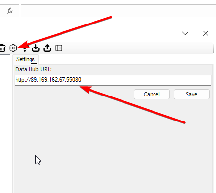
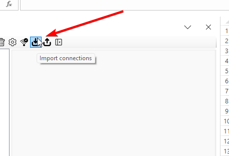
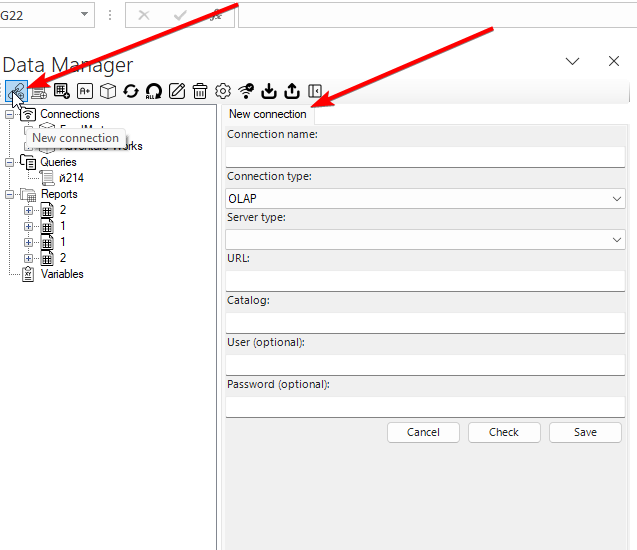
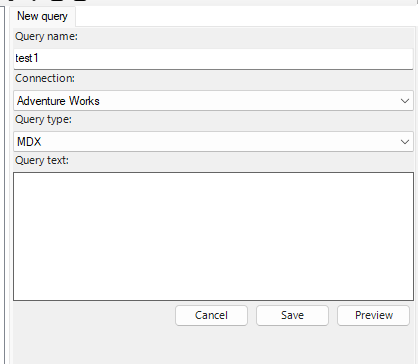
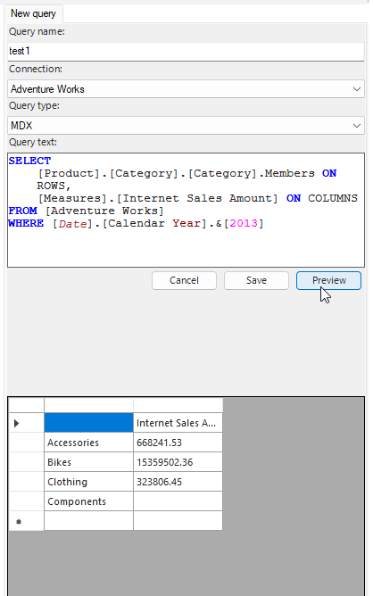
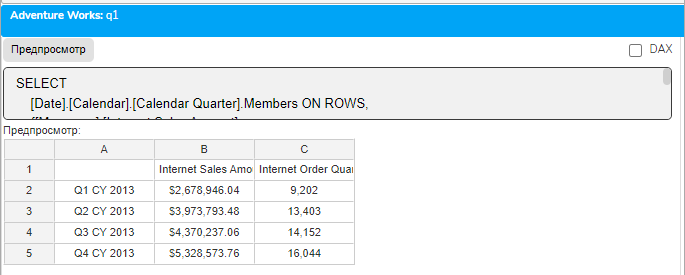
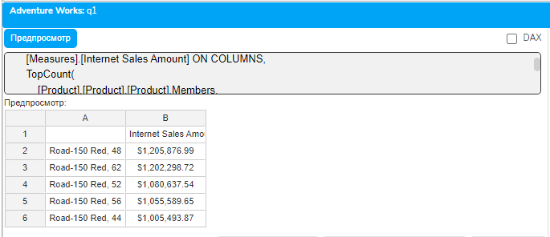
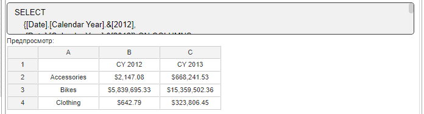
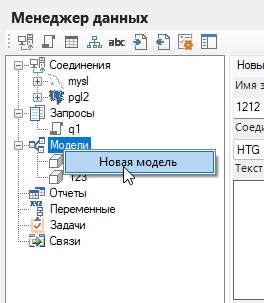
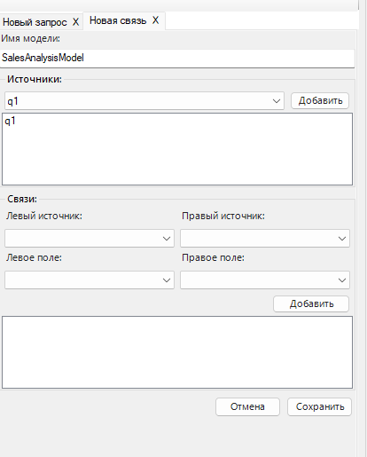

# Урок 1.3: Практика работы с MDX в плагине «Слайдер данные»

Введение: от теории к практике

После изучения теоретических основ OLAP и архитектуры кубов, настало время применить полученные знания на практике. В этом уроке мы будем работать с плагином «Слайдер данные» для Microsoft Excel — мощным инструментом для выполнения MDX-запросов и работы с OLAP-кубами. Основное преимущество этого подхода — возможность писать и тестировать MDX-запросы в привычной среде Excel, получая результаты прямо в таблицы.

Установка плагина «Слайдер данные»

Шаг 1: Загрузка и установка

Начнем с установки плагина. Скачайте установочный файл плагина «Слайдер данные» по ссылке, предоставленной в материалах курса. После загрузки запустите установщик и следуйте инструкциям мастера установки.

## Системные требования

Microsoft Excel 2010 или выше

.NET Framework 4.5 или более поздняя версия

Минимум 2 ГБ оперативной памяти для комфортной работы

После завершения установки запустите Excel. Вы должны увидеть новую вкладку «Слайдер данные» на ленте Excel. Если вкладка не появилась, активируйте надстройку через меню «Файл» → «Параметры» → «Надстройки» → «Управление: Надстройки COM» → «Перейти» и поставьте галочку напротив «Слайдер данные».

Шаг 2: Активация лицензии

При первом запуске плагин запросит лицензионный ключ. Введите ключ, предоставленный для курса, или активируйте пробную версию. Пробная версия предоставляет полный функционал на 30 дней, чего достаточно для изучения всего курса.

Настройка подключения к OLAP-кубу

Использование Data Manager

После успешной установки перейдите на вкладку «Слайдер данные» и нажмите кнопку «Data Manager». Это центральная точка управления всеми подключениями и запросами. Data Manager открывается в отдельном окне и предоставляет удобный интерфейс для работы с подключениями.

Настройка подключения к серверу

Для подключение к тестовым кубу  вам надо будет сделать.
1. Нажать на шестеренки и вставить этот айпи адрес 
     http://89.169.162.67:55080




2. Скачайте подключение  с сайта… . и импортируйте этот файл в Data Manager.




        Вы конечно можете ввести данные вручную, но пока вам это не нужно.



Создание первого MDX-запроса

Шаг 1: Создание нового запроса

В Data Manager нажмите кнопку «New Query». Откроется диалоговое окно создания запроса, где необходимо указать:

Имя запроса: Дайте понятное имя, например, "Продажи по категориям 2013"

Выбор куба: В выпадающем списке выберите "Adventure Works" (или полное имя "Adventure Works DW")

Язык запроса: Выберите MDX (также доступны DAX и SQL, но мы изучаем MDX)



Шаг 2: Написание MDX-запроса

## В открывшемся редакторе запросов введите ваш первый MDX-запрос

```mdx
SELECT
    [Product].[Category].[Category].Members ON ROWS,
    [Measures].[Internet Sales Amount] ON COLUMNS
FROM [Adventure Works]
WHERE [Date].[Calendar Year].&[2013]
```

## Разбор запроса

SELECT — начало запроса

[Product].[Category].[Category].Members — все категории продуктов на строках

[Measures].[Internet Sales Amount] — мера продаж на столбцах

FROM [Adventure Works] — указание куба
WHERE [Date].[Calendar Year].&amp;[2013] — фильтр по 2013 году



Шаг 3: Предварительный просмотр

Нажмите кнопку «Preview» для выполнения запроса и просмотра результатов. В окне предпросмотра вы увидите:

Таблицу с результатами (категории продуктов и суммы продаж)

Время выполнения запроса

Количество возвращенных строк

Если результаты соответствуют ожиданиям, нажмите «Save» для сохранения запроса. Запрос сохранится в библиотеке запросов и будет доступен для последующего использования.

Выгрузка результатов в Excel

Создание отчета из запроса

## После сохранения запроса переходим к созданию отчета в Excel

В Data Manager нажмите кнопку «New Report»

Имя отчета: Введите понятное имя, например, "Анализ продаж 2013"

Выбор запроса: В выпадающем списке "Query" выберите ранее сохраненный запрос

## Целевой лист: Укажите, на какой лист Excel выгружать данные

Можно выбрать существующий лист

Создать новый лист с указанным именем

Указать конкретную ячейку начала вывода (например, A1)

Обновление и сохранение отчета

Нажмите кнопку «Update» для выполнения запроса и выгрузки данных на указанный лист. Результаты появятся в виде форматированной таблицы Excel с:

Заголовками строк и столбцов

Числовым форматированием для мер

Возможностью дальнейшей обработки средствами Excel

Для сохранения конфигурации отчета нажмите «Save Report». Это позволит в будущем быстро обновлять данные без повторной настройки.

Практические примеры MDX-запросов

Пример 1: Продажи по кварталам

```mdx
SELECT
    [Date].[Calendar].[Calendar Quarter].Members ON ROWS,
    {[Measures].[Internet Sales Amount],
     [Measures].[Internet Order Quantity]} ON COLUMNS
FROM [Adventure Works]
WHERE [Date].[Calendar Year].&[2013]
```



Этот запрос показывает продажи и количество заказов по кварталам 2013 года.

Пример 2: Топ-5 продуктов

```mdx
SELECT
    [Measures].[Internet Sales Amount] ON COLUMNS,
    TopCount(
        [Product].[Product].[Product].Members,
        5,
        [Measures].[Internet Sales Amount]
    ) ON ROWS
FROM [Adventure Works]
```



Запрос возвращает 5 самых продаваемых продуктов по сумме продаж.

Пример 3: Сравнение годов

```mdx
SELECT
    {[Date].[Calendar Year].&[2012],
     [Date].[Calendar Year].&[2013]} ON COLUMNS,
    [Product].[Category].[Category].Members ON ROWS
FROM [Adventure Works]
WHERE ([Measures].[Internet Sales Amount])
```



Сравнение продаж по категориям между 2012 и 2013 годами.

3. Подход 2: Создание ROLAP-моделей через UI плагина

3.1. Что такое ROLAP и зачем он нужен

ROLAP (Relational OLAP) — это подход к аналитике, при котором данные остаются в реляционной базе данных, а аналитическая модель создаётся "поверх" существующих таблиц. В отличие от классических OLAP-кубов (MOLAP), где данные предварительно агрегируются и хранятся в специальном формате, ROLAP работает напрямую с исходными данными.

## Преимущества ROLAP

• Работа с актуальными данными в реальном времени

• Не требуется создание и обновление отдельного куба

• Гибкость в изменении структуры модели

• Использование мощи SQL-сервера для вычислений

• Простота создания через графический интерфейс Excel

## Недостатки ROLAP

• Более медленная работа по сравнению с MOLAP (предагрегированными кубами)

• Зависимость от производительности базы данных

• Требуется оптимизация SQL-запросов для больших объёмов данных

3.2. Пошаговая инструкция создания ROLAP-модели

Шаг 1: Подключение к базе данных SQL

## Откройте Data Manager и создайте новое подключение к SQL Server

1. В Data Manager нажмите на иконку "Connections" или "Новое подключение"

2. Создайте подключение на основе которого будете делать sql запросы

## 3. Укажите параметры подключения

Шаг 2: Создание сохранённых SQL-запросов

## После успешного подключения создайте SQL-запросы для извлечения данных

## Запрос для измерения Product (назовём его q1)

```mdx
SELECT
    ProductID,
```

    Name AS ProductName,

    ProductCategoryID

FROM Production.Product

## Запрос для фактов Sales (назовём его q2)

```mdx
SELECT
    SalesOrderID,
    ProductID,
    OrderDate,
```

    LineTotal AS SalesAmount

FROM Sales.SalesOrderDetail

JOIN Sales.SalesOrderHeader ON ...

Шаг 3: Создание модели через UI интерфейс плагина в Excel

## Теперь самое важное — создание аналитической модели

1. В Data Manager нажмите кнопку "New Model" (Новая модель)



2. Задайте имя модели, например: "123" или "SalesAnalysisModel"



3. Добавьте источники из ранее сохранённых sql запросов

4.Добавье в связь источники и поля из них и сохраните

5. Нажмите “Cохранить” и теперь ваша модель появится в списке. С этого момента вы можете ей пользоваться

Изучение структуры куба (дополнительная возможность)

Хотя основной фокус на MDX-запросах, плагин также позволяет визуально изучать структуру куба. Это полезно для понимания доступных измерений и мер перед написанием запросов.

В Data Manager есть кнопка «Explore Cube», которая открывает визуальный браузер куба. Здесь вы можете:

Просматривать иерархию измерений

Видеть доступные меры и их группы

Изучать атрибуты и свойства членов

Однако, как правильно отмечено, для практической работы удобнее использовать MDX-запросы, так как они:

Точно определяют нужные данные

Легко сохраняются и переиспользуются

Могут быть автоматизированы

Предоставляют больше возможностей для сложного анализа

Советы по эффективной работе

Организация запросов

Используйте понятные имена: Называйте запросы описательно, например, "YTD_Sales_By_Region_2013"

Группируйте по темам: Создавайте папки в Data Manager для разных типов анализа

## Документируйте запросы: Добавляйте комментарии в MDX-код

```mdx
-- Анализ продаж по регионам за текущий год
```

SELECT ...

Оптимизация производительности

Используйте фильтры WHERE: Ограничивайте объем данных на уровне запроса

Избегайте CrossJoin больших наборов: Это может привести к огромным результатам

Применяйте NON EMPTY: Исключайте пустые строки и столбцы

Отладка запросов

## Если запрос не работает

Проверьте правильность имен измерений и членов

Убедитесь в наличии квадратных скобок для имен с пробелами

Используйте Preview для пошаговой проверки

Начинайте с простого запроса и постепенно усложняйте

Практические задания

Задание 1: Базовый запрос

Создайте MDX-запрос, который показывает продажи через интернет по странам за 2013 год.

Задание 2: Множественные меры

Напишите запрос, отображающий три меры (продажи, количество, среднюю цену) по категориям продуктов.

Задание 3: Временной анализ

Создайте запрос для анализа продаж по месяцам за последний доступный год в кубе.

Типичные проблемы и их решения

Проблема: "Не удается подключиться к серверу"

## Решение

Проверьте правильность IP-адреса

Убедитесь, что сервер доступен (ping)

Проверьте настройки файрвола

Используйте готовый файл подключения

Проблема: "Запрос возвращает пустой результат"

## Решение

Проверьте правильность имен членов

Убедитесь, что данные существуют для выбранного периода

Уберите излишние фильтры

Проблема: "Слишком долгое выполнение запроса"

## Решение

Добавьте фильтры для ограничения данных

Используйте конкретные члены вместо .Members

Примените NON EMPTY

Заключение

В этом уроке мы освоили практическую работу с MDX через плагин «Слайдер данные». Вы научились:

Устанавливать и настраивать плагин

Подключаться к OLAP-кубу через Data Manager

Создавать и сохранять MDX-запросы

Создавать Rolap

Выгружать результаты в Excel для дальнейшего анализа

Этот практический опыт станет основой для всех последующих уроков. В следующем модуле мы углубимся в синтаксис MDX и научимся писать более сложные запросы. Рекомендуется попрактиковаться с различными запросами, чтобы освоиться с интерфейсом плагина перед переходом к продвинутым темам.
