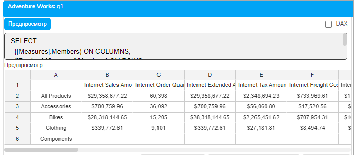
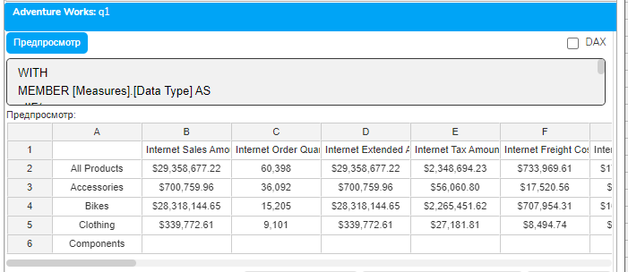

# Урок 1.4: Типы данных и метаданные в MDX

Введение: погружение в систему типов MDX

После практического знакомства с навигацией по кубу через плагин «Слайдер данные», мы переходим к более глубокому изучению технических аспектов MDX. Понимание типов данных и метаданных критически важно для написания эффективных и корректных MDX-запросов. В этом уроке мы детально изучим, как MDX обрабатывает различные типы данных, как работает система преобразования типов, и как метаданные влияют на выполнение запросов.

Фундаментальные типы данных в MDX

MDX оперирует несколькими базовыми типами данных, каждый из которых имеет свое назначение и особенности использования. В отличие от традиционных языков программирования, где типы данных относятся к скалярным значениям, в MDX типы часто относятся к многомерным структурам.

Числовые типы (Numeric) — это основа для всех вычислений в MDX. Числовые данные могут быть целыми (Integer) или с плавающей точкой (Float/Double). MDX автоматически выбирает подходящий числовой тип в зависимости от контекста. Например, количество проданных единиц товара будет храниться как целое число, а сумма продаж или процентные показатели — как числа с плавающей точкой.

Важная особенность числовых типов в MDX — это их поведение при агрегации. Когда вы суммируете продажи по регионам, MDX автоматически обрабатывает различную точность чисел, обеспечивая корректный результат. При делении целых чисел результат автоматически преобразуется в число с плавающей точкой, чтобы не потерять дробную часть.

Строковые типы (String) используются для хранения текстовой информации — названий продуктов, имен клиентов, описаний. В MDX строки заключаются в двойные кавычки. Особенность работы со строками в MDX заключается в том, что они часто используются для идентификации членов измерений. Например, "[Product].[Category].[Bikes]" — это строковое представление пути к члену измерения.

Строковые операции в MDX включают конкатенацию (объединение строк), извлечение подстрок, преобразование регистра. Функция + или || используется для объединения строк, функции Left, Right, Mid — для работы с частями строк. При работе со строками важно учитывать локализацию и кодировку, особенно при работе с международными данными.

Логический тип (Boolean) представляет значения истина (TRUE) или ложь (FALSE). Логические значения являются результатом операций сравнения и используются в условных конструкциях. В MDX логические операции включают AND, OR, NOT, XOR. Особенность MDX в том, что пустое множество (empty set) в логическом контексте интерпретируется как FALSE, а непустое — как TRUE.

Временные типы (Date/Time) критически важны для временного анализа. MDX поддерживает полные даты со временем, только даты и только время. Временные данные могут быть представлены в различных форматах, и MDX автоматически распознает большинство стандартных форматов дат.

Многомерные типы данных

Помимо скалярных типов, MDX оперирует специфическими многомерными типами, которые являются фундаментом языка.

Член (Member) — это базовый элемент измерения. Каждый член имеет уникальное имя, ключ и набор свойств. Члены могут быть листовыми (не имеют потомков) или родительскими (имеют потомков в иерархии). Тип Member включает в себя информацию о положении члена в иерархии, его уровне, родителях и потомках.

Работа с типом Member включает навигационные операции: получение родителя (.Parent), потомков (.Children), предыдущего или следующего члена на том же уровне (.PrevMember, .NextMember). Каждый член также имеет свойства, доступные через функцию .Properties("PropertyName").

```mdx
Кортеж (Tuple) представляет точку в многомерном пространстве куба, определяемую пересечением членов из разных измерений. Кортеж всегда указывает на конкретную ячейку в кубе. Синтаксически кортеж записывается в круглых скобках: ([Time].[2024], [Product].[Bikes], [Geography].[USA]).
```

Важная особенность кортежей — они должны содержать не более одного члена из каждого измерения. Если измерение не указано явно, используется член по умолчанию. Кортежи могут использоваться для точного указания контекста вычислений или для получения конкретных значений из куба.

Набор (Set) — это упорядоченная коллекция кортежей. Наборы являются основой для определения осей в MDX-запросах. Набор может содержать от нуля до бесконечного количества кортежей. Синтаксически набор записывается в фигурных скобках: {[Time].[2023], [Time].[2024]}.

Наборы могут быть созданы различными способами: перечислением членов, использованием функций (.Members, .Children), операциями над другими наборами (Union, Intersect, Except). Важно понимать, что порядок элементов в наборе имеет значение и сохраняется при операциях.

Свойства и атрибуты членов

Каждый член измерения может иметь набор свойств, которые предоставляют дополнительную информацию. Свойства делятся на внутренние (intrinsic) и пользовательские (custom).

## Внутренние свойства доступны для всех членов и включают

MEMBER_NAME — отображаемое имя члена

MEMBER_UNIQUE_NAME — уникальное имя члена в кубе

MEMBER_KEY — ключевое значение члена

MEMBER_CAPTION — подпись члена для отображения

LEVEL_NUMBER — номер уровня в иерархии

CHILDREN_CARDINALITY — количество непосредственных потомков

```mdx
Доступ к внутренним свойствам осуществляется через функцию Properties: [Product].[Bikes].Properties("MEMBER_KEY").
```

Пользовательские свойства определяются при создании куба и специфичны для конкретных измерений. Например, для продуктов это может быть цвет, размер, вес; для клиентов — дата рождения, пол, уровень дохода; для магазинов — площадь, количество сотрудников, часы работы.

Использование свойств членов позволяет обогатить анализ без необходимости создания отдельных измерений. Например, можно отфильтровать продукты по цвету или отсортировать магазины по площади, используя соответствующие свойства.

FORMAT_STRING: управление отображением данных

FORMAT_STRING — это важнейшее свойство мер, определяющее, как числовые значения отображаются пользователю. Правильное форматирование делает отчеты более читаемыми и профессиональными.

## Основные форматы включают

"Currency" или "$#,##0.00" — для денежных значений

"Percent" или "0.00%" — для процентных показателей

"#,##0" — для целых чисел с разделителями тысяч

"Short Date" — для дат без времени

"Long Time" — для времени с секундами

FORMAT_STRING может быть статическим или динамическим. Статический формат задается при определении меры в кубе. Динамический формат может изменяться в зависимости от контекста через вычисляемые меры:

```mdx
WITH MEMBER [Measures].[Formatted Sales] AS
  [Measures].[Sales Amount],
  FORMAT_STRING = IIF(
    [Measures].[Sales Amount] > 1000000,
```

    "$#,##0,,.0M",  -- Миллионы

    "$#,##0,.0K"    -- Тысячи

```mdx
  )
```

Работа с NULL и пустыми значениями

Обработка пустых значений — критически важный аспект работы с MDX. В многомерном анализе существует несколько типов "пустоты", каждый с своей семантикой.

NULL значения представляют отсутствие данных. В контексте мер NULL означает, что для данной комбинации измерений нет записей в таблице фактов. NULL значения не участвуют в агрегациях — при суммировании они игнорируются, при подсчете количества не учитываются.

Пустые ячейки (Empty cells) — это ячейки куба, для которых нет данных. Они отличаются от ячеек с нулевым значением. Пустая ячейка означает отсутствие факта (например, продукт не продавался в определенном регионе), а ноль означает, что факт есть, но его значение равно нулю (продукт выставлялся, но не был продан).

## Функции для работы с пустыми значениями

IsEmpty() — проверяет, является ли значение пустым

CoalesceEmpty() — заменяет пустые значения указанным значением

NonEmpty() — фильтрует непустые элементы набора

IIF(IsEmpty(), альтернатива, значение) — условная замена пустых значений

Правильная обработка пустых значений критична для корректности вычислений. Например, при расчете среднего значения важно различать пустые ячейки (не учитываются) и нулевые значения (учитываются).

Преобразование типов данных

MDX выполняет автоматическое преобразование типов в большинстве случаев, но понимание правил преобразования помогает избежать ошибок.

Неявное преобразование происходит автоматически при необходимости. Числа преобразуются в строки при конкатенации, строки в числа при арифметических операциях (если возможно), логические значения в числа (TRUE = 1, FALSE = 0).

## Явное преобразование выполняется специальными функциями

CStr() — преобразование в строку

CDbl() — преобразование в число с плавающей точкой

CInt() — преобразование в целое число

CDate() — преобразование в дату

При преобразовании важно обрабатывать ошибки. Функция IsError() позволяет проверить, привело ли выражение к ошибке, что особенно важно при преобразовании пользовательского ввода.

Метаданные: информация об информации

Метаданные в MDX — это данные о структуре куба, измерениях, иерархиях и мерах. Доступ к метаданным позволяет создавать динамические запросы и универсальные отчеты.

## Функции для работы с метаданными

Dimensions() — возвращает коллекцию всех измерений

Hierarchies() — возвращает иерархии измерения

Levels() — возвращает уровни иерархии

Members — возвращает членов уровня или иерархии

MemberValue — возвращает значение свойства члена

Метаданные можно использовать для динамического построения запросов. Например, создать отчет, который автоматически включает все меры определенной группы:

```mdx
SELECT
  {[Measures].Members} ON COLUMNS,
  {[Product].[Category].Members} ON ROWS
FROM [Adventure Works]
```



Схемы метаданных и их использование

MDX поддерживает несколько схем метаданных, которые предоставляют структурированную информацию о кубе.

MDSCHEMA_CUBES содержит информацию о доступных кубах: имена, описания, даты последнего обновления. Это полезно для административных задач и мониторинга.

MDSCHEMA_DIMENSIONS предоставляет детальную информацию об измерениях: типы, количество членов, кардинальность. Эта информация помогает оптимизировать запросы, выбирая правильный порядок измерений.

MDSCHEMA_HIERARCHIES содержит данные об иерархиях: структуру, уровни, типы агрегации. Используется для построения навигационных интерфейсов.

MDSCHEMA_MEASURES описывает все доступные меры: типы данных, функции агрегации, форматы отображения. Критично для правильной интерпретации числовых данных.

Практические примеры работы с типами и метаданными

Рассмотрим практический пример создания универсального отчета, который адаптируется к структуре куба:

```mdx
WITH
MEMBER [Measures].[Data Type] AS
  IIF(
    IsNumeric([Measures].CurrentMember),
    "Numeric: " +
    [Measures].CurrentMember.Properties("FORMAT_STRING"),
    "Non-numeric"
  )
SELECT
  {[Measures].Members} ON COLUMNS,
  {[Product].[Category].Members} ON ROWS
FROM [Adventure Works]
```



Этот запрос показывает все меры с информацией об их типе данных и формате.

Оптимизация через понимание типов

Понимание типов данных помогает оптимизировать запросы. Например, сравнение строк медленнее сравнения чисел, поэтому при фильтрации лучше использовать числовые ключи, а не строковые имена.

При работе с большими наборами данных важно минимизировать преобразования типов. Если возможно, выполняйте вычисления в том типе, в котором хранятся данные. Избегайте ненужных преобразований в строки для промежуточных вычислений.

Обработка ошибок типизации

Ошибки типизации — частая проблема в MDX. Основные причины: попытка выполнить арифметическую операцию над строкой, неверный формат даты, деление на ноль.

## Стратегии обработки ошибок

Проверка типа перед операцией с помощью IsNumeric(), IsDate()

Использование условных конструкций IIF() для обработки особых случаев

Применение функции Error() для генерации понятных сообщений об ошибках

Использование ValidMeasure() для обработки несуществующих комбинаций измерений

Заключение

В этом уроке мы глубоко изучили систему типов данных MDX и работу с метаданными. Понимание этих концепций критически важно для написания корректных и эффективных MDX-запросов. Мы узнали о скалярных и многомерных типах, научились работать с NULL значениями, изучили форматирование и преобразование типов. В следующем модуле мы применим эти знания на практике, начав писать реальные MDX-запросы и создавать сложные вычисления. Помните, что правильная работа с типами данных — это основа надежных и производительных аналитических решений.

Количество слов: 1863

Заключение Модуля 1

Поздравляем с завершением первого модуля курса по MDX! Мы прошли путь от базового понимания концепций OLAP до практической работы с кубами и глубокого изучения системы типов данных.

## В этом модуле вы узнали

Фундаментальные различия между OLTP и OLAP системами

Архитектуру многомерных кубов и структуру иерархий

Практические навыки навигации по кубу в плагине «Слайдер данные»

Систему типов данных MDX и работу с метаданными

Эти знания формируют прочный фундамент для изучения синтаксиса MDX в следующем модуле. Вы готовы начать писать собственные MDX-запросы и создавать мощные аналитические решения!
