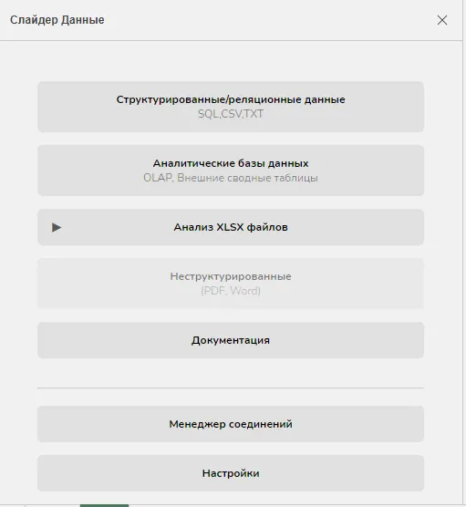
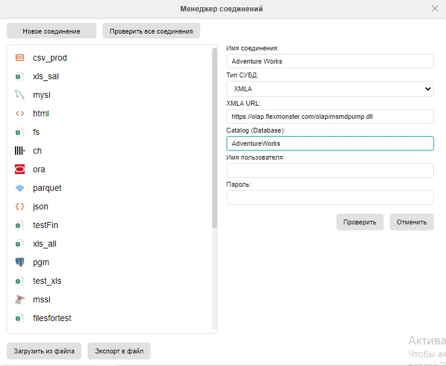

# Урок 1.5. Анатомия OLAP-куба

**1\. Атрибуты измерений (свойства членов)**

Каждый член измерения (например, «Январь 2024», «Ноутбук XPS-13») может иметь дополнительные характеристики — атрибуты. Они не участвуют напрямую в группировке данных, но предоставляют контекстную информацию.

**Пример:**

В измерении **«Продукт»** член ProductKey = 123 может иметь атрибуты:

-    EnglishProductName = "Road-650"
-    Color = "Red"
-    ProductLine = "R"

Эти атрибуты:

-    Отображаются в сводной таблице при наведении или в детализации;
-    Могут использоваться в фильтрах (например, «показать только красные товары»);
-    Не являются уровнями иерархии, но дополняют её.

В «Слайдер Данные» атрибуты автоматически становятся доступны в списке полей измерения после создания ROLAP-модели, если они присутствуют в SQL-запросе к таблице измерения.

**2\. Кортежи (Tuples) — комбинации членов из разных измерений**

Кортеж — это упорядоченный набор по одному члену из каждого измерения, который однозначно определяет позицию в кубе.

**Пример кортежа:**

1

Этот кортеж указывает на конкретное «пересечение» в кубе: продажи велосипедов в Европе за первый квартал 2024 года.

-    Кортеж не содержит мер — он задаёт координаты.
-    В MDX именно кортежи используются для адресации ячеек.
-    В «Слайдер Данные» пользователь не пишет кортежи вручную, но каждая строка/столбец сводной таблицы соответствует неявному кортежу.

Например, когда вы видите строку «2024 → Q1» и столбец «Bikes», система интерпретирует это как кортеж (2024.Q1, Bikes).

**3\. Ячейки куба и их свойства**

**Ячейка** — это основная единица данных в OLAP-кубе. Она находится на пересечении кортежа и содержит значение одной или нескольких мер.

Структура ячейки:

| Координаты (кортеж) | Мера | Значение |
| --- | --- | --- |
| (2024, Москва, Ноутбуки) | SalesAmount | 2 450 000 ₽ |
| (2024, Москва, Ноутбуки) | OrderQuantity | 187 |

**Свойства ячейки:**

-    **Значение меры** — основное содержимое;
-    **Формат отображения** — валюта, проценты, количество знаков;
-    **Статус агрегации** — является ли значение расчётным (итог) или исходным;
-    **Доступность** — может быть скрыта по правилам безопасности (в продвинутых системах).

В «Слайдер Данные» каждая ячейка сводной таблицы — это результат выполнения SQL-запроса, сформированного на основе выбранного кортежа и мер.

**4\. Наборы (Sets) — коллекции кортежей**

**Набор** — это упорядоченная коллекция кортежей одного типа (например, все месяцы 2024 года или все категории товаров).

**Примеры наборов:**

-    { \[Time\].\[2024\].\[Jan\], \[Time\].\[2024\].\[Feb\], \[Time\].\[2024\].\[Mar\] }
-    { \[Product\].\[Bikes\], \[Product\].\[Clothing\], \[Product\].\[Accessories\] }

Наборы используются для:

-    Определения осей в MDX-запросах (ON ROWS, ON COLUMNS);
-    Создания сложных срезов (например, «ТОП-5 продуктов»);
-    Фильтрации и сравнения групп («сравнить текущий квартал с прошлым»).

В «Слайдер Данные» наборы формируются **автоматически** при выборе измерений в сводной таблице. Например, когда вы помещаете измерение «Время» в строки, система создаёт набор всех лет или месяцев, доступных в данных.

**Практическая работа №1:** Знакомство с интерфейсом и основными понятиями  

**Часть 1. Запуск и навигация**

1.  Откройте табличный редактор **Р7-Офис**.
2.  На ленте инструментов найдите и нажмите кнопку **«Слайдер Данные»**.
3.  В открывшемся главном окне плагина ознакомьтесь с доступными модулями:
    -    **Модуль 1**: Структурированные/реляционные данные (SQL)
    -    **Модуль 2**: Аналитические базы данных (OLAP)
    -    **Модуль 3**: Анализ XLSX файлов
    -    **Модуль 4**: Документация
    -    **Модуль 5**: Менеджер соединений
    -    **Модуль 6**: Настройки

1.  Нажмите кнопку **«Аналитические базы данных (OLAP, внешние сводные таблицы)»** — вы перейдёте в **Модуль 2**.

Чтобы вернуться в главное меню в любой момент — дважды щёлкните по кнопке плагина на панели инструментов.

**Часть 2. Подключение к публичному OLAP-кубу**

1.  В Модуле 5 нажмите **«Менеджер соединений»**.
2.  Нажмите **«Новое соединение»**.
3.  Заполните поля:
    -    **Имя соединения**: Adventure Works
    -    **Тип СУБД**: XMLA
    -    **URL**: https://olap.flexmonster.com/olap/msmdpump.dll
    -    **Каталог**: Adventure Works
    -    Логин и пароль — оставьте пустыми.
4.  Нажмите **«Проверить»** → убедитесь, что соединение успешно.

Теперь соединение появится в списке и будет доступно для анализа.

**Часть 3. Первый сводный отчёт**

1.  Нажмите **«Сводные отчёты»**.
2.  В выпадающем списке **«Соединение»** выберите Adventure Works.
3.  В поле **«Куб»** выберите Adventure Works.
4.  В левой панели вы увидите:
    -    **Измерения**: Customer, Date, Product, Geography и др.
    -    **Показатели (меры)**: Internet Sales Amount, Order Quantity и др.
5.  Выполните следующие действия:
    -    Кликните правой кнопкой по измерению **Date** → выберите **«В строки»**.
    -    Кликните правой кнопкой по измерению **Product** → выберите **«В столбцы»**.
    -    В секции **Показатели** поставьте галочку напротив **Internet Sales Amount**.
6.  На листе документа выделите ячейку **A1**.
7.  Нажмите кнопку **«Создать»** в правой части окна.

Через несколько секунд в документе появится сводная таблица с продажами по годам и категориям товаров.

**Часть 4. Исследование и интерактивность**

1.  **Drill-down**:
    -    Выделите ячейку с годом, например **2013**.
    -    Нажмите кнопку **«Развернуть»** → данные детализируются до уровня кварталов.
2.  **Фильтрация**:
    -    Кликните правой кнопкой по измерению Geography → выберите «В фильтры».
    -    Перейдите во вкладку «Фильтры», разверните дерево All Geographies → North America → United States.
    -    Поставьте галочку только на California.
    -    Нажмите «Создать» → отчёт обновится, показывая только данные по Калифорнии.
3.  **Поворот**:
    -    Нажмите кнопку **«Повернуть»** → строки и столбцы поменяются местами.
4.  **Очистка**:
    -    Нажмите **«Очистить все»** → лист очистится, но настройки отчёта сохранятся.
