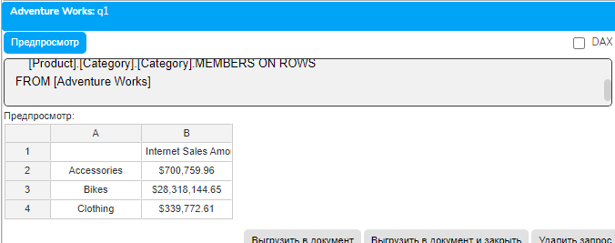
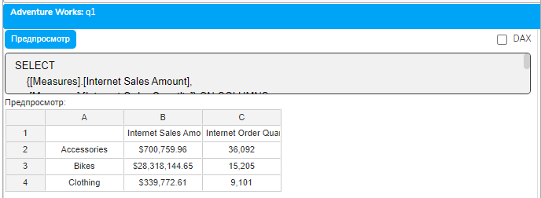
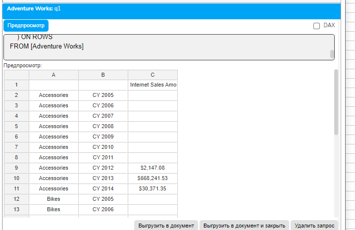
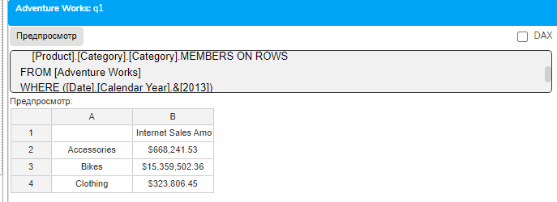
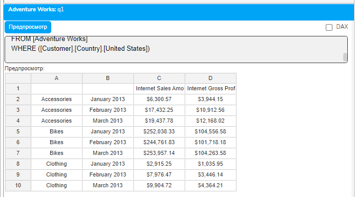

# Урок 2.1: Первые запросы в MDX - от простого к сложному

Введение: Переход от теории к практике

Добро пожаловать во второй модуль курса MDX! В предыдущем уроке мы изучили типы данных MDX, разобрались с метаданными куба и научились понимать структуру многомерных данных. Сегодня мы сделаем важный шаг - напишем наши первые MDX-запросы и увидим, как теоретические знания превращаются в реальные результаты.

Представьте, что вы впервые садитесь за руль автомобиля после изучения правил дорожного движения. Вы знаете теорию, но практика - это совершенно новый опыт. Так же и с MDX: пришло время "завести мотор" и начать движение по многомерным данным Adventure Works.

Анатомия базового MDX-запроса

MDX-запрос, как и предложение на естественном языке, имеет свою грамматику и структуру. В отличие от SQL, где мы думаем строками и столбцами, MDX оперирует осями и измерениями. Давайте разберем базовую структуру:

```mdx
SELECT
    {набор_на_колонках} ON COLUMNS,
    {набор_на_строках} ON ROWS
FROM [Имя_Куба]
WHERE (условие_среза)
```

## Каждый элемент этой структуры имеет свое назначение

SELECT - указывает, что мы хотим выбрать данные

ON COLUMNS (или ON 0) - определяет, что будет отображаться по горизонтали

ON ROWS (или ON 1) - определяет, что будет отображаться по вертикали

FROM - указывает куб-источник данных

WHERE - определяет контекст среза (slicer)

Важное отличие от SQL

В SQL мы привыкли, что SELECT определяет колонки результата. В MDX логика иная: SELECT определяет оси многомерного результата. Это фундаментальное отличие, которое нужно усвоить с самого начала.

Практическое упражнение №1: Первый запрос

Откройте Excel и подключитесь к Adventure Works через плагин "Слайдер данные". В панели Data Manager вы увидите структуру куба с папками Connections, Queries, Reports и Variables.

Шаг 1: Нажмите кнопку "Edit Query" на панели инструментов плагина.

## Шаг 2: В открывшемся окне редактора введите следующий запрос

```mdx
SELECT
    [Measures].[Internet Sales Amount] ON COLUMNS,
    [Product].[Category].[Category].MEMBERS ON ROWS
FROM [Adventure Works]
```

Шаг 3: Нажмите кнопку выполнения запроса (обычно это зеленая стрелка или F5).

Что мы увидим: Таблицу, где по горизонтали отображается сумма интернет-продаж, а по вертикали - категории продуктов (Bikes, Clothing, Accessories).



Разбор запроса по компонентам

## Давайте детально разберем, что происходит в этом запросе

[Measures].[Internet Sales Amount] - это член измерения Measures. Помните из урока 1.4, что член (Member) - это конкретная точка в измерении? Здесь мы выбираем конкретную меру - сумму интернет-продаж.

[Product].[Category].[Category].MEMBERS - это функция, возвращающая набор (Set) всех членов уровня Category в иерархии Category измерения Product.

ON COLUMNS и ON ROWS - определяют расположение данных. MDX поддерживает до 128 осей, но на практике используются обычно две или три.

Оси в MDX: больше, чем строки и столбцы

## MDX поддерживает множество осей, каждая из которых имеет номер и псевдоним

Ось 0 = COLUMNS

Ось 1 = ROWS

Ось 2 = PAGES

Ось 3 = SECTIONS

Ось 4 = CHAPTERS

Оси 5-127 = AXIS(n)

Хотя Excel через плагин "Слайдер данные" визуализирует только две оси (строки и столбцы), понимание многоосевой природы MDX важно для работы с другими инструментами.

Практическое упражнение №2: Добавляем сложность

## Теперь усложним наш запрос, добавив больше измерений

## Шаг 1: Очистите предыдущий запрос и введите новый

```mdx
SELECT
    {[Measures].[Internet Sales Amount],
     [Measures].[Internet Order Quantity]} ON COLUMNS,
    [Product].[Category].[Category].MEMBERS ON ROWS
FROM [Adventure Works]
```



Что изменилось: Теперь мы используем фигурные скобки для создания набора из двух мер. Это важный момент - фигурные скобки создают набор (Set) из перечисленных элементов.

Результат: Таблица с двумя колонками (сумма продаж и количество заказов) и строками по категориям продуктов.

Синтаксис создания наборов

## В MDX есть несколько способов создания наборов

## Явное перечисление в фигурных скобках

```mdx
{[Member1], [Member2], [Member3]}
```

## Использование функций

```mdx
[Dimension].[Hierarchy].MEMBERS
```

## Диапазоны (будем изучать позже)

```mdx
[Member1]:[Member3]
```

Практическое упражнение №3: Кросс-джойн - декартово произведение

Одна из мощнейших возможностей MDX - это кросс-джойн (CROSSJOIN), позволяющий комбинировать члены разных измерений:

## Шаг 1: Введите следующий запрос

```mdx
SELECT
    [Measures].[Internet Sales Amount] ON COLUMNS,
    CROSSJOIN(
        [Product].[Category].[Category].MEMBERS,
        [Date].[Calendar Year].[Calendar Year].MEMBERS
    ) ON ROWS
FROM [Adventure Works]
```



Что происходит: CROSSJOIN создает декартово произведение двух наборов. Каждая категория продукта будет показана для каждого года.

Результат: Расширенная таблица, где каждая категория продукта разбита по годам.

Альтернативный синтаксис кросс-джойна

## MDX предлагает несколько способов записи кросс-джойна

## Функция CROSSJOIN (максимум 2 набора)

```mdx
CROSSJOIN(Set1, Set2)
```

## Оператор звездочка (*)

Set1 * Set2

## Вложенные CROSSJOIN для более чем 2 наборов

```mdx
CROSSJOIN(CROSSJOIN(Set1, Set2), Set3)
```

Практическое упражнение №4: Использование WHERE для среза данных

WHERE в MDX работает иначе, чем в SQL. Он не фильтрует строки, а устанавливает контекст среза для всего запроса:

## Шаг 1: Модифицируем наш запрос

```mdx
SELECT
    [Measures].[Internet Sales Amount] ON COLUMNS,
    [Product].[Category].[Category].MEMBERS ON ROWS
FROM [Adventure Works]
WHERE ([Date].[Calendar Year].&[2013])
```



Что происходит: WHERE устанавливает контекст - мы смотрим на данные только за 2013 год. Обратите внимание на синтаксис &amp;[2013] - амперсанд указывает на ключ члена.

Важно: WHERE в MDX - это не фильтр в привычном понимании SQL. Это установка точки обзора в многомерном пространстве.

Множественный срез в WHERE

## WHERE может содержать кортеж из нескольких измерений

```mdx
WHERE (
    [Date].[Calendar Year].&[2013],
    [Customer].[Country].[United States]
)
```

Это установит контекст на 2013 год И США одновременно.

Практическое упражнение №5: Комплексный запрос

## Объединим все изученные концепции в одном запросе

## Шаг 1: Создайте следующий запрос

```mdx
SELECT
    {[Measures].[Internet Sales Amount],
     [Measures].[Internet Gross Profit]} ON COLUMNS,
    CROSSJOIN(
        [Product].[Category].[Category].MEMBERS,
        {[Date].[Calendar].[Month].[January 2013],
         [Date].[Calendar].[Month].[February 2013],
         [Date].[Calendar].[Month].[March 2013]}
    ) ON ROWS
FROM [Adventure Works]
WHERE ([Customer].[Country].[United States])
```



## Анализ запроса

Две меры на колонках

Кросс-джойн категорий продуктов с первым кварталом 2013 года на строках

Срез по США в WHERE

Результат: Детализированный отчет по продажам и прибыли в разрезе категорий продуктов за Q1 2013 для американского рынка.

Типичные ошибки начинающих

Ошибка 1: Забывают фигурные скобки для одного члена

## Неправильно

```mdx
SELECT
    [Measures].[Internet Sales Amount] ON COLUMNS  -- Ошибка!
```

## Правильно

```mdx
SELECT
    {[Measures].[Internet Sales Amount]} ON COLUMNS  -- Технически правильно
-- Или без скобок, если это единственный член:
SELECT
    [Measures].[Internet Sales Amount] ON COLUMNS  -- Тоже правильно
```

Ошибка 2: Путают WHERE и фильтрацию на осях

Неправильное понимание: "WHERE фильтрует строки результата"

Правильное понимание: "WHERE устанавливает контекст для всего запроса, а фильтрация на осях делается через функции FILTER или NON EMPTY"

Ошибка 3: Неправильный порядок осей

## Неправильно

```mdx
SELECT
    Set1 ON ROWS,    -- Ошибка! Оси должны идти по порядку
    Set2 ON COLUMNS
```

## Правильно

```mdx
SELECT
    Set2 ON COLUMNS,  -- Сначала ось 0
    Set1 ON ROWS      -- Потом ось 1
```

Ошибка 4: Использование SQL-логики

## SQL-мышление (неправильно для MDX)

```mdx
SELECT ProductCategory, SUM(Sales)  -- Это не MDX!
FROM Sales
```

GROUP BY ProductCategory

## MDX-мышление (правильно)

```mdx
SELECT
    [Measures].[Sales] ON COLUMNS,
    [Product].[Category].MEMBERS ON ROWS
FROM [Sales Cube]
```

Оптимизация производительности первых запросов

## Даже в простых запросах можно заложить основы хорошей производительности

## Используйте конкретные уровни вместо всей иерархии

```mdx
-- Медленнее:
[Product].[Product Categories].MEMBERS
-- Быстрее:
[Product].[Product Categories].[Category].MEMBERS
```

## Ограничивайте наборы при тестировании

```mdx
-- Вместо всех членов:
[Date].[Calendar].MEMBERS  -- Может вернуть тысячи строк
-- Используйте HEAD для тестирования:
HEAD([Date].[Calendar].MEMBERS, 10)  -- Первые 10 членов
```

## Старайтесь использовать ключи членов

```mdx
-- По имени (медленнее):
[Product].[Category].[Bikes]
-- По ключу (быстрее):
[Product].[Category].&[1]
```

Контекст выполнения запроса

## Важно понимать, как MDX-процессор выполняет запрос

Установка контекста через WHERE - определяется точка обзора

Разрешение наборов на осях - вычисляются все наборы

Создание пространства результата - формируется "решетка" результатов

Заполнение ячеек - вычисляются значения для каждой ячейки

Этот порядок объясняет, почему WHERE не может ссылаться на вычисления, сделанные в SELECT - WHERE выполняется первым!

Практические советы для работы с плагином "Слайдер данные"

Используйте Query History: После выполнения запроса, он сохраняется в истории. Используйте кнопку "Query History" для быстрого доступа к предыдущим запросам.

Проверяйте синтаксис перед выполнением: Многие ошибки можно поймать визуально - несбалансированные скобки, пропущенные запятые.

Начинайте с простого: Сначала напишите минимальный рабочий запрос, затем постепенно усложняйте его.

Сохраняйте успешные запросы: Используйте папку Queries в Data Manager для сохранения отработанных запросов как шаблонов.

Используйте режим "Result Limit": При работе с большими наборами данных, ограничивайте количество возвращаемых строк через настройки плагина.

Домашнее задание

Задание 1: Базовый анализ продаж

## Напишите запрос, который покажет

Internet Sales Amount и Internet Order Quantity по колонкам

Subcategory продуктов по строкам

Ограничьте результат только 2012 годом через WHERE

Задание 2: Географический анализ

## Создайте запрос для анализа продаж по странам

Internet Sales Amount по колонкам

Страны (Customer Country) по строкам

Добавьте срез по категории Bikes

Задание 3: Временной анализ

## Постройте запрос для квартального анализа

Gross Profit по колонкам

Кварталы 2013 года по строкам

Срез по категории Clothing

Задание 4: Комбинированный анализ

## Используя CROSSJOIN, создайте отчет

Sales Amount и Tax Amount по колонкам

Комбинация категорий продуктов и годов (2012-2013) по строкам

Задание 5: Исследовательское задание

Найдите в структуре куба Adventure Works интересное для вас измерение и постройте запрос, используя его. Объясните, почему вы выбрали именно это измерение и какую бизнес-задачу решает ваш запрос.

Вопросы для самопроверки

В чем ключевое отличие WHERE в MDX от WHERE в SQL?

Что возвращает функция .MEMBERS?

Зачем нужны фигурные скобки в MDX-запросах?

Какая максимальная ось поддерживается в MDX?

Что делает функция CROSSJOIN?

Как обратиться к члену по ключу?

В каком порядке выполняются части MDX-запроса?

Можно ли использовать ось ROWS без оси COLUMNS?

Что происходит при указании нескольких измерений в WHERE?

Как оператор * связан с CROSSJOIN?

Заключение и взгляд вперед

Поздравляю! Вы написали свои первые MDX-запросы и начали путешествие по многомерным данным. Мы изучили базовую структуру запросов, научились работать с осями, создавать наборы и использовать WHERE для установки контекста.

## Ключевые достижения этого урока

Понимание структуры MDX-запроса

Умение создавать простые и составные наборы

Использование CROSSJOIN для комбинирования измерений

Понимание роли WHERE как контекста среза

В следующем уроке мы углубимся в тему WHERE и срезов. Вы узнаете, как WHERE взаимодействует с default members, как создавать сложные срезы с множественными измерениями, и почему понимание контекста среза критически важно для правильной интерпретации результатов MDX-запросов.

Помните: MDX - это не просто язык запросов, это способ мышления о многомерных данных. С каждым написанным запросом вы развиваете это мышление. Продолжайте практиковаться, экспериментировать и не бойтесь ошибок - они лучшие учителя!

До встречи в уроке 2.2: "Структура WHERE и использование среза"!
