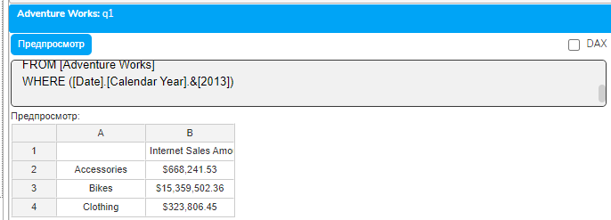
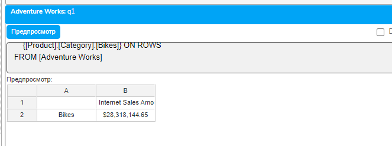
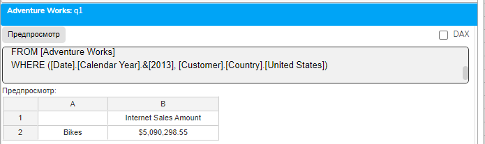
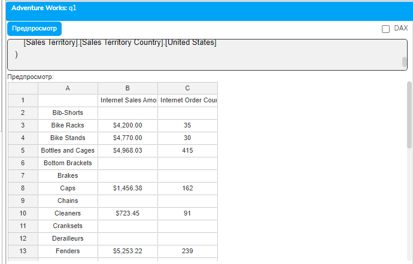
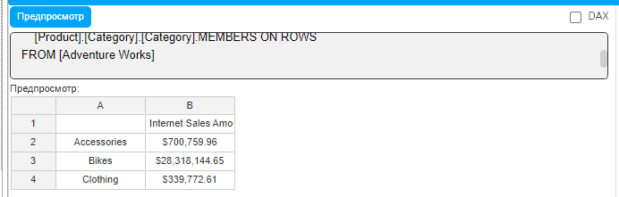
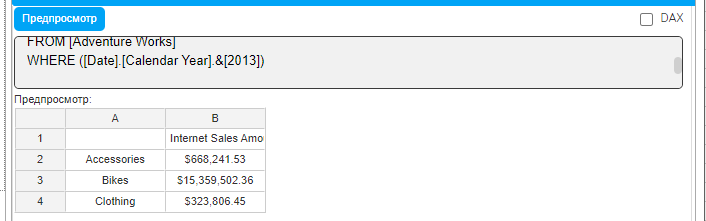
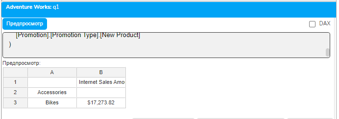
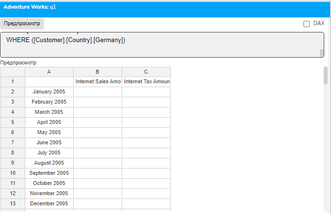
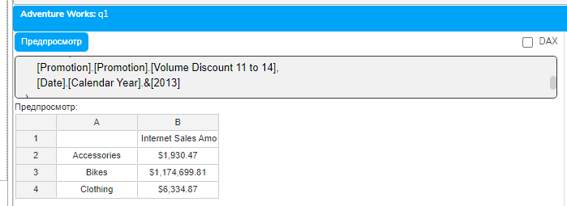
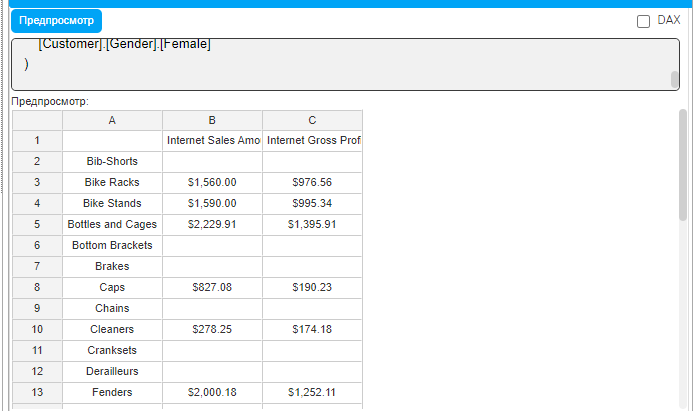

# Урок 2.2: Структура WHERE и использование среза

Введение: WHERE как точка обзора на куб

Добро пожаловать во второй урок практического модуля! В предыдущем уроке мы написали первые MDX-запросы, научились работать с осями COLUMNS и ROWS, создавать наборы и использовать CROSSJOIN. Сегодня мы детально изучим конструкцию WHERE - один из самых непонятых элементов MDX для тех, кто приходит из мира SQL.

В SQL клауза WHERE фильтрует строки результата. В MDX всё иначе - WHERE устанавливает контекст среза для всего запроса, определяя точку обзора на многомерный куб. Это фундаментальное отличие, которое мы сегодня полностью освоим через практику.

Синтаксис WHERE в MDX

## WHERE в MDX имеет строгий синтаксис, требующий обязательного использования круглых скобок

```mdx
WHERE (член_или_кортеж)
```

## Даже для одного члена скобки обСлайдер данные" и выполните запрос без WHERE

```mdx
SELECT
    [Measures].[Internet Sales Amount] ON COLUMNS,
    [Product].[Category].[Category].MEMBERS ON ROWS
FROM [Adventure Works]
```

## Запишите результаты. Теперь добавьте WHERE

```mdx
SELECT
    [Measures].[Internet Sales Amount] ON COLUMNS,
    [Product].[Category].[Category].MEMBERS ON ROWS
FROM [Adventure Works]
WHERE ([Date].[Calendar Year].&[2013])
```



Обратите внимание: количество строк не изменилось, изменились только значения. WHERE не отфильтровал категории - он установил контекст "смотрим на данные 2013 года".

Default Members и их роль в срезах

Каждая иерархия в кубе имеет default member - член по умолчанию, используемый когда измерение не указано явно. Обычно это член "All" верхнего уровня. WHERE переопределяет эти значения по умолчанию.

Практическое упражнение №2: Понимание контекста по умолчанию

## Выполните запрос

```mdx
SELECT
    {[Measures].[Internet Sales Amount]} ON COLUMNS,
    {[Product].[Category].[Bikes]} ON ROWS
FROM [Adventure Works]
```



Результат показывает продажи велосипедов за все периоды, всем клиентам, во всех территориях - везде используются default members.

## Теперь установим конкретный контекст

```mdx
SELECT
    {[Measures].[Internet Sales Amount]} ON COLUMNS,
    {[Product].[Category].[Bikes]} ON ROWS
FROM [Adventure Works]
WHERE ([Date].[Calendar Year].&[2013], [Customer].[Country].[United States])
```



Теперь мы видим продажи велосипедов только за 2013 год только в США.

Множественные измерения в WHERE

WHERE может содержать члены из разных измерений, формируя кортеж. Важное правило: из каждого измерения можно указать только один член.

Практическое упражнение №3: Комплексный срез

```mdx
SELECT
    {[Measures].[Internet Sales Amount],
     [Measures].[Internet Order Count]} ON COLUMNS,
    [Product].[Subcategory].[Subcategory].MEMBERS ON ROWS
FROM [Adventure Works]
WHERE (
    [Date].[Calendar].[Calendar Quarter].&[2013]&[2],
    [Customer].[Country].[United States],
    [Sales Territory].[Sales Territory Country].[United States]
)
```



Этот запрос показывает продажи и количество заказов по подкатегориям продуктов в контексте: второй квартал 2013 года, клиенты из США, территория продаж США.

WHERE vs размещение на осях

Важно понимать разницу между использованием измерения в WHERE и размещением его на оси.

Практическое упражнение №4: Сравнение подходов

## Вариант 1 - год в WHERE

```mdx
SELECT
    [Measures].[Internet Sales Amount] ON COLUMNS,
    [Product].[Category].[Category].MEMBERS ON ROWS
FROM [Adventure Works]
WHERE ([Date].[Calendar Year].&[2013])
```

## Вариант 2 - год на оси

```mdx
SELECT
    [Date].[Calendar Year].&[2013] ON COLUMNS,
    [Product].[Category].[Category].MEMBERS ON ROWS
FROM [Adventure Works]
```

В первом случае год - невидимый контекст. Во втором - год явно отображается как колонка. Выбор зависит от требований к отчёту.

Ограничения WHERE

## WHERE имеет важные ограничения, которые нужно знать

Нельзя указать несколько членов одного измерения напрямую

## Неправильно

```mdx
WHERE ([Product].[Category].[Bikes], [Product].[Category].[Clothing])
```

Нельзя использовать члены из разных иерархий одного измерения

## Неправильно

```mdx
WHERE (
    [Date].[Calendar Year].&[2013],
    [Date].[Fiscal].[Fiscal Year].&[2013]
)
```

WHERE не может содержать наборы, только кортежи

## Неправильно

```mdx
WHERE {[Date].[Calendar Year].&[2012], [Date].[Calendar Year].&[2013]}
```

Практическое упражнение №5: Обход ограничений через подзапросы

## Когда нужно ограничить данные несколькими членами одного измерения, используйте подзапрос

```mdx
SELECT
    [Measures].[Internet Sales Amount] ON COLUMNS,
    [Product].[Category].[Category].MEMBERS ON ROWS
FROM (
    SELECT {[Date].[Calendar Year].&[2012],
            [Date].[Calendar Year].&[2013]} ON COLUMNS
    FROM [Adventure Works]
)
```

Подзапрос создаёт виртуальный куб, ограниченный 2012-2013 годами, и основной запрос работает уже с этим ограниченным пространством.

Взаимодействие WHERE с вычисляемыми членами

WHERE устанавливает контекст для всех вычислений, но вычисляемые члены могут переопределять этот контекст.

Практическое упражнение №6: Контекст и вычисления

```mdx
WITH MEMBER [Measures].[Sales 2012] AS
    ([Measures].[Internet Sales Amount], [Date].[Calendar Year].&[2012])
SELECT
    {[Measures].[Internet Sales Amount],
     [Measures].[Sales 2012]} ON COLUMNS,
    [Product].[Category].[Category].MEMBERS ON ROWS
FROM [Adventure Works]
WHERE ([Date].[Calendar Year].&[2013])
```

## Результат покажет

[Internet Sales Amount] - данные за 2013 год (из WHERE)

[Sales 2012] - данные за 2012 год (явно указано в формуле)

Вычисляемый член игнорирует контекст WHERE для измерения Date.

Производительность и WHERE

WHERE влияет на производительность запросов. MDX-процессор использует срез для оптимизации доступа к данным.

## Рекомендации по оптимизации

## Используйте ключи членов вместо имён

```mdx
-- Быстрее
WHERE ([Customer].[Country].&[United States])
-- Медленнее
WHERE ([Customer].[Country].[United States])
```

Минимизируйте количество измерений в WHERE: Каждое дополнительное измерение усложняет контекст вычислений.

Размещайте в WHERE измерения с высокой селективностью: Если измерение сильно ограничивает данные, его эффективнее использовать в WHERE.

Практическое упражнение №7: Анализ влияния WHERE

## Создадим отчёт для анализа эффекта различных срезов

```mdx
-- Запрос 1: Без среза
SELECT
    [Measures].[Internet Sales Amount] ON COLUMNS,
    [Product].[Category].[Category].MEMBERS ON ROWS
FROM [Adventure Works]
```



```mdx
-- Запрос 2: Срез по году
SELECT
    [Measures].[Internet Sales Amount] ON COLUMNS,
    [Product].[Category].[Category].MEMBERS ON ROWS
FROM [Adventure Works]
WHERE ([Date].[Calendar Year].&[2013])
```



```mdx
-- Запрос 3: Комплексный срез
SELECT
    [Measures].[Internet Sales Amount] ON COLUMNS,
    [Product].[Category].[Category].MEMBERS ON ROWS
FROM [Adventure Works]
WHERE (
    [Date].[Calendar Year].&[2013],
    [Customer].[Country].[United States],
    [Promotion].[Promotion Type].[New Product]
)
```



Сравните результаты и время выполнения. Заметьте, как каждое дополнительное условие в WHERE сужает контекст и меняет результаты.

Типичные ошибки при работе с WHERE

Ошибка 1: Забывают круглые скобки

```mdx
-- Неправильно
WHERE [Date].[Calendar Year].&[2013]
-- Правильно
WHERE ([Date].[Calendar Year].&[2013])
```

Ошибка 2: Пытаются использовать операторы сравнения

```mdx
-- Неправильно (SQL-стиль)
WHERE [Measures].[Internet Sales Amount] > 1000000
-- Это не работает в WHERE MDX!
```

Ошибка 3: Путают срез и фильтрацию WHERE не фильтрует результаты - он устанавливает контекст. Для фильтрации используйте функции на осях.

Практические сценарии использования WHERE

Сценарий 1: Отчёт для конкретного региона

```mdx
SELECT
    {[Measures].[Internet Sales Amount],
     [Measures].[Internet Tax Amount]} ON COLUMNS,
    [Date].[Calendar].[Month].MEMBERS ON ROWS
FROM [Adventure Works]
WHERE ([Customer].[Country].[Germany])
```



Сценарий 2: Анализ конкретной промо-акции

```mdx
SELECT
    [Measures].[Internet Sales Amount] ON COLUMNS,
    [Product].[Category].[Category].MEMBERS ON ROWS
FROM [Adventure Works]
WHERE (
    [Promotion].[Promotion].[Volume Discount 11 to 14],
    [Date].[Calendar Year].&[2013]
)
```



Сценарий 3: Точечный анализ

```mdx
SELECT
    {[Measures].[Internet Sales Amount],
     [Measures].[Internet Gross Profit]} ON COLUMNS,
    [Product].[Subcategory].[Subcategory].MEMBERS ON ROWS
FROM [Adventure Works]
WHERE (
    [Date].[Calendar].[Calendar Quarter].&[2013]&[4],
    [Customer].[Education].[Bachelors],
    [Customer].[Gender].[Female]
)
```



Домашнее задание

Задание 1: Базовые срезы

## Создайте три запроса с использованием WHERE

Продажи по категориям продуктов для Канады

Продажи по месяцам 2013 года для категории Bikes

Продажи по подкатегориям с срезом по Q3 2013

Задание 2: Множественные срезы

Создайте запрос с WHERE, содержащим минимум 4 измерения. Объясните выбор каждого измерения.

Задание 3: Сравнительный анализ

## Создайте два варианта одного отчёта

С использованием WHERE для года

С размещением года на оси Объясните, когда какой вариант предпочтительнее.

Задание 4: Исследование

Найдите в Adventure Works три измерения, которые логично использовать вместе в WHERE для анализа целевой аудитории. Создайте соответствующий запрос.

Контрольные вопросы

В чём принципиальное отличие WHERE в MDX от WHERE в SQL?

Почему круглые скобки обязательны в WHERE MDX?

Что такое default member и как WHERE его переопределяет?

Можно ли указать два члена одного измерения в WHERE?

Как WHERE влияет на вычисляемые члены?

Что эффективнее: ключ или имя члена в WHERE?

Как обойти ограничение на несколько членов одного измерения?

Влияет ли порядок членов в WHERE на результат?

Заключение

## Мы глубоко изучили WHERE и концепцию среза в MDX. Ключевые моменты

WHERE устанавливает контекст, а не фильтрует данные

Синтаксис требует обязательных круглых скобок

Можно комбинировать члены разных измерений

WHERE переопределяет default members

Существуют способы обхода ограничений через подзапросы

В следующем уроке 2.3 мы изучим работу с наборами и членами - научимся создавать сложные наборы, использовать операции над ними и эффективно манипулировать членами измерений. Это расширит ваши возможности создания гибких отчётов.

Продолжайте практиковаться с WHERE - правильное понимание срезов критически важно для всей дальнейшей работы с MDX!
