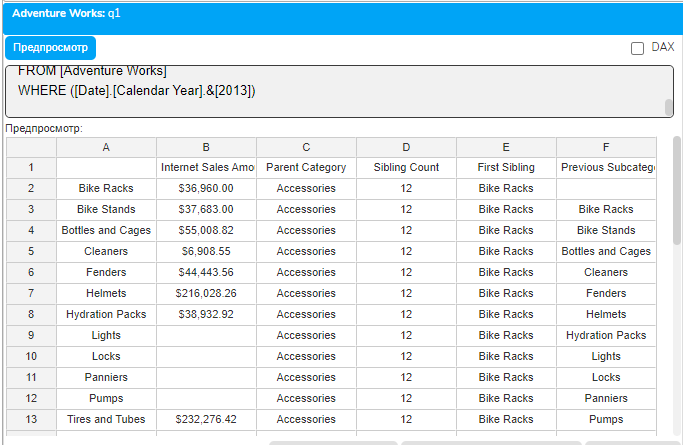
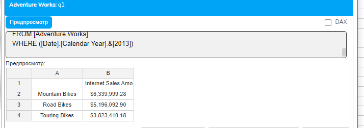

# Урок 2.4: Продвинутые функции навигации

Введение: Расширяем возможности навигации по иерархиям

Добро пожаловать в четвёртый урок модуля синтаксиса MDX! В предыдущих уроках мы изучили базовые запросы, работу с WHERE-срезами и основы работы с наборами и членами. Сегодня мы значительно расширим ваш арсенал инструментов для навигации по многомерным структурам данных, изучив продвинутые функции навигации в MDX.

Навигационные функции - это мощнейший инструмент MDX, позволяющий динамически перемещаться по иерархиям, находить родственные элементы, предков и потомков. Эти функции делают MDX настолько эффективным для анализа иерархических данных, что аналогичные операции в SQL потребовали бы множества сложных JOIN-операций и рекурсивных запросов.

Теоретические основы: Семейство навигационных функций

Концепция иерархической навигации

В многомерной модели данных каждый член существует не изолированно, а в контексте иерархической структуры. MDX предоставляет богатый набор функций для перемещения по этой структуре в любом направлении: вверх к предкам, вниз к потомкам, горизонтально к братьям и сёстрам.

## Иерархическая навигация в MDX базируется на следующих принципах

Относительность позиции - все навигационные функции работают относительно текущего члена или указанного члена.

Сохранение контекста - при навигации сохраняется информация об измерении и иерархии.

Уровневая структура - функции учитывают уровни иерархии и могут перемещаться как по уровням, так и внутри уровня.

Классификация навигационных функций

## Навигационные функции MDX можно разделить на несколько категорий

## Вертикальная навигация - движение вверх и вниз по иерархии

Parent - родительский член

Children - дочерние члены

Ancestors - предки на заданном уровне

Descendants - потомки с различными опциями

## Горизонтальная навигация - движение внутри уровня

PrevMember - предыдущий член на том же уровне

NextMember - следующий член на том же уровне

Siblings - все члены того же уровня с тем же родителем

Cousin - параллельный член в другой ветви иерархии

## Позиционная навигация - навигация по порядковым номерам

FirstChild - первый дочерний член

LastChild - последний дочерний член

FirstSibling - первый член среди братьев и сестёр

LastSibling - последний член среди братьев и сестёр

Вертикальная навигация: Parent и Children

Функция Parent

Функция Parent возвращает родительский член для указанного члена. Это одна из самых простых, но часто используемых функций навигации.

## Синтаксис

Member_Expression.Parent

## Важные особенности Parent

Если член находится на верхнем уровне иерархии, Parent возвращает NULL

Parent всегда возвращает одного члена, а не набор

Можно применять Parent последовательно для навигации на несколько уровней вверх

Функция Children

Функция Children возвращает набор всех непосредственных потомков указанного члена.

## Синтаксис

Member_Expression.Children

## Особенности Children

Возвращает набор, даже если потомков нет (пустой набор)

Включает только непосредственных потомков (на один уровень вниз)

Порядок членов в возвращаемом наборе соответствует их естественному порядку в иерархии

Функции Ancestors и Descendants

Функция Ancestors

Ancestors позволяет найти предка члена на указанном уровне или на заданном расстоянии вверх по иерархии.

## Синтаксис имеет две формы

Ancestors(Member_Expression, Level_Expression)

Ancestors(Member_Expression, Distance)

## Параметры

Member_Expression - член, для которого ищем предка

Level_Expression - уровень, на котором должен находиться предок

Distance - количество уровней вверх от исходного члена

## Важные аспекты Ancestors

При использовании уровня, функция найдёт предка именно на этом уровне

При использовании расстояния, отсчёт идёт от текущего уровня члена

Если предка на указанном уровне нет, возвращается NULL

Функция Descendants

Descendants - одна из самых мощных и гибких функций навигации, позволяющая получить потомков члена с различными опциями.

## Синтаксис

```mdx
Descendants(Member_Expression [, Level_Expression [, Desc_Flag]])
Descendants(Member_Expression [, Distance [, Desc_Flag]])
```

## Параметры

Member_Expression - член, потомков которого ищем

Level_Expression или Distance - уровень или расстояние для поиска

Desc_Flag - флаг, определяющий какие потомки включаются

## Флаги Descendants

SELF - только члены указанного уровня

AFTER - члены после указанного уровня

BEFORE - члены до указанного уровня

BEFORE_AND_AFTER - члены до и после указанного уровня

SELF_AND_AFTER - члены указанного уровня и после

SELF_AND_BEFORE - члены указанного уровня и до

SELF_BEFORE_AFTER - все потомки

LEAVES - только листовые члены (без потомков)

Горизонтальная навигация: PrevMember, NextMember, Siblings

Функции PrevMember и NextMember

Эти функции позволяют перемещаться к соседним членам на том же уровне иерархии.

## Синтаксис

Member_Expression.PrevMember

Member_Expression.NextMember

## Особенности

Навигация происходит в пределах того же родителя

Если предыдущего/следующего члена нет, возвращается NULL

Порядок определяется естественным порядком членов в измерении

Функция Siblings

Siblings возвращает всех братьев и сестёр члена, включая сам член.

## Синтаксис

Member_Expression.Siblings

## Характеристики Siblings

Возвращает набор всех членов с тем же родителем

Включает исходный член в результат

Сохраняет естественный порядок членов

Функция Cousin

Cousin - уникальная функция для навигации между параллельными ветвями иерархии.

## Синтаксис

Cousin(Member_Expression1, Member_Expression2)

## Логика работы Cousin

Определяет позицию Member_Expression1 относительно его предков

Находит аналогичную позицию относительно Member_Expression2

Возвращает член в найденной позиции

Cousin особенно полезна при работе с временными иерархиями для поиска аналогичных периодов в разных годах.

Позиционные функции: First и Last

FirstChild и LastChild

Эти функции возвращают первого или последнего потомка члена.

## Синтаксис

Member_Expression.FirstChild

Member_Expression.LastChild

FirstSibling и LastSibling

Возвращают первого или последнего члена среди братьев и сестёр.

## Синтаксис

Member_Expression.FirstSibling

Member_Expression.LastSibling

Важно: эти функции возвращают члены с тем же родителем, что и исходный член.

Функция Lag и Lead

Lag и Lead позволяют перемещаться на заданное количество позиций назад или вперёд.

## Синтаксис

```mdx
Member_Expression.Lag(Index)
Member_Expression.Lead(Index)
```

Где Index - количество позиций для перемещения.

Особерархии

Комбинирование навигационных функций

Мощь навигационных функций раскрывается при их комбинировании. Можно создавать цепочки вызовов дляю 2. Переходит к предыдущему брату родителя 3. Получает всех детей этого члена

Такие комбинации позволяют реализовать практически любую логику навигации по иерархии.

Практическое упражнение: Применение навигационных функций

Теперь применим изученные функции на практике. Откройте плагин "Слайдер данные" и выполните следующий комплексный запрос:

```mdx
WITH
-- Родительская категория для каждой подкатегории
MEMBER [Measures].[Parent Category] AS
    [Product].[Product Categories].CurrentMember.Parent.Name
-- Количество братьев и сестёр
MEMBER [Measures].[Sibling Count] AS
    COUNT([Product].[Product Categories].CurrentMember.Siblings)
-- Первый брат/сестра
MEMBER [Measures].[First Sibling] AS
    [Product].[Product Categories].CurrentMember.FirstSibling.Name
-- Предыдущая подкатегория
MEMBER [Measures].[Previous Subcategory] AS
    [Product].[Product Categories].CurrentMember.PrevMember.Name
SELECT
    {[Measures].[Internet Sales Amount],
     [Measures].[Parent Category],
     [Measures].[Sibling Count],
     [Measures].[First Sibling],
     [Measures].[Previous Subcategory]} ON COLUMNS,
    [Product].[Product Categories].[Subcategory].Members ON ROWS
FROM [Adventure Works]
WHERE ([Date].[Calendar Year].&[2013])
```



## Этот запрос демонстрирует

Использование Parent для получения родительской категории

Подсчёт Siblings для определения количества подкатегорий в категории

FirstSibling для нахождения первой подкатегории в группе

PrevMember для навигации к предыдущей подкатегории

Второй практический пример: Descendants

```mdx
WITH
SET [Bikes Subcategories] AS
    Descendants(
        [Product].[Product Categories].[Category].[Bikes],
        [Product].[Product Categories].[Subcategory],
        SELF
    )
SELECT
    [Measures].[Internet Sales Amount] ON COLUMNS,
    [Bikes Subcategories] ON ROWS
FROM [Adventure Works]
WHERE ([Date].[Calendar Year].&[2013])
```



Этот запрос использует Descendants для получения всех подкатегорий велосипедов.

Домашнее задание

Задание 1: Навигация вверх по иерархии

Создайте запрос, который для каждого продукта покажет его подкатегорию и категорию, используя функции Parent и Ancestors.

Задание 2: Горизонтальная навигация

Для каждого месяца 2013 года покажите продажи текущего месяца, предыдущего и следующего, используя PrevMember и NextMember.

Задание 3: Сложная навигация

Используя Descendants с разными флагами, создайте три разных набора потомков для категории Clothing и сравните результаты.

Контрольные вопросы

В чём разница между Parent и Ancestors?

Какие флаги можно использовать с функцией Descendants?

Что вернёт PrevMember для первого члена уровня?

Как работает функция Cousin?

В чём разница между Children и Descendants?

Что возвращает Siblings - член или набор?

Как получить всех листовых потомков члена?

Заключение

В этом уроке мы освоили продвинутые функции навигации MDX, которые позволяют эффективно перемещаться по иерархическим структурам данных. Мы изучили вертикальную навигацию с Parent, Children, Ancestors и Descendants, горизонтальную с PrevMember, NextMember и Siblings, а также специальные функции как Cousin, Lag и Lead.

Эти функции - фундамент для создания сложных аналитических запросов. Они позволяют динамически находить связанные данные, создавать контекстно-зависимые вычисления и реализовывать сложную бизнес-логику прямо в MDX-запросах.

В следующем уроке мы изучим работу с NON EMPTY для очистки результатов от пустых данных, что сделает наши отчёты более читаемыми и эффективными.
