# Урок 2.5: NON EMPTY для очистки пустых данных

Введение: Проблема пустых ячеек в многомерных запросах

Добро пожаловать в пятый урок модуля синтаксиса MDX! В предыдущих уроках мы освоили создание запросов, работу с WHERE-срезами, наборами и членами, а также продвинутые функции навигации. Сегодня мы изучим критически важную для практической работы тему - управление пустыми данными с помощью ключевого слова NON EMPTY.

При работе с многомерными кубами часто возникает ситуация, когда большая часть возможных комбинаций измерений не содержит данных. Например, не все продукты продаются во всех регионах или не для всех комбинаций дат и клиентов существуют транзакции. Без правильной обработки таких пустых ячеек отчёты становятся громоздкими и трудночитаемыми. NON EMPTY - это элегантное решение этой проблемы.

Теоретические основы: Понимание пустоты в MDX

Что такое пустая ячейка

В контексте MDX пустая ячейка - это пересечение измерений, для которого не существует данных в кубе. Важно понимать, что пустая ячейка отличается от ячейки с нулевым значением:

Пустая ячейка (NULL) - отсутствие данных. Например, если продукт никогда не продавался в определённом регионе, соответствующая ячейка будет пустой.

Нулевое значение (0) - явное значение, указывающее на отсутствие величины, но наличие факта. Например, если была попытка продажи, но она была отменена, значение может быть 0.

## Это различие критически важно, поскольку NULL и 0 по-разному влияют на вычисления

При суммировании NULL игнорируется, а 0 учитывается

При подсчёте среднего NULL не учитывается в знаменателе, а 0 учитывается

При умножении NULL даёт NULL, а 0 даёт 0

Причины появления пустых ячеек

## Пустые ячейки появляются по нескольким причинам

Разреженность данных (Sparsity) - естественное свойство многомерных данных, когда существует лишь малая часть всех возможных комбинаций. В типичном кубе продаж заполнено обычно менее 1% всех возможных комбинаций.

Несовместимые измерения - некоторые комбинации логически невозможны. Например, интернет-продажи не могут иметь значения для измерения "Физический магазин".

Временные границы - данные существуют только в определённом временном диапазоне. Для будущих дат или дат до начала бизнеса данные отсутствуют.

Бизнес-правила - определённые комбинации исключены бизнес-логикой. Например, некоторые продукты могут быть недоступны для определённых категорий клиентов.

Влияние пустых ячеек на производительность

## Пустые ячейки влияют не только на читаемость отчётов, но и на производительность

Объём передаваемых данных - даже пустые ячейки требуют передачи метаинформации от сервера к клиенту.

Время обработки - MDX-процессор тратит ресурсы на обработку пустых комбинаций.

Использование памяти - клиентские приложения выделяют память под структуры для хранения всех ячеек, включая пустые.

Синтаксис и семантика NON EMPTY

Базовый синтаксис

## NON EMPTY применяется к осям запроса и имеет следующий синтаксис

```mdx
SELECT
    NON EMPTY {набор} ON COLUMNS,
    NON EMPTY {набор} ON ROWS
FROM [куб]
```

NON EMPTY можно применять к каждой оси независимо или к обеим одновременно.

Механизм работы NON EMPTY

## NON EMPTY работает следующим образом

Формирование исходного набора - сначала формируется полный набор согласно выражению на оси

Оценка пустоты - для каждого элемента набора проверяется, существуют ли непустые данные в контексте запроса

Фильтрация - из набора удаляются элементы, для которых все ячейки пусты

Возврат результата - возвращается очищенный набор

Важная особенность: NON EMPTY оценивает пустоту в контексте всего запроса, включая другие оси и WHERE-срез.

NON EMPTY vs NONEMPTY()

## Существует важное различие между ключевым словом NON EMPTY и функцией NonEmpty()

## NON EMPTY (ключевое слово)

Применяется на уровне оси

Оценивает пустоту в контексте всего запроса

Учитывает все меры и измерения в запросе

Более эффективно с точки зрения производительности

```mdx
NonEmpty() (функция):
```

Может использоваться в любом месте, где ожидается набор

Позволяет указать конкретную меру для проверки пустоты

Более гибкая, но может быть менее эффективной

Контекст применения NON EMPTY

NON EMPTY и одна ось

При применении NON EMPTY к одной оси, проверка пустоты происходит для всех комбинаций с членами другой оси:

```mdx
SELECT
    [Measures].[Internet Sales Amount] ON COLUMNS,
    NON EMPTY [Product].[Category].Members ON ROWS
FROM [Adventure Works]
```

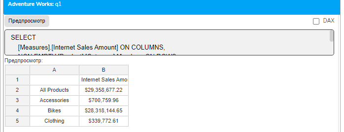

Здесь будут показаны только те категории продуктов, для которых существуют интернет-продажи.

NON EMPTY и обе оси

## При применении к обеим осям происходит двухэтапная фильтрация

```mdx
SELECT
    NON EMPTY [Date].[Calendar Year].Members ON COLUMNS,
    NON EMPTY [Product].[Category].Members ON ROWS
FROM [Adventure Works]
WHERE ([Measures].[Internet Sales Amount])
```

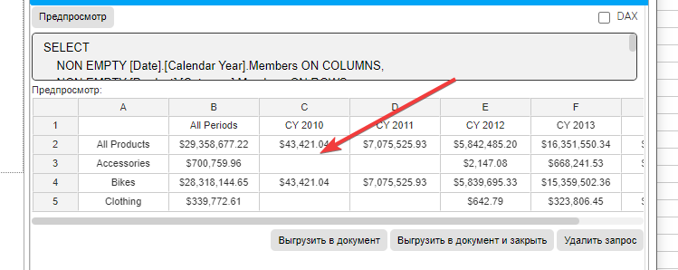

Сначала удаляются категории без продаж, затем годы без продаж.

NON EMPTY и множественные меры

Когда на оси находится несколько мер, NON EMPTY считает строку/столбец непустым, если хотя бы одна мера имеет значение:

```mdx
SELECT
    {[Measures].[Internet Sales Amount],
     [Measures].[Reseller Sales Amount]} ON COLUMNS,
    NON EMPTY [Product].[Category].Members ON ROWS
FROM [Adventure Works]
```

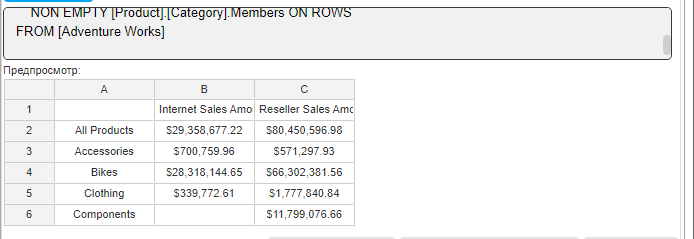

Категория будет показана, если есть либо интернет-продажи, либо продажи через посредников.

Взаимодействие NON EMPTY с другими элементами запроса

NON EMPTY и WHERE

## WHERE-срез влияет на работу NON EMPTY, устанавливая контекст для оценки пустоты

```mdx
SELECT
    [Measures].[Internet Sales Amount] ON COLUMNS,
    NON EMPTY [Product].[Subcategory].Members ON ROWS
FROM [Adventure Works]
WHERE ([Date].[Calendar Year].&[2013])
```

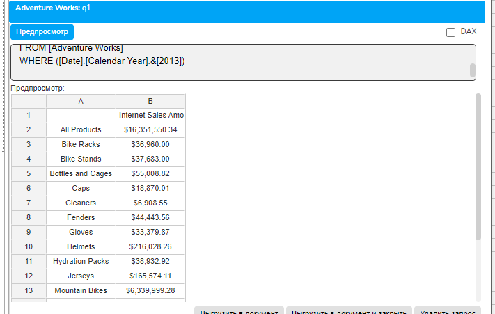

NON EMPTY будет проверять наличие данных только для 2013 года.

NON EMPTY и CROSSJOIN

## При использовании с декартовым произведением NON EMPTY особенно эффективен

```mdx
SELECT
    [Measures].[Internet Sales Amount] ON COLUMNS,
    NON EMPTY
        CROSSJOIN(
            [Product].[Category].Members,
            [Customer].[Country].Members
        ) ON ROWS
FROM [Adventure Works]
```

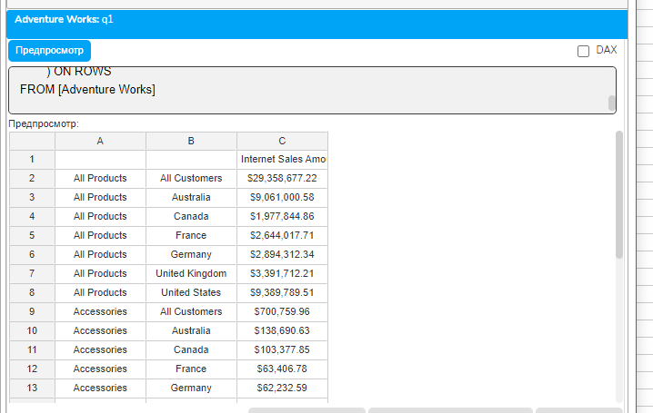

Из всех возможных комбинаций категорий и стран будут показаны только те, где есть продажи.

NON EMPTY и вычисляемые члены

## Вычисляемые члены могут влиять на работу NON EMPTY

```mdx
WITH MEMBER [Measures].[Profit Margin] AS
    [Measures].[Internet Sales Amount] - [Measures].[Internet Total Product Cost]
SELECT
    {[Measures].[Internet Sales Amount],
     [Measures].[Profit Margin]} ON COLUMNS,
    NON EMPTY [Product].[Category].Members ON ROWS
FROM [Adventure Works]
```

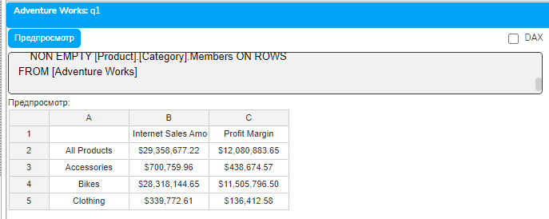

Категория считается непустой, если есть данные для расчёта прибыли.

Оптимизация производительности с NON EMPTY

Правила эффективного использования

Применяйте NON EMPTY как можно раньше - чем раньше в запросе применяется NON EMPTY, тем меньше данных нужно обрабатывать.

Используйте на обеих осях при больших наборах - это значительно сокращает размер результирующего набора.

Комбинируйте с WHERE для предварительной фильтрации - WHERE сокращает пространство поиска до применения NON EMPTY.

Влияние на план выполнения

## NON EMPTY позволяет оптимизатору запросов

Использовать индексы для быстрого исключения пустых областей

Применять параллельную обработку для больших наборов

Кэшировать результаты проверки пустоты

Альтернативные подходы

## В некоторых случаях вместо NON EMPTY можно использовать

Функцию NonEmpty() для более точного контроля

HAVING для фильтрации после агрегации (будет изучено в модуле 4)

Предварительную фильтрацию через подзапросы

Практическое упражнение: Применение NON EMPTY

Откройте плагин "Слайдер данные" и выполните следующие запросы для понимания работы NON EMPTY:

Пример 1: Базовое использование

## Сначала выполните запрос без NON EMPTY

```mdx
SELECT
    [Measures].[Internet Sales Amount] ON COLUMNS,
    Descendants(
        [Product].[Product Categories].[All Products],
        [Product].[Product Categories].[Subcategory],
        SELF
    ) ON ROWS
FROM [Adventure Works]
WHERE ([Date].[Calendar Year].&[2013])
```

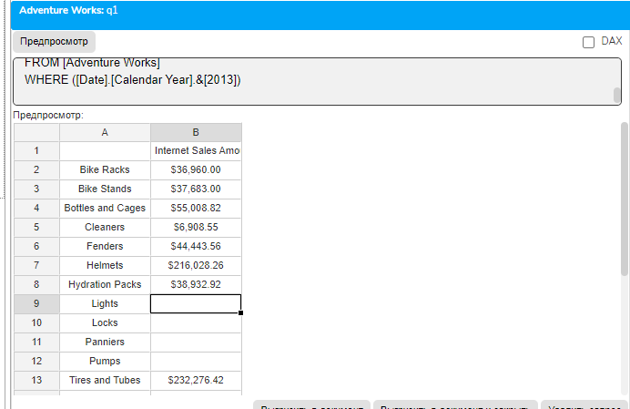

Обратите внимание на количество строк и наличие пустых значений.

## Теперь добавьте NON EMPTY

```mdx
SELECT
    [Measures].[Internet Sales Amount] ON COLUMNS,
    NON EMPTY
        Descendants(
            [Product].[Product Categories].[All Products],
            [Product].[Product Categories].[Subcategory],
            SELF
        ) ON ROWS
FROM [Adventure Works]
WHERE ([Date].[Calendar Year].&[2013])
```

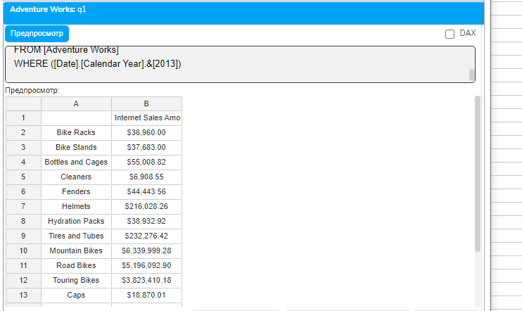

Сравните результаты - остались только подкатегории с продажами в 2013 году.

Пример 2: NON EMPTY с CROSSJOIN

-- Без NON EMPTY - много пустых комбинаций

```mdx
SELECT
    [Measures].[Internet Sales Amount] ON COLUMNS,
    CROSSJOIN(
        [Date].[Calendar].[Month].&[2013]&[1]:[Date].[Calendar].[Month].&[2013]&[6],
        [Product].[Category].Members
    ) ON ROWS
FROM [Adventure Works]
```

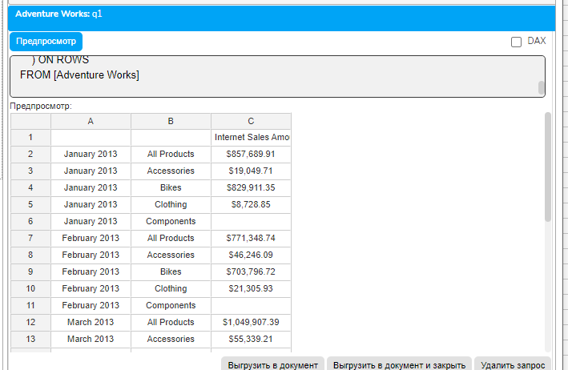

-- С NON EMPTY - только существующие комбинации

```mdx
SELECT
    [Measures].[Internet Sales Amount] ON COLUMNS,
    NON EMPTY
        CROSSJOIN(
            [Date].[Calendar].[Month].&[2013]&[1]:[Date].[Calendar].[Month].&[2013]&[6],
            [Product].[Category].Members
        ) ON ROWS
FROM [Adventure Works]
```

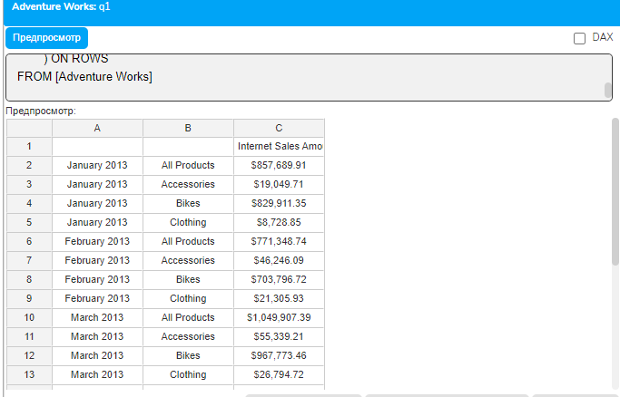

Пример 3: NON EMPTY на обеих осях

```mdx
WITH
MEMBER [Measures].[Avg Order Size] AS
    [Measures].[Internet Sales Amount] / [Measures].[Internet Order Count],
    FORMAT_STRING = "Currency"
SELECT
    NON EMPTY {
        [Measures].[Internet Sales Amount],
        [Measures].[Internet Order Count],
        [Measures].[Avg Order Size]
    } ON COLUMNS,
    NON EMPTY
        CROSSJOIN(
            [Customer].[Country].Members,
            [Product].[Category].Members
        ) ON ROWS
FROM [Adventure Works]
WHERE ([Date].[Calendar Year].&[2013])
```

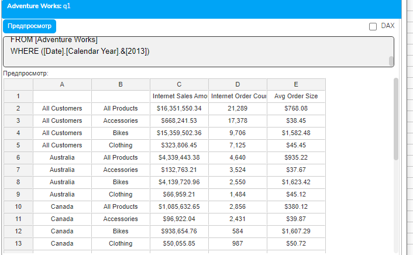

Этот запрос показывает только те комбинации стран и категорий, где были продажи, и только те меры, которые имеют значения.

Типичные ошибки и их решение

Ошибка 1: Неправильное размещение NON EMPTY

-- Неправильно - NON EMPTY внутри фигурных скобок

```mdx
SELECT
    {NON EMPTY [Measures].[Internet Sales Amount]} ON COLUMNS
```

-- Правильно - NON EMPTY перед набором

```mdx
SELECT
    NON EMPTY {[Measures].[Internet Sales Amount]} ON COLUMNS
```

Ошибка 2: Ожидание фильтрации по конкретной мере

## NON EMPTY учитывает все меры в запросе, а не только видимые

```mdx
-- Может вернуть строки с пустыми значениями Internet Sales
-- если есть значения Reseller Sales
SELECT
    [Measures].[Internet Sales Amount] ON COLUMNS,
    NON EMPTY [Product].[Category].Members ON ROWS
FROM [Adventure Works]
WHERE ([Measures].[Reseller Sales Amount])
```

Ошибка 3: Путаница между NULL и 0

NON EMPTY удаляет только NULL, но не нулевые значения. Для фильтрации нулей потребуются другие методы (будут изучены в модуле 4).

Домашнее задание

Задание 1: Базовое применение NON EMPTY

Создайте запрос, показывающий продажи по подкатегориям продуктов и странам клиентов. Используйте NON EMPTY для удаления пустых комбинаций.

Задание 2: Анализ эффективности

Создайте два варианта одного запроса с CROSSJOIN трёх измерений - с и без NON EMPTY. Сравните количество возвращаемых строк.

Задание 3: NON EMPTY с навигационными функциями

Используя функцию Descendants, получите все уровни иерархии Product Categories. Примените NON EMPTY для показа только тех элементов, которые имели продажи в 2013 году.

Контрольные вопросы

В чём разница между пустой ячейкой (NULL) и нулевым значением?

Как NON EMPTY определяет, является ли строка пустой при наличии нескольких мер?

Можно ли применить NON EMPTY только к одной оси?

Как WHERE влияет на работу NON EMPTY?

В чём разница между ключевым словом NON EMPTY и функцией NonEmpty()?

Почему NON EMPTY особенно важен при использовании CROSSJOIN?

Влияет ли NON EMPTY на вычисляемые члены?

Заключение

В этом уроке мы изучили ключевое слово NON EMPTY - мощный инструмент для управления пустыми данными в MDX-запросах. Мы узнали, как NON EMPTY фильтрует пустые строки и столбцы, повышая читаемость отчётов и производительность запросов. Понимание механизма работы NON EMPTY и его взаимодействия с другими элементами запроса критически важно для создания эффективных MDX-решений.

В следующем уроке мы изучим кортежи и многомерные срезы - продвинутые концепции для точного указания пересечений измерений и создания сложных фильтров.
