# Урок 2.6: Кортежи и многомерные срезы

Введение: Фундамент точной адресации в многомерных отчетах

Добро пожаловать в заключительный урок второго модуля! Сегодня мы изучим кортежи (Tuples) — концепцию, которая является краеугольным камнем понимания того, как MDX адресует данные в многомерном пространстве. После освоения базовых запросов, WHERE-срезов, работы с наборами и членами, навигационных функций и NON EMPTY, кортежи станут тем недостающим элементом, который свяжет все эти знания в единую, логичную систему.

Почему кортежи критически важны для создания отчетов? В реальной практике бизнес-аналитики каждый отчет представляет собой набор точно адресованных данных. Когда финансовый директор запрашивает отчет о продажах конкретного продукта в определенном регионе за конкретный период, он фактически запрашивает значение, находящееся на пересечении трех измерений. Кортежи — это механизм, который позволяет MDX точно указать это пересечение и извлечь нужные данные. Без понимания кортежей невозможно создавать точные, эффективные и масштабируемые аналитические отчеты.

Теоретические основы: Понимание кортежей

Что такое кортеж в многомерном пространстве

Кортеж в MDX — это упорядоченная коллекция членов из различных измерений, которая определяет конкретную точку или ячейку в многомерном кубе данных. Если представить куб как многомерную систему координат, то кортеж — это набор координат, указывающий на конкретную ячейку в этом пространстве.

Представьте себе простой пример из реальной жизни: вы находитесь в большом торговом центре и хотите встретиться с другом. Вы говорите: "Встретимся на третьем этаже, в северном крыле, у магазина электроники". Вы только что описали кортеж — точку в трехмерном пространстве торгового центра, определенную пересечением трех координат (этаж, крыло, ориентир).

В контексте MDX и бизнес-отчетности кортеж работает аналогично. Когда мы говорим "продажи велосипедов в США за январь 2013 года", мы описываем кортеж:

```mdx
Измерение Product: член [Bikes]
Измерение Geography: член [United States]
Измерение Time: член [January 2013]
Измерение Measures: член [Sales Amount]
```

Синтаксис и правила создания кортежей

Кортежи в MDX создаются с использованием круглых скобок, внутри которых перечисляются члены различных измерений через запятую:

```mdx
(Member1, Member2, Member3, ...)
```

## Фундаментальные правила кортежей

Уникальность измерений — В одном кортеже не может быть двух членов из одного и того же измерения или иерархии. Это логично: вы не можете находиться одновременно на третьем и пятом этаже здания. Каждое измерение может быть представлено максимум одним членом.

Неполные кортежи — Кортеж не обязан содержать члены из всех измерений куба. Если измерение не указано явно, MDX использует член по умолчанию для этого измерения (обычно это член All или DefaultMember). Это позволяет создавать компактные выражения, фокусируясь только на важных для конкретного отчета измерениях.

Порядок не критичен — В отличие от математических кортежей, порядок членов в MDX-кортеже не влияет на результат. Кортеж ([Product].[Bikes], [Time].[2013]) эквивалентен кортежу ([Time].[2013], [Product].[Bikes]).

Атомарность — Кортеж представляет единую, неделимую точку в многомерном пространстве. Он либо существует целиком, либо не существует вовсе.

Кортежи vs Наборы: критическое различие для отчетности

Понимание разницы между кортежами и наборами фундаментально важно для создания правильных отчетов:

## Кортеж — это одна точка в многомерном пространстве, одна ячейка в кубе

```mdx
([Product].[Category].[Bikes], [Date].[Calendar Year].&[2013])
```

Этот кортеж представляет одно конкретное значение — продажи велосипедов в 2013 году.

## Набор — это коллекция кортежей, множество ячеек

```mdx
{([Product].[Category].[Bikes], [Date].[Calendar Year].&[2013]),
 ([Product].[Category].[Clothing], [Date].[Calendar Year].&[2013])}
```

Этот набор содержит два кортежа и представляет две ячейки данных.

В контексте отчетности: кортеж определяет одно значение в отчете (например, итоговую сумму), а набор определяет строки или столбцы отчета (например, список продуктов с их продажами).

Роль кортежей в формировании структуры отчетов

Явные и неявные кортежи в запросах

При создании MDX-запроса для отчета кортежи присутствуют везде, даже когда мы их явно не видим. Понимание этого механизма критически важно для создания эффективных отчетов.

## Явные кортежи — те, которые мы создаем намеренно

```mdx
SELECT
    {([Measures].[Internet Sales Amount], [Date].[Calendar Year].&[2012]),
     ([Measures].[Internet Sales Amount], [Date].[Calendar Year].&[2013])} ON COLUMNS,
    [Product].[Category].Members ON ROWS
FROM [Adventure Works]
```

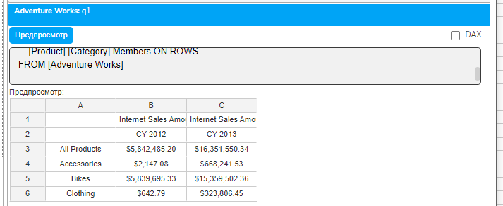

В этом запросе мы явно создаем два кортежа на оси столбцов, чтобы показать продажи за два года.

## Неявные кортежи — те, которые MDX создает автоматически

```mdx
SELECT
    [Measures].[Internet Sales Amount] ON COLUMNS,
    [Product].[Category].Members ON ROWS
FROM [Adventure Works]
```

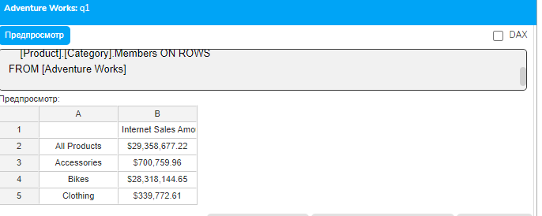

```mdx
Хотя мы не используем круглые скобки, каждая ячейка результирующего отчета представляет собой неявный кортеж. Например, ячейка на пересечении столбца [Internet Sales Amount] и строки [Bikes] представляет кортеж ([Measures].[Internet Sales Amount], [Product].[Category].[Bikes]).
```

Кортежи и контекст выполнения запроса

Каждая ячейка в результирующем отчете вычисляется в контексте определенного кортежа. Этот контекст формируется из:

Членов с оси COLUMNS

Членов с оси ROWS

Среза WHERE

Значений по умолчанию для неуказанных измерений

Понимание этого механизма позволяет точно предсказывать, какие данные появятся в каждой ячейке отчета, и правильно структурировать запросы для получения нужных результатов.

CrossJoin: Мощный инструмент создания комплексных отчетов

Основы функции CrossJoin

CrossJoin — это функция, которая создает декартово произведение двух наборов, генерируя все возможные комбинации их элементов. В контексте отчетности CrossJoin незаменим для создания матричных отчетов, где нужно показать все комбинации элементов из разных измерений.

## Синтаксис

```mdx
CrossJoin(Set1, Set2)
```

## Механизм работы CrossJoin при создании отчетов

Представьте, что вам нужен отчет, показывающий продажи всех категорий продуктов во всех странах. У вас есть 4 категории продуктов и 6 стран. CrossJoin создаст 24 комбинации (4 × 6), каждая из которых будет представлять строку в вашем отчете.

```mdx
SELECT
    [Measures].[Internet Sales Amount] ON COLUMNS,
    CrossJoin(
        [Product].[Category].Members,
        [Customer].[Country].Members
    ) ON ROWS
FROM [Adventure Works]
```

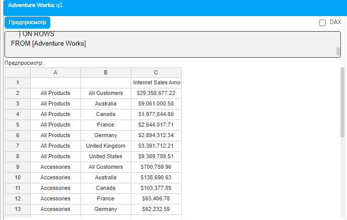

Этот запрос создает матричный отчет, где каждая строка представляет уникальную комбинацию категории и страны.

Расширенное использование CrossJoin для иерархических отчетов

## CrossJoin можно использовать последовательно для создания многоуровневых отчетов

```mdx
SELECT
    [Measures].[Internet Sales Amount] ON COLUMNS,
    CrossJoin(
        CrossJoin(
            [Date].[Calendar Year].Members,
            [Date].[Calendar Quarter].Members
        ),
        [Product].[Category].Members
    ) ON ROWS
FROM [Adventure Works]
```

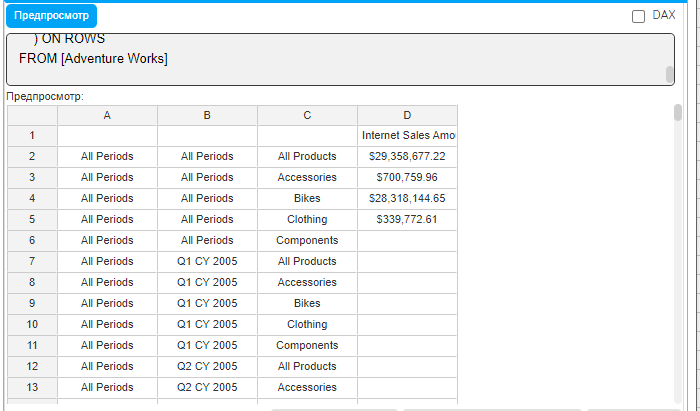

Такой подход создает иерархический отчет с группировкой: Год → Квартал → Категория продукта.

```mdx
*Альтернативный синтаксис с оператором :
```

## MDX предоставляет оператор * как сокращенную запись для CrossJoin

```mdx
[Date].[Calendar Year].Members *
[Date].[Calendar Quarter].Members *
[Product].[Category].Members
```

Этот синтаксис более читаем при создании отчетов с множественными пересечениями.

CrossJoin и производительность отчетов

При использовании CrossJoin важно понимать его влияние на производительность и размер результирующего отчета. Декартово произведение может быстро создать огромное количество комбинаций. Например, CrossJoin 100 продуктов с 50 регионами и 12 месяцами создаст 60,000 строк. Поэтому критически важно:

Использовать NON EMPTY для удаления пустых комбинаций

Применять фильтрацию до CrossJoin, когда это возможно

Ограничивать наборы только необходимыми элементами

Многомерные срезы с кортежами в WHERE

Простые срезы для фокусировки отчета

WHERE-клауза в MDX определяет срез данных — фильтр, применяемый ко всему отчету. Когда мы используем простой член в WHERE, мы фактически создаем частичный кортеж:

```mdx
SELECT
    [Measures].[Internet Sales Amount] ON COLUMNS,
    [Product].[Category].Members ON ROWS
FROM [Adventure Works]
WHERE [Date].[Calendar Year].&[2013]
```

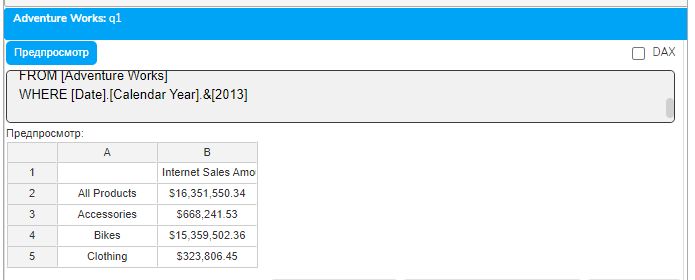

```mdx
Этот срез ограничивает весь отчет данными 2013 года. Каждая ячейка результата будет включать [Date].[Calendar Year].&[2013] как часть своего контекстного кортежа.
```

Сложные многомерные срезы для точной фильтрации

## Используя полные кортежи в WHERE, можно создавать сложные многомерные фильтры для отчетов

```mdx
SELECT
    [Measures].[Internet Sales Amount] ON COLUMNS,
    [Product].[Category].Members ON ROWS
FROM [Adventure Works]
WHERE (
    [Date].[Calendar Year].&[2013],
    [Customer].[Country].[United States],
    [Sales Channel].[Sales Channel].[Internet]
)
```

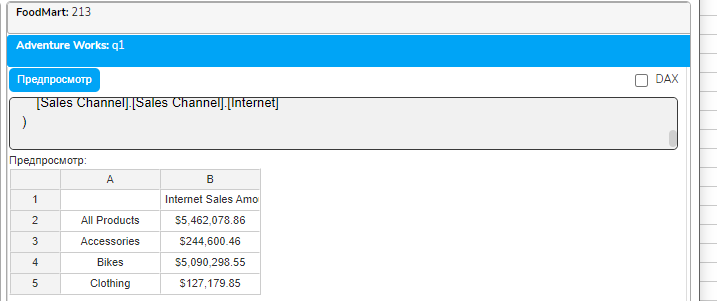

## Что происходит в этом отчете

Показываются только интернет-продажи

Только для клиентов из США

Только за 2013 год

По всем категориям продуктов

Такой подход позволяет создавать высокоспециализированные отчеты для конкретных бизнес-сценариев.

Множественные кортежи в WHERE для альтернативных сценариев

WHERE может содержать набор кортежей, что позволяет создавать отчеты с альтернативными условиями:

```mdx
SELECT
    [Measures].[Internet Sales Amount] ON COLUMNS,
    [Product].[Category].Members ON ROWS
FROM [Adventure Works]
WHERE {
    ([Date].[Calendar Year].&[2013], [Customer].[Country].[United States]),
    ([Date].[Calendar Year].&[2012], [Customer].[Country].[Canada]),
    ([Date].[Calendar Year].&[2011], [Customer].[Country].[United Kingdom])
}
```

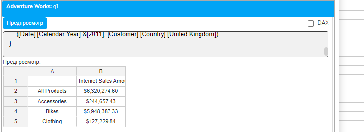

Бизнес-смысл такого отчета: Сравнение продаж по категориям для трех ключевых рынков в разные годы их пиковой активности. Это позволяет создавать сложные аналитические отчеты, учитывающие различные бизнес-контексты.

Практическое применение кортежей в типовых отчетах

Отчет с точечными KPI

## Кортежи позволяют извлекать конкретные значения для дашбордов и KPI-отчетов

```mdx
WITH
MEMBER [Measures].[USA Bikes 2013] AS
    ([Measures].[Internet Sales Amount],
     [Product].[Category].[Bikes],
     [Customer].[Country].[United States],
     [Date].[Calendar Year].&[2013])
MEMBER [Measures].[UK Clothing 2013] AS
    ([Measures].[Internet Sales Amount],
     [Product].[Category].[Clothing],
     [Customer].[Country].[United Kingdom],
     [Date].[Calendar Year].&[2013])
SELECT
    {[Measures].[USA Bikes 2013],
     [Measures].[UK Clothing 2013]} ON COLUMNS
FROM [Adventure Works]
```

Такой подход используется для создания управленческих дашбордов с ключевыми метриками.

Матричный отчет продаж

```mdx
SELECT
    NON EMPTY [Date].[Calendar].[Month].Members ON COLUMNS,
    NON EMPTY
        CrossJoin(
            [Product].[Category].Members,
            [Customer].[Country].Members
        ) ON ROWS
FROM [Adventure Works]
WHERE [Date].[Calendar Year].&[2013]
```

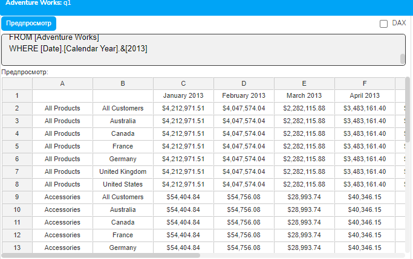

## Этот отчет создает матрицу, где

Столбцы — месяцы 2013 года

Строки — комбинации категорий продуктов и стран

Ячейки — продажи для каждой комбинации

Интеграция кортежей с изученными концепциями

Кортежи и навигационные функции

## Навигационные функции из урока 2.4 можно применять к членам внутри кортежей

```mdx
WITH MEMBER [Measures].[Parent Level Sales] AS
    ([Measures].[Internet Sales Amount],
     [Product].[Product Categories].CurrentMember.Parent,
     [Date].[Calendar].CurrentMember)
SELECT
    {[Measures].[Internet Sales Amount],
     [Measures].[Parent Level Sales]} ON COLUMNS,
    NON EMPTY
        CrossJoin(
            [Product].[Product Categories].[Subcategory].Members,
            [Date].[Calendar].[Month].Members
        ) ON ROWS
FROM [Adventure Works]
WHERE [Date].[Calendar Year].&[2013]
```

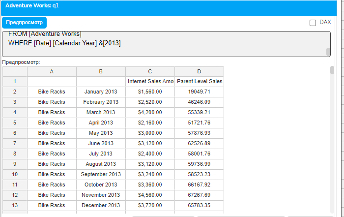

Этот отчет показывает продажи подкатегорий и их родительских категорий по месяцам.

Кортежи и NON EMPTY

NON EMPTY из урока 2.5 работает с наборами кортежей, удаляя те комбинации, для которых нет данных:

```mdx
SELECT
    [Measures].[Internet Sales Amount] ON COLUMNS,
    NON EMPTY
        CrossJoin(
            Descendants(
                [Product].[Product Categories].[All Products],
                [Product].[Product Categories].[Subcategory],
                SELF
            ),
            [Customer].[Country].Members
        ) ON ROWS
FROM [Adventure Works]
WHERE [Date].[Calendar Year].&[2013]
```

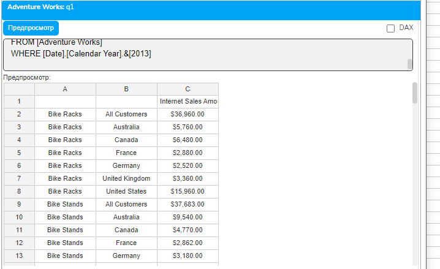

NON EMPTY анализирует каждый кортеж (подкатегория, страна) и удаляет те, где нет продаж.

Практические упражнения

Упражнение 1: Создание детализированного отчета продаж

```mdx
-- Создаем отчет с конкретными комбинациями для анализа ключевых сегментов
SELECT
    {[Measures].[Internet Sales Amount],
     [Measures].[Internet Order Count]} ON COLUMNS,
    {([Product].[Category].[Bikes], [Customer].[Country].[United States]),
     ([Product].[Category].[Bikes], [Customer].[Country].[United Kingdom]),
     ([Product].[Category].[Clothing], [Customer].[Country].[United States]),
     ([Product].[Category].[Clothing], [Customer].[Country].[United Kingdom])} ON ROWS
FROM [Adventure Works]
WHERE [Date].[Calendar Year].&[2013]
```

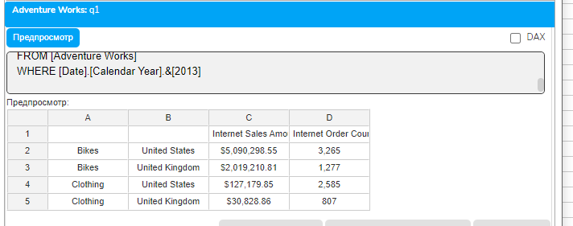

Упражнение 2: Комплексный матричный отчет

```mdx
-- Матричный отчет с тройным пересечением
SELECT
    NON EMPTY
        CrossJoin(
            [Date].[Calendar].[Month].&[2013]&[1]:[Date].[Calendar].[Month].&[2013]&[6],
            {[Measures].[Internet Sales Amount], [Measures].[Internet Order Count]}
        ) ON COLUMNS,
    NON EMPTY
        CrossJoin(
            [Product].[Category].Members,
            [Customer].[Country].Members
        ) ON ROWS
FROM [Adventure Works]
```

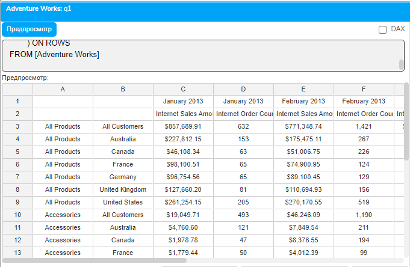

Заключение и переход к следующему модулю

В этом уроке мы изучили кортежи — фундаментальную концепцию MDX, которая обеспечивает точную адресацию в многомерном пространстве данных. Мы узнали, как кортежи формируют структуру отчетов, как CrossJoin создает комплексные матричные представления, и как использовать кортежи в WHERE для создания сложных многомерных фильтров.

Понимание кортежей критически важно для создания профессиональных аналитических отчетов, поскольку они:

Обеспечивают точную адресацию любой ячейки данных в кубе

Позволяют создавать сложные матричные и иерархические отчеты

Дают возможность точно контролировать контекст вычислений

Являются основой для понимания более сложных концепций MDX

С завершением этого урока вы освоили все базовые концепции синтаксиса MDX. В следующем модуле мы начнем создавать расчетные меры и изучать вычисления, применяя все полученные знания для решения реальных аналитических задач.

Домашнее задание

Задание 1: Отчет для руководства

Создайте отчет, показывающий продажи топ-3 категорий продуктов в топ-5 странах, используя явные кортежи на оси ROWS.

Задание 2: Матричный анализ

Используйте CrossJoin для создания отчета, показывающего все комбинации кварталов 2013 года и категорий продуктов. Примените NON EMPTY для очистки.

Задание 3: Сложный срез

Создайте отчет с многомерным срезом в WHERE, включающим минимум 4 измерения, и объясните бизнес-смысл такой фильтрации.

Контрольные вопросы

Что такое кортеж и почему он важен для создания отчетов?

В чем разница между кортежом и набором в контексте структуры отчета?

Как CrossJoin помогает создавать матричные отчеты?

Почему в кортеже не может быть двух членов из одного измерения?

Как кортежи в WHERE влияют на весь отчет?

Что происходит с неуказанными измерениями в частичном кортеже?

Как NON EMPTY работает с наборами кортежей?
