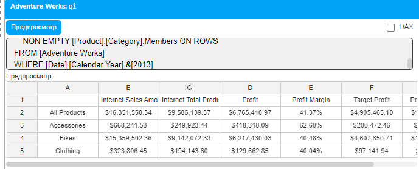
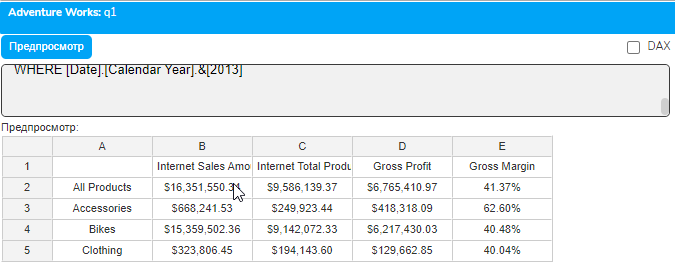
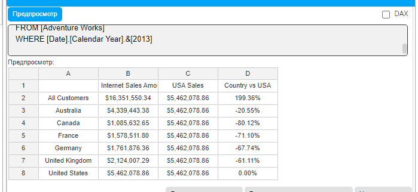
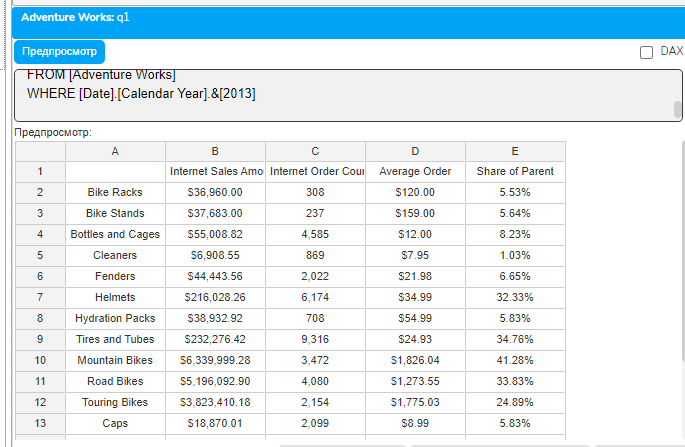

# Урок 3.1: Создание простых расчетных мер

Введение: Переход от извлечения к вычислению данных

Добро пожаловать в третий модуль курса MDX! Поздравляем с успешным освоением основ синтаксиса MDX. Вы научились создавать запросы, работать с наборами и членами, использовать навигационные функции, применять NON EMPTY и понимать кортежи. Теперь пришло время сделать следующий важный шаг — научиться создавать собственные вычисляемые показатели.

До сих пор мы работали с существующими мерами в кубе, такими как [Internet Sales Amount] или [Order Count]. Но реальная аналитика требует большего: нужно вычислять маржинальность, коэффициенты конверсии, средние показатели, отклонения и множество других производных метрик. Расчетные меры (Calculated Members) — это механизм MDX, позволяющий создавать новые показатели на основе существующих данных прямо в запросе.

Теоретические основы расчетных мер

Что такое расчетная мера и зачем она нужна

Расчетная мера — это виртуальный член измерения (чаще всего измерения Measures), который вычисляется на основе MDX-выражения. В отличие от физических мер, хранящихся в кубе, расчетные меры создаются динамически во время выполнения запроса.

## Ключевые характеристики расчетных мер

Виртуальность — расчетные меры не хранятся физически в кубе, они существуют только в контексте запроса или сессии

Динамичность — значение расчетной меры вычисляется для каждой ячейки результата в зависимости от контекста

Гибкость — формула расчетной меры может использовать любые доступные функции MDX и ссылаться на любые элементы куба

Контекстная зависимость — результат вычисления зависит от текущего контекста (какие члены находятся на осях, какой применен срез)

## Почему расчетные меры критически важны для аналитики

В реальных бизнес-сценариях базовые меры редко дают полную картину. Например, знание общей суммы продаж полезно, но для принятия решений нужны производные показатели: средний чек, маржинальность, доля рынка, темпы роста. Расчетные меры позволяют создавать эти показатели без изменения структуры куба, что дает аналитикам гибкость и независимость от IT-отдела.

Синтаксис WITH MEMBER

Расчетные меры создаются с помощью конструкции WITH MEMBER, которая предшествует основному SELECT-запросу:

```mdx
WITH MEMBER [Dimension].[Hierarchy].[MemberName] AS
    Expression
    [, Property = Value]
SELECT
    ...
```

FROM ...

## Разбор синтаксиса

WITH — ключевое слово, начинающее блок определений

MEMBER — указывает, что мы создаем новый член

[Dimension].[Hierarchy].[MemberName] — полное имя создаваемого члена

AS — ключевое слово, после которого следует выражение

Expression — MDX-выражение, определяющее логику вычисления

Property = Value — необязательные свойства члена (например, FORMAT_STRING)

Область видимости расчетных мер

Расчетные меры, созданные с WITH MEMBER, имеют область видимости в пределах одного запроса. Это означает:

Мера существует только во время выполнения конкретного запроса

После выполнения запроса мера исчезает

Другие запросы не видят эту меру

Мера доступна во всех частях запроса после её определения

Такая изоляция обеспечивает безопасность и предсказуемость: создание расчетной меры в одном отчете не влияет на другие отчеты или пользователей.

Основные паттерны создания расчетных мер

Арифметические операции

Самый простой и распространенный тип расчетных мер — арифметические вычисления над существующими мерами:

```mdx
WITH MEMBER [Measures].[Profit] AS
    [Measures].[Internet Sales Amount] - [Measures].[Internet Total Product Cost]
```

## MDX поддерживает стандартные арифметические операторы

```mdx
+ (сложение)
```

- (вычитание)

```mdx
* (умножение)
/ (деление)
```

## При выполнении арифметических операций важно понимать, как обрабатываются NULL значения

NULL + число = NULL

NULL - число = NULL

NULL * число = NULL

NULL / число = NULL

число / 0 = ошибка (деление на ноль)

число / NULL = NULL

Вычисление коэффициентов и соотношений

## Коэффициенты — важнейший инструмент анализа, показывающий соотношение между показателями

```mdx
WITH MEMBER [Measures].[Profit Margin] AS
    ([Measures].[Internet Sales Amount] - [Measures].[Internet Total Product Cost]) /
    [Measures].[Internet Sales Amount]
FROM [Adventure Works]
```

## При вычислении коэффициентов критически важно обрабатывать деление на ноль и NULL

```mdx
WITH MEMBER [Measures].[Average Order Value] AS
    [Measures].[Internet Sales Amount] / [Measures].[Internet Order Count]
Если [Internet Order Count] равен нулю или NULL, результат будет некорректным.
```

Форматирование расчетных мер

## Свойство FORMAT_STRING определяет, как отображается значение расчетной меры

```mdx
WITH MEMBER [Measures].[Profit Margin] AS
    ([Measures].[Internet Sales Amount] - [Measures].[Internet Total Product Cost]) /
    [Measures].[Internet Sales Amount],
    FORMAT_STRING = "Percent"
```

## Основные форматы

"Currency" — денежный формат с символом валюты

"Percent" — процентный формат (умножает на 100 и добавляет %)

"#,##0.00" — числовой формат с разделителями тысяч и двумя десятичными знаками

"Standard" — стандартный числовой формат

Использование контекста в расчетных мерах

Расчетные меры вычисляются в контексте текущей ячейки. Это означает, что одна и та же формула может давать разные результаты в зависимости от того, какие члены находятся на осях:

```mdx
WITH MEMBER [Measures].[Sales Contribution] AS
    [Measures].[Internet Sales Amount] /
    ([Measures].[Internet Sales Amount], [Product].[Category].CurrentMember.Parent)
```

Здесь используется навигация по иерархии для получения продаж родительской категории.

Работа с кортежами в расчетных мерах

Кортежи, изученные в предыдущем модуле, активно используются в расчетных мерах для получения конкретных значений:

```mdx
WITH MEMBER [Measures].[USA Sales] AS
    ([Measures].[Internet Sales Amount], [Customer].[Country].[United States])
MEMBER [Measures].[Share of USA] AS
    [Measures].[Internet Sales Amount] / [Measures].[USA Sales],
    FORMAT_STRING = "Percent"
```

Кортеж ([Measures].[Internet Sales Amount], [Customer].[Country].[United States]) возвращает конкретное значение — продажи в США, которое затем используется как константа во второй расчетной мере.

Использование навигационных функций в расчетных мерах

Навигационные функции из модуля 2 становятся особенно мощными в сочетании с расчетными мерами:

```mdx
WITH MEMBER [Measures].[Parent Sales] AS
    ([Measures].[Internet Sales Amount],
     [Product].[Product Categories].CurrentMember.Parent)
MEMBER [Measures].[Percent of Parent] AS
    [Measures].[Internet Sales Amount] / [Measures].[Parent Sales],
    FORMAT_STRING = "Percent"
```

Функция .Parent позволяет динамически получать родительский элемент для каждой строки отчета.

Комбинирование нескольких расчетных мер

В одном запросе можно создавать множество расчетных мер, которые могут ссылаться друг на друга:
WITH

```mdx
MEMBER [Measures].[Profit] AS
    [Measures].[Internet Sales Amount] - [Measures].[Internet Total Product Cost],
    FORMAT_STRING = "Currency"
MEMBER [Measures].[Profit Margin] AS
    [Measures].[Profit] / [Measures].[Internet Sales Amount],
    FORMAT_STRING = "Percent"
MEMBER [Measures].[Target Profit] AS
    [Measures].[Internet Sales Amount] * 0.3,
    FORMAT_STRING = "Currency"
MEMBER [Measures].[Profit vs Target] AS
    [Measures].[Profit] - [Measures].[Target Profit],
    FORMAT_STRING = "Currency"
SELECT
    {[Measures].[Internet Sales Amount],
     [Measures].[Internet Total Product Cost],
     [Measures].[Profit],
     [Measures].[Profit Margin],
     [Measures].[Target Profit],
     [Measures].[Profit vs Target]} ON COLUMNS,
    NON EMPTY [Product].[Category].Members ON ROWS
FROM [Adventure Works]
WHERE [Date].[Calendar Year].&[2013]
```




Важно: расчетные меры должны определяться в порядке их зависимостей. Мера не может ссылаться на меру, определенную после неё.

Практические упражнения

Упражнение 1: Базовые арифметические вычисления

```mdx
-- Создаем отчет с расчетом прибыли и маржинальности
WITH
MEMBER [Measures].[Gross Profit] AS
    [Measures].[Internet Sales Amount] - [Measures].[Internet Total Product Cost],
    FORMAT_STRING = "Currency"
MEMBER [Measures].[Gross Margin] AS
    [Measures].[Gross Profit] / [Measures].[Internet Sales Amount],
    FORMAT_STRING = "Percent"
SELECT
    {[Measures].[Internet Sales Amount],
     [Measures].[Internet Total Product Cost],
     [Measures].[Gross Profit],
     [Measures].[Gross Margin]} ON COLUMNS,
    NON EMPTY [Product].[Category].Members ON ROWS
FROM [Adventure Works]
WHERE [Date].[Calendar Year].&[2013]
```



Упражнение 2: Использование кортежей для сравнительного анализа

```mdx
-- Сравнение каждой страны с США
WITH
MEMBER [Measures].[USA Sales] AS
    ([Measures].[Internet Sales Amount],
     [Customer].[Country].[United States])
MEMBER [Measures].[Country vs USA] AS
    [Measures].[Internet Sales Amount] / [Measures].[USA Sales] - 1,
    FORMAT_STRING = "Percent"
SELECT
    {[Measures].[Internet Sales Amount],
     [Measures].[USA Sales],
     [Measures].[Country vs USA]} ON COLUMNS,
    NON EMPTY [Customer].[Country].Members ON ROWS
FROM [Adventure Works]
WHERE [Date].[Calendar Year].&[2013]
```



Упражнение 3: Комплексный анализ с навигацией

```mdx
-- Анализ подкатегорий с долей от родительской категории
WITH
MEMBER [Measures].[Parent Category Sales] AS
    ([Measures].[Internet Sales Amount],
     [Product].[Product Categories].CurrentMember.Parent)
MEMBER [Measures].[Share of Parent] AS
    [Measures].[Internet Sales Amount] / [Measures].[Parent Category Sales],
    FORMAT_STRING = "Percent"
MEMBER [Measures].[Average Order] AS
    [Measures].[Internet Sales Amount] / [Measures].[Internet Order Count],
    FORMAT_STRING = "Currency"
SELECT
    {[Measures].[Internet Sales Amount],
     [Measures].[Internet Order Count],
     [Measures].[Average Order],
     [Measures].[Share of Parent]} ON COLUMNS,
    NON EMPTY
        Descendants(
            [Product].[Product Categories].[All Products],
            [Product].[Product Categories].[Subcategory],
            SELF
        ) ON ROWS
FROM [Adventure Works]
WHERE [Date].[Calendar Year].&[2013]
```



Обработка особых случаев

Деление на ноль

## При создании расчетных мер с делением всегда нужно учитывать возможность деления на ноль

```mdx
WITH MEMBER [Measures].[Safe Average] AS
    CASE
        WHEN [Measures].[Internet Order Count] = 0 OR
             [Measures].[Internet Order Count] IS NULL
        THEN NULL
        ELSE [Measures].[Internet Sales Amount] / [Measures].[Internet Order Count]
    END,
    FORMAT_STRING = "Currency"
```

Работа с NULL значениями

## NULL значения требуют особого внимания в расчетных мерах

```mdx
WITH MEMBER [Measures].[Total Cost] AS
    [Measures].[Internet Total Product Cost] + [Measures].[Internet Freight Cost]
-- Если одна из мер NULL, результат будет NULL
MEMBER [Measures].[Safe Total Cost] AS
    COALESCEEMPTY([Measures].[Internet Total Product Cost], 0) +
    COALESCEEMPTY([Measures].[Internet Freight Cost], 0)
-- Заменяем NULL на 0 перед сложением
```

Лучшие практики создания расчетных мер

Именование

## Используйте понятные, описательные имена

```mdx
Хорошо: [Gross Profit Margin]
Плохо: [GPM] или [Calc1]
```

Форматирование

## Всегда указывайте FORMAT_STRING для улучшения читаемости

Проценты для коэффициентов

Currency для денежных значений

Подходящее количество десятичных знаков

Производительность

Избегайте излишне сложных вычислений

Переиспользуйте промежуточные расчеты

Помните, что расчетные меры вычисляются для каждой ячейки

Документирование

## Добавляйте комментарии к сложным формулам

```mdx
WITH
-- Расчет маржинальности с учетом всех затрат
MEMBER [Measures].[Net Margin] AS
    ([Measures].[Internet Sales Amount] -
     [Measures].[Internet Total Product Cost] -
     [Measures].[Internet Freight Cost]) /
    [Measures].[Internet Sales Amount],
    FORMAT_STRING = "Percent"
```

Типичные ошибки и их решение

Ошибка 1: Циклические ссылки

-- Неправильно - циклическая ссылка

```mdx
WITH
MEMBER [Measures].[A] AS [Measures].[B] * 2
MEMBER [Measures].[B] AS [Measures].[A] / 2
```

Ошибка 2: Неправильный порядок определения

-- Неправильно - [Profit] используется до определения

```mdx
WITH
MEMBER [Measures].[Margin] AS [Measures].[Profit] / [Measures].[Sales]
MEMBER [Measures].[Profit] AS [Measures].[Sales] - [Measures].[Cost]
-- Правильно
WITH
MEMBER [Measures].[Profit] AS [Measures].[Sales] - [Measures].[Cost]
MEMBER [Measures].[Margin] AS [Measures].[Profit] / [Measures].[Sales]
```

Ошибка 3: Игнорирование контекста

-- Неправильно - жестко закодированная ссылка

```mdx
MEMBER [Measures].[Share] AS
    [Measures].[Sales] / ([Measures].[Sales], [Product].[Category].[Bikes])
```

-- Правильно - использование контекста

```mdx
MEMBER [Measures].[Share] AS
    [Measures].[Sales] /
    ([Measures].[Sales], [Product].[Category].CurrentMember.Parent)
```

Заключение

В этом уроке мы изучили основы создания расчетных мер — мощного инструмента для создания производных показателей в MDX. Мы научились:

Создавать расчетные меры с помощью WITH MEMBER

Выполнять арифметические операции над существующими мерами

Форматировать результаты с помощью FORMAT_STRING

Использовать кортежи и навигационные функции в расчетах

Обрабатывать особые случаи (NULL, деление на ноль)

Комбинировать несколько расчетных мер в одном запросе

Расчетные меры — это фундамент аналитических возможностей MDX. Они позволяют создавать любые производные показатели без изменения структуры куба, что дает аналитикам гибкость и независимость. В следующих уроках мы расширим эти знания, изучив условные операторы, функции агрегации и более сложные вычисления.

Домашнее задание

Задание 1: Базовые вычисления

Создайте отчет с расчетом рентабельности (ROI) для каждой категории продуктов. ROI = (Прибыль / Затраты) * 100%.

Задание 2: Сравнительный анализ

Создайте расчетную меру, показывающую отклонение продаж каждого месяца от среднемесячных продаж за 2013 год.

Задание 3: Комплексный отчет

## Создайте отчет для руководства с следующими расчетными мерами

Валовая прибыль

Маржинальность

Средний чек

Доля от общих продаж

Контрольные вопросы

Что такое расчетная мера и чем она отличается от физической меры в кубе?

Какова область видимости расчетной меры, созданной с WITH MEMBER?

Как обрабатываются NULL значения в арифметических операциях?

Зачем нужно свойство FORMAT_STRING?

Как использовать кортежи в расчетных мерах?

В каком порядке должны определяться зависимые расчетные меры?

Как контекст выполнения влияет на результат расчетной меры?
