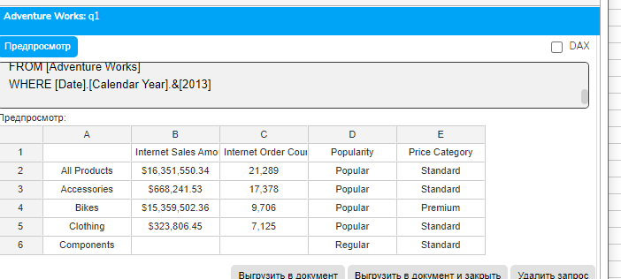
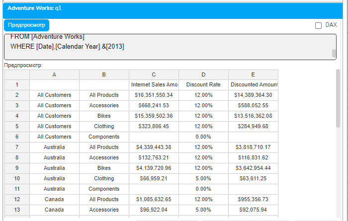
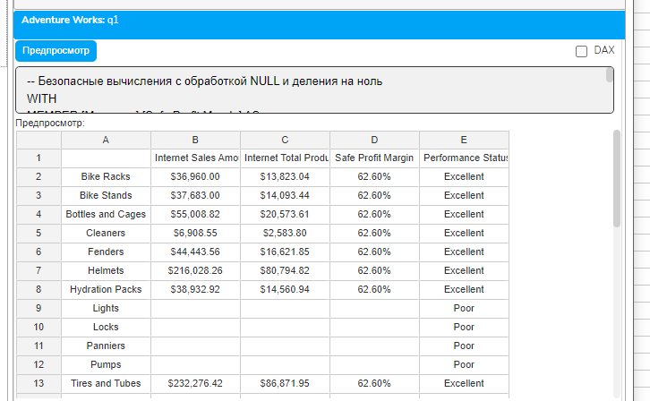

# Урок 3.2: Использование условных операторов и IIF

Введение: Добавляем логику в расчетные меры

Добро пожаловать во второй урок модуля "Расчетные меры и вычисления"! В предыдущем уроке мы научились создавать простые расчетные меры с арифметическими операциями. Однако реальная бизнес-логика редко бывает линейной — она полна условий, исключений и особых случаев. Сегодня мы изучим, как добавить условную логику в наши расчеты, что позволит создавать интеллектуальные меры, адаптирующиеся к контексту данных.

Условные операторы в MDX позволяют принимать решения на основе данных: применять разные формулы для разных категорий, обрабатывать исключения, создавать классификации и многое другое. Это критически важный навык для создания профессиональных аналитических отчетов.

Теоретические основы условной логики в MDX

Функция IIF: основной инструмент условных вычислений

Функция IIF (Immediate IF) — это основной способ реализации условной логики в MDX. Название происходит от "Immediate IF", подчеркивая, что функция вычисляет результат немедленно, в отличие от отложенных вычислений.

## Синтаксис функции IIF

```mdx
IIF(logical_expression, true_value, false_value)
```

## Параметры

logical_expression — логическое выражение, которое возвращает TRUE или FALSE

true_value — значение или выражение, возвращаемое если условие истинно

false_value — значение или выражение, возвращаемое если условие ложно

Важная особенность IIF в MDX: В отличие от условных операторов в языках программирования, IIF в MDX вычисляет оба выражения (и для true, и для false) перед выбором результата. Это может влиять на производительность и приводить к ошибкам, если одно из выражений некорректно в определенном контексте.

Оператор CASE: расширенная условная логика

Оператор CASE предоставляет более гибкий способ работы с множественными условиями. В MDX существует две формы CASE:

## Простая форма CASE

CASE expression

    WHEN value1 THEN result1

    WHEN value2 THEN result2

    ...

    ELSE default_result

```mdx
END
```

## Поисковая форма CASE

```mdx
CASE
```

    WHEN condition1 THEN result1

    WHEN condition2 THEN result2

    ...

    ELSE default_result

```mdx
END
```

Поисковая форма более универсальна, так как позволяет проверять разные условия, а не только сравнивать одно выражение с разными значениями.

Логические операторы в условных выражениях

## MDX поддерживает стандартные логические операторы для построения сложных условий

## Операторы сравнения

= — равенство

&lt;&gt; или != — неравенство

&lt; — меньше

&gt; — больше

&lt;= — меньше или равно

&gt;= — больше или равно

## Логические операторы

AND — логическое И

OR — логическое ИЛИ

NOT — логическое НЕ

## Специальные операторы

IS NULL — проверка на NULL

IS EMPTY — проверка на пустое значение

IsEmpty() — функция для проверки пустоты

Работа с NULL и пустыми значениями в условиях

## В MDX важно различать NULL и пустые значения

NULL — отсутствие значения

Empty — пустая ячейка в кубе (нет данных для данной комбинации измерений)

## При работе с условными операторами критически важно правильно обрабатывать эти случаи

```mdx
-- Проверка на NULL
IIF([Measures].[Sales] IS NULL, 0, [Measures].[Sales])
-- Проверка на Empty
IIF(IsEmpty([Measures].[Sales]), 0, [Measures].[Sales])
-- Комбинированная проверка
IIF(IsEmpty([Measures].[Sales]) OR [Measures].[Sales] IS NULL, 0, [Measures].[Sales])
```

Практические паттерны использования условной логики

Категоризация и классификация данных

## Условные операторы часто используются для создания категорий на основе числовых значений

```mdx
WITH MEMBER [Measures].[Sales Category] AS
    CASE
        WHEN [Measures].[Internet Sales Amount] > 1000000 THEN "High"
        WHEN [Measures].[Internet Sales Amount] > 500000 THEN "Medium"
        WHEN [Measures].[Internet Sales Amount] > 0 THEN "Low"
```

        ELSE "No Sales"

```mdx
    END
```

Это позволяет превратить непрерывные числовые данные в дискретные категории для анализа.

Обработка деления на ноль

## Одно из самых частых применений IIF — защита от деления на ноль

```mdx
WITH MEMBER [Measures].[Safe Average Price] AS
    IIF(
        [Measures].[Internet Order Count] = 0 OR IsEmpty([Measures].[Internet Order Count]),
        NULL,
        [Measures].[Internet Sales Amount] / [Measures].[Internet Order Count]
    ),
    FORMAT_STRING = "Currency"
```

Условное форматирование значений

## IIF можно использовать для динамического изменения отображения данных

```mdx
WITH MEMBER [Measures].[Performance Indicator] AS
    IIF(
        [Measures].[Internet Sales Amount] >
        ([Measures].[Internet Sales Amount], [Date].[Calendar].CurrentMember.PrevMember),
        "↑ " + CStr([Measures].[Internet Sales Amount]),
        "↓ " + CStr([Measures].[Internet Sales Amount])
    )
```

Применение разных формул в зависимости от контекста

## Условная логика позволяет использовать разные расчеты для разных элементов иерархии

```mdx
WITH MEMBER [Measures].[Context Aware Calculation] AS
    CASE
        WHEN [Product].[Category].CurrentMember IS [Product].[Category].[Bikes]
            THEN [Measures].[Internet Sales Amount] * 1.1  -- Применяем наценку 10% для велосипедов
        WHEN [Product].[Category].CurrentMember IS [Product].[Category].[Accessories]
            THEN [Measures].[Internet Sales Amount] * 1.25  -- Наценка 25% для аксессуаров
        ELSE [Measures].[Internet Sales Amount]
    END,
    FORMAT_STRING = "Currency"
```

Вложенные условия и сложная логика

Использование вложенных IIF

## Для реализации сложной логики можно вкладывать IIF друг в друга

```mdx
WITH MEMBER [Measures].[Commission Rate] AS
    IIF(
        [Measures].[Internet Sales Amount] > 1000000,
```

        0.05,  -- 5% для больших продаж

```mdx
        IIF(
            [Measures].[Internet Sales Amount] > 500000,
```

            0.03,  -- 3% для средних продаж

```mdx
            IIF(
                [Measures].[Internet Sales Amount] > 100000,
```

                0.02,  -- 2% для малых продаж

                0.01   -- 1% для остальных

```mdx
            )
        )
    ),
    FORMAT_STRING = "Percent"
```

Однако вложенные IIF быстро становятся нечитаемыми, поэтому для множественных условий лучше использовать CASE.

Комбинирование условий с логическими операторами

## Сложные условия можно строить с помощью AND, OR и NOT

```mdx
WITH MEMBER [Measures].[Premium Customer Flag] AS
    IIF(
        [Measures].[Internet Sales Amount] > 10000
        AND [Measures].[Internet Order Count] > 5
        AND NOT IsEmpty([Measures].[Internet Sales Amount]),
        "Premium",
        "Regular"
    )
```

CASE с множественными условиями

## CASE позволяет элегантно обрабатывать множественные условия

```mdx
WITH MEMBER [Measures].[Customer Segment] AS
    CASE
        WHEN [Measures].[Internet Sales Amount] > 50000
             AND [Measures].[Internet Order Count] > 20
            THEN "VIP"
        WHEN [Measures].[Internet Sales Amount] > 20000
             OR [Measures].[Internet Order Count] > 10
            THEN "Gold"
        WHEN [Measures].[Internet Sales Amount] > 5000
            THEN "Silver"
        WHEN NOT IsEmpty([Measures].[Internet Sales Amount])
            THEN "Bronze"
        ELSE "Prospect"
    END
```

Работа с иерархиями и навигацией в условиях

Проверка уровня в иерархии

Условная логика часто используется для применения разных вычислений на разных уровнях иерархии:

```mdx
WITH MEMBER [Measures].[Level Based Calculation] AS
    CASE
        WHEN [Product].[Product Categories].CurrentMember.Level.Ordinal = 0
            THEN [Measures].[Internet Sales Amount]  -- Уровень All
        WHEN [Product].[Product Categories].CurrentMember.Level.Ordinal = 1
            THEN [Measures].[Internet Sales Amount] * 0.9  -- Уровень Category
        WHEN [Product].[Product Categories].CurrentMember.Level.Ordinal = 2
            THEN [Measures].[Internet Sales Amount] * 0.8  -- Уровень Subcategory
        ELSE [Measures].[Internet Sales Amount] * 0.7  -- Уровень Product
    END,
    FORMAT_STRING = "Currency"
```

Условия на основе свойств членов

## MDX позволяет использовать свойства членов в условиях

```mdx
WITH MEMBER [Measures].[Adjusted Sales] AS
    IIF(
        [Product].[Product].CurrentMember.Properties("Color") = "Red",
        [Measures].[Internet Sales Amount] * 1.1,  -- Премиум для красных продуктов
        [Measures].[Internet Sales Amount]
    ),
    FORMAT_STRING = "Currency"
```

Производительность и оптимизация условных выражений

Особенности вычисления IIF

Важно помнить, что IIF вычисляет оба выражения (true и false) независимо от результата условия. Это может привести к проблемам производительности:

-- Неэффективно - оба выражения всегда вычисляются

```mdx
WITH MEMBER [Measures].[Inefficient] AS
    IIF(
        [Measures].[Internet Sales Amount] > 0,
        [Measures].[Internet Sales Amount] / [Measures].[Internet Order Count],
        0
    )
```

Использование CASE для оптимизации

## CASE выполняет вычисления последовательно и останавливается на первом совпадении

-- Более эффективно - вычисляется только нужная ветка

```mdx
WITH MEMBER [Measures].[Efficient] AS
    CASE
        WHEN [Measures].[Internet Sales Amount] = 0 OR IsEmpty([Measures].[Internet Sales Amount])
            THEN 0
        WHEN [Measures].[Internet Order Count] = 0 OR IsEmpty([Measures].[Internet Order Count])
            THEN NULL
        ELSE [Measures].[Internet Sales Amount] / [Measures].[Internet Order Count]
    END
```

Практические упражнения

Упражнение 1: Базовая категоризация с IIF

```mdx
-- Классификация продуктов по популярности
WITH
MEMBER [Measures].[Popularity] AS
    IIF(
        [Measures].[Internet Order Count] > 100,
        "Popular",
        "Regular"
    )
MEMBER [Measures].[Price Category] AS
    IIF(
        [Measures].[Internet Sales Amount] / [Measures].[Internet Order Count] > 1000,
        "Premium",
        "Standard"
    )
SELECT
    {[Measures].[Internet Sales Amount],
     [Measures].[Internet Order Count],
     [Measures].[Popularity],
     [Measures].[Price Category]} ON COLUMNS,
    NON EMPTY [Product].[Category].Members ON ROWS
FROM [Adventure Works]
WHERE [Date].[Calendar Year].&[2013]
```



Упражнение 2: Сложная логика с CASE

```mdx
-- Расчет скидок на основе множественных условий
WITH
MEMBER [Measures].[Discount Rate] AS
    CASE
        WHEN [Customer].[Country].CurrentMember IS [Customer].[Country].[United States]
             AND [Measures].[Internet Sales Amount] > 50000
```

            THEN 0.15  -- 15% скидка для крупных клиентов из США

```mdx
        WHEN [Customer].[Country].CurrentMember IS [Customer].[Country].[United States]
```

            THEN 0.10  -- 10% базовая скидка для США

```mdx
        WHEN [Measures].[Internet Sales Amount] > 100000
```

            THEN 0.12  -- 12% для крупных международных клиентов

```mdx
        WHEN [Measures].[Internet Order Count] > 10
```

            THEN 0.05  -- 5% для частых покупателей

        ELSE 0

    END,

```mdx
    FORMAT_STRING = "Percent"
MEMBER [Measures].[Discounted Amount] AS
    [Measures].[Internet Sales Amount] * (1 - [Measures].[Discount Rate]),
    FORMAT_STRING = "Currency"
SELECT
    {[Measures].[Internet Sales Amount],
     [Measures].[Discount Rate],
     [Measures].[Discounted Amount]} ON COLUMNS,
    NON EMPTY
        CrossJoin(
            [Customer].[Country].Members,
            [Product].[Category].Members
        ) ON ROWS
FROM [Adventure Works]
WHERE [Date].[Calendar Year].&[2013]
```



Упражнение 3: Обработка особых случаев

```mdx
-- Безопасные вычисления с обработкой NULL и деления на ноль
WITH
MEMBER [Measures].[Safe Profit Margin] AS
    CASE
        WHEN IsEmpty([Measures].[Internet Sales Amount])
             OR [Measures].[Internet Sales Amount] = 0
            THEN NULL
        WHEN IsEmpty([Measures].[Internet Total Product Cost])
```

            THEN 1  -- 100% маржа если нет данных о затратах

```mdx
        ELSE
            ([Measures].[Internet Sales Amount] - [Measures].[Internet Total Product Cost]) /
            [Measures].[Internet Sales Amount]
    END,
    FORMAT_STRING = "Percent"
MEMBER [Measures].[Performance Status] AS
    CASE
        WHEN [Measures].[Safe Profit Margin] IS NULL
```

            THEN "No Data"

```mdx
        WHEN [Measures].[Safe Profit Margin] > 0.5
            THEN "Excellent"
        WHEN [Measures].[Safe Profit Margin] > 0.3
            THEN "Good"
        WHEN [Measures].[Safe Profit Margin] > 0.1
            THEN "Acceptable"
        ELSE "Poor"
    END
SELECT
    {[Measures].[Internet Sales Amount],
     [Measures].[Internet Total Product Cost],
     [Measures].[Safe Profit Margin],
     [Measures].[Performance Status]} ON COLUMNS,
    NON EMPTY
        Descendants(
            [Product].[Product Categories].[All Products],
            [Product].[Product Categories].[Subcategory],
            SELF
        ) ON ROWS
FROM [Adventure Works]
WHERE [Date].[Calendar Year].&[2013]
```



Типичные ошибки и их решение

Ошибка 1: Игнорирование NULL и Empty

-- Неправильно - не учитывает NULL и Empty

```mdx
WITH MEMBER [Measures].[Wrong Average] AS
    [Measures].[Sales] / [Measures].[Count]
```

-- Правильно - обрабатывает особые случаи

```mdx
WITH MEMBER [Measures].[Correct Average] AS
    IIF(
        IsEmpty([Measures].[Count]) OR [Measures].[Count] = 0,
        NULL,
        [Measures].[Sales] / [Measures].[Count]
    )
```

Ошибка 2: Неправильный порядок условий в CASE

-- Неправильно - общее условие перекрывает частные

```mdx
CASE
    WHEN [Measures].[Sales] > 1000 THEN "Good"
    WHEN [Measures].[Sales] > 5000 THEN "Excellent"  -- Никогда не выполнится
```

-- Правильно - от частного к общему

```mdx
CASE
    WHEN [Measures].[Sales] > 5000 THEN "Excellent"
    WHEN [Measures].[Sales] > 1000 THEN "Good"
```

Ошибка 3: Вычислительно тяжелые выражения в IIF

-- Неэффективно - сложное вычисление выполняется всегда

```mdx
WITH MEMBER [Measures].[Inefficient] AS
    IIF(
        [Product].[Category].CurrentMember IS [Product].[Category].[Bikes],
        SUM([Customer].[Country].Members, [Measures].[Sales]),  -- Тяжелое вычисление
        0
    )
```

Заключение

В этом уроке мы изучили мощные инструменты для добавления условной логики в расчетные меры MDX. Мы освоили:

Функцию IIF для простых условных вычислений

Оператор CASE для сложной многоуровневой логики

Работу с логическими операторами и построение сложных условий

Обработку NULL и пустых значений в условиях

Применение условной логики в контексте иерархий

Оптимизацию производительности условных выражений

Условные операторы превращают статичные вычисления в динамичные, адаптивные меры, способные реагировать на контекст данных. Это фундаментальный навык для создания интеллектуальных аналитических отчетов, которые могут автоматически адаптироваться к различным сценариям и обрабатывать исключения.

В следующем уроке мы изучим функции агрегации, которые позволят нам выполнять сложные вычисления над наборами данных.

Домашнее задание

Задание 1: Динамическое ценообразование

Создайте расчетную меру, которая применяет разные наценки в зависимости от категории продукта и страны клиента.

Задание 2: Система KPI

Разработайте систему из трех взаимосвязанных мер с использованием CASE для оценки эффективности продаж (красный/желтый/зеленый индикатор).

Задание 3: Обработка исключений

Создайте безопасную меру для расчета рентабельности с полной обработкой всех возможных исключений (NULL, Empty, деление на ноль).

Контрольные вопросы

В чем разница между IIF и CASE в MDX?

Почему IIF может быть менее эффективным, чем CASE?

Как правильно обрабатывать NULL и Empty в условных выражениях?

Какие логические операторы поддерживает MDX?

Как использовать свойства членов в условиях?

В каком порядке следует располагать условия в операторе CASE?

Как условная логика может использоваться с навигационными функциями?
