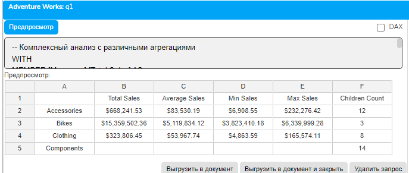
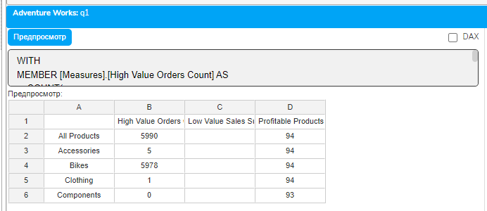
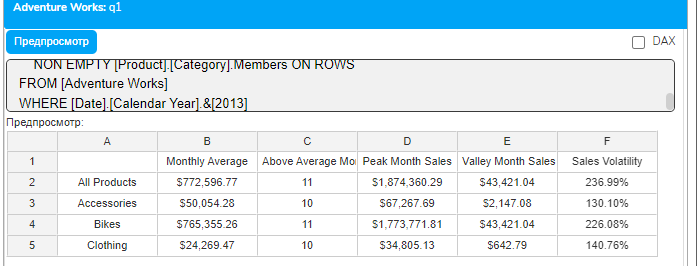

# Урок 3.3: Функции агрегации

Введение: От точечных вычислений к обобщенным показателям

Добро пожаловать в третий урок модуля "Расчетные меры и вычисления"! В предыдущих уроках мы научились создавать простые расчетные меры и добавлять в них условную логику. Теперь пришло время освоить мощный инструментарий функций агрегации, который позволит нам выполнять вычисления над целыми наборами данных, а не только над отдельными значениями.

Функции агрегации — это сердце аналитических вычислений в MDX. Они позволяют суммировать, усреднять, находить минимумы и максимумы, подсчитывать количество элементов и выполнять множество других операций над наборами данных. Без агрегационных функций невозможно создать большинство ключевых бизнес-метрик: средние показатели, итоговые суммы по группам, медианные значения и многое другое.

Теоретические основы функций агрегации

Что такое агрегация в контексте MDX

Агрегация в MDX — это процесс вычисления единого значения на основе набора значений. В отличие от простых арифметических операций, которые работают с конкретными ячейками, агрегационные функции обрабатывают целые наборы и возвращают обобщенный результат.

## Ключевые характеристики агрегационных функций

Работа с наборами — агрегационные функции принимают на вход набор элементов (Set) и возвращают скалярное значение

Контекстная зависимость — результат агрегации зависит от текущего контекста выполнения

Возможность указания выражения — большинство функций позволяют указать выражение для вычисления перед агрегацией

Обработка пустых значений — функции имеют встроенные механизмы работы с NULL и Empty

Основные агрегационные функции MDX

## MDX предоставляет богатый набор агрегационных функций

## Базовые функции

SUM — сумма значений

AVG — среднее арифметическое

MIN — минимальное значение

MAX — максимальное значение

COUNT — количество элементов

## Расширенные функции

AGGREGATE — агрегация с учетом типа меры

MEDIAN — медианное значение

STDDEV — стандартное отклонение

VAR — дисперсия

Синтаксис агрегационных функций

## Большинство агрегационных функций имеют схожий синтаксис

```mdx
FunctionName(Set [, Numeric_Expression])
```

## Параметры

Set — набор элементов для агрегации

Numeric_Expression — необязательное выражение, вычисляемое для каждого элемента набора

Если выражение не указано, используется текущая мера из контекста.

Функция SUM: Суммирование значений

Базовое использование SUM

## Функция SUM — самая используемая агрегационная функция, вычисляющая сумму значений

```mdx
WITH MEMBER [Measures].[Total Sales All Countries] AS
    SUM(
        [Customer].[Country].Members,
        [Measures].[Internet Sales Amount]
    )
```

SUM с навигацией по иерархии

SUM часто используется с навигационными функциями для вычисления итогов по уровням иерархии:

```mdx
WITH MEMBER [Measures].[Subcategory Total] AS
    SUM(
        Descendants(
            [Product].[Product Categories].CurrentMember,
            [Product].[Product Categories].[Product],
            SELF
        ),
        [Measures].[Internet Sales Amount]
    )
```

Условное суммирование

## Комбинирование SUM с IIF позволяет создавать условные суммы

```mdx
WITH MEMBER [Measures].[High Value Sales] AS
    SUM(
        [Product].[Product].Members,
        IIF(
            [Measures].[Internet Sales Amount] > 1000,
            [Measures].[Internet Sales Amount],
            0
        )
    )
```

Функция AVG: Вычисление средних значений

Простое среднее арифметическое

## Функция AVG вычисляет среднее арифметическое значение

```mdx
WITH MEMBER [Measures].[Average Sales per Country] AS
    AVG(
        [Customer].[Country].Members,
        [Measures].[Internet Sales Amount]
    )
```

Важность правильного выбора набора

## При использовании AVG критически важно правильно определить набор для усреднения

```mdx
WITH MEMBER [Measures].[Average Daily Sales] AS
    AVG(
        [Date].[Calendar].[Date].Members,
        [Measures].[Internet Sales Amount]
    )
MEMBER [Measures].[Average Monthly Sales] AS
    AVG(
        [Date].[Calendar].[Month].Members,
        [Measures].[Internet Sales Amount]
    )
```

Обработка пустых значений в AVG

## AVG автоматически исключает пустые значения из расчета

```mdx
WITH MEMBER [Measures].[Average Non-Empty Sales] AS
    AVG(
        NON EMPTY [Product].[Product].Members,
        [Measures].[Internet Sales Amount]
    )
```

Функции MIN и MAX: Поиск экстремумов

Нахождение минимальных и максимальных значений

## MIN и MAX позволяют найти экстремальные значения в наборе

```mdx
WITH MEMBER [Measures].[Lowest Sales] AS
    MIN(
        [Date].[Calendar].[Month].Members,
        [Measures].[Internet Sales Amount]
    )
MEMBER [Measures].[Highest Sales] AS
    MAX(
        [Date].[Calendar].[Month].Members,
        [Measures].[Internet Sales Amount]
    )
MEMBER [Measures].[Sales Range] AS
    [Measures].[Highest Sales] - [Measures].[Lowest Sales]
```

Использование MIN/MAX для валидации данных

## MIN и MAX полезны для проверки качества данных и выявления аномалий

```mdx
WITH MEMBER [Measures].[Price Check] AS
    CASE
        WHEN MAX([Product].[Product].Members, [Measures].[List Price]) > 10000
```

            THEN "Contains Premium Products"

```mdx
        WHEN MIN([Product].[Product].Members, [Measures].[List Price]) < 10
```

            THEN "Contains Budget Products"

        ELSE "Standard Price Range"

```mdx
    END
```

Функция COUNT: Подсчет элементов

Базовый подсчет

## COUNT возвращает количество элементов в наборе

```mdx
WITH MEMBER [Measures].[Number of Products] AS
    COUNT([Product].[Product].Members)
MEMBER [Measures].[Number of Active Products] AS
    COUNT(
        NON EMPTY [Product].[Product].Members,
        INCLUDEEMPTY
    )
```

DISTINCTCOUNT для уникальных значений

## DISTINCTCOUNT подсчитывает количество уникальных непустых значений

```mdx
WITH MEMBER [Measures].[Unique Customers] AS
    DISTINCTCOUNT(
        [Customer].[Customer].Members,
        [Measures].[Internet Sales Amount]
    )
```

Условный подсчет

## Комбинирование COUNT с условной логикой

```mdx
WITH MEMBER [Measures].[High Sales Months Count] AS
    COUNT(
        [Date].[Calendar].[Month].Members,
        IIF(
            [Measures].[Internet Sales Amount] > 1000000,
            1,
            NULL
        )
    )
```

Функция AGGREGATE: Контекстно-зависимая агрегация

Понимание AGGREGATE

## AGGREGATE использует тип агрегации, определенный для меры в кубе

```mdx
WITH MEMBER [Measures].[Product Group Total] AS
    AGGREGATE(
        [Product].[Product Categories].CurrentMember.Children
    )
```

Преимущества AGGREGATE

AGGREGATE автоматически выбирает правильный тип агрегации (SUM, AVG, MIN, MAX и т.д.) в зависимости от настроек меры в кубе. Это особенно важно для полуаддитивных и неаддитивных мер.

Комбинирование агрегационных функций

Вложенные агрегации

## Агрегационные функции можно комбинировать для создания сложных вычислений

```mdx
WITH MEMBER [Measures].[Average of Monthly Maximums] AS
    AVG(
        [Date].[Calendar].[Month].Members,
        MAX(
            Descendants(
                [Date].[Calendar].CurrentMember,
                [Date].[Calendar].[Date],
                SELF
            ),
            [Measures].[Internet Sales Amount]
        )
    )
```

Агрегации с кортежами

## Использование кортежей в агрегационных функциях для точного указания контекста

```mdx
WITH MEMBER [Measures].[USA Product Average] AS
    AVG(
        [Product].[Product].Members,
        ([Measures].[Internet Sales Amount], [Customer].[Country].[United States])
    )
```

Обработка особых случаев в агрегациях

Работа с пустыми наборами

## Важно обрабатывать случаи, когда набор для агрегации пуст

```mdx
WITH MEMBER [Measures].[Safe Average] AS
    IIF(
        COUNT(NON EMPTY [Product].[Product].Members) = 0,
        0,
        AVG(
            NON EMPTY [Product].[Product].Members,
            [Measures].[Internet Sales Amount]
        )
    )
```

Исключение выбросов

## Создание устойчивых к выбросам агрегаций

```mdx
WITH MEMBER [Measures].[Trimmed Average] AS
    AVG(
        [Date].[Calendar].[Month].Members,
        IIF(
            [Measures].[Internet Sales Amount] >
                AVG([Date].[Calendar].[Month].Members, [Measures].[Internet Sales Amount]) * 2,
            NULL,
            [Measures].[Internet Sales Amount]
        )
    )
```

Практические упражнения

Упражнение 1: Базовые агрегации

```mdx
-- Комплексный анализ с различными агрегациями
WITH
MEMBER [Measures].[Total Sales] AS
    SUM(
        [Product].[Product Categories].CurrentMember.Children,
        [Measures].[Internet Sales Amount]
    ),
    FORMAT_STRING = "Currency"
MEMBER [Measures].[Average Sales] AS
    AVG(
        [Product].[Product Categories].CurrentMember.Children,
        [Measures].[Internet Sales Amount]
    ),
    FORMAT_STRING = "Currency"
MEMBER [Measures].[Min Sales] AS
    MIN(
        [Product].[Product Categories].CurrentMember.Children,
        [Measures].[Internet Sales Amount]
    ),
    FORMAT_STRING = "Currency"
MEMBER [Measures].[Max Sales] AS
    MAX(
        [Product].[Product Categories].CurrentMember.Children,
        [Measures].[Internet Sales Amount]
    ),
    FORMAT_STRING = "Currency"
MEMBER [Measures].[Children Count] AS
    COUNT([Product].[Product Categories].CurrentMember.Children)
SELECT
    {[Measures].[Total Sales],
     [Measures].[Average Sales],
     [Measures].[Min Sales],
     [Measures].[Max Sales],
     [Measures].[Children Count]} ON COLUMNS,
    [Product].[Product Categories].[Category].Members ON ROWS
FROM [Adventure Works]
WHERE [Date].[Calendar Year].&[2013]
```



Упражнение 2: Условные агрегации
WITH

```mdx
MEMBER [Measures].[High Value Orders Count] AS
    COUNT(
        FILTER(
            [Customer].[Customer].Members,
            [Measures].[Internet Sales Amount] > 1000
        )
    )
MEMBER [Measures].[Low Value Sales Sum] AS
    SUM(
        FILTER(
            [Product].[Product].Members,
            [Measures].[Internet Sales Amount] < 100
        ),
        [Measures].[Internet Sales Amount]
    ),
    FORMAT_STRING = "Currency"
MEMBER [Measures].[Profitable Products Count] AS
    COUNT(
        FILTER(
            [Product].[Product].Members,
            [Measures].[Internet Sales Amount] > [Measures].[Internet Total Product Cost] * 1.3
        )
    )
SELECT
    {[Measures].[High Value Orders Count],
     [Measures].[Low Value Sales Sum],
     [Measures].[Profitable Products Count]} ON COLUMNS,
    NON EMPTY [Product].[Category].Members ON ROWS
FROM [Adventure Works]
WHERE [Date].[Calendar Year].&[2013]
```



Упражнение 3: Комплексные вычисления с агрегациями

```mdx
WITH
MEMBER [Measures].[Monthly Average] AS
    AVG(
        [Date].[Calendar].[Month].Members,
        [Measures].[Internet Sales Amount]
    ),
    FORMAT_STRING = "Currency"
MEMBER [Measures].[Above Average Months] AS
    COUNT(
        FILTER(
            [Date].[Calendar].[Month].Members,
            [Measures].[Internet Sales Amount] > [Measures].[Monthly Average]
        )
    )
MEMBER [Measures].[Peak Month Sales] AS
    MAX(
        [Date].[Calendar].[Month].Members,
        [Measures].[Internet Sales Amount]
    ),
    FORMAT_STRING = "Currency"
MEMBER [Measures].[Valley Month Sales] AS
    MIN(
        FILTER(
            [Date].[Calendar].[Month].Members,
            NOT ISEMPTY([Measures].[Internet Sales Amount])
        ),
        [Measures].[Internet Sales Amount]
    ),
    FORMAT_STRING = "Currency"
MEMBER [Measures].[Sales Volatility] AS
    IIF(
        [Measures].[Monthly Average] = 0,
        NULL,
        ([Measures].[Peak Month Sales] - [Measures].[Valley Month Sales]) / [Measures].[Monthly Average]
    ),
    FORMAT_STRING = "Percent"
SELECT
    {[Measures].[Monthly Average],
     [Measures].[Above Average Months],
     [Measures].[Peak Month Sales],
     [Measures].[Valley Month Sales],
     [Measures].[Sales Volatility]} ON COLUMNS,
    NON EMPTY [Product].[Category].Members ON ROWS
FROM [Adventure Works]
WHERE [Date].[Calendar Year].&[2013]
```



Оптимизация агрегационных вычислений

Минимизация области агрегации

## Используйте NON EMPTY для исключения пустых элементов перед агрегацией

```mdx
-- Неэффективно
WITH MEMBER [Measures].[Avg1] AS
    AVG([Product].[Product].Members, [Measures].[Internet Sales Amount])
-- Эффективно
WITH MEMBER [Measures].[Avg2] AS
    AVG(NON EMPTY [Product].[Product].Members, [Measures].[Internet Sales Amount])
```

Кэширование результатов агрегации

## При многократном использовании результата агрегации сохраняйте его в отдельной мере

```mdx
WITH
MEMBER [Measures].[Total Cache] AS
    SUM([Product].[Product].Members, [Measures].[Internet Sales Amount])
MEMBER [Measures].[Percent of Total] AS
    [Measures].[Internet Sales Amount] / [Measures].[Total Cache],
    FORMAT_STRING = "Percent"
```

Типичные ошибки и их решение

Ошибка 1: Неправильный выбор набора для агрегации

-- Неправильно - агрегация по всем продуктам независимо от контекста

```mdx
WITH MEMBER [Measures].[Wrong Avg] AS
    AVG([Product].[Product].Members, [Measures].[Sales])
```

-- Правильно - агрегация по детям текущего элемента

```mdx
WITH MEMBER [Measures].[Correct Avg] AS
    AVG(
        Descendants(
            [Product].[Product Categories].CurrentMember,
            [Product].[Product Categories].[Product],
            SELF
        ),
        [Measures].[Sales]
    )
```

Ошибка 2: Игнорирование пустых значений

-- Проблема - COUNT считает пустые элементы

```mdx
WITH MEMBER [Measures].[All Count] AS
    COUNT([Product].[Product].Members)
```

-- Решение - использование NON EMPTY или условной логики

```mdx
WITH MEMBER [Measures].[Active Count] AS
    COUNT(
        NON EMPTY [Product].[Product].Members,
        [Measures].[Internet Sales Amount]
    )
```

Заключение

## В этом уроке мы изучили мощный инструментарий функций агрегации в MDX. Мы освоили

Базовые агрегационные функции: SUM, AVG, MIN, MAX, COUNT

Особенности работы каждой функции с пустыми значениями

Комбинирование агрегаций с условной логикой

Использование агрегаций с навигационными функциями и кортежами

Создание сложных статистических вычислений

Оптимизацию производительности агрегационных вычислений

Функции агрегации — это фундамент для создания большинства аналитических метрик. Они позволяют превратить детальные данные в обобщенные показатели, необходимые для принятия управленческих решений. Владение агрегационными функциями открывает путь к созданию сложных статистических анализов и KPI.

В следующем уроке мы изучим продвинутые вычисления, которые позволят создавать еще более сложные аналитические меры.

Домашнее задание

Задание 1: Статистический профиль

Создайте набор мер для статистического анализа продаж, включающий среднее, медиану, стандартное отклонение и коэффициент вариации.

Задание 2: Динамическая агрегация

Разработайте меру, которая меняет тип агрегации (SUM/AVG/MAX) в зависимости от уровня иерархии продуктов.

Задание 3: Сравнительный анализ

Создайте отчет, сравнивающий различные агрегационные показатели между категориями продуктов и странами.

Контрольные вопросы

В чем разница между SUM и AGGREGATE?

Как агрегационные функции обрабатывают пустые значения?

Почему важно использовать NON EMPTY перед агрегацией?

Как комбинировать агрегационные функции с условной логикой?

В каких случаях COUNT и DISTINCTCOUNT дают разные результаты?

Как оптимизировать производительность агрегационных вычислений?

Какие агрегационные функции лучше использовать для статистического анализа?
