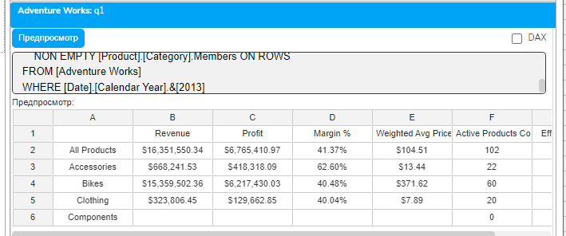
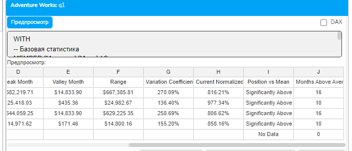

# Урок 3.4: Продвинутые вычисления

Введение: Переход к сложной аналитической логике

Добро пожаловать в четвертый урок модуля "Расчетные меры и вычисления"! Мы уже освоили создание простых расчетных мер, условную логику и функции агрегации. Теперь пришло время объединить все эти знания и научиться создавать по-настоящему сложные вычисления, которые решают реальные бизнес-задачи.

Продвинутые вычисления в MDX — это комбинация всех изученных техник для создания комплексных аналитических показателей. Это могут быть взвешенные средние, сложные коэффициенты, многоуровневые вычисления с множественными условиями и агрегациями. Именно такие вычисления превращают сырые данные в ценные бизнес-инсайты.

Теоретические основы продвинутых вычислений

Концепция многослойных вычислений

Продвинутые вычисления в MDX часто представляют собой многослойную структуру, где каждый слой добавляет свою логику:

Базовый слой — извлечение исходных данных из куба

Слой трансформации — преобразование данных (нормализация, очистка)

Слой вычислений — применение формул и алгоритмов

Слой агрегации — обобщение результатов

Слой презентации — форматирование для отображения

Каждый слой может использовать результаты предыдущего, создавая сложные цепочки вычислений.

Взвешенные вычисления

Взвешенные вычисления учитывают важность или вес каждого элемента в общем результате. В отличие от простого среднего арифметического, взвешенное среднее дает более точную картину, учитывая значимость каждого компонента.

## Формула взвешенного среднего

Augmented Backus-Naur Form

Weighted Average = Σ(Value × Weight) / Σ(Weight)

## В MDX это реализуется через комбинацию SUM и деления

```mdx
WITH MEMBER [Measures].[Weighted Average Price] AS
    SUM(
        [Product].[Product].Members,
        [Measures].[Internet Sales Amount]
    ) /
    SUM(
        [Product].[Product].Members,
        [Measures].[Order Quantity]
    )
```

Коэффициенты и индексы

Коэффициенты позволяют сравнивать разнородные показатели, приводя их к единой шкале. Индексы показывают относительное изменение по сравнению с базовым периодом или значением.

## Типы коэффициентов в бизнес-анализе

Коэффициенты эффективности — соотношение результата к затратам

Коэффициенты интенсивности — показатели на единицу измерения

Коэффициенты структуры — доля в общем объеме

Коэффициенты динамики — темпы изменения

Нормализация и стандартизация данных

Нормализация приводит данные к единому масштабу, что критически важно при сравнении разнородных показателей:

## Min-Max нормализация (приведение к диапазону 0-1)

Mathematica

Normalized = (Value - Min) / (Max - Min)

## Z-score стандартизация

Augmented Backus-Naur Form

Standardized = (Value - Mean) / StdDev

Реализация взвешенных средних

Базовое взвешенное среднее

Рассмотрим классический пример — расчет средневзвешенной цены продукта с учетом объемов продаж:

```mdx
WITH
MEMBER [Measures].[Total Revenue] AS
    SUM(
        [Product].[Product].Members,
        [Measures].[Internet Sales Amount]
    )
MEMBER [Measures].[Total Quantity] AS
    SUM(
        [Product].[Product].Members,
        [Measures].[Order Quantity]
    )
MEMBER [Measures].[Weighted Average Price] AS
    [Measures].[Total Revenue] / [Measures].[Total Quantity],
    FORMAT_STRING = "Currency"
```

Взвешенное среднее с условиями

## Добавим условную логику для исключения выбросов

```mdx
WITH
MEMBER [Measures].[Filtered Revenue] AS
    SUM(
        [Product].[Product].Members,
        IIF(
            [Measures].[Internet Sales Amount] / [Measures].[Order Quantity] < 10000,
            [Measures].[Internet Sales Amount],
            NULL
        )
    )
MEMBER [Measures].[Filtered Quantity] AS
    SUM(
        [Product].[Product].Members,
        IIF(
            [Measures].[Internet Sales Amount] / [Measures].[Order Quantity] < 10000,
            [Measures].[Order Quantity],
            NULL
        )
    )
MEMBER [Measures].[Weighted Avg Without Outliers] AS
    [Measures].[Filtered Revenue] / [Measures].[Filtered Quantity],
    FORMAT_STRING = "Currency"
```

Создание комплексных индексов и коэффициентов

Индекс эффективности

## Создадим комплексный индекс эффективности, учитывающий несколько факторов

```mdx
WITH
-- Компонент 1: Эффективность продаж
MEMBER [Measures].[Sales Efficiency] AS
    [Measures].[Internet Sales Amount] /
    CASE
        WHEN [Measures].[Internet Order Count] = 0 THEN NULL
        ELSE [Measures].[Internet Order Count]
    END
-- Компонент 2: Маржинальность
MEMBER [Measures].[Margin Rate] AS
    ([Measures].[Internet Sales Amount] - [Measures].[Internet Total Product Cost]) /
    CASE
        WHEN [Measures].[Internet Sales Amount] = 0 THEN NULL
        ELSE [Measures].[Internet Sales Amount]
    END
-- Компонент 3: Оборачиваемость
MEMBER [Measures].[Turnover Index] AS
    [Measures].[Internet Order Count] /
    COUNT(NON EMPTY [Date].[Calendar].[Date].Members)
-- Комплексный индекс эффективности
MEMBER [Measures].[Performance Index] AS
    ([Measures].[Sales Efficiency] * 0.4 +
     [Measures].[Margin Rate] * 1000 * 0.4 +
     [Measures].[Turnover Index] * 100 * 0.2),
    FORMAT_STRING = "#,##0.00"
```

Коэффициент вариации

## Коэффициент вариации показывает степень разброса данных относительно среднего

```mdx
WITH
-- Среднее значение
MEMBER [Measures].[Avg Sales] AS
    AVG(
        [Date].[Calendar].[Month].Members,
        [Measures].[Internet Sales Amount]
    )
-- Расчет дисперсии вручную
MEMBER [Measures].[Variance] AS
    AVG(
        [Date].[Calendar].[Month].Members,
        ([Measures].[Internet Sales Amount] - [Measures].[Avg Sales]) *
        ([Measures].[Internet Sales Amount] - [Measures].[Avg Sales])
    )
-- Стандартное отклонение
MEMBER [Measures].[StdDev] AS
    IIF(
        [Measures].[Variance] > 0,
        [Measures].[Variance] ^ 0.5,
        0
    )
-- Коэффициент вариации
MEMBER [Measures].[Coefficient of Variation] AS
    CASE
        WHEN [Measures].[Avg Sales] = 0 OR IsEmpty([Measures].[Avg Sales]) THEN NULL
        ELSE [Measures].[StdDev] / [Measures].[Avg Sales]
    END,
    FORMAT_STRING = "Percent"
```

Нормализация и ранговые вычисления

Min-Max нормализация

## Приведение значений к диапазону от 0 до 1

```mdx
WITH
-- Находим минимум и максимум
MEMBER [Measures].[Min Sales] AS
    MIN(
        [Product].[Category].Members,
        [Measures].[Internet Sales Amount]
    )
MEMBER [Measures].[Max Sales] AS
    MAX(
        [Product].[Category].Members,
        [Measures].[Internet Sales Amount]
    )
-- Нормализованное значение
MEMBER [Measures].[Normalized Sales] AS
    CASE
        WHEN [Measures].[Max Sales] = [Measures].[Min Sales] THEN 0.5
        ELSE
            ([Measures].[Internet Sales Amount] - [Measures].[Min Sales]) /
            ([Measures].[Max Sales] - [Measures].[Min Sales])
    END,
    FORMAT_STRING = "Percent"
```

Процентильный ранг

## Вычисление позиции элемента относительно всего набора

```mdx
WITH
-- Количество элементов с меньшим значением
MEMBER [Measures].[Lower Count] AS
    COUNT(
        [Product].[Product].Members,
        IIF(
            ([Measures].[Internet Sales Amount], [Product].[Product].CurrentMember) <
            [Measures].[Internet Sales Amount],
            1,
            NULL
        )
    )
-- Общее количество элементов
MEMBER [Measures].[Total Count] AS
    COUNT(NON EMPTY [Product].[Product].Members)
-- Процентильный ранг
MEMBER [Measures].[Percentile Rank] AS
    [Measures].[Lower Count] / [Measures].[Total Count],
    FORMAT_STRING = "Percent"
```

Комбинированные многоуровневые вычисления

Скоринговая модель

## Создадим комплексную скоринговую модель для оценки клиентов

```mdx
WITH
-- Критерий 1: Объем покупок (вес 40%)
MEMBER [Measures].[Volume Score] AS
    CASE
        WHEN [Measures].[Internet Sales Amount] > 50000 THEN 100
        WHEN [Measures].[Internet Sales Amount] > 20000 THEN 75
        WHEN [Measures].[Internet Sales Amount] > 5000 THEN 50
        WHEN [Measures].[Internet Sales Amount] > 0 THEN 25
        ELSE 0
```

    END * 0.4

```mdx
-- Критерий 2: Частота покупок (вес 30%)
MEMBER [Measures].[Frequency Score] AS
    CASE
        WHEN [Measures].[Internet Order Count] > 20 THEN 100
        WHEN [Measures].[Internet Order Count] > 10 THEN 75
        WHEN [Measures].[Internet Order Count] > 5 THEN 50
        WHEN [Measures].[Internet Order Count] > 0 THEN 25
        ELSE 0
```

    END * 0.3

```mdx
-- Критерий 3: Средний чек (вес 30%)
MEMBER [Measures].[Avg Check] AS
    IIF(
        [Measures].[Internet Order Count] = 0,
        0,
        [Measures].[Internet Sales Amount] / [Measures].[Internet Order Count]
    )
MEMBER [Measures].[Avg Check Score] AS
    CASE
        WHEN [Measures].[Avg Check] > 5000 THEN 100
        WHEN [Measures].[Avg Check] > 2000 THEN 75
        WHEN [Measures].[Avg Check] > 500 THEN 50
        WHEN [Measures].[Avg Check] > 0 THEN 25
        ELSE 0
```

    END * 0.3

```mdx
-- Итоговый скоринг
MEMBER [Measures].[Total Score] AS
    [Measures].[Volume Score] +
    [Measures].[Frequency Score] +
    [Measures].[Avg Check Score],
    FORMAT_STRING = "#,##0.00"
-- Категория клиента
MEMBER [Measures].[Customer Category] AS
    CASE
        WHEN [Measures].[Total Score] >= 80 THEN "VIP"
        WHEN [Measures].[Total Score] >= 60 THEN "Gold"
        WHEN [Measures].[Total Score] >= 40 THEN "Silver"
        WHEN [Measures].[Total Score] > 0 THEN "Bronze"
        ELSE "Inactive"
    END
```

Практические упражнения

Упражнение 1: Комплексный анализ эффективности

```mdx
-- Создаем систему KPI для оценки эффективности продуктовых категорий
WITH
-- Базовые метрики
MEMBER [Measures].[Revenue] AS
    [Measures].[Internet Sales Amount],
    FORMAT_STRING = "Currency"
MEMBER [Measures].[Profit] AS
    [Measures].[Internet Sales Amount] - [Measures].[Internet Total Product Cost],
    FORMAT_STRING = "Currency"
MEMBER [Measures].[Margin %] AS
    IIF(
        [Measures].[Internet Sales Amount] = 0,
        NULL,
        [Measures].[Profit] / [Measures].[Internet Sales Amount]
    ),
    FORMAT_STRING = "Percent"
-- Взвешенная средняя цена
MEMBER [Measures].[Weighted Avg Price] AS
    IIF(
        [Measures].[Order Quantity] = 0,
        NULL,
        [Measures].[Internet Sales Amount] / [Measures].[Order Quantity]
    ),
    FORMAT_STRING = "Currency"
-- Количество активных продуктов
MEMBER [Measures].[Active Products Count] AS
    COUNT(
        FILTER(
            Descendants(
                [Product].[Product Categories].CurrentMember,
                [Product].[Product Categories].[Product]
            ),
            NOT ISEMPTY([Measures].[Internet Sales Amount])
        )
    )
-- Максимальная выручка среди категорий
MEMBER [Measures].[Max Category Revenue] AS
    MAX([Product].[Category].Members, [Measures].[Internet Sales Amount]),
    FORMAT_STRING = "Currency"
-- Индекс эффективности (упрощенная версия без LOG10)
MEMBER [Measures].[Efficiency Index] AS
    IIF(
        [Measures].[Max Category Revenue] = 0 OR [Measures].[Margin %] IS NULL,
        NULL,
        (
            -- Нормализованная маржинальность (вес 40%)
            [Measures].[Margin %] * 100 * 0.4 +
            -- Нормализованный объем продаж (вес 30%)
            ([Measures].[Revenue] / [Measures].[Max Category Revenue]) * 100 * 0.3 +
            -- Нормализованная оборачиваемость (вес 30%)
            IIF(
                [Measures].[Active Products Count] = 0,
                0,
                ([Measures].[Active Products Count] / 100) * 100 * 0.3
            )
        )
    ),
    FORMAT_STRING = "#,##0.00"
SELECT
    {[Measures].[Revenue],
     [Measures].[Profit],
     [Measures].[Margin %],
     [Measures].[Weighted Avg Price],
     [Measures].[Active Products Count],
     [Measures].[Efficiency Index]} ON COLUMNS,
    NON EMPTY [Product].[Category].Members ON ROWS
FROM [Adventure Works]
WHERE [Date].[Calendar Year].&[2013]
```



Упражнение 2: Статистический анализ с нормализацией

```mdx
WITH
-- Базовая статистика
MEMBER [Measures].[Mean] AS
    AVG(
        [Date].[Calendar].[Month].Members,
        [Measures].[Internet Sales Amount]
    ),
    FORMAT_STRING = "Currency"
MEMBER [Measures].[Peak Month] AS
    MAX(
        [Date].[Calendar].[Month].Members,
        [Measures].[Internet Sales Amount]
    ),
    FORMAT_STRING = "Currency"
MEMBER [Measures].[Valley Month] AS
    MIN(
        FILTER(
            [Date].[Calendar].[Month].Members,
            NOT ISEMPTY([Measures].[Internet Sales Amount])
        ),
        [Measures].[Internet Sales Amount]
    ),
    FORMAT_STRING = "Currency"
-- Размах (Range)
MEMBER [Measures].[Range] AS
    [Measures].[Peak Month] - [Measures].[Valley Month],
    FORMAT_STRING = "Currency"
-- Коэффициент вариации (упрощенный)
MEMBER [Measures].[Variation Coefficient] AS
    IIF(
        [Measures].[Mean] = 0,
        NULL,
        [Measures].[Range] / [Measures].[Mean]
    ),
    FORMAT_STRING = "Percent"
-- Нормализованное текущее значение
MEMBER [Measures].[Current Normalized] AS
    IIF(
        [Measures].[Range] = 0,
        NULL,
        ([Measures].[Internet Sales Amount] - [Measures].[Valley Month]) / [Measures].[Range]
    ),
    FORMAT_STRING = "Percent"
-- Позиция относительно среднего
MEMBER [Measures].[Position vs Mean] AS
    CASE
        WHEN ISEMPTY([Measures].[Internet Sales Amount]) THEN "No Data"
        WHEN [Measures].[Internet Sales Amount] > [Measures].[Mean] * 1.2 THEN "Significantly Above"
        WHEN [Measures].[Internet Sales Amount] > [Measures].[Mean] THEN "Above Average"
        WHEN [Measures].[Internet Sales Amount] > [Measures].[Mean] * 0.8 THEN "Near Average"
```

        ELSE "Below Average"

```mdx
    END
-- Количество месяцев выше среднего
MEMBER [Measures].[Months Above Average] AS
    COUNT(
        FILTER(
            [Date].[Calendar].[Month].Members,
            [Measures].[Internet Sales Amount] > [Measures].[Mean]
        )
    )
SELECT
    {[Measures].[Internet Sales Amount],
     [Measures].[Mean],
     [Measures].[Peak Month],
     [Measures].[Valley Month],
     [Measures].[Range],
     [Measures].[Variation Coefficient],
     [Measures].[Current Normalized],
     [Measures].[Position vs Mean],
     [Measures].[Months Above Average]} ON COLUMNS,
    NON EMPTY [Product].[Category].Members ON ROWS
FROM [Adventure Works]
WHERE ([Date].[Calendar Year].&[2013], [Customer].[Country].&[United States])
```



Оптимизация сложных вычислений

Декомпозиция вычислений

## Разбивайте сложные формулы на промежуточные шаги

```mdx
-- Вместо одной сложной формулы
MEMBER [Measures].[Complex] AS
    (SUM(...) * AVG(...)) / (MAX(...) - MIN(...)) * IIF(...)
-- Используйте промежуточные меры
MEMBER [Measures].[Step1] AS SUM(...)
MEMBER [Measures].[Step2] AS AVG(...)
MEMBER [Measures].[Step3] AS MAX(...) - MIN(...)
MEMBER [Measures].[Complex] AS
    ([Measures].[Step1] * [Measures].[Step2]) / [Measures].[Step3] * IIF(...)
```

Избегание повторных вычислений

## Сохраняйте результаты часто используемых вычислений

```mdx
WITH
-- Вычисляем один раз
MEMBER [Measures].[Category Total] AS
    SUM([Product].[Category].Members, [Measures].[Internet Sales Amount])
-- Используем многократно
MEMBER [Measures].[Percent of Total] AS
    [Measures].[Internet Sales Amount] / [Measures].[Category Total]
```

Заключение

В этом уроке мы изучили продвинутые техники вычислений в MDX, объединив все ранее полученные знания. Мы освоили:

Создание взвешенных средних и их применение в анализе

Разработку комплексных индексов и коэффициентов

Нормализацию данных для сравнительного анализа

Построение многоуровневых скоринговых моделей

Комбинирование условной логики, агрегаций и навигации

Оптимизацию сложных вычислений

Продвинутые вычисления — это искусство комбинирования базовых техник MDX для решения сложных аналитических задач. Владение этими техниками позволяет создавать sophisticated KPI и метрики, которые дают глубокое понимание бизнес-процессов.

В следующем уроке мы изучим специфическую, но крайне важную тему — расчет процентов от общей суммы, что является фундаментальным паттерном в бизнес-аналитике.

Домашнее задание

Задание 1: Индекс лояльности

Создайте комплексный индекс лояльности клиентов, учитывающий: частоту покупок, средний чек, давность последней покупки и общий объем покупок.

Задание 2: Взвешенная рентабельность

Разработайте систему расчета взвешенной рентабельности продуктов с учетом объемов продаж и сезонности.

Задание 3: Нормализованный рейтинг

Создайте нормализованный рейтинг регионов по нескольким показателям с возможностью настройки весов.

Контрольные вопросы

Что такое взвешенное среднее и когда его следует использовать вместо обычного?

Как правильно нормализовать данные методом Min-Max?

Какие компоненты должен включать комплексный индекс эффективности?

Почему важна декомпозиция сложных вычислений?

Как комбинировать условную логику с агрегациями в сложных формулах?

Что такое скоринговая модель и как ее реализовать в MDX?

Какие техники оптимизации применимы к сложным вычислениям?
