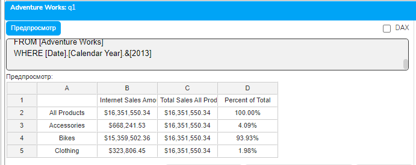
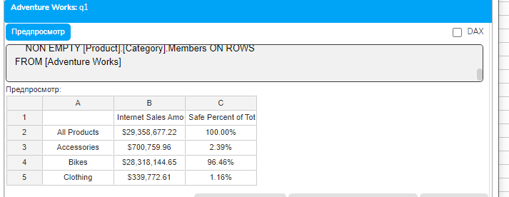
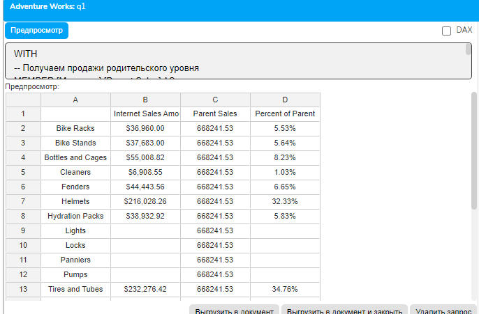
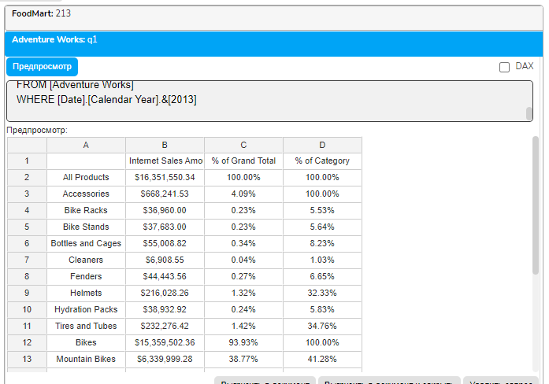
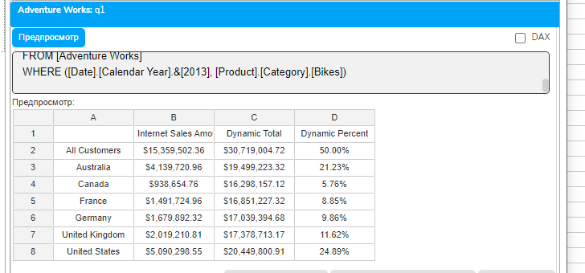
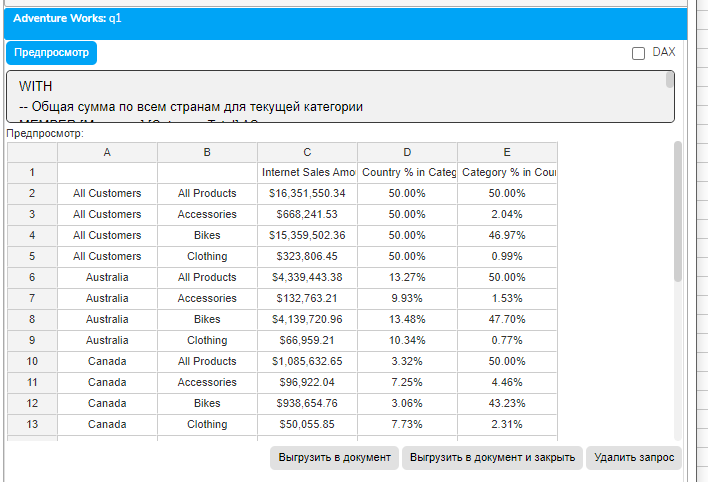
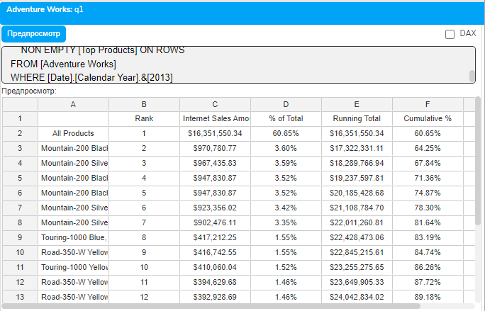
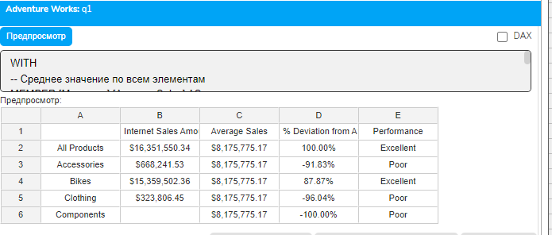
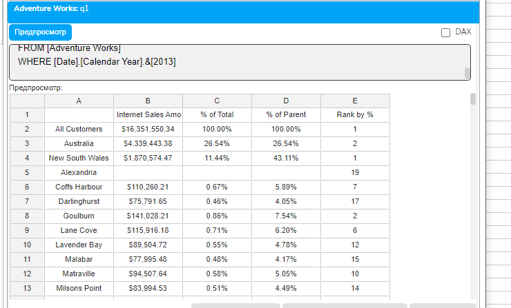
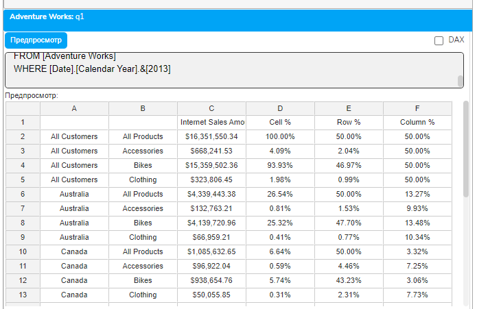

# Урок 3.5: Расчет процента от общей суммы

Введение: Важность процентных соотношений в аналитике

Добро пожаловать в пятый урок модуля "Расчетные меры и вычисления"! После изучения простых расчетных мер, условной логики, функций агрегации и продвинутых вычислений, пришло время освоить один из самых востребованных паттернов в бизнес-аналитике — расчет процента от общей суммы.

Процентные соотношения — это универсальный язык бизнеса. Они позволяют сравнивать несопоставимые величины, понимать структуру данных и выявлять тренды. Вопросы типа "Какова доля продукта в общих продажах?", "Какой процент клиентов приходится на регион?" или "Как распределяется выручка по категориям?" — это основа управленческой отчетности.

Теоретические основы расчета процентов

Концепция "часть от целого"

## Расчет процента от общей суммы базируется на простой математической формуле

Augmented Backus-Naur Form

Процент = (Часть / Целое) × 100

Однако в многомерном анализе эта простая концепция становится сложной из-за необходимости правильно определить, что является "целым" в каждом конкретном контексте.

Виды процентных расчетов в OLAP

## В контексте OLAP-анализа существует несколько типов процентных расчетов

Процент от общего итога — доля элемента от суммы всех элементов

Процент от родителя — доля элемента от суммы его родительского уровня в иерархии

Процент от подытога — доля от промежуточной суммы группы

Процент от фиксированного значения — сравнение с конкретным базовым значением

Контекст вычисления в MDX

Ключевая сложность расчета процентов в MDX — это понимание контекста. Контекст определяется:

Осями запроса — какие измерения находятся на строках и столбцах

Срезом WHERE — какие фильтры применены

Текущей позицией — для какой ячейки выполняется расчет

## MDX предоставляет функции и свойства для работы с контекстом

CurrentMember — текущий элемент измерения

.Parent — родительский элемент в иерархии

All — корневой элемент, представляющий все данные

Базовый расчет процента от общей суммы

Простейший случай: процент от фиксированного итога

## Начнем с самого простого случая — расчета процента от заранее известной общей суммы

```mdx
WITH
-- Шаг 1: Вычисляем общую сумму по всем продуктам
MEMBER [Measures].[Total Sales All Products] AS
    ([Measures].[Internet Sales Amount], [Product].[Product Categories].[All Products])
-- Шаг 2: Рассчитываем процент для каждого продукта
MEMBER [Measures].[Percent of Total] AS
    [Measures].[Internet Sales Amount] / [Measures].[Total Sales All Products],
    FORMAT_STRING = "Percent"
SELECT
    {[Measures].[Internet Sales Amount],
     [Measures].[Total Sales All Products],
     [Measures].[Percent of Total]} ON COLUMNS,
    [Product].[Category].Members ON ROWS
FROM [Adventure Works]
WHERE [Date].[Calendar Year].&[2013]
```



## Разберем этот код детально

```mdx
Создаем меру [Total Sales All Products], которая всегда возвращает сумму продаж по всем продуктам, используя кортеж с элементом [All Products]
```

Делим текущие продажи на общую сумму

Применяем формат "Percent" для отображения результата в процентах

Обработка нулевого знаменателя

## Всегда проверяйте деление на ноль

```mdx
WITH
MEMBER [Measures].[Total Sales] AS
    ([Measures].[Internet Sales Amount], [Product].[Product Categories].[All Products])
MEMBER [Measures].[Safe Percent of Total] AS
    IIF(
        [Measures].[Total Sales] = 0 OR IsEmpty([Measures].[Total Sales]),
        NULL,
        [Measures].[Internet Sales Amount] / [Measures].[Total Sales]
    ),
    FORMAT_STRING = "Percent"
SELECT
    {[Measures].[Internet Sales Amount],
     [Measures].[Safe Percent of Total]} ON COLUMNS,
    NON EMPTY [Product].[Category].Members ON ROWS
FROM [Adventure Works]
```



Процент от родителя в иерархии

Использование навигации по иерархии

## Часто нужно рассчитать долю элемента относительно его родителя в иерархии

```mdx
WITH
-- Получаем продажи родительского уровня
MEMBER [Measures].[Parent Sales] AS
    ([Measures].[Internet Sales Amount],
     [Product].[Product Categories].CurrentMember.Parent)
-- Рассчитываем процент от родителя
MEMBER [Measures].[Percent of Parent] AS
    IIF(
        IsEmpty([Measures].[Parent Sales]) OR [Measures].[Parent Sales] = 0,
        NULL,
        [Measures].[Internet Sales Amount] / [Measures].[Parent Sales]
    ),
    FORMAT_STRING = "Percent"
SELECT
    {[Measures].[Internet Sales Amount],
     [Measures].[Parent Sales],
     [Measures].[Percent of Parent]} ON COLUMNS,
    -- Показываем подкатегории
    Descendants(
        [Product].[Product Categories].[All Products],
        [Product].[Product Categories].[Subcategory],
        SELF
    ) ON ROWS
FROM [Adventure Works]
WHERE [Date].[Calendar Year].&[2013]
```



Многоуровневый анализ структуры

## Создадим отчет, показывающий процентную структуру на разных уровнях

```mdx
WITH
-- Процент от общего итога
MEMBER [Measures].[% of Grand Total] AS
    [Measures].[Internet Sales Amount] /
    ([Measures].[Internet Sales Amount], [Product].[Product Categories].[All Products]),
    FORMAT_STRING = "Percent"
-- Процент от категории (родителя)
MEMBER [Measures].[% of Category] AS
    IIF(
        [Product].[Product Categories].CurrentMember.Level.Ordinal <= 1,
```

        1, -- Для уровня All и Category показываем 100%

```mdx
        [Measures].[Internet Sales Amount] /
        ([Measures].[Internet Sales Amount],
         Ancestor(
             [Product].[Product Categories].CurrentMember,
             [Product].[Product Categories].[Category]
         ))
    ),
    FORMAT_STRING = "Percent"
SELECT
    {[Measures].[Internet Sales Amount],
     [Measures].[% of Grand Total],
     [Measures].[% of Category]} ON COLUMNS,
    NON EMPTY
        Descendants(
            [Product].[Product Categories].[All Products],
```

            2, -- Спускаемся на 2 уровня вниз

            SELF_AND_BEFORE

```mdx
        ) ON ROWS
FROM [Adventure Works]
WHERE [Date].[Calendar Year].&[2013]
```



Динамический расчет процентов с учетом контекста

Адаптивный расчет в зависимости от оси

## Создадим меру, которая автоматически адаптируется к контексту запроса

```mdx
WITH
-- Динамическая общая сумма по текущему набору на оси
MEMBER [Measures].[Dynamic Total] AS
    SUM(
        EXISTING [Customer].[Country].Members,
        [Measures].[Internet Sales Amount]
    )
-- Процент с учетом текущего контекста
MEMBER [Measures].[Dynamic Percent] AS
    [Measures].[Internet Sales Amount] / [Measures].[Dynamic Total],
    FORMAT_STRING = "Percent"
SELECT
    {[Measures].[Internet Sales Amount],
     [Measures].[Dynamic Total],
     [Measures].[Dynamic Percent]} ON COLUMNS,
    NON EMPTY [Customer].[Country].Members ON ROWS
FROM [Adventure Works]
WHERE ([Date].[Calendar Year].&[2013], [Product].[Category].[Bikes])
```



Процент с множественными измерениями

## Рассчитаем процент при наличии нескольких измерений на осях

```mdx
WITH
-- Общая сумма по всем странам для текущей категории
MEMBER [Measures].[Category Total] AS
    SUM(
        [Customer].[Country].Members,
        [Measures].[Internet Sales Amount]
    )
-- Процент страны в категории
MEMBER [Measures].[Country % in Category] AS
    [Measures].[Internet Sales Amount] / [Measures].[Category Total],
    FORMAT_STRING = "Percent"
-- Общая сумма по всем категориям для текущей страны
MEMBER [Measures].[Country Total] AS
    SUM(
        [Product].[Category].Members,
        [Measures].[Internet Sales Amount]
    )
-- Процент категории в стране
MEMBER [Measures].[Category % in Country] AS
    [Measures].[Internet Sales Amount] / [Measures].[Country Total],
    FORMAT_STRING = "Percent"
SELECT
    {[Measures].[Internet Sales Amount],
     [Measures].[Country % in Category],
     [Measures].[Category % in Country]} ON COLUMNS,
    NON EMPTY
        CrossJoin(
            [Customer].[Country].Members,
            [Product].[Category].Members
        ) ON ROWS
FROM [Adventure Works]
WHERE [Date].[Calendar Year].&[2013]
```



Накопительные проценты и анализ Парето

Принцип Парето (правило 80/20)

## Анализ Парето помогает выявить наиболее значимые элементы. Создадим накопительный процент

```mdx
WITH
-- Набор топ-20 продуктов, отсортированных по продажам
SET [Top Products] AS
    HEAD(
        ORDER(
            [Product].[Product].Members,
            [Measures].[Internet Sales Amount],
            BDESC
        ),
        20
    )
-- Общая сумма продаж для топ-20
MEMBER [Measures].[Total Sales Top20] AS
    SUM([Top Products], [Measures].[Internet Sales Amount]),
    FORMAT_STRING = "Currency"
-- Накопительная сумма
MEMBER [Measures].[Running Total] AS
    SUM(
        HEAD(
            [Top Products],
            RANK([Product].[Product].CurrentMember, [Top Products])
        ),
        [Measures].[Internet Sales Amount]
    ),
    FORMAT_STRING = "Currency"
-- Накопительный процент
MEMBER [Measures].[Cumulative %] AS
    IIF(
        [Measures].[Total Sales Top20] = 0,
        NULL,
        [Measures].[Running Total] / [Measures].[Total Sales Top20]
    ),
    FORMAT_STRING = "Percent"
-- Процент от общей суммы
MEMBER [Measures].[% of Total] AS
    IIF(
        [Measures].[Total Sales Top20] = 0,
        NULL,
        [Measures].[Internet Sales Amount] / [Measures].[Total Sales Top20]
    ),
    FORMAT_STRING = "Percent"
-- Классификация по Парето
MEMBER [Measures].[Pareto Class] AS
    CASE
        WHEN ISEMPTY([Measures].[Cumulative %]) THEN "N/A"
        WHEN [Measures].[Cumulative %] <= 0.8 THEN "A (80%)"
        WHEN [Measures].[Cumulative %] <= 0.95 THEN "B (15%)"
        ELSE "C (5%)"
    END
-- Ранг продукта
MEMBER [Measures].[Rank] AS
    RANK([Product].[Product].CurrentMember, [Top Products])
SELECT
    {[Measures].[Rank],
     [Measures].[Internet Sales Amount],
     [Measures].[% of Total],
     [Measures].[Running Total],
     [Measures].[Cumulative %],
     [Measures].[Pareto Class]} ON COLUMNS,
    NON EMPTY [Top Products] ON ROWS
FROM [Adventure Works]
WHERE [Date].[Calendar Year].&[2013]
```



Сравнительный анализ с процентными отклонениями

Процентное отклонение от среднего

```mdx
WITH
-- Среднее значение по всем элементам
MEMBER [Measures].[Average Sales] AS
    AVG(
        [Product].[Category].Members,
        [Measures].[Internet Sales Amount]
    )
-- Отклонение от среднего в процентах
MEMBER [Measures].[% Deviation from Avg] AS
    ([Measures].[Internet Sales Amount] - [Measures].[Average Sales]) /
    [Measures].[Average Sales],
    FORMAT_STRING = "Percent"
-- Классификация отклонения
MEMBER [Measures].[Performance] AS
    CASE
        WHEN [Measures].[% Deviation from Avg] > 0.5 THEN "Excellent"
        WHEN [Measures].[% Deviation from Avg] > 0 THEN "Above Average"
        WHEN [Measures].[% Deviation from Avg] > -0.3 THEN "Below Average"
        ELSE "Poor"
    END
SELECT
    {[Measures].[Internet Sales Amount],
     [Measures].[Average Sales],
     [Measures].[% Deviation from Avg],
     [Measures].[Performance]} ON COLUMNS,
    NON EMPTY [Product].[Category].Members ON ROWS
FROM [Adventure Works]
WHERE [Date].[Calendar Year].&[2013]
```



Практические упражнения

Упражнение 1: Полный структурный анализ

```mdx
-- Комплексный анализ структуры продаж
WITH
-- Процент от общего итога
MEMBER [Measures].[% of Total] AS
    [Measures].[Internet Sales Amount] /
    ([Measures].[Internet Sales Amount], [Customer].[Customer Geography].[All Customers]),
    FORMAT_STRING = "Percent"
-- Процент от родителя
MEMBER [Measures].[% of Parent] AS
    IIF(
        [Customer].[Customer Geography].CurrentMember.Level.Ordinal = 0,
        1,
        [Measures].[Internet Sales Amount] /
        ([Measures].[Internet Sales Amount],
         [Customer].[Customer Geography].CurrentMember.Parent)
    ),
    FORMAT_STRING = "Percent"
-- Ранг по проценту
MEMBER [Measures].[Rank by %] AS
    RANK(
        [Customer].[Customer Geography].CurrentMember,
        [Customer].[Customer Geography].CurrentMember.Siblings,
        [Measures].[Internet Sales Amount]
    )
SELECT
    {[Measures].[Internet Sales Amount],
     [Measures].[% of Total],
     [Measures].[% of Parent],
     [Measures].[Rank by %]} ON COLUMNS,
    NON EMPTY
        Descendants(
            [Customer].[Customer Geography].[All Customers],
            3,
            SELF_AND_BEFORE
        ) ON ROWS
FROM [Adventure Works]
WHERE [Date].[Calendar Year].&[2013]
```



Упражнение 2: Матричный процентный анализ

```mdx
-- Процентная матрица продукты × регионы
WITH
-- Общий итог
MEMBER [Measures].[Grand Total] AS
    ([Measures].[Internet Sales Amount],
     [Product].[Category].[All Products],
     [Customer].[Country].[All Customers])
-- Процент ячейки от общего итога
MEMBER [Measures].[Cell %] AS
    [Measures].[Internet Sales Amount] / [Measures].[Grand Total],
    FORMAT_STRING = "0.00%"
-- Итог по строке (стране)
MEMBER [Measures].[Row Total] AS
    SUM([Product].[Category].Members, [Measures].[Internet Sales Amount])
-- Процент от строки
MEMBER [Measures].[Row %] AS
    [Measures].[Internet Sales Amount] / [Measures].[Row Total],
    FORMAT_STRING = "Percent"
-- Итог по столбцу (категории)
MEMBER [Measures].[Column Total] AS
    SUM([Customer].[Country].Members, [Measures].[Internet Sales Amount])
-- Процент от столбца
MEMBER [Measures].[Column %] AS
    [Measures].[Internet Sales Amount] / [Measures].[Column Total],
    FORMAT_STRING = "Percent"
SELECT
    {[Measures].[Internet Sales Amount],
     [Measures].[Cell %],
     [Measures].[Row %],
     [Measures].[Column %]} ON COLUMNS,
    NON EMPTY
        CrossJoin(
            [Customer].[Country].Members,
            [Product].[Category].Members
        ) ON ROWS
FROM [Adventure Works]
WHERE [Date].[Calendar Year].&[2013]
```



Оптимизация процентных вычислений

Кэширование общих сумм

## При множественных процентных расчетах кэшируйте общие суммы

```mdx
WITH
-- Вычисляем один раз и переиспользуем
MEMBER [Measures].[Cached Total] AS
    ([Measures].[Internet Sales Amount], [Product].[Product Categories].[All Products]),
    -- Указываем, что значение можно кэшировать
    SOLVE_ORDER = 1
MEMBER [Measures].[% of Total] AS
    [Measures].[Internet Sales Amount] / [Measures].[Cached Total],
    FORMAT_STRING = "Percent",
    SOLVE_ORDER = 2
MEMBER [Measures].[Inverse %] AS
    1 - ([Measures].[Internet Sales Amount] / [Measures].[Cached Total]),
    FORMAT_STRING = "Percent",
    SOLVE_ORDER = 3
```

Использование SCOPE для массовых вычислений

## Для больших наборов данных используйте правильную область вычислений

```mdx
WITH
-- Эффективное вычисление процента для текущего контекста
MEMBER [Measures].[Efficient %] AS
    [Measures].[Internet Sales Amount] /
    SUM(
        EXISTING [Product].[Category].Members,
        [Measures].[Internet Sales Amount]
    ),
    FORMAT_STRING = "Percent"
```

Типичные ошибки и их решение

Ошибка 1: Неправильный контекст для "целого"

-- Неправильно - всегда даст 100% для каждой строки

```mdx
MEMBER [Measures].[Wrong %] AS
    [Measures].[Sales] / SUM([Product].[Product].CurrentMember, [Measures].[Sales])
```

-- Правильно - используем весь набор

```mdx
MEMBER [Measures].[Correct %] AS
    [Measures].[Sales] / SUM([Product].[Product].Members, [Measures].[Sales])
```

Ошибка 2: Игнорирование фильтров WHERE

```mdx
-- Учитывайте, что WHERE влияет на контекст
WITH
MEMBER [Measures].[% with WHERE context] AS
    [Measures].[Internet Sales Amount] /
    ([Measures].[Internet Sales Amount],
     [Date].[Calendar Year].CurrentMember,  -- Учитываем текущий год из WHERE
     [Product].[Category].[All Products])
```

Заключение

В этом уроке мы детально изучили расчет процентов от общей суммы — один из фундаментальных паттернов бизнес-аналитики в MDX. Мы освоили:

Базовый расчет процента от фиксированной суммы

Расчет процента от родителя в иерархии

Динамические проценты с учетом контекста

Накопительные проценты и анализ Парето

Процентные отклонения для сравнительного анализа

Оптимизацию процентных вычислений

Умение правильно рассчитывать проценты открывает путь к созданию информативных аналитических отчетов, которые показывают структуру данных, выявляют аномалии и помогают принимать обоснованные решения. Процентные соотношения — это универсальный язык, понятный всем уровням менеджмента.

Домашнее задание

Задание 1: Иерархический процентный анализ

Создайте отчет, показывающий процентную структуру продаж на трех уровнях иерархии продуктов одновременно.

Задание 2: ABC-анализ

Реализуйте полноценный ABC-анализ клиентов с накопительными процентами и автоматической классификацией.

Задание 3: Процентная динамика

Создайте меру, показывающую изменение доли категории в общих продажах (требует комбинации процентов с навигацией).

Контрольные вопросы

В чем разница между процентом от общей суммы и процентом от родителя?

Как функция EXISTING помогает в расчете динамических процентов?

Почему важно проверять деление на ноль при расчете процентов?

Как рассчитать накопительный процент в MDX?

Что такое анализ Парето и как его реализовать?

Как оптимизировать множественные процентные вычисления?

Как контекст WHERE влияет на расчет процентов?
