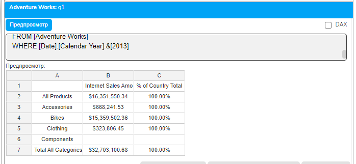
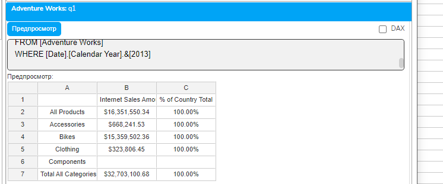
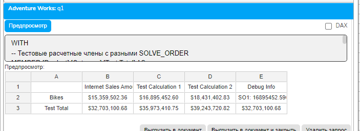
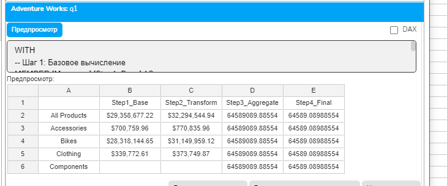
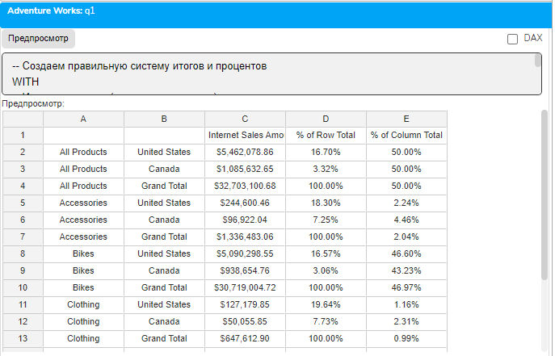
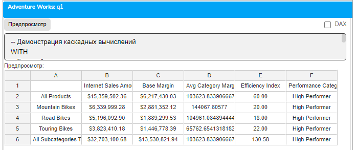

# Урок 3.6: Контекст вычислений и SOLVE_ORDER

Введение: Почему порядок вычислений критически важен

Добро пожаловать в шестой урок модуля "Расчетные меры и вычисления"! До сих пор мы создавали различные расчетные меры, работали с условной логикой, агрегациями и процентами. Но что происходит, когда несколько расчетных членов пересекаются в одной ячейке? Какой из них выполняется первым? Ответ на эти вопросы определяет механизм SOLVE_ORDER.

Представьте ситуацию: у вас есть расчетный член для итогов по строкам и расчетный член для процентов по столбцам. В ячейке пересечения — что должно быть: процент от итога или итог процентов? Без понимания SOLVE_ORDER вы получите непредсказуемые результаты, которые могут привести к серьезным ошибкам в отчетности.

Теоретические основы SOLVE_ORDER

Что такое SOLVE_ORDER

SOLVE_ORDER — это целочисленное свойство расчетного члена, определяющее порядок его вычисления относительно других расчетных членов. Когда MDX обрабатывает запрос и встречает ячейку, где пересекаются несколько расчетных членов, он выполняет их в порядке возрастания SOLVE_ORDER.

## Ключевые принципы

Члены с меньшим SOLVE_ORDER вычисляются первыми

По умолчанию SOLVE_ORDER равен 0

Диапазон значений: от -8181 до 65535

При одинаковом SOLVE_ORDER порядок не определен

Контекст вычислений в MDX

## Контекст вычислений — это совокупность факторов, влияющих на результат расчета

Координаты ячейки — пересечение элементов всех измерений

Расчетные члены — какие вычисления применяются

Порядок вычислений — последовательность применения расчетов

Область видимости — где определен расчетный член (запрос или сессия)

Типичные сценарии конфликтов

## Конфликты SOLVE_ORDER чаще всего возникают в следующих ситуациях

Итоги и проценты — когда итоговая строка пересекается с процентным столбцом

Множественные агрегации — несколько уровней суммирования

Условные вычисления — разные условия для строк и столбцов

Форматирование — когда формат зависит от вычислений

Механизм работы SOLVE_ORDER

Последовательность вычислений

## Рассмотрим пошаговый процесс вычисления ячейки с несколькими расчетными членами

MDX определяет все расчетные члены, влияющие на ячейку

Сортирует их по SOLVE_ORDER (от меньшего к большему)

Выполняет вычисления в этом порядке

Результат каждого шага может использоваться в следующем

Финальный результат — это результат члена с наибольшим SOLVE_ORDER

Демонстрация проблемы без SOLVE_ORDER

## Создадим классический пример конфликта

-- БЕЗ указания SOLVE_ORDER - непредсказуемый результат

```mdx
WITH
-- Итоговая строка для категорий
MEMBER [Product].[Category].[Total All Categories] AS
    SUM([Product].[Category].Members, [Measures].[Internet Sales Amount])
-- Процент от общей суммы по странам
MEMBER [Measures].[% of Country Total] AS
    [Measures].[Internet Sales Amount] /
    ([Measures].[Internet Sales Amount], [Customer].[Country].[All Customers]),
    FORMAT_STRING = "Percent"
SELECT
    {[Measures].[Internet Sales Amount],
     [Measures].[% of Country Total]} ON COLUMNS,
    {[Product].[Category].Members,
     [Product].[Category].[Total All Categories]} ON ROWS
FROM [Adventure Works]
WHERE [Date].[Calendar Year].&[2013]
```



```mdx
В ячейке пересечения [Total All Categories] и [% of Country Total] результат неопределен!
```

Решение с правильным SOLVE_ORDER

```mdx
WITH
```

-- Итоговая строка - вычисляется ПЕРВОЙ

```mdx
MEMBER [Product].[Category].[Total All Categories] AS
    SUM([Product].[Category].Members, [Measures].[Internet Sales Amount]),
    SOLVE_ORDER = 1
```

-- Процент - вычисляется ПОСЛЕ итогов

```mdx
MEMBER [Measures].[% of Country Total] AS
    [Measures].[Internet Sales Amount] /
    ([Measures].[Internet Sales Amount], [Customer].[Country].[All Customers]),
    FORMAT_STRING = "Percent",
    SOLVE_ORDER = 2
SELECT
    {[Measures].[Internet Sales Amount],
     [Measures].[% of Country Total]} ON COLUMNS,
    {[Product].[Category].Members,
     [Product].[Category].[Total All Categories]} ON ROWS
FROM [Adventure Works]
WHERE [Date].[Calendar Year].&[2013]
```



Теперь в ячейке пересечения будет процент от итога, а не итог процентов!

Стратегии назначения SOLVE_ORDER

Рекомендуемые диапазоны значений

## Для организации расчетов рекомендуется использовать следующие диапазоны

0-10: Базовые вычисления (простые арифметические операции)

20-30: Агрегации и суммирования

40-50: Производные показатели (соотношения, индексы)

60-70: Проценты и доли

80-90: Условное форматирование

100+: Финальные корректировки

Правила для типовых сценариев

Правило 1: Итоги перед процентами

```mdx
-- Сначала считаем итоги
MEMBER [Dimension].[Hierarchy].[Total] AS
    SUM(...),
    SOLVE_ORDER = 10
-- Потом проценты от итогов
MEMBER [Measures].[Percent] AS
    ... / ...,
    SOLVE_ORDER = 20
```

Правило 2: Агрегация перед форматированием

```mdx
-- Сначала агрегируем
MEMBER [Measures].[Aggregated] AS
    AVG(...),
    SOLVE_ORDER = 10
-- Потом применяем условное форматирование
MEMBER [Measures].[Formatted] AS
    IIF([Measures].[Aggregated] > 1000, ...),
    SOLVE_ORDER = 30
```

Сложные сценарии с множественными пересечениями

Трехуровневая система вычислений

## Рассмотрим сложный пример с несколькими уровнями вычислений

```mdx
WITH
-- Уровень 1: Базовые итоги по измерениям
MEMBER [Product].[Category].[All Products Total] AS
    SUM([Product].[Category].Members, [Measures].[Internet Sales Amount]),
    SOLVE_ORDER = 10
MEMBER [Customer].[Country].[All Countries Total] AS
    SUM([Customer].[Country].Members, [Measures].[Internet Sales Amount]),
    SOLVE_ORDER = 10
-- Уровень 2: Расчетные показатели
MEMBER [Measures].[Profit] AS
    [Measures].[Internet Sales Amount] - [Measures].[Internet Total Product Cost],
    SOLVE_ORDER = 20
MEMBER [Measures].[Margin %] AS
    IIF(
        [Measures].[Internet Sales Amount] = 0,
        NULL,
        [Measures].[Profit] / [Measures].[Internet Sales Amount]
    ),
    FORMAT_STRING = "Percent",
    SOLVE_ORDER = 30
-- Уровень 3: Проценты от итогов
MEMBER [Measures].[% of Total Sales] AS
    [Measures].[Internet Sales Amount] /
    ([Measures].[Internet Sales Amount],
     [Product].[Category].[All Products Total],
     [Customer].[Country].[All Countries Total]),
    FORMAT_STRING = "Percent",
    SOLVE_ORDER = 40
SELECT
    {[Measures].[Internet Sales Amount],
     [Measures].[Profit],
     [Measures].[Margin %],
     [Measures].[% of Total Sales]} ON COLUMNS,
    CrossJoin(
        {[Product].[Category].Members, [Product].[Category].[All Products Total]},
        {[Customer].[Country].Members, [Customer].[Country].[All Countries Total]}
    ) ON ROWS
FROM [Adventure Works]
WHERE [Date].[Calendar Year].&[2013]
```

Анализ порядка вычислений

## В предыдущем примере для ячейки пересечения всех итогов

SOLVE_ORDER = 10: Вычисляются итоги по продуктам и странам

SOLVE_ORDER = 20: Рассчитывается прибыль на основе итогов

SOLVE_ORDER = 30: Вычисляется маржа от прибыли и итогов

SOLVE_ORDER = 40: Рассчитывается процент (будет 100%, так как это итог от итога)

Отладка и диагностика проблем с SOLVE_ORDER

Визуализация конфликтов

## Создадим диагностический запрос для выявления проблем

```mdx
WITH
-- Тестовые расчетные члены с разными SOLVE_ORDER
MEMBER [Product].[Category].[Test Total] AS
    SUM([Product].[Category].Members, [Measures].[Internet Sales Amount]),
    SOLVE_ORDER = 1
MEMBER [Measures].[Test Calculation 1] AS
    [Measures].[Internet Sales Amount] * 1.1,
    SOLVE_ORDER = 5
MEMBER [Measures].[Test Calculation 2] AS
    [Measures].[Internet Sales Amount] * 1.2,
    SOLVE_ORDER = 10
-- Диагностическая мера показывающая какой SOLVE_ORDER "победил"
MEMBER [Measures].[Debug Info] AS
    "SO1: " + CStr([Measures].[Test Calculation 1]) +
    " | SO2: " + CStr([Measures].[Test Calculation 2])
SELECT
    {[Measures].[Internet Sales Amount],
     [Measures].[Test Calculation 1],
     [Measures].[Test Calculation 2],
     [Measures].[Debug Info]} ON COLUMNS,
    {[Product].[Category].[Bikes],
     [Product].[Category].[Test Total]} ON ROWS
FROM [Adventure Works]
WHERE [Date].[Calendar Year].&[2013]
```



Техника пошаговой отладки

## Для отладки сложных вычислений используйте постепенное увеличение SOLVE_ORDER

```mdx
WITH
-- Шаг 1: Базовое вычисление
MEMBER [Measures].[Step1_Base] AS
    [Measures].[Internet Sales Amount],
    SOLVE_ORDER = 0
-- Шаг 2: Первое преобразование
MEMBER [Measures].[Step2_Transform] AS
    [Measures].[Step1_Base] * 1.1,
    SOLVE_ORDER = 10
-- Шаг 3: Агрегация
MEMBER [Measures].[Step3_Aggregate] AS
    SUM([Product].[Category].Members, [Measures].[Step2_Transform]),
    SOLVE_ORDER = 20
-- Шаг 4: Финальный расчет
MEMBER [Measures].[Step4_Final] AS
    [Measures].[Step3_Aggregate] / 1000,
    SOLVE_ORDER = 30
SELECT
    {[Measures].[Step1_Base],
     [Measures].[Step2_Transform],
     [Measures].[Step3_Aggregate],
     [Measures].[Step4_Final]} ON COLUMNS,
    [Product].[Category].Members ON ROWS
FROM [Adventure Works]
```



Практические упражнения

Упражнение 1: Корректная матрица процентов и итогов

```mdx
-- Создаем правильную систему итогов и процентов
WITH
-- Итоги по строкам (категории продуктов)
MEMBER [Product].[Category].[Grand Total] AS
    SUM([Product].[Category].Members, [Measures].[Internet Sales Amount]),
    SOLVE_ORDER = 100
-- Итоги по столбцам (страны)
MEMBER [Customer].[Country].[Grand Total] AS
    SUM([Customer].[Country].Members, [Measures].[Internet Sales Amount]),
    SOLVE_ORDER = 100
-- Процент от итога по строке
MEMBER [Measures].[% of Row Total] AS
    IIF(
        ([Measures].[Internet Sales Amount], [Customer].[Country].[Grand Total]) = 0,
        NULL,
        [Measures].[Internet Sales Amount] /
        ([Measures].[Internet Sales Amount], [Customer].[Country].[Grand Total])
    ),
    FORMAT_STRING = "Percent",
    SOLVE_ORDER = 200
-- Процент от итога по столбцу
MEMBER [Measures].[% of Column Total] AS
    IIF(
        ([Measures].[Internet Sales Amount], [Product].[Category].[Grand Total]) = 0,
        NULL,
        [Measures].[Internet Sales Amount] /
        ([Measures].[Internet Sales Amount], [Product].[Category].[Grand Total])
    ),
    FORMAT_STRING = "Percent",
    SOLVE_ORDER = 200
SELECT
    {[Measures].[Internet Sales Amount],
     [Measures].[% of Row Total],
     [Measures].[% of Column Total]} ON COLUMNS,
    CrossJoin(
        {[Product].[Category].Members, [Product].[Category].[Grand Total]},
        {[Customer].[Country].[United States],
         [Customer].[Country].[Canada],
         [Customer].[Country].[Grand Total]}
    ) ON ROWS
FROM [Adventure Works]
WHERE [Date].[Calendar Year].&[2013]
```



Упражнение 2: Каскадные вычисления с правильным порядком

```mdx
-- Демонстрация каскадных вычислений
WITH
-- Базовый расчет маржи
MEMBER [Measures].[Base Margin] AS
    [Measures].[Internet Sales Amount] - [Measures].[Internet Total Product Cost],
    SOLVE_ORDER = 10
-- Средняя маржа по категории
MEMBER [Measures].[Avg Category Margin] AS
    AVG(
        Descendants(
            [Product].[Product Categories].CurrentMember,
            [Product].[Product Categories].[Product]
        ),
        [Measures].[Base Margin]
    ),
    SOLVE_ORDER = 20
-- Индекс эффективности (маржа / средняя маржа)
MEMBER [Measures].[Efficiency Index] AS
    IIF(
        [Measures].[Avg Category Margin] = 0,
        NULL,
        [Measures].[Base Margin] / [Measures].[Avg Category Margin]
    ),
    FORMAT_STRING = "#,##0.00",
    SOLVE_ORDER = 30
-- Категоризация на основе индекса
MEMBER [Measures].[Performance Category] AS
    CASE
        WHEN [Measures].[Efficiency Index] > 1.2 THEN "High Performer"
        WHEN [Measures].[Efficiency Index] > 0.8 THEN "Average"
```

        ELSE "Low Performer"

    END,

    SOLVE_ORDER = 40

```mdx
-- Итоговая строка
MEMBER [Product].[Subcategory].[All Subcategories Total] AS
    SUM([Product].[Subcategory].Members, [Measures].CurrentMember),
```

    SOLVE_ORDER = 5  -- Выполняется первым для правильных итогов

```mdx
SELECT
    {[Measures].[Internet Sales Amount],
     [Measures].[Base Margin],
     [Measures].[Avg Category Margin],
     [Measures].[Efficiency Index],
     [Measures].[Performance Category]} ON COLUMNS,
    {[Product].[Subcategory].Members,
     [Product].[Subcategory].[All Subcategories Total]} ON ROWS
FROM [Adventure Works]
WHERE ([Date].[Calendar Year].&[2013], [Product].[Category].[Bikes])
```



Лучшие практики и рекомендации

Документирование SOLVE_ORDER

## Всегда документируйте логику назначения SOLVE_ORDER

```mdx
WITH
-- SOLVE_ORDER = 10: Базовые агрегации выполняются первыми
-- Это обеспечивает правильные итоги для последующих расчетов
MEMBER [Measures].[Total Sales] AS
    SUM(...),
    SOLVE_ORDER = 10
-- SOLVE_ORDER = 50: Проценты вычисляются после итогов
-- Зависит от [Total Sales] с SOLVE_ORDER = 10
MEMBER [Measures].[Sales %] AS
    ... / [Measures].[Total Sales],
    SOLVE_ORDER = 50
```

Избегание конфликтов

Используйте разные значения — не назначайте одинаковый SOLVE_ORDER разным членам

Оставляйте промежутки — используйте шаг 10 или больше для возможности вставки

Группируйте по типам — схожие вычисления должны иметь близкие SOLVE_ORDER

Тестируйте пересечения — проверяйте все возможные комбинации расчетных членов

Типичные ошибки и их решение

Ошибка 1: Игнорирование SOLVE_ORDER

```mdx
-- НЕПРАВИЛЬНО: без SOLVE_ORDER результаты непредсказуемы
MEMBER [Measures].[Calc1] AS ...
MEMBER [Measures].[Calc2] AS ...
-- ПРАВИЛЬНО: явно указываем порядок
MEMBER [Measures].[Calc1] AS ..., SOLVE_ORDER = 10
MEMBER [Measures].[Calc2] AS ..., SOLVE_ORDER = 20
```

Ошибка 2: Неправильный порядок для зависимых вычислений

```mdx
-- НЕПРАВИЛЬНО: процент вычисляется до итога
MEMBER [Measures].[Percent] AS ..., SOLVE_ORDER = 10
MEMBER [Product].[Total] AS SUM(...), SOLVE_ORDER = 20
-- ПРАВИЛЬНО: сначала итог, потом процент
MEMBER [Product].[Total] AS SUM(...), SOLVE_ORDER = 10
MEMBER [Measures].[Percent] AS ..., SOLVE_ORDER = 20
```

Заключение

В этом уроке мы глубоко изучили механизм SOLVE_ORDER и контекст вычислений в MDX. Мы научились:

Понимать, как MDX определяет порядок вычисления расчетных членов

Правильно назначать SOLVE_ORDER для корректных результатов

Решать конфликты при пересечении нескольких расчетных членов

Отлаживать сложные системы вычислений

Применять лучшие практики для организации вычислений

SOLVE_ORDER — это мощный, но часто недооцененный механизм MDX. Правильное его использование гарантирует предсказуемые и корректные результаты даже в самых сложных аналитических сценариях. Без понимания SOLVE_ORDER невозможно создавать надежные производственные отчеты с множественными расчетными членами.

В следующем уроке мы изучим техники оптимизации производительности вычислений, что позволит создавать не только корректные, но и быстрые запросы.

Домашнее задание

Задание 1: Отладка конфликтов

Создайте запрос с тремя пересекающимися расчетными членами и продемонстрируйте, как разные значения SOLVE_ORDER влияют на результат.

Задание 2: Сложная матрица

Разработайте матричный отчет с итогами по строкам и столбцам, процентами и условным форматированием, правильно настроив все SOLVE_ORDER.

Задание 3: Каскадная система

Создайте систему из 5 взаимозависимых расчетных мер с правильной последовательностью вычислений.

Контрольные вопросы

Что такое SOLVE_ORDER и зачем он нужен?

В каком порядке выполняются члены с SOLVE_ORDER 10, 5 и 20?

Какое значение SOLVE_ORDER по умолчанию?

Почему итоги должны вычисляться раньше процентов?

Как отладить проблемы с неправильным SOLVE_ORDER?

Какие диапазоны значений рекомендуется использовать для разных типов вычислений?

Что происходит при одинаковом SOLVE_ORDER у нескольких членов?
