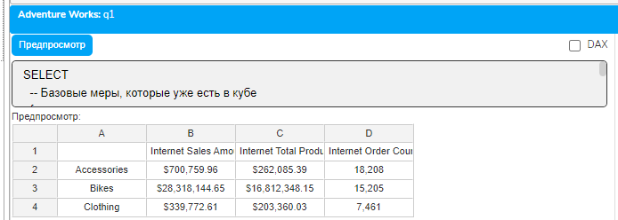
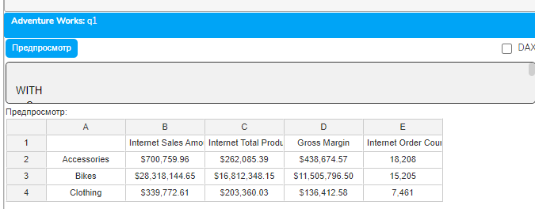
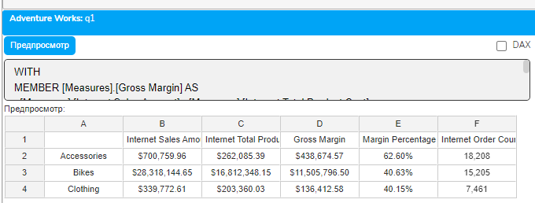
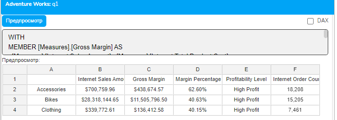
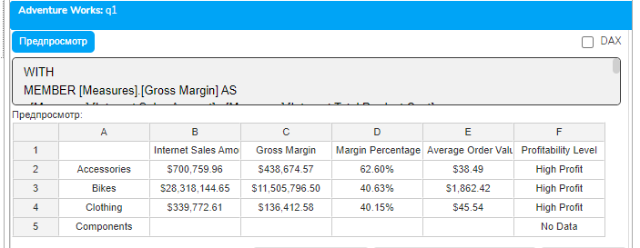
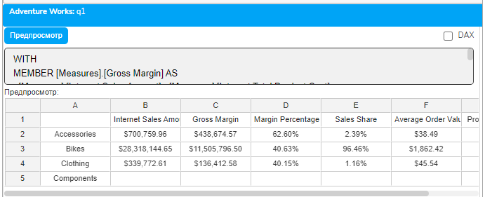
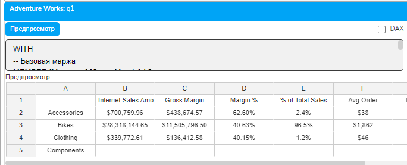

# Урок 3.7: Практика создания комплексного отчета в "Слайдер данные"

Введение

После изучения всех основных концепций расчетных мер и вычислений, пришло время применить полученные знания на практике. В этом уроке мы создадим полноценный аналитический отчет по продажам, используя плагин "Слайдер данные" и все техники, которые освоили в предыдущих уроках модуля 3.

Наш отчет будет включать в себя множество расчетных показателей: от простых вычислений до сложных условных мер с правильно настроенным SOLVE_ORDER. Вы научитесь не только писать MDX-запросы, но и эффективно организовывать их в единый отчет, который можно использовать для принятия бизнес-решений.

Постановка задачи

Представьте, что вы аналитик в компании Adventure Works. Руководство попросило вас создать отчет по эффективности продаж, который должен показывать:

Базовые показатели продаж по категориям продуктов

Расчетную маржинальность (разница между продажами и себестоимостью)

Процент маржинальности от общих продаж

Категоризацию продуктов по уровню прибыльности

Средний чек по каждой категории

Долю каждой категории в общих продажах

Все эти показатели должны быть представлены в едином отчете с корректными вычислениями и форматированием.

Подготовка рабочего окружения

Прежде чем начать создание отчета, давайте убедимся, что наше рабочее окружение готово. Откройте плагин "Слайдер данные" и создайте новый запрос. Как мы изучали в уроке 1.3, для этого нужно:

Открыть панель "Слайдер данные"

Нажать кнопку создания нового запроса

В открывшемся окне выбрать подключение к кубу Adventure Works

## В окне создания запроса вы увидите

Поле для названия запроса - введем "Sales Performance Report"

Выпадающий список с доступными подключениями - выберем Adventure Works

Большое текстовое поле для MDX-запроса - здесь мы будем писать наш код

Этап 1: Создание базовой структуры отчета

## Начнем с простого запроса, используя знания из урока 2.1 о структуре MDX-запросов

```mdx
SELECT
  -- Базовые меры, которые уже есть в кубе
  {
    [Measures].[Internet Sales Amount],
    [Measures].[Internet Total Product Cost],
    [Measures].[Internet Order Count]
  } ON COLUMNS,
  -- Категории продуктов по строкам
  [Product].[Category].[Category].MEMBERS ON ROWS
FROM [Adventure Works]
```



## Давайте разберем каждую строку этого запроса

Строка SELECT - начинает наш запрос, как мы изучали в уроке 2.1.

```mdx
Набор мер ON COLUMNS:
```

Мы создаем набор из трех мер, используя фигурные скобки {}

[Measures].[Internet Sales Amount] - это мера суммы продаж через интернет

[Measures].[Internet Total Product Cost] - себестоимость проданных товаров

[Measures].[Internet Order Count] - количество интернет-заказов

```mdx
Ключевое слово ON COLUMNS размещает эти меры по колонкам (горизонтально)
Члены категорий ON ROWS:
```

[Product].[Category] - это иерархия Category в измерении Product (из урока 1.2)

[Category].MEMBERS - получаем всех членов уровня Category

```mdx
ON ROWS размещает категории по строкам (вертикально)
```

FROM [Adventure Works] - указываем куб, из которого берем данные.

Этап 2: Добавление первой расчетной меры - маржа

Теперь применим знания из урока 3.1 о создании расчетных мер. Добавим меру для расчета валовой маржи:

```mdx
WITH
-- Создаем расчетную меру для маржи
MEMBER [Measures].[Gross Margin] AS
  [Measures].[Internet Sales Amount] - [Measures].[Internet Total Product Cost],
  FORMAT_STRING = "Currency"
SELECT
  {
    [Measures].[Internet Sales Amount],
    [Measures].[Internet Total Product Cost],
    [Measures].[Gross Margin],  -- Добавляем нашу новую меру
    [Measures].[Internet Order Count]
  } ON COLUMNS,
  [Product].[Category].[Category].MEMBERS ON ROWS
FROM [Adventure Works]
```



## Разберем новые элементы

Секция WITH - здесь мы определяем расчетные члены перед основным запросом SELECT.

MEMBER [Measures].[Gross Margin] AS - создаем новый член в измерении Measures с именем "Gross Margin".

Формула вычисления - простое вычитание: продажи минус себестоимость. MDX автоматически выполнит это вычисление для каждой ячейки результата.

FORMAT_STRING = "Currency" - из урока 1.4 мы знаем, что это свойство определяет формат отображения. "Currency" форматирует число как денежную сумму.

Этап 3: Добавление процента маржинальности с условной логикой

## Применим знания из урока 3.2 об условных операторах IIF для безопасного расчета процента

```mdx
WITH
MEMBER [Measures].[Gross Margin] AS
  [Measures].[Internet Sales Amount] - [Measures].[Internet Total Product Cost],
  FORMAT_STRING = "Currency"
MEMBER [Measures].[Margin Percentage] AS
  IIF(
    [Measures].[Internet Sales Amount] = 0,
    NULL,
    [Measures].[Gross Margin] / [Measures].[Internet Sales Amount]
  ),
  FORMAT_STRING = "Percent"
SELECT
  {
    [Measures].[Internet Sales Amount],
    [Measures].[Internet Total Product Cost],
    [Measures].[Gross Margin],
    [Measures].[Margin Percentage],
    [Measures].[Internet Order Count]
  } ON COLUMNS,
  [Product].[Category].[Category].MEMBERS ON ROWS
FROM [Adventure Works]
```



## Детально разберем функцию IIF

```mdx
IIF(
    [Measures].[Internet Sales Amount] = 0,  -- Условие
```

    NULL,                                     -- Значение если истина

```mdx
    [Measures].[Gross Margin] / [Measures].[Internet Sales Amount]  -- Значение если ложь
)
```

Первый параметр - условие проверки: равны ли продажи нулю

Второй параметр - что вернуть, если условие истинно (продажи = 0): возвращаем NULL

Третий параметр - что вернуть, если условие ложно: выполняем деление

Это защищает нас от ошибки деления на ноль. FORMAT_STRING = "Percent" автоматически умножит результат на 100 и добавит знак %.

Этап 4: Создание категоризации с вложенными условиями

## Теперь создадим сложную логику категоризации, используя вложенные IIF

```mdx
WITH
MEMBER [Measures].[Gross Margin] AS
  [Measures].[Internet Sales Amount] - [Measures].[Internet Total Product Cost],
  FORMAT_STRING = "Currency"
MEMBER [Measures].[Margin Percentage] AS
  IIF(
    [Measures].[Internet Sales Amount] = 0,
    NULL,
    [Measures].[Gross Margin] / [Measures].[Internet Sales Amount]
  ),
  FORMAT_STRING = "Percent"
MEMBER [Measures].[Profitability Level] AS
  IIF(
    [Measures].[Margin Percentage] = NULL,
    "No Data",
    IIF(
      [Measures].[Margin Percentage] >= 0.4,
      "High Profit",
      IIF(
        [Measures].[Margin Percentage] >= 0.25,
        "Medium Profit",
        IIF(
          [Measures].[Margin Percentage] >= 0.1,
          "Low Profit",
          "Minimal Profit"
        )
      )
    )
  )
SELECT
  {
    [Measures].[Internet Sales Amount],
    [Measures].[Gross Margin],
    [Measures].[Margin Percentage],
    [Measures].[Profitability Level],
    [Measures].[Internet Order Count]
  } ON COLUMNS,
  [Product].[Category].[Category].MEMBERS ON ROWS
FROM [Adventure Works]
```



## Давайте пошагово проследим логику вложенных IIF

Первая проверка: Margin Percentage = NULL?

Если да → возвращаем "No Data"

Если нет → переходим к следующей проверке

Вторая проверка: Margin Percentage &gt;= 0.4 (40%)?

Если да → возвращаем "High Profit"

Если нет → переходим к следующей проверке

Третья проверка: Margin Percentage &gt;= 0.25 (25%)?

Если да → возвращаем "Medium Profit"

Если нет → переходим к следующей проверке

Четвертая проверка: Margin Percentage &gt;= 0.1 (10%)?

Если да → возвращаем "Low Profit"

Если нет → возвращаем "Minimal Profit"

Этап 5: Расчет среднего чека

## Добавим меру для среднего чека, снова используя IIF для защиты от деления на ноль

```mdx
WITH
MEMBER [Measures].[Gross Margin] AS
  [Measures].[Internet Sales Amount] - [Measures].[Internet Total Product Cost],
  FORMAT_STRING = "Currency"
MEMBER [Measures].[Margin Percentage] AS
  IIF(
    [Measures].[Internet Sales Amount] = 0,
    NULL,
    [Measures].[Gross Margin] / [Measures].[Internet Sales Amount]
  ),
  FORMAT_STRING = "Percent"
MEMBER [Measures].[Average Order Value] AS
  IIF(
    [Measures].[Internet Order Count] = 0 OR [Measures].[Internet Order Count] = NULL,
    NULL,
    [Measures].[Internet Sales Amount] / [Measures].[Internet Order Count]
  ),
  FORMAT_STRING = "Currency"
MEMBER [Measures].[Profitability Level] AS
  IIF(
    [Measures].[Margin Percentage] = NULL,
    "No Data",
    IIF(
      [Measures].[Margin Percentage] >= 0.4,
      "High Profit",
      IIF(
        [Measures].[Margin Percentage] >= 0.25,
        "Medium Profit",
        IIF(
          [Measures].[Margin Percentage] >= 0.1,
          "Low Profit",
          "Minimal Profit"
        )
      )
    )
  )
SELECT
  {
    [Measures].[Internet Sales Amount],
    [Measures].[Gross Margin],
    [Measures].[Margin Percentage],
    [Measures].[Average Order Value],
    [Measures].[Profitability Level]
  } ON COLUMNS,
  [Product].[Category].[Category].MEMBERS ON ROWS
FROM [Adventure Works]
```



## Обратите внимание на использование оператора OR в условии

```mdx
[Measures].[Internet Order Count] = 0 OR [Measures].[Internet Order Count] = NULL
```

Это двойная проверка гарантирует, что мы не попытаемся делить на ноль или на NULL.

Этап 6: Расчет доли в общих продажах

Теперь применим знания из урока 3.5 о расчете процента от общей суммы. Для этого нам нужно использовать кортеж (из урока 2.6):

```mdx
WITH
MEMBER [Measures].[Gross Margin] AS
  [Measures].[Internet Sales Amount] - [Measures].[Internet Total Product Cost],
  FORMAT_STRING = "Currency",
  SOLVE_ORDER = 1
MEMBER [Measures].[Margin Percentage] AS
  IIF(
    [Measures].[Internet Sales Amount] = 0,
    NULL,
    [Measures].[Gross Margin] / [Measures].[Internet Sales Amount]
  ),
  FORMAT_STRING = "Percent",
  SOLVE_ORDER = 2
MEMBER [Measures].[Average Order Value] AS
  IIF(
    [Measures].[Internet Order Count] = 0 OR [Measures].[Internet Order Count] = NULL,
    NULL,
    [Measures].[Internet Sales Amount] / [Measures].[Internet Order Count]
  ),
  FORMAT_STRING = "Currency",
  SOLVE_ORDER = 1
MEMBER [Measures].[Sales Share] AS
  IIF(
    [Measures].[Internet Sales Amount] = 0 OR [Measures].[Internet Sales Amount] = NULL,
    NULL,
    [Measures].[Internet Sales Amount] /
    (
      [Measures].[Internet Sales Amount],
      [Product].[Category].[All Products]
    )
  ),
  FORMAT_STRING = "Percent",
  SOLVE_ORDER = 3
MEMBER [Measures].[Profitability Level] AS
  IIF(
    [Measures].[Margin Percentage] = NULL,
    "No Data",
    IIF(
      [Measures].[Margin Percentage] >= 0.4,
      "High Profit",
      IIF(
        [Measures].[Margin Percentage] >= 0.25,
        "Medium Profit",
        IIF(
          [Measures].[Margin Percentage] >= 0.1,
          "Low Profit",
          "Minimal Profit"
        )
      )
    )
  ),
  SOLVE_ORDER = 4
SELECT
  {
    [Measures].[Internet Sales Amount],
    [Measures].[Gross Margin],
    [Measures].[Margin Percentage],
    [Measures].[Sales Share],
    [Measures].[Average Order Value],
    [Measures].[Profitability Level]
  } ON COLUMNS,
  NON EMPTY [Product].[Category].[Category].MEMBERS ON ROWS
FROM [Adventure Works]
```



## Давайте детально разберем расчет доли продаж

```mdx
MEMBER [Measures].[Sales Share] AS
  IIF(
    [Measures].[Internet Sales Amount] = 0 OR [Measures].[Internet Sales Amount] = NULL,
    NULL,
    [Measures].[Internet Sales Amount] /
    (
      [Measures].[Internet Sales Amount],
      [Product].[Category].[All Products]
    )
  )
```

## Ключевой момент - кортеж в знаменателе

```mdx
(
  [Measures].[Internet Sales Amount],
  [Product].[Category].[All Products]
)
```

## Этот кортеж (из урока 2.6) указывает на конкретную ячейку куба

Мера: Internet Sales Amount

Категория продукта: All Products

[All Products] - это специальный член, который автоматически создается в каждой иерархии (мы видели это в уроке 1.2). Он представляет агрегацию по всем членам уровня. Таким образом, мы получаем общую сумму продаж по всем категориям.

Понимание SOLVE_ORDER

Из урока 3.6 мы знаем, что SOLVE_ORDER определяет порядок вычисления расчетных членов. Давайте разберем, почему мы установили именно такие значения:

SOLVE_ORDER = 1 для Gross Margin и Average Order Value

Это простые арифметические операции

Они не зависят от других расчетных мер

Вычисляются первыми

SOLVE_ORDER = 2 для Margin Percentage

Использует результат Gross Margin

Должна вычисляться после Gross Margin

Поэтому имеет больший SOLVE_ORDER

SOLVE_ORDER = 3 для Sales Share

Независимое вычисление

Не зависит от других расчетных мер

SOLVE_ORDER = 4 для Profitability Level

Использует результат Margin Percentage

Должна вычисляться последней

Имеет самый высокий SOLVE_ORDER

Что произойдет без правильного SOLVE_ORDER?

Если бы мы не указали SOLVE_ORDER или указали неправильно, MDX мог бы попытаться вычислить Profitability Level до того, как вычислен Margin Percentage. Это привело бы к ошибке или некорректным результатам.

Добавление NON EMPTY для очистки результата

## Заметили, что мы добавили NON EMPTY перед строками? Это знание из урока 2.5

```mdx
NON EMPTY [Product].[Category].[Category].MEMBERS ON ROWS
```

NON EMPTY убирает из результата строки, где все меры пустые. Это делает отчет чище и компактнее.

Финальная версия отчета с улучшениями

## Давайте создадим финальную версию с улучшенным форматированием

```mdx
WITH
-- Базовая маржа
MEMBER [Measures].[Gross Margin] AS
  [Measures].[Internet Sales Amount] - [Measures].[Internet Total Product Cost],
  FORMAT_STRING = "$#,##0.00",  -- Формат с разделителями тысяч
  SOLVE_ORDER = 1
-- Процент маржинальности
MEMBER [Measures].[Margin %] AS
  IIF(
    [Measures].[Internet Sales Amount] = 0 OR
    [Measures].[Internet Sales Amount] = NULL,
    NULL,
    [Measures].[Gross Margin] / [Measures].[Internet Sales Amount]
  ),
  FORMAT_STRING = "0.00%",  -- Процент с двумя знаками после запятой
  SOLVE_ORDER = 2
-- Средний чек
MEMBER [Measures].[Avg Order] AS
  IIF(
    [Measures].[Internet Order Count] = 0 OR
    [Measures].[Internet Order Count] = NULL,
    NULL,
    [Measures].[Internet Sales Amount] / [Measures].[Internet Order Count]
  ),
  FORMAT_STRING = "$#,##0",  -- Округление до целых
  SOLVE_ORDER = 1
-- Доля в продажах
MEMBER [Measures].[% of Total Sales] AS
  IIF(
    [Measures].[Internet Sales Amount] = 0 OR
    [Measures].[Internet Sales Amount] = NULL,
    NULL,
    [Measures].[Internet Sales Amount] /
    (
      [Measures].[Internet Sales Amount],
      [Product].[Category].[All Products]
    )
  ),
  FORMAT_STRING = "0.0%",  -- Процент с одним знаком
  SOLVE_ORDER = 3
-- Уровень прибыльности с визуальными индикаторами
MEMBER [Measures].[Profit Level] AS
  IIF(
    [Measures].[Margin %] = NULL,
    "No Data",
    IIF(
      [Measures].[Margin %] >= 0.4,
      "*** High",
      IIF(
        [Measures].[Margin %] >= 0.25,
        "** Medium",
        IIF(
          [Measures].[Margin %] >= 0.1,
          "* Low",
          "! Minimal"
        )
      )
    )
  ),
  SOLVE_ORDER = 4
SELECT
  {
    [Measures].[Internet Sales Amount],
    [Measures].[Gross Margin],
    [Measures].[Margin %],
    [Measures].[% of Total Sales],
    [Measures].[Avg Order],
    [Measures].[Profit Level]
  } ON COLUMNS,
  NON EMPTY
    [Product].[Category].[Category].MEMBERS ON ROWS
FROM [Adventure Works]
```



Работа с результатами в "Слайдер данные"

## После ввода всего запроса в текстовое поле

Нажмите кнопку "Preview" - это покажет результаты запроса в табличном виде

Проверьте результаты - убедитесь, что все колонки отображаются корректно

Сохраните запрос - нажмите кнопку "Save" и дайте запросу понятное имя

## Вы должны увидеть таблицу с

Строками для каждой категории продуктов (Bikes, Clothing, Accessories, Components)

Шестью колонками с нашими показателями

Правильно отформатированными значениями (валюты, проценты, текст)

Практические задания

Задание 1 (базовый уровень): Добавьте новую расчетную меру "Cost Percentage", которая покажет долю себестоимости в продажах:

```mdx
MEMBER [Measures].[Cost Percentage] AS
  IIF(
    [Measures].[Internet Sales Amount] = 0,
    NULL,
    [Measures].[Internet Total Product Cost] / [Measures].[Internet Sales Amount]
  ),
  FORMAT_STRING = "Percent"
```

Задание 2 (средний уровень): Создайте меру "Order Efficiency", которая покажет среднюю маржу на один заказ:

```mdx
MEMBER [Measures].[Order Efficiency] AS
  IIF(
    [Measures].[Internet Order Count] = 0,
    NULL,
    [Measures].[Gross Margin] / [Measures].[Internet Order Count]
  ),
  FORMAT_STRING = "Currency",
```

  SOLVE_ORDER = 2  -- После Gross Margin

Задание 3 (продвинутый уровень): Создайте меру "Performance Score" от 1 до 10, основанную на комбинации маржинальности и среднего чека. Используйте вложенные IIF для создания сложной логики оценки.

Типичные ошибки и их решение

Ошибка 1: Забыли проверку на ноль

```mdx
-- Неправильно:
[Measures].[Margin] / [Measures].[Sales]
-- Правильно:
IIF([Measures].[Sales] = 0, NULL, [Measures].[Margin] / [Measures].[Sales])
```

Ошибка 2: Неправильный SOLVE_ORDER

```mdx
-- Неправильно: Level зависит от Margin%, но имеет меньший SOLVE_ORDER
MEMBER [Measures].[Margin %] AS ..., SOLVE_ORDER = 2
MEMBER [Measures].[Level] AS IIF([Measures].[Margin %] > 0.3, ...), SOLVE_ORDER = 1
-- Правильно:
MEMBER [Measures].[Margin %] AS ..., SOLVE_ORDER = 1
MEMBER [Measures].[Level] AS IIF([Measures].[Margin %] > 0.3, ...), SOLVE_ORDER = 2
```

Ошибка 3: Забыли FORMAT_STRING

```mdx
-- Без форматирования число будет показано как 0.4567
MEMBER [Measures].[Percentage] AS [Measures].[Value1] / [Measures].[Value2]
-- С форматированием будет 45.67%
MEMBER [Measures].[Percentage] AS [Measures].[Value1] / [Measures].[Value2],
  FORMAT_STRING = "Percent"
```

Дополнительные советы по работе в "Слайдер данные"

Используйте комментарии - они помогут вам и коллегам понять логику запроса

Сохраняйте промежуточные версии - это позволит вернуться к работающей версии при ошибках

Тестируйте постепенно - добавляйте по одной мере и проверяйте результат

Используйте правильные имена - давайте мерам понятные бизнес-названия

Заключение

В этом практическом уроке мы создали полноценный аналитический отчет, применив все изученные концепции:

Из урока 3.1: Создание простых расчетных мер (Gross Margin)

Из урока 3.2: Условные операторы IIF для безопасных вычислений и категоризации

Из урока 3.3: Агрегация данных (хотя явно не использовали SUM/AVG, но применили концепцию)

Из урока 3.5: Расчет процента от общей суммы (Sales Share)

Из урока 3.6: Правильное использование SOLVE_ORDER для контроля порядка вычислений

Из урока 2.5: NON EMPTY для очистки результатов

Из урока 2.6: Кортежи для указания конкретных точек в кубе

Этот опыт подготовил вас к созданию реальных бизнес-отчетов. Вы теперь можете комбинировать различные техники MDX для решения сложных аналитических задач. В следующем модуле мы изучим продвинутые техники фильтрации и сортировки, которые сделают ваши отчеты еще более гибкими и мощными.
