# Урок 4.1: Фильтрация данных с помощью Filter

Введение: Зачем нужна фильтрация в MDX

Добро пожаловать в первый урок четвертого модуля! После изучения расчетных мер, агрегаций и оптимизации, мы переходим к не менее важной теме — фильтрации данных. В реальной аналитике редко нужны все данные куба. Чаще требуется отобрать только те элементы, которые соответствуют определенным критериям: продукты с продажами выше порога, клиенты из конкретного региона, периоды с положительной динамикой.

Функция FILTER — это основной инструмент для отбора данных в MDX. В отличие от WHERE, который применяет глобальный срез ко всему запросу, FILTER позволяет применять условия к конкретным наборам прямо в процессе формирования осей.

Теоретические основы функции FILTER

Синтаксис и принцип работы

## Функция FILTER имеет следующий синтаксис

```mdx
FILTER(набор, логическое_условие)
```

## Где

набор — исходный набор элементов для фильтрации

логическое_условие — выражение, возвращающее true или false для каждого элемента

FILTER проходит по каждому элементу набора, вычисляет для него условие и включает в результат только те элементы, для которых условие истинно.

Отличие FILTER от других методов отбора

## В MDX существует несколько способов ограничить данные

WHERE — глобальный срез, применяется ко всему запросу

NON EMPTY — убирает пустые ячейки

FILTER — применяет произвольное логическое условие

Навигационные функции (Children, Descendants) — отбор по структуре иерархии

FILTER уникален тем, что позволяет использовать любую логику отбора, включая сравнение мер, проверку свойств членов и сложные вычисления.

Контекст выполнения FILTER

Важнейший аспект FILTER — понимание контекста. При вычислении условия для каждого элемента:

Текущий элемент становится контекстом через CurrentMember

Можно обращаться к мерам и их значениям для этого элемента

Можно использовать навигацию относительно текущего элемента

Базовая фильтрация по числовым условиям

Простейший пример: фильтрация по порогу

Начнем с самого простого случая — отберем продукты с продажами выше определенного значения:

```mdx
SELECT
    [Measures].[Internet Sales Amount] ON COLUMNS,
    FILTER(
        [Product].[Product].[Product].Members,  -- Исходный набор: все продукты
        [Measures].[Internet Sales Amount] > 50000  -- Условие: продажи больше 50000
    ) ON ROWS
FROM [Adventure Works]
WHERE [Date].[Calendar Year].&[2013]
```

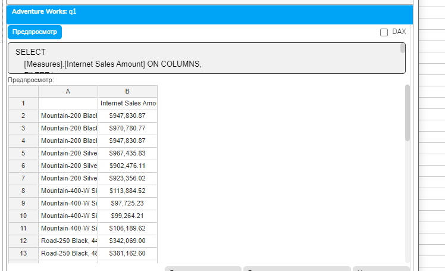

## Разберем подробно, что происходит

```mdx
Берем набор всех продуктов [Product].[Product].[Product].Members
Для каждого продукта проверяем условие [Measures].[Internet Sales Amount] > 50000
```

В результат попадают только продукты, где условие истинно

Фильтрация с использованием вычислений

## Можно использовать любые вычисления в условии

```mdx
WITH
MEMBER [Measures].[Avg Price] AS
    IIF(
        [Measures].[Order Quantity] = 0,
        NULL,
        [Measures].[Internet Sales Amount] / [Measures].[Order Quantity]
    ),
    FORMAT_STRING = "Currency"
SELECT
    {[Measures].[Internet Sales Amount],
     [Measures].[Order Quantity],
     [Measures].[Avg Price]} ON COLUMNS,
    FILTER(
        [Product].[Product].Members,
        [Measures].[Avg Price] > 500
    ) ON ROWS
FROM [Adventure Works]
WHERE [Date].[Calendar Year].&[2013]
```

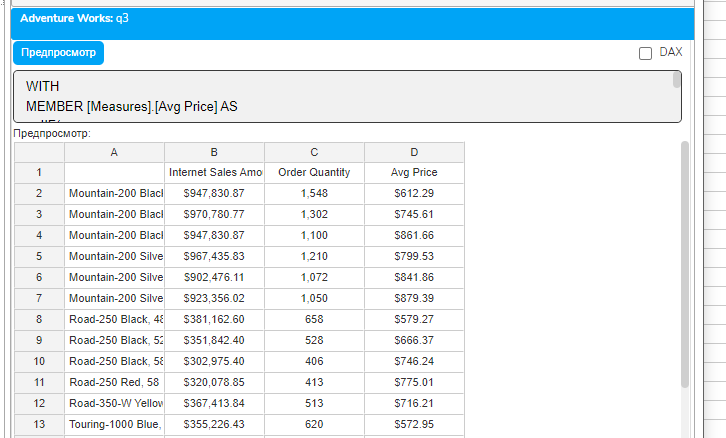

Множественные условия

## Используем логические операторы AND, OR, NOT

```mdx
SELECT
    {[Measures].[Internet Sales Amount],
     [Measures].[Order Quantity]} ON COLUMNS,
    FILTER(
        [Product].[Product].[Product].Members,
        -- Сложное условие: высокие продажи И большое количество заказов
        [Measures].[Internet Sales Amount] > 30000
        AND
        [Measures].[Order Quantity] > 50
    ) ON ROWS
FROM [Adventure Works]
WHERE [Date].[Calendar Year].&[2013]
```

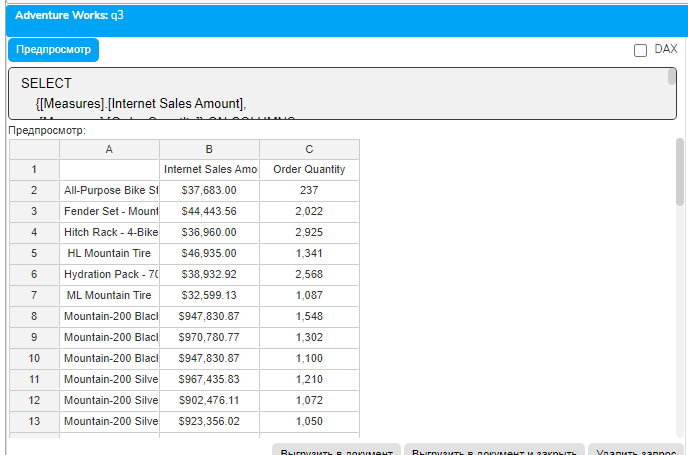

Фильтрация с использованием свойств членов

Фильтрация по имени

## MDX позволяет фильтровать по свойствам элементов, например, по имени

```mdx
SELECT
    [Measures].[Internet Sales Amount] ON COLUMNS,
    FILTER(
        [Product].[Product].[Product].Members,
        -- Функция InStr проверяет наличие подстроки в имени
        InStr(
            [Product].[Product].CurrentMember.Name,
            "Mountain"
        ) > 0
    ) ON ROWS
FROM [Adventure Works]
```

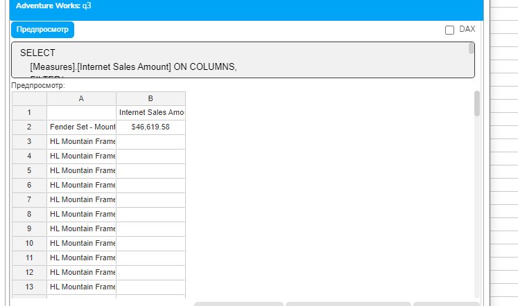

## Здесь

CurrentMember — текущий элемент в процессе фильтрации

.Name — свойство, возвращающее имя элемента

InStr — функция поиска подстроки (возвращает позицию или 0)

Фильтрация по уровню иерархии

```mdx
SELECT
    [Measures].[Internet Sales Amount] ON COLUMNS,
    FILTER(
        -- Берем все элементы иерархии
        [Customer].[Customer Geography].Members,
        -- Оставляем только уровень Country
        [Customer].[Customer Geography].CurrentMember.Level.Name = "Country"
    ) ON ROWS
FROM [Adventure Works]
```

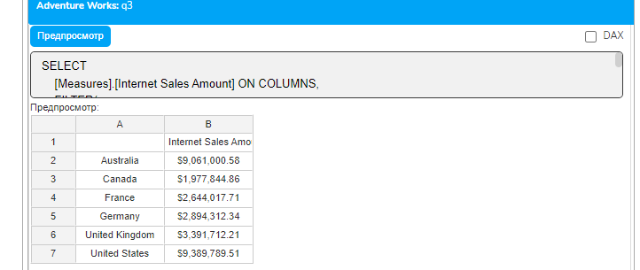

Относительная фильтрация

Сравнение с агрегированными значениями

## Отберем продукты, продажи которых выше среднего

```mdx
WITH
-- Вычисляем среднее по всем продуктам
MEMBER [Measures].[Avg Product Sales] AS
    AVG(
        [Product].[Product].[Product].Members,
        [Measures].[Internet Sales Amount]
    )
SELECT
    {[Measures].[Internet Sales Amount],
     [Measures].[Avg Product Sales]} ON COLUMNS,
    FILTER(
        [Product].[Product].[Product].Members,
        -- Сравниваем с вычисленным средним
        [Measures].[Internet Sales Amount] > [Measures].[Avg Product Sales]
    ) ON ROWS
FROM [Adventure Works]
WHERE [Date].[Calendar Year].&[2013]
```

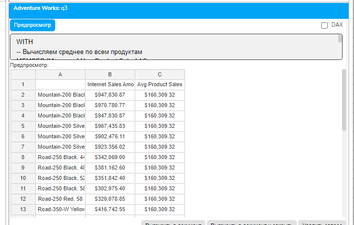

Фильтрация по проценту от общей суммы

## Найдем категории, составляющие более 20% от общих продаж

```mdx
WITH
-- Общая сумма продаж
MEMBER [Measures].[Total Sales] AS
    ([Measures].[Internet Sales Amount], [Product].[Category].[All Products])
-- Процент от общей суммы
MEMBER [Measures].[Percent of Total] AS
    [Measures].[Internet Sales Amount] / [Measures].[Total Sales],
    FORMAT_STRING = "Percent"
SELECT
    {[Measures].[Internet Sales Amount],
     [Measures].[Percent of Total]} ON COLUMNS,
    FILTER(
        [Product].[Category].[Category].Members,
        -- Фильтруем по проценту
        [Measures].[Percent of Total] > 0.2
    ) ON ROWS
FROM [Adventure Works]
WHERE [Date].[Calendar Year].&[2013]
```

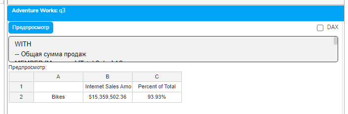

Комбинирование FILTER с другими функциями

FILTER и NON EMPTY

## NON EMPTY убирает пустые строки после фильтрации

```mdx
SELECT
    [Measures].[Internet Sales Amount] ON COLUMNS,
```

    NON EMPTY  -- Убираем пустые результаты

```mdx
        FILTER(
            [Customer].[Country].[Country].Members,
            [Measures].[Internet Sales Amount] > 1000000
        ) ON ROWS
FROM [Adventure Works]
WHERE [Date].[Calendar Year].&[2013]
```

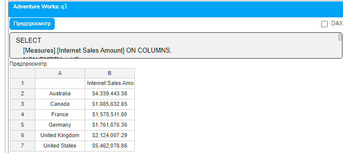

FILTER и CrossJoin

## Фильтрация декартова произведения

```mdx
SELECT
    [Measures].[Internet Sales Amount] ON COLUMNS,
    FILTER(
        -- Создаем все комбинации категория-страна
        CrossJoin(
            [Product].[Category].[Category].Members,
            [Customer].[Country].[Country].Members
        ),
        -- Оставляем только значимые комбинации
        [Measures].[Internet Sales Amount] > 500000
    ) ON ROWS
FROM [Adventure Works]
WHERE [Date].[Calendar Year].&[2013]
```

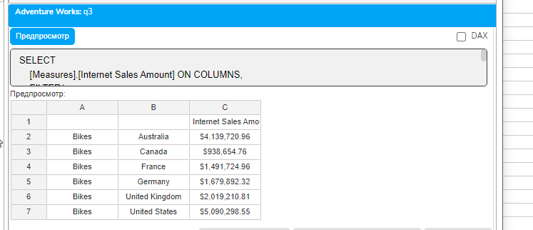

Вложенные FILTER

## Можно применять несколько фильтров последовательно

```mdx
WITH
MEMBER [Measures].[Profit] AS
    [Measures].[Internet Sales Amount] - [Measures].[Internet Total Product Cost]
SELECT
    {[Measures].[Internet Sales Amount],
     [Measures].[Profit]} ON COLUMNS,
    FILTER(
        -- Второй фильтр: по прибыли
        FILTER(
            -- Первый фильтр: по продажам
            [Product].[Product].[Product].Members,
            [Measures].[Internet Sales Amount] > 10000
        ),
        [Measures].[Profit] > 5000
    ) ON ROWS
FROM [Adventure Works]
WHERE [Date].[Calendar Year].&[2013]
```

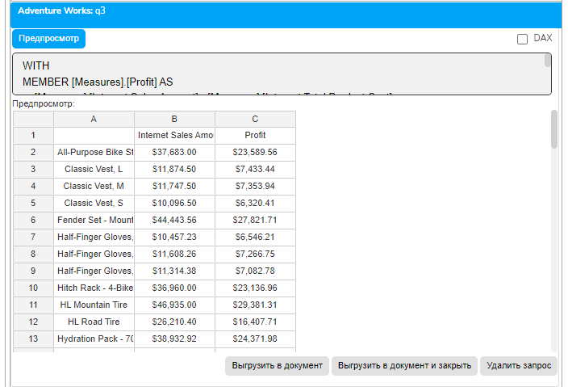

Оптимизация производительности FILTER

Проблемы производительности

## FILTER может быть медленным на больших наборах, так как

Условие вычисляется для каждого элемента

Сложные условия требуют множественных вычислений

Нет автоматической оптимизации порядка проверок

Стратегии оптимизации

## 1. Предварительная фильтрация набора

```mdx
-- ПЛОХО: фильтруем все продукты
SELECT
    [Measures].[Internet Sales Amount] ON COLUMNS,
    FILTER(
        [Product].[Product].[Product].Members,  -- 397 продуктов
        [Measures].[Internet Sales Amount] > 50000
    ) ON ROWS
FROM [Adventure Works]
-- ХОРОШО: сначала берем только нужную категорию
SELECT
    [Measures].[Internet Sales Amount] ON COLUMNS,
    FILTER(
        -- Сначала ограничиваем набор
        Descendants(
            [Product].[Product Categories].[Category].&[1],  -- Bikes
            [Product].[Product Categories].[Product]
        ),
        [Measures].[Internet Sales Amount] > 50000
    ) ON ROWS
FROM [Adventure Works]
```

## 2. Использование EXISTING для контекстной фильтрации

```mdx
WITH
MEMBER [Measures].[Category Avg] AS
    AVG(
        EXISTING [Product].[Product].[Product].Members,
        [Measures].[Internet Sales Amount]
    )
SELECT
    [Measures].[Internet Sales Amount] ON COLUMNS,
    FILTER(
        EXISTING [Product].[Product].[Product].Members,  -- Только продукты в контексте
        [Measures].[Internet Sales Amount] > [Measures].[Category Avg]
    ) ON ROWS
FROM [Adventure Works]
WHERE (
    [Date].[Calendar Year].&[2013],
    [Product].[Category].[Bikes]
)
```

Практические упражнения

Упражнение 1: Комплексная фильтрация с анализом

```mdx
-- Задача: найти топ-продукты по нескольким критериям
WITH
-- Расчетные меры для анализа
MEMBER [Measures].[Profit] AS
    [Measures].[Internet Sales Amount] - [Measures].[Internet Total Product Cost],
    FORMAT_STRING = "Currency"
MEMBER [Measures].[Margin %] AS
    IIF(
        [Measures].[Internet Sales Amount] = 0,
        NULL,
        [Measures].[Profit] / [Measures].[Internet Sales Amount]
    ),
    FORMAT_STRING = "Percent"
MEMBER [Measures].[Avg Order Size] AS
    IIF(
        [Measures].[Internet Order Count] = 0,
        NULL,
        [Measures].[Internet Sales Amount] / [Measures].[Internet Order Count]
    ),
    FORMAT_STRING = "Currency"
-- Средние значения для сравнения
MEMBER [Measures].[Avg Margin All] AS
    AVG(
        [Product].[Product].[Product].Members,
        [Measures].[Margin %]
    ),
    FORMAT_STRING = "Percent"
SELECT
    {[Measures].[Internet Sales Amount],
     [Measures].[Profit],
     [Measures].[Margin %],
     [Measures].[Avg Order Size]} ON COLUMNS,
    FILTER(
        [Product].[Product].[Product].Members,
        -- Комплексное условие: высокие продажи, хорошая маржа, крупные заказы
        [Measures].[Internet Sales Amount] > 20000
        AND [Measures].[Margin %] > 0.4  -- Маржа выше 40%
        AND [Measures].[Avg Order Size] > 1000
        AND NOT IsEmpty([Measures].[Internet Order Count])  -- Исключаем продукты без заказов
    ) ON ROWS
FROM [Adventure Works]
WHERE [Date].[Calendar Year].&[2013]
```

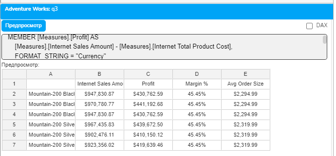

Упражнение 2: Динамическая фильтрация по категориям

```mdx
WITH
-- Среднее по велосипедам (жёстко привязанное к контексту WHERE)
MEMBER [Measures].[Category Avg] AS
    AVG(
        [Product].[Product].[Product].Members,
        ([Measures].[Internet Sales Amount], [Product].[Category].[Bikes])
    ),
    FORMAT_STRING = "Currency"
MEMBER [Measures].[Deviation] AS
    [Measures].[Internet Sales Amount] - [Measures].[Category Avg],
    FORMAT_STRING = "Currency"
SELECT
    {[Measures].[Internet Sales Amount],
     [Measures].[Category Avg],
     [Measures].[Deviation]} ON COLUMNS,
    FILTER(
        [Product].[Product].[Product].Members,
        [Measures].[Internet Sales Amount] > [Measures].[Category Avg]
    ) ON ROWS
FROM [Adventure Works]
WHERE (
    [Date].[Calendar Year].&[2013],
    [Product].[Category].[Bikes]
)
```

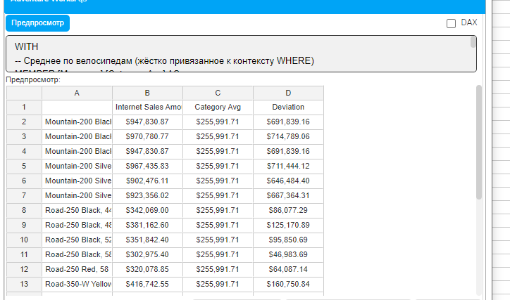

Упражнение 3: Каскадная фильтрация

```mdx
-- Задача: последовательное применение фильтров с промежуточным анализом
WITH
-- Шаг 1: Продукты с продажами
SET [ProductsWithSales] AS
    FILTER(
        [Product].[Product].[Product].Members,
        NOT IsEmpty([Measures].[Internet Sales Amount])
    )
```

-- Шаг 2: Из них - прибыльные

```mdx
SET [ProfitableProducts] AS
    FILTER(
        [ProductsWithSales],
        ([Measures].[Internet Sales Amount] - [Measures].[Internet Total Product Cost]) > 0
    )
```

-- Шаг 3: Из прибыльных - с хорошей маржой

```mdx
SET [HighMarginProducts] AS
    FILTER(
        [ProfitableProducts],
        ([Measures].[Internet Sales Amount] - [Measures].[Internet Total Product Cost]) /
        [Measures].[Internet Sales Amount] > 0.3
    )
-- Статистика по каждому шагу
MEMBER [Measures].[Step1 Count] AS
    COUNT([ProductsWithSales])
MEMBER [Measures].[Step2 Count] AS
    COUNT([ProfitableProducts])
MEMBER [Measures].[Step3 Count] AS
    COUNT([HighMarginProducts])
MEMBER [Measures].[Margin %] AS
    ([Measures].[Internet Sales Amount] - [Measures].[Internet Total Product Cost]) /
    [Measures].[Internet Sales Amount],
    FORMAT_STRING = "Percent"
SELECT
    {[Measures].[Internet Sales Amount],
     [Measures].[Margin %],
     [Measures].[Step1 Count],
     [Measures].[Step2 Count],
     [Measures].[Step3 Count]} ON COLUMNS,
    [HighMarginProducts] ON ROWS
FROM [Adventure Works]
WHERE [Date].[Calendar Year].&[2013]
```

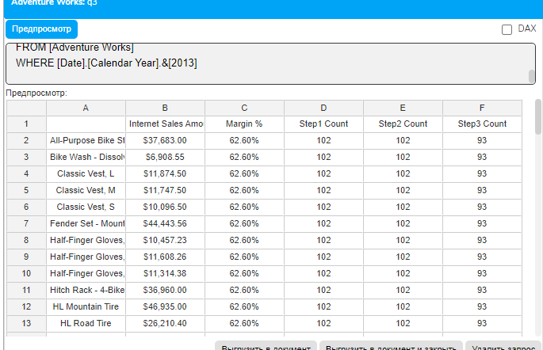

Типичные ошибки и их решение

Ошибка 1: Фильтрация по NULL

```mdx
-- НЕПРАВИЛЬНО: не учитывает NULL
FILTER(
    [Product].[Product].Members,
    [Measures].[Sales] > 1000
)
-- ПРАВИЛЬНО: явная проверка на NULL
FILTER(
    [Product].[Product].Members,
    NOT IsEmpty([Measures].[Sales]) AND [Measures].[Sales] > 1000
)
```

Ошибка 2: Неэффективный порядок условий

```mdx
-- НЕПРАВИЛЬНО: сложное условие проверяется первым
FILTER(
    [Product].[Product].Members,
    AVG([Date].[Month].Members, [Measures].[Sales]) > 1000  -- Дорогое вычисление
    AND NOT IsEmpty([Measures].[Sales])  -- Простая проверка
)
-- ПРАВИЛЬНО: простые проверки первыми
FILTER(
    [Product].[Product].Members,
    NOT IsEmpty([Measures].[Sales])  -- Быстро отсекаем пустые
    AND AVG([Date].[Month].Members, [Measures].[Sales]) > 1000
)
```

Заключение

В этом уроке мы детально изучили функцию FILTER — мощный инструмент для отбора данных в MDX. Мы научились:

Применять простые и сложные условия фильтрации

Использовать свойства членов в условиях

Выполнять относительную фильтрацию по агрегированным значениям

Комбинировать FILTER с другими функциями MDX

Оптимизировать производительность фильтрации

Создавать каскадные фильтры

FILTER — это основа для создания гибких и динамичных отчетов. В отличие от статического WHERE, FILTER позволяет применять разные условия к разным частям запроса и использовать вычисляемые критерии отбора.

В следующих уроках мы изучим, как сортировать и ранжировать отфильтрованные данные, создавая еще более информативные аналитические отчеты.

Домашнее задание

Задание 1: Фильтрация по динамическому порогу

Создайте запрос, который отбирает клиентов с покупками выше 80-го процентиля.

Задание 2: Многоуровневая фильтрация

Реализуйте фильтрацию продуктов по трем критериям с возможностью видеть результат каждого этапа.

Задание 3: Контекстно-зависимая фильтрация

Создайте запрос, где условие фильтрации меняется в зависимости от выбранной категории продукта.

Контрольные вопросы

В чем основное отличие FILTER от WHERE?

Как работает CurrentMember в контексте FILTER?

Почему важен порядок условий при использовании логических операторов?

Как FILTER взаимодействует с NON EMPTY?

Какие стратегии оптимизации применимы к FILTER?

Можно ли использовать расчетные меры в условиях FILTER?

Как правильно обрабатывать NULL значения при фильтрации?
