# Урок 4.2: Сортировка наборов

Введение: Важность упорядочивания данных в бизнес-анализе

Представьте, что вы открываете отчет о продажах, где продукты расположены хаотично — ни по алфавиту, ни по объему продаж, ни по какому-либо другому логическому принципу. Найти нужную информацию становится практически невозможно. Именно поэтому сортировка является фундаментальной операцией в аналитике данных.

В MDX сортировка работает иначе, чем в традиционных реляционных базах данных. Мы работаем не с плоскими таблицами, а с многомерными структурами, где каждый элемент может быть частью сложной иерархии. Это открывает уникальные возможности, но также создает специфические вызовы.

Основы сортировки в MDX

Функция ORDER — главный инструмент упорядочивания

## В MDX для сортировки используется функция ORDER. Её структура интуитивно понятна

Haxe

```mdx
ORDER(что_сортируем, по_чему_сортируем, как_сортируем)
```

## Более формально

Первый параметр — набор элементов, который нужно упорядочить

Второй параметр — выражение, определяющее критерий сортировки

Третий параметр — направление и тип сортировки

Типы сортировки: сохранение против разрушения иерархии

## MDX предоставляет четыре варианта сортировки

ASC (Ascending) — возрастающий порядок с учетом иерархии

DESC (Descending) — убывающий порядок с учетом иерархии

BASC (Break Ascending) — возрастающий порядок, игнорируя иерархию

BDESC (Break Descending) — убывающий порядок, игнорируя иерархию

Буква "B" означает "Break" — разрушение иерархической структуры. Это критическое отличие, которое определяет, будут ли дочерние элементы оставаться под своими родителями или сортироваться глобально.

Механизм работы сортировки

## Когда MDX выполняет сортировку

Оценивает выражение сортировки для каждого элемента набора

Создает упорядоченный список на основе полученных значений

Применяет указанное направление сортировки

Учитывает иерархические связи (если не указан флаг B)

Сортировка по числовым мерам

Простейший случай: упорядочивание по продажам

## Начнем с базового примера — отсортируем субкатегории продуктов по объему интернет-продаж

```mdx
SELECT
    [Measures].[Internet Sales Amount] ON COLUMNS,
    ORDER(
        [Product].[Subcategory].[Subcategory].Members,  -- Что сортируем
        [Measures].[Internet Sales Amount],              -- По чему сортируем
```

        DESC                                              -- Как сортируем

```mdx
    ) ON ROWS
FROM [Adventure Works]
WHERE [Date].[Calendar Year].&[2013]
```

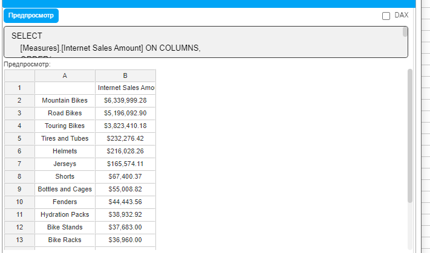

## Этот запрос

Берет все элементы уровня Subcategory

Вычисляет для каждого значение Internet Sales Amount

Располагает их от большего к меньшему

Комбинирование фильтрации и сортировки

## Часто требуется сначала отобрать релевантные данные, затем их упорядочить

```mdx
WITH
-- Определяем минимальный порог продаж
MEMBER [Measures].[Sales Threshold] AS 100000
SELECT
    {[Measures].[Internet Sales Amount],
     [Measures].[Internet Order Count]} ON COLUMNS,
    ORDER(
        -- Сначала фильтруем элементы выше порога
        FILTER(
            [Product].[Subcategory].[Subcategory].Members,
            [Measures].[Internet Sales Amount] > [Measures].[Sales Threshold]
        ),
        [Measures].[Internet Order Count],  -- Сортируем по количеству заказов
        DESC
    ) ON ROWS
FROM [Adventure Works]
WHERE [Date].[Calendar Year].&[2013]
```

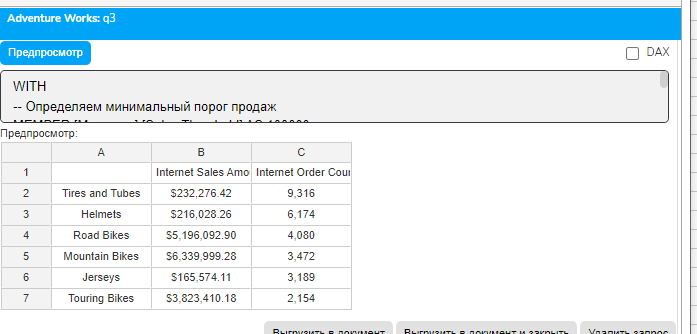

Работа с NULL значениями в сортировке

## NULL значения требуют особого внимания

```mdx
WITH
-- Рассчитываем рентабельность
MEMBER [Measures].[ROI] AS
    IIF(
        [Measures].[Internet Total Product Cost] = 0,
        NULL,
        ([Measures].[Internet Sales Amount] - [Measures].[Internet Total Product Cost]) /
        [Measures].[Internet Total Product Cost]
    ),
    FORMAT_STRING = "Percent"
-- Прибыль
MEMBER [Measures].[Profit] AS
    [Measures].[Internet Sales Amount] - [Measures].[Internet Total Product Cost],
    FORMAT_STRING = "Currency"
SELECT
    {[Measures].[Internet Sales Amount],
     [Measures].[Internet Total Product Cost],
     [Measures].[Profit],
     [Measures].[ROI]} ON COLUMNS,
    ORDER(
        [Product].[Product].[Product].Members,
        [Measures].[ROI],
        BDESC
    ) ON ROWS
FROM [Adventure Works]
WHERE [Date].[Calendar Year].&[2013]
```

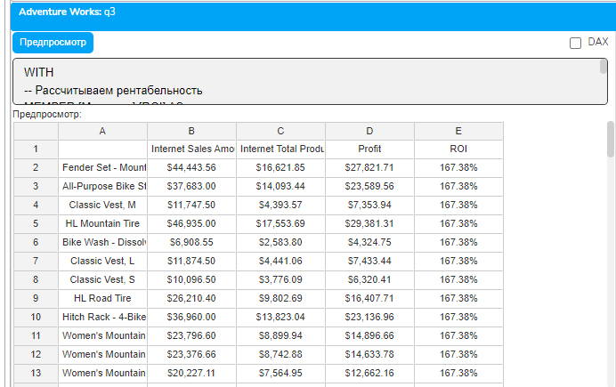

Иерархическая сортировка

Сохранение структуры при сортировке

## Рассмотрим, как работает сортировка с сохранением иерархии

```mdx
WITH
SET [AllLevels] AS
    [Product].[Category].[Category].Members +
    [Product].[Product].[Product].Members
SELECT
    [Measures].[Internet Sales Amount] ON COLUMNS,
    ORDER(
        [AllLevels],
        [Measures].[Internet Sales Amount],
        BDESC
    ) ON ROWS
FROM [Adventure Works]
WHERE [Date].[Calendar Year].&[2013]
```

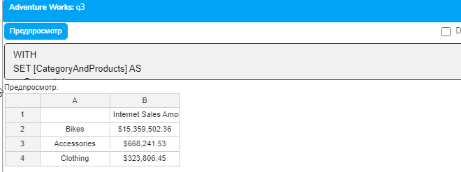

Глобальная сортировка с разрушением иерархии

## Теперь применим BDESC для полной пересортировки

```mdx
WITH SET [AllLevels] AS
    [Product].[Category].[Category].Members +
    [Product].[Subcategory].[Subcategory].Members
SELECT
    {[Measures].[Internet Sales Amount],
     [Product].[Product Categories].CurrentMember.Level.Name} ON COLUMNS,
    ORDER(
        [AllLevels],
        [Measures].[Internet Sales Amount],
```

        BDESC  -- Все элементы сортируются независимо от иерархии

```mdx
    ) ON ROWS
FROM [Adventure Works]
WHERE [Date].[Calendar Year].&[2013]
```

Сортировка внутри каждой группы

## Для локальной сортировки внутри групп

```mdx
WITH
-- Для каждой страны создаем отсортированный список регионов
SET [SortedByCountry] AS
    Generate(
        [Customer].[Country].[Country].Members,
        {[Customer].[Country].CurrentMember} +
        ORDER(
            Filter(
                [Customer].[State-Province].[State-Province].Members,
                [Customer].[State-Province].CurrentMember.Parent =
                [Customer].[Country].CurrentMember
            ),
            [Measures].[Internet Sales Amount],
            DESC
        )
    )
SELECT
    [Measures].[Internet Sales Amount] ON COLUMNS,
    [SortedByCountry] ON ROWS
FROM [Adventure Works]
WHERE [Date].[Calendar Year].&[2013]
```

Сортировка по вычисляемым критериям

Использование расчетных мер для упорядочивания

## Создадим комплексный критерий сортировки

```mdx
WITH
-- Базовые метрики
MEMBER [Measures].[Units Sold] AS
    [Measures].[Order Quantity]
MEMBER [Measures].[Revenue] AS
    [Measures].[Internet Sales Amount]
-- Средняя стоимость единицы (переименовали)
MEMBER [Measures].[Avg Unit Price] AS
    IIF(
        [Measures].[Units Sold] = 0,
        0,
        [Measures].[Revenue] / [Measures].[Units Sold]
    ),
    FORMAT_STRING = "Currency"
-- Комплексный индекс привлекательности
MEMBER [Measures].[Attractiveness Score] AS
    -- Учитываем объем, цену и частоту покупок
    [Measures].[Revenue] * 0.5 +
    [Measures].[Avg Unit Price] * 100 * 0.3 +
    [Measures].[Internet Order Count] * 50 * 0.2,
    FORMAT_STRING = "#,##0"
SELECT
    {[Measures].[Revenue],
     [Measures].[Avg Unit Price],
     [Measures].[Internet Order Count],
     [Measures].[Attractiveness Score]} ON COLUMNS,
    ORDER(
        [Product].[Category].Members,
        [Measures].[Attractiveness Score],
        BDESC
    ) ON ROWS
FROM [Adventure Works]
WHERE [Date].[Calendar Year].&[2013]
```

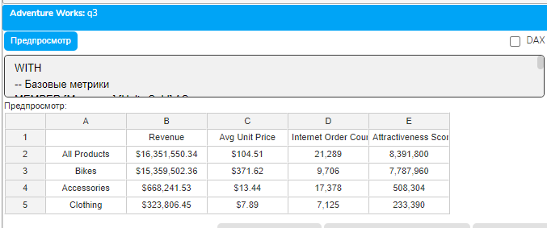

Относительная сортировка

## Упорядочивание по отклонению от среднего

```mdx
WITH
-- Среднее значение по всем элементам
MEMBER [Measures].[Global Average] AS
    AVG(
        [Product].[Category].Members,
        [Measures].[Internet Sales Amount]
    ),
    FORMAT_STRING = "Currency"
-- Отклонение от среднего в процентах
MEMBER [Measures].[Variance %] AS
    IIF(
        [Measures].[Global Average] = 0,
        0,
        ([Measures].[Internet Sales Amount] - [Measures].[Global Average]) /
        [Measures].[Global Average] * 100
    ),
    FORMAT_STRING = "#,##0.00"
-- Категоризация
MEMBER [Measures].[Performance Category] AS
    CASE
        WHEN [Measures].[Variance %] > 100 THEN "Outstanding"
        WHEN [Measures].[Variance %] > 0 THEN "Above Average"
        WHEN [Measures].[Variance %] > -50 THEN "Below Average"
        ELSE "Poor"
    END
SELECT
    {[Measures].[Internet Sales Amount],
     [Measures].[Global Average],
     [Measures].[Variance %],
     [Measures].[Performance Category]} ON COLUMNS,
    ORDER(
        [Product].[Category].Members,
        [Measures].[Variance %],
        BDESC
    ) ON ROWS
FROM [Adventure Works]
WHERE [Date].[Calendar Year].&[2013]
```

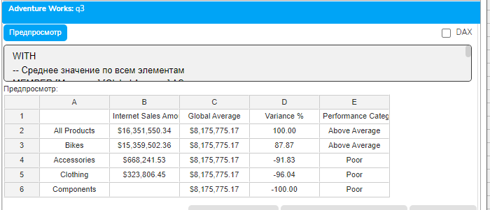

Сортировка по атрибутам элементов

Алфавитное упорядочивание

## Сортировка по названию элемента

```mdx
SELECT
    {[Measures].[Internet Sales Amount],
     [Measures].[Internet Order Count]} ON COLUMNS,
    ORDER(
        [Customer].[City].[City].Members,
        [Customer].[City].CurrentMember.Name,
        ASC
    ) ON ROWS
FROM [Adventure Works]
WHERE (
    [Date].[Calendar Year].&[2013],
    [Customer].[Country].&[United States]
)
```

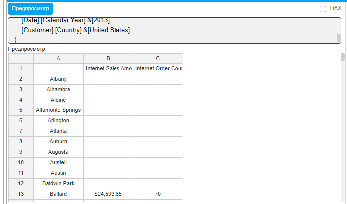

Сортировка по свойствам членов

## Использование дополнительных атрибутов

```mdx
WITH
-- Получаем уникальный ключ элемента
MEMBER [Measures].[Member Key] AS
    [Product].[Product].CurrentMember.UniqueName
-- Получаем уровень в иерархии
MEMBER [Measures].[Hierarchy Level] AS
    [Product].[Product Categories].CurrentMember.Level.Ordinal
SELECT
    {[Measures].[Internet Sales Amount],
     [Measures].[Member Key],
     [Measures].[Hierarchy Level]} ON COLUMNS,
    ORDER(
        Descendants(
            [Product].[Product Categories].[All Products],
            3,
            SELF_AND_BEFORE
        ),
        [Measures].[Hierarchy Level],  -- Сортируем по уровню иерархии
        ASC
    ) ON ROWS
FROM [Adventure Works]
WHERE [Date].[Calendar Year].&[2013]
```

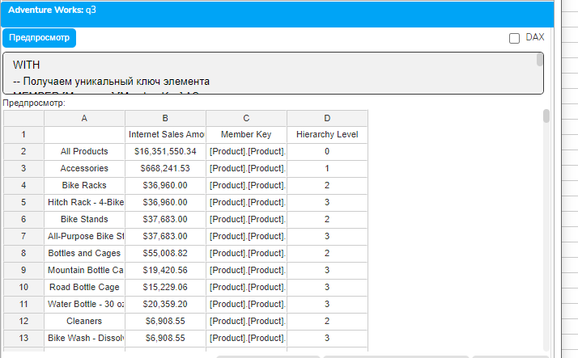

Продвинутые техники сортировки

Многоступенчатая сортировка

## Реализация сортировки по нескольким критериям

```mdx
WITH
-- Первичный критерий: категория продукта
MEMBER [Measures].[Primary Sort] AS
    CASE [Product].[Category].CurrentMember.Name
```

        WHEN "Bikes" THEN 1

        WHEN "Components" THEN 2

        WHEN "Clothing" THEN 3

        WHEN "Accessories" THEN 4

        ELSE 5

```mdx
    END
-- Вторичный критерий: продажи (инвертируем для DESC внутри категории)
MEMBER [Measures].[Secondary Sort] AS
    -[Measures].[Internet Sales Amount]
-- Объединенный критерий
MEMBER [Measures].[Combined Sort] AS
    [Measures].[Primary Sort] * 100000000 +
    [Measures].[Secondary Sort]
-- Название категории для отображения
MEMBER [Measures].[Category Name] AS
    [Product].[Category].CurrentMember.Name
SELECT
    {[Measures].[Internet Sales Amount],
     [Measures].[Category Name],
     [Measures].[Primary Sort]} ON COLUMNS,
    ORDER(
        CrossJoin(
            [Product].[Category].[Category].Members,
            [Product].[Product].[Product].Members
        ),
        [Measures].[Combined Sort],
        ASC
    ) ON ROWS
FROM [Adventure Works]
WHERE [Date].[Calendar Year].&[2013]
```

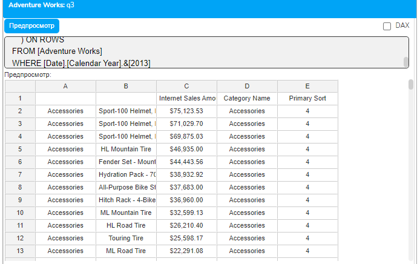

Условная сортировка

## Изменение направления в зависимости от условий

```mdx
WITH
-- Определяем прибыль
MEMBER [Measures].[Profit] AS
    [Measures].[Internet Sales Amount] - [Measures].[Internet Total Product Cost],
    FORMAT_STRING = "Currency"
-- Флаг прибыльности
MEMBER [Measures].[Is Profitable] AS
    IIF([Measures].[Profit] > 0, 1, 0)
-- Критерий сортировки с условной логикой
MEMBER [Measures].[Smart Sort] AS
    IIF(
        [Measures].[Is Profitable] = 1,
        [Measures].[Profit],
        [Measures].[Internet Sales Amount] * -1
    )
SELECT
    {[Measures].[Internet Sales Amount],
     [Measures].[Profit],
     [Measures].[Is Profitable]} ON COLUMNS,
    ORDER(
        [Product].[Product].[Product].Members,
        [Measures].[Smart Sort],
        BDESC
    ) ON ROWS
FROM [Adventure Works]
WHERE [Date].[Calendar Year].&[2013]
```

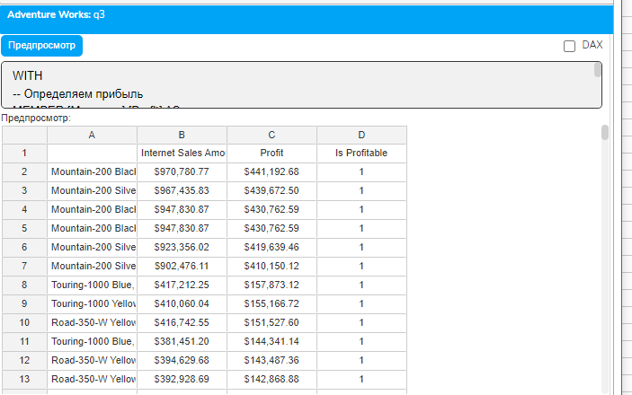

Практические примеры

Пример 1: Топ-N анализ с детализацией

```mdx
WITH
-- Находим топ-5 категорий
SET [Top5Categories] AS
    HEAD(
        ORDER(
            [Product].[Category].[Category].Members,
            [Measures].[Internet Sales Amount],
            BDESC
        ),
        5
    )
-- Для каждой топ-категории берем топ-3 продукта
SET [DetailedTop] AS
    GENERATE(
        [Top5Categories],
        {[Product].[Category].CurrentMember} +
        HEAD(
            ORDER(
                [Product].[Category].CurrentMember.Children,
                [Measures].[Internet Sales Amount],
                BDESC
            ),
            3
        )
    )
-- Добавляем ранги
MEMBER [Measures].[Category Rank] AS
    RANK(
        [Product].[Category].CurrentMember,
        [Top5Categories]
    )
MEMBER [Measures].[Product Rank in Category] AS
    IIF(
        [Product].[Product].CurrentMember.Level.Ordinal = 0,
        NULL,
        RANK(
            [Product].[Product].CurrentMember,
            ORDER(
                [Product].[Category].CurrentMember.Children,
                [Measures].[Internet Sales Amount],
                BDESC
            )
        )
    )
SELECT
    {[Measures].[Internet Sales Amount],
     [Measures].[Category Rank],
     [Measures].[Product Rank in Category]} ON COLUMNS,
    [DetailedTop] ON ROWS
FROM [Adventure Works]
WHERE [Date].[Calendar Year].&[2013]
```

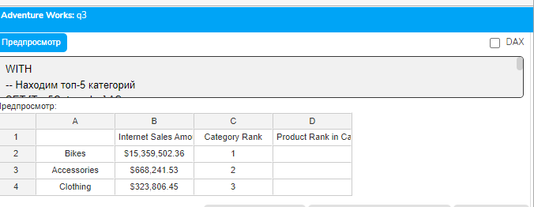

Пример 2: Парето-анализ (правило 80/20)

```mdx
WITH
-- Сортируем продукты по продажам (БЕЗ NON EMPTY)
SET [SortedProducts] AS
    ORDER(
        FILTER(
            [Product].[Product].[Product].Members,
            [Measures].[Internet Sales Amount] > 0
        ),
        [Measures].[Internet Sales Amount],
        BDESC
    )
-- Общая сумма
MEMBER [Measures].[Total Revenue] AS
    SUM([SortedProducts], [Measures].[Internet Sales Amount]),
    FORMAT_STRING = "Currency"
-- Накопительная сумма
MEMBER [Measures].[Running Total] AS
    SUM(
        HEAD(
            [SortedProducts],
            RANK([Product].[Product].CurrentMember, [SortedProducts])
        ),
        [Measures].[Internet Sales Amount]
    ),
    FORMAT_STRING = "Currency"
-- Накопительный процент
MEMBER [Measures].[Running %] AS
    IIF(
        [Measures].[Total Revenue] = 0,
        NULL,
        [Measures].[Running Total] / [Measures].[Total Revenue]
    ),
    FORMAT_STRING = "Percent"
-- Определяем группу Парето
MEMBER [Measures].[Pareto Group] AS
    IIF(
        [Measures].[Running %] <= 0.8,
        "A - Vital Few (80%)",
        "B - Trivial Many (20%)"
    )
-- Ранг продукта
MEMBER [Measures].[Product Rank] AS
    RANK([Product].[Product].CurrentMember, [SortedProducts])
SELECT
    {[Measures].[Product Rank],
     [Measures].[Internet Sales Amount],
     [Measures].[Running Total],
     [Measures].[Running %],
     [Measures].[Pareto Group]} ON COLUMNS,
    HEAD([SortedProducts], 50) ON ROWS
FROM [Adventure Works]
WHERE [Date].[Calendar Year].&[2013]
```

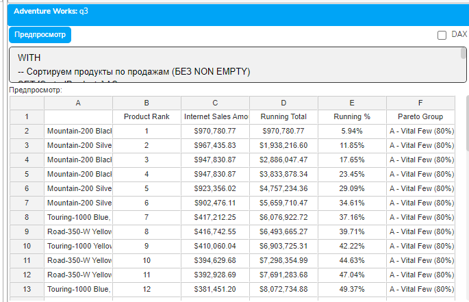

Пример 3: Динамическая сортировка с переключением

```mdx
WITH
-- Параметр для выбора критерия (меняйте это значение: 1, 2 или 3)
MEMBER [Measures].[Sort Mode] AS 2  -- 1=Sales, 2=Margin, 3=Volume
-- Расчет маржи
MEMBER [Measures].[Margin %] AS
    IIF(
        [Measures].[Internet Sales Amount] = 0,
        0,
        ([Measures].[Internet Sales Amount] - [Measures].[Internet Total Product Cost]) /
        [Measures].[Internet Sales Amount]
    ),
    FORMAT_STRING = "Percent"
-- Универсальный критерий сортировки
MEMBER [Measures].[Dynamic Sort Value] AS
    CASE [Measures].[Sort Mode]
        WHEN 1 THEN [Measures].[Internet Sales Amount]
        WHEN 2 THEN [Measures].[Margin %] * 1000000
        WHEN 3 THEN [Measures].[Order Quantity]
        ELSE [Measures].[Internet Sales Amount]
    END
-- Название текущего критерия
MEMBER [Measures].[Sort Criteria Name] AS
    CASE [Measures].[Sort Mode]
```

        WHEN 1 THEN "Revenue"

        WHEN 2 THEN "Margin %"

        WHEN 3 THEN "Volume"

        ELSE "Default"

```mdx
    END
SELECT
    {[Measures].[Internet Sales Amount],
     [Measures].[Margin %],
     [Measures].[Order Quantity],
     [Measures].[Sort Criteria Name]} ON COLUMNS,
    ORDER(
        [Product].[Category].Members,
        [Measures].[Dynamic Sort Value],
        BDESC
    ) ON ROWS
FROM [Adventure Works]
WHERE [Date].[Calendar Year].&[2013]
```

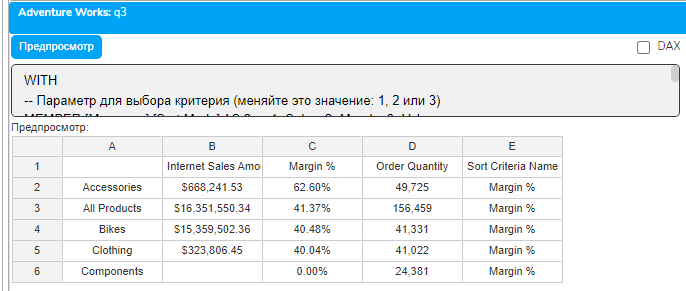

Оптимизация производительности

Ключевые принципы эффективной сортировки

## 1. Минимизация набора перед сортировкой

```mdx
-- НЕЭФФЕКТИВНО: сортировка всех элементов
WITH SET [AllSorted] AS
    ORDER(
        [Customer].[Customer].[Customer].Members,  -- 18,484 клиента!
        [Measures].[Internet Sales Amount],
        DESC
    )
-- ЭФФЕКТИВНО: фильтрация перед сортировкой
WITH SET [FilteredSorted] AS
    ORDER(
        NON EMPTY
            FILTER(
                [Customer].[Customer].[Customer].Members,
                [Measures].[Internet Sales Amount] > 1000
            ),
        [Measures].[Internet Sales Amount],
        DESC
    )
SELECT
    [Measures].[Internet Sales Amount] ON COLUMNS,
    Head([FilteredSorted], 100) ON ROWS
FROM [Adventure Works]
```

## 2. Кэширование отсортированных наборов

```mdx
WITH
-- Создаем и кэшируем отсортированный набор один раз
SET [CachedSorted] AS
    ORDER(
        NON EMPTY [Product].[Product].[Product].Members,
        [Measures].[Internet Sales Amount],
        DESC
    )
-- Используем кэшированный набор многократно
MEMBER [Measures].[Position] AS
    Rank([Product].[Product].CurrentMember, [CachedSorted])
MEMBER [Measures].[In Top 10] AS
    IIF([Measures].[Position] <= 10, "Yes", "No")
MEMBER [Measures].[Percentile] AS
    ([Measures].[Position] - 1) / (COUNT([CachedSorted]) - 1) * 100,
    FORMAT_STRING = "#,##0.00"
SELECT
    {[Measures].[Internet Sales Amount],
     [Measures].[Position],
     [Measures].[In Top 10],
     [Measures].[Percentile]} ON COLUMNS,
    [CachedSorted] ON ROWS
FROM [Adventure Works]
WHERE [Date].[Calendar Year].&[2013]
```

Распространенные ошибки

Ошибка 1: Сортировка с NULL в критерии

```mdx
-- ПРОБЛЕМА: NULL нарушает порядок
ORDER(
    [Product].[Product].Members,
    [Measures].[Some Ratio],  -- Может содержать NULL
    DESC
)
-- РЕШЕНИЕ: Обработка NULL
ORDER(
    [Product].[Product].Members,
    IIF(
        IsEmpty([Measures].[Some Ratio]),
        -999999,  -- Явное значение для NULL
        [Measures].[Some Ratio]
    ),
    DESC
)
```

Ошибка 2: Избыточная вложенность ORDER

```mdx
-- ПРОБЛЕМА: Множественные ORDER неэффективны
ORDER(
    ORDER(
        ORDER(
            [Product].[Product].Members,
            [Measures].[Sales],
            DESC
        ),
        [Measures].[Profit],
        DESC
    ),
    [Measures].[Quantity],
    DESC
)
-- РЕШЕНИЕ: Комбинированный критерий
WITH MEMBER [Measures].[Combined] AS
    [Measures].[Sales] * 1000000 +
    [Measures].[Profit] * 1000 +
    [Measures].[Quantity]
SELECT * FROM [Adventure Works]
ORDER(
    [Product].[Product].Members,
    [Measures].[Combined],
    DESC
)
```

Заключение

Сортировка в MDX — это мощный инструмент, который выходит далеко за рамки простого упорядочивания. Мы изучили:

Различные режимы сортировки и их влияние на иерархии

Работу с NULL значениями и специальными случаями

Создание сложных критериев сортировки

Комбинирование сортировки с фильтрацией

Техники оптимизации для больших наборов данных

Реализацию многоуровневой и условной сортировки

Правильное применение сортировки превращает сырые данные в информативные отчеты, где важная информация всегда на виду, тренды очевидны, а аномалии легко обнаружить.

Домашнее задание

Задание 1: Иерархическая сортировка

Создайте отчет, где страны отсортированы по общим продажам, а внутри каждой страны регионы отсортированы по средней сумме заказа.

Задание 2: Адаптивная сортировка

Реализуйте запрос, который автоматически меняет критерий сортировки в зависимости от выбранного измерения (продукты сортируются по марже, клиенты — по частоте покупок).

Задание 3: Комплексный ABC-анализ

Создайте полноценный ABC-анализ с автоматическим определением границ групп и подсчетом статистики по каждой группе.

Контрольные вопросы

Когда следует использовать BDESC вместо DESC?

Как эффективно обрабатывать NULL при сортировке?

Можно ли реализовать сортировку по нескольким критериям одновременно?

Как оптимизировать сортировку очень больших наборов?

В чем преимущество кэширования отсортированных наборов?

Как реализовать условную сортировку с разными направлениями?

Какие функции часто используются совместно с ORDER?
