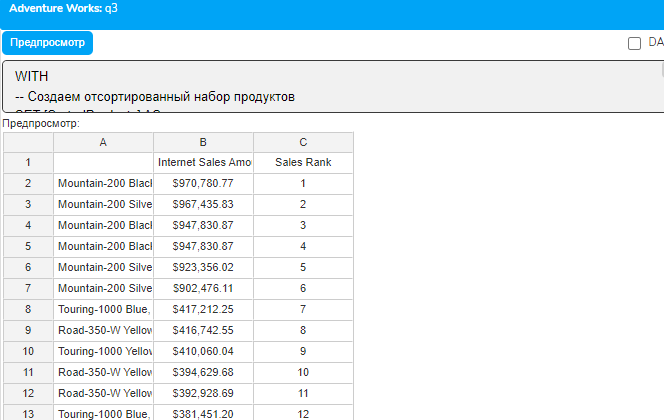
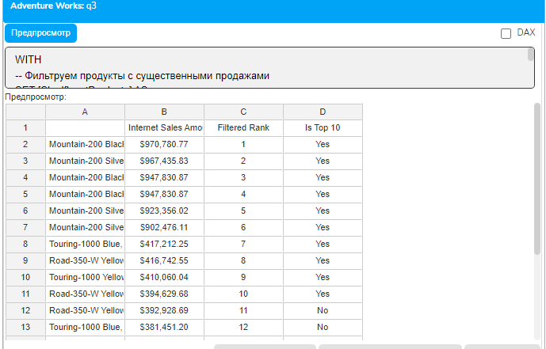
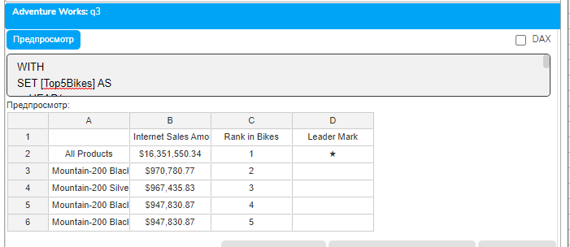
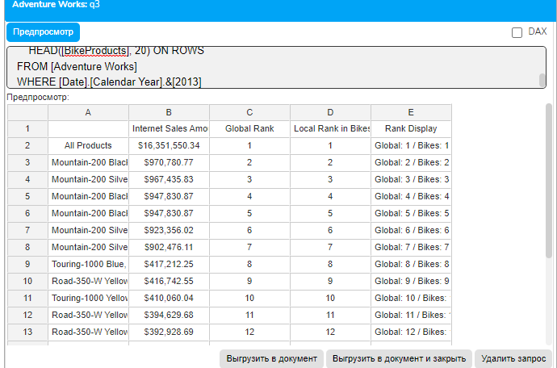
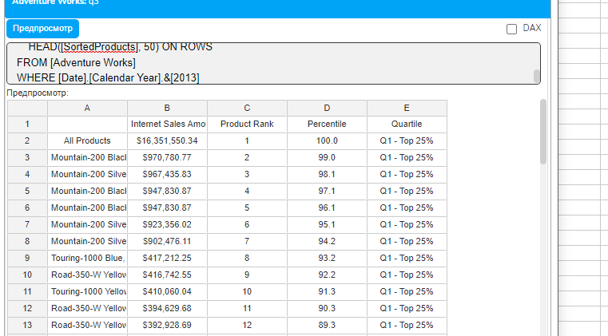
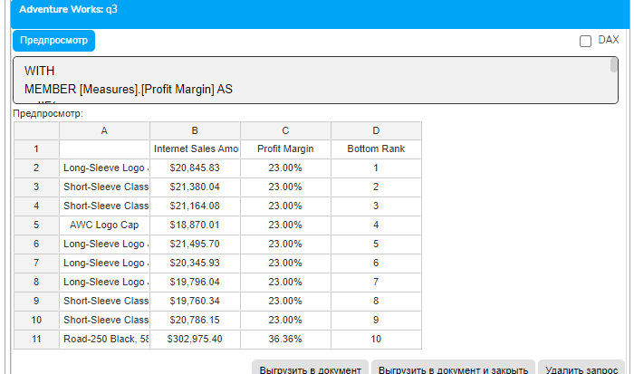
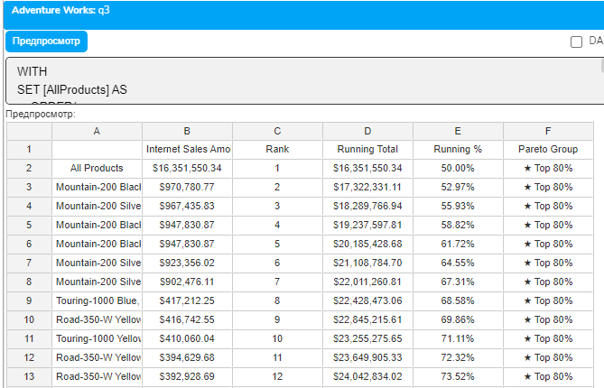
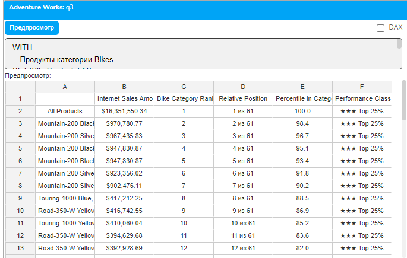
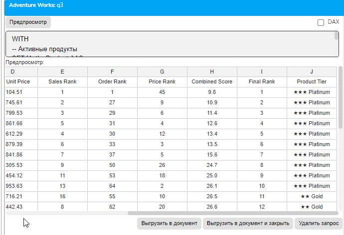
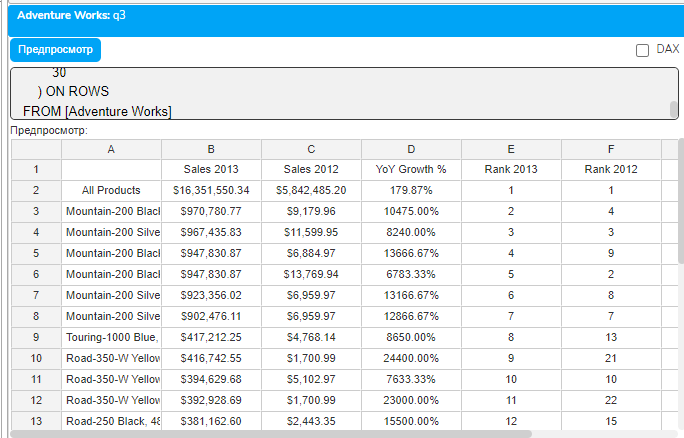

# Урок 4.3: Ранжирование данных

Введение: Зачем нужно ранжирование в аналитике

После изучения фильтрации и сортировки мы переходим к ранжированию — мощному инструменту для определения позиции элементов в упорядоченном наборе. Ранжирование отвечает на вопросы: "Какое место занимает этот продукт по продажам?", "Входит ли клиент в топ-10?", "Какой процентиль занимает регион по прибыли?".

В отличие от простой сортировки, которая упорядочивает элементы, ранжирование присваивает каждому элементу числовую позицию. Это критически важно для создания рейтингов, выявления лидеров и аутсайдеров, а также для сравнительного анализа.

Теоретические основы ранжирования

Функция RANK и её синтаксис

## Основная функция для ранжирования в MDX — это RANK. Её синтаксис

```mdx
RANK(элемент, набор [, выражение_сортировки])
```

## Где

элемент — член, для которого определяется ранг

набор — упорядоченный набор для ранжирования

выражение_сортировки — необязательный параметр для определения критерия

Важная особенность: если третий параметр не указан, RANK использует текущий порядок элементов в наборе. Если указан — сначала выполняется сортировка, затем определяется позиция.

Типы ранжирования

## В аналитике существует несколько подходов к ранжированию

Плотное ранжирование — одинаковые значения получают одинаковый ранг, следующий ранг идет по порядку

Стандартное ранжирование — одинаковые значения получают одинаковый ранг, но следующий ранг пропускает позиции

Уникальное ранжирование — каждый элемент получает уникальный ранг

MDX по умолчанию использует уникальное ранжирование на основе позиции в наборе.

Взаимосвязь ранжирования с сортировкой

## Ранжирование тесно связано с сортировкой. Обычный подход

Создаем отсортированный набор с помощью ORDER

Применяем RANK к этому набору

Используем ранг для анализа или фильтрации

Базовое ранжирование

Простейший пример ранжирования

## Начнем с определения рангов продуктов по продажам

```mdx
WITH
-- Создаем отсортированный набор продуктов
SET [SortedProducts] AS
    ORDER(
        [Product].[Product].[Product].Members,
        [Measures].[Internet Sales Amount],
```

        DESC  -- Сортируем по убыванию продаж

```mdx
    )
-- Создаем меру для отображения ранга
MEMBER [Measures].[Sales Rank] AS
    RANK(
        [Product].[Product].CurrentMember,  -- Текущий продукт
        [SortedProducts]                    -- В отсортированном наборе
    )
SELECT
    {[Measures].[Internet Sales Amount],
     [Measures].[Sales Rank]} ON COLUMNS,
    NON EMPTY [SortedProducts] ON ROWS
FROM [Adventure Works]
WHERE [Date].[Calendar Year].&[2013]
```



## Разберем этот код подробно

```mdx
SET [SortedProducts] создает именованный набор отсортированных продуктов
MEMBER [Measures].[Sales Rank] создает расчетную меру для ранга
```

CurrentMember указывает на текущий элемент в контексте вычисления

RANK возвращает позицию элемента в отсортированном наборе

Ранжирование с фильтрацией

## Часто нужно ранжировать только релевантные элементы

```mdx
WITH
-- Фильтруем продукты с существенными продажами
SET [SignificantProducts] AS
    FILTER(
        [Product].[Product].[Product].Members,
        [Measures].[Internet Sales Amount] > 10000
    )
-- Сортируем отфильтрованный набор
SET [RankedProducts] AS
    ORDER(
        [SignificantProducts],
        [Measures].[Internet Sales Amount],
        DESC
    )
-- Вычисляем ранг
MEMBER [Measures].[Filtered Rank] AS
    RANK(
        [Product].[Product].CurrentMember,
        [RankedProducts]
    )
-- Добавляем индикатор топ-10
MEMBER [Measures].[Is Top 10] AS
    IIF(
        [Measures].[Filtered Rank] <= 10 AND [Measures].[Filtered Rank] > 0,
        "Yes",
        "No"
    )
SELECT
    {[Measures].[Internet Sales Amount],
     [Measures].[Filtered Rank],
     [Measures].[Is Top 10]} ON COLUMNS,
    HEAD([RankedProducts], 20) ON ROWS  -- Показываем топ-20
FROM [Adventure Works]
WHERE [Date].[Calendar Year].&[2013]
```



Ранжирование в группах

Локальное ранжирование внутри категорий

## Определим ранг продукта внутри его категории

```mdx
WITH
SET [Top5Bikes] AS
    HEAD(
        ORDER(
            FILTER(
                [Product].[Product].Members,
                ([Product].[Category].[Bikes], [Measures].[Internet Sales Amount]) > 0
            ),
            [Measures].[Internet Sales Amount],
            BDESC
        ),
        5
    )
MEMBER [Measures].[Rank in Bikes] AS
    RANK([Product].[Product].CurrentMember, [Top5Bikes])
MEMBER [Measures].[Leader Mark] AS
    IIF([Measures].[Rank in Bikes] = 1, "★", "")
SELECT
    {[Measures].[Internet Sales Amount],
     [Measures].[Rank in Bikes],
     [Measures].[Leader Mark]} ON COLUMNS,
    [Top5Bikes] ON ROWS
FROM [Adventure Works]
WHERE [Date].[Calendar Year].&[2013]
```



Многоуровневое ранжирование

## Создадим систему с глобальным и локальным рангами

```mdx
WITH
-- Глобальный отсортированный набор всех продуктов
SET [AllProducts] AS
    ORDER(
        FILTER(
            [Product].[Product].Members,
            [Measures].[Internet Sales Amount] > 0
        ),
        [Measures].[Internet Sales Amount],
        BDESC
    )
-- Продукты категории Bikes
SET [BikeProducts] AS
    ORDER(
        FILTER(
            [Product].[Product].Members,
            ([Product].[Category].[Bikes], [Measures].[Internet Sales Amount]) > 0
        ),
        [Measures].[Internet Sales Amount],
        BDESC
    )
-- Глобальный ранг среди всех продуктов
MEMBER [Measures].[Global Rank] AS
    RANK([Product].[Product].CurrentMember, [AllProducts])
-- Локальный ранг внутри Bikes
MEMBER [Measures].[Local Rank in Bikes] AS
    IIF(
        RANK([Product].[Product].CurrentMember, [BikeProducts]) > 0,
        RANK([Product].[Product].CurrentMember, [BikeProducts]),
        NULL
    )
-- Комбинированный показатель
MEMBER [Measures].[Rank Display] AS
    IIF(
        [Measures].[Local Rank in Bikes] > 0,
        "Global: " + CSTR([Measures].[Global Rank]) + " / Bikes: " + CSTR([Measures].[Local Rank in Bikes]),
        "Global: " + CSTR([Measures].[Global Rank])
    )
SELECT
    {[Measures].[Internet Sales Amount],
     [Measures].[Global Rank],
     [Measures].[Local Rank in Bikes],
     [Measures].[Rank Display]} ON COLUMNS,
    HEAD([BikeProducts], 20) ON ROWS
FROM [Adventure Works]
WHERE [Date].[Calendar Year].&[2013]
```



Процентильное ранжирование - Вычисление процентилей

```mdx
WITH
SET [SortedProducts] AS
    ORDER(
        FILTER(
            [Product].[Product].Members,
            [Measures].[Internet Sales Amount] > 0
        ),
        [Measures].[Internet Sales Amount],
        BDESC
    )
MEMBER [Measures].[Total Products] AS
    COUNT([SortedProducts])
MEMBER [Measures].[Product Rank] AS
    RANK([Product].[Product].CurrentMember, [SortedProducts])
MEMBER [Measures].[Percentile] AS
    IIF(
        [Measures].[Total Products] = 0,
        NULL,
        ((1 - ([Measures].[Product Rank] - 1) / [Measures].[Total Products]) * 100)
    ),
    FORMAT_STRING = "#,##0.0"
MEMBER [Measures].[Quartile] AS
    CASE
        WHEN [Measures].[Percentile] >= 75 THEN "Q1 - Top 25%"
        WHEN [Measures].[Percentile] >= 50 THEN "Q2 - 25-50%"
        WHEN [Measures].[Percentile] >= 25 THEN "Q3 - 50-75%"
```

        ELSE "Q4 - Bottom 25%"

```mdx
    END
SELECT
    {[Measures].[Internet Sales Amount],
     [Measures].[Product Rank],
     [Measures].[Percentile],
     [Measures].[Quartile]} ON COLUMNS,
    HEAD([SortedProducts], 50) ON ROWS
FROM [Adventure Works]
WHERE [Date].[Calendar Year].&[2013]
```



BottomCount для анализа аутсайдеров

```mdx
WITH
MEMBER [Measures].[Profit Margin] AS
    IIF(
        [Measures].[Internet Sales Amount] = 0,
        NULL,
        ([Measures].[Internet Sales Amount] - [Measures].[Internet Total Product Cost]) /
        [Measures].[Internet Sales Amount]
    ),
    FORMAT_STRING = "Percent"
SET [Bottom10Products] AS
    BOTTOMCOUNT(
        FILTER(
            [Product].[Product].Members,
            [Measures].[Internet Sales Amount] > 0
        ),
        10,
        [Measures].[Profit Margin]
    )
MEMBER [Measures].[Bottom Rank] AS
    RANK(
        [Product].[Product].CurrentMember,
        ORDER([Bottom10Products], [Measures].[Profit Margin], ASC)
    )
SELECT
    {[Measures].[Internet Sales Amount],
     [Measures].[Profit Margin],
     [Measures].[Bottom Rank]} ON COLUMNS,
    ORDER([Bottom10Products], [Measures].[Profit Margin], ASC) ON ROWS
FROM [Adventure Works]
WHERE [Date].[Calendar Year].&[2013]
```



TopPercent для процентного отбора

```mdx
WITH
SET [AllProducts] AS
    ORDER(
        FILTER(
            [Product].[Product].Members,
            [Measures].[Internet Sales Amount] > 0
        ),
        [Measures].[Internet Sales Amount],
        BDESC
    )
MEMBER [Measures].[Total Revenue] AS
    SUM([AllProducts], [Measures].[Internet Sales Amount]),
    FORMAT_STRING = "Currency"
MEMBER [Measures].[Running Total] AS
    SUM(
        HEAD(
            [AllProducts],
            RANK([Product].[Product].CurrentMember, [AllProducts])
        ),
        [Measures].[Internet Sales Amount]
    ),
    FORMAT_STRING = "Currency"
MEMBER [Measures].[Running %] AS
    IIF(
        [Measures].[Total Revenue] = 0,
        NULL,
        [Measures].[Running Total] / [Measures].[Total Revenue]
    ),
    FORMAT_STRING = "Percent"
MEMBER [Measures].[Pareto Group] AS
    IIF(
        [Measures].[Running %] <= 0.8,
        "★ Top 80%",
        "Bottom 20%"
    )
MEMBER [Measures].[Rank] AS
    RANK([Product].[Product].CurrentMember, [AllProducts])
SELECT
    {[Measures].[Internet Sales Amount],
     [Measures].[Rank],
     [Measures].[Running Total],
     [Measures].[Running %],
     [Measures].[Pareto Group]} ON COLUMNS,
    HEAD([AllProducts], 50) ON ROWS
FROM [Adventure Works]
WHERE [Date].[Calendar Year].&[2013]
```



Динамическое ранжирование

Ранжирование с изменяющимся контекстом

```mdx
WITH
-- Продукты категории Bikes
SET [BikeProducts] AS
    ORDER(
        FILTER(
            [Product].[Product].Members,
            ([Product].[Category].[Bikes], [Measures].[Internet Sales Amount]) > 0
        ),
        [Measures].[Internet Sales Amount],
        BDESC
    )
-- Ранг внутри категории Bikes
MEMBER [Measures].[Bike Category Rank] AS
    RANK([Product].[Product].CurrentMember, [BikeProducts])
-- Общее количество продуктов Bikes
MEMBER [Measures].[Total Bike Products] AS
    COUNT([BikeProducts])
-- Относительная позиция
MEMBER [Measures].[Relative Position] AS
    CSTR([Measures].[Bike Category Rank]) + " из " + CSTR([Measures].[Total Bike Products])
-- Процентиль внутри категории
MEMBER [Measures].[Percentile in Category] AS
    IIF(
        [Measures].[Total Bike Products] = 0,
        NULL,
        ((1 - ([Measures].[Bike Category Rank] - 1) / [Measures].[Total Bike Products]) * 100)
    ),
    FORMAT_STRING = "#,##0.0"
-- Классификация
MEMBER [Measures].[Performance Class] AS
    CASE
        WHEN [Measures].[Percentile in Category] >= 75 THEN "★★★ Top 25%"
        WHEN [Measures].[Percentile in Category] >= 50 THEN "★★ Top 50%"
        WHEN [Measures].[Percentile in Category] >= 25 THEN "★ Top 75%"
```

        ELSE "Bottom 25%"

```mdx
    END
SELECT
    {[Measures].[Internet Sales Amount],
     [Measures].[Bike Category Rank],
     [Measures].[Relative Position],
     [Measures].[Percentile in Category],
     [Measures].[Performance Class]} ON COLUMNS,
    [BikeProducts] ON ROWS
FROM [Adventure Works]
WHERE [Date].[Calendar Year].&[2013]
```



Практические упражнения

Упражнение 1: Комплексная система ранжирования

```mdx
WITH
-- Активные продукты
SET [ActiveProducts] AS
    FILTER(
        [Product].[Product].Members,
        [Measures].[Internet Sales Amount] > 0
    )
-- Ранг по объему продаж
MEMBER [Measures].[Sales Rank] AS
    RANK(
        [Product].[Product].CurrentMember,
        ORDER([ActiveProducts], [Measures].[Internet Sales Amount], BDESC)
    )
-- Ранг по количеству заказов
MEMBER [Measures].[Order Rank] AS
    RANK(
        [Product].[Product].CurrentMember,
        ORDER([ActiveProducts], [Measures].[Internet Order Count], BDESC)
    )
-- Средний чек (цена за единицу)
MEMBER [Measures].[Avg Unit Price] AS
    IIF(
        [Measures].[Order Quantity] = 0,
        NULL,
        [Measures].[Internet Sales Amount] / [Measures].[Order Quantity]
    ),
    FORMAT_STRING = "Currency"
-- Ранг по средней цене
MEMBER [Measures].[Price Rank] AS
    RANK(
        [Product].[Product].CurrentMember,
        ORDER([ActiveProducts], [Measures].[Avg Unit Price], BDESC)
    )
-- Комплексная оценка (чем меньше, тем лучше)
MEMBER [Measures].[Combined Score] AS
    ([Measures].[Sales Rank] * 0.5 +
     [Measures].[Order Rank] * 0.3 +
     [Measures].[Price Rank] * 0.2),
    FORMAT_STRING = "#,##0.0"
-- Финальный ранг по комплексной оценке
MEMBER [Measures].[Final Rank] AS
    RANK(
        [Product].[Product].CurrentMember,
        ORDER([ActiveProducts], [Measures].[Combined Score], ASC)
    )
-- Категория продукта
MEMBER [Measures].[Product Tier] AS
    CASE
        WHEN [Measures].[Final Rank] <= 10 THEN "★★★ Platinum"
        WHEN [Measures].[Final Rank] <= 30 THEN "★★ Gold"
        WHEN [Measures].[Final Rank] <= 100 THEN "★ Silver"
        ELSE "Bronze"
    END
SELECT
    {[Measures].[Internet Sales Amount],
     [Measures].[Internet Order Count],
     [Measures].[Avg Unit Price],
     [Measures].[Sales Rank],
     [Measures].[Order Rank],
     [Measures].[Price Rank],
     [Measures].[Combined Score],
     [Measures].[Final Rank],
     [Measures].[Product Tier]} ON COLUMNS,
    HEAD(
        ORDER([ActiveProducts], [Measures].[Final Rank], ASC),
        30
    ) ON ROWS
FROM [Adventure Works]
WHERE [Date].[Calendar Year].&[2013]
```



Упражнение 2: Анализ изменения рангов

```mdx
WITH
-- Продажи 2013
MEMBER [Measures].[Sales 2013] AS
    ([Measures].[Internet Sales Amount], [Date].[Calendar Year].&[2013]),
    FORMAT_STRING = "Currency"
-- Продажи 2012
MEMBER [Measures].[Sales 2012] AS
    ([Measures].[Internet Sales Amount], [Date].[Calendar Year].&[2012]),
    FORMAT_STRING = "Currency"
-- Набор продуктов с продажами в обоих годах
SET [ProductsBothYears] AS
    FILTER(
        [Product].[Product].Members,
        [Measures].[Sales 2013] > 0 AND [Measures].[Sales 2012] > 0
    )
-- Ранг в 2013
MEMBER [Measures].[Rank 2013] AS
    RANK(
        [Product].[Product].CurrentMember,
        ORDER([ProductsBothYears], [Measures].[Sales 2013], BDESC)
    )
-- Ранг в 2012
MEMBER [Measures].[Rank 2012] AS
    RANK(
        [Product].[Product].CurrentMember,
        ORDER([ProductsBothYears], [Measures].[Sales 2012], BDESC)
    )
-- Изменение позиции (положительное = улучшение)
MEMBER [Measures].[Rank Change] AS
    [Measures].[Rank 2012] - [Measures].[Rank 2013]
-- Визуализация изменения
MEMBER [Measures].[Trend] AS
    CASE
        WHEN [Measures].[Rank Change] >= 5 THEN "↑↑ Strong Growth"
        WHEN [Measures].[Rank Change] > 0 THEN "↑ Growth"
        WHEN [Measures].[Rank Change] = 0 THEN "→ Stable"
        WHEN [Measures].[Rank Change] >= -5 THEN "↓ Decline"
```

        ELSE "↓↓ Strong Decline"

```mdx
    END
-- Рост продаж %
MEMBER [Measures].[YoY Growth %] AS
    IIF(
        [Measures].[Sales 2012] = 0,
        NULL,
        ([Measures].[Sales 2013] - [Measures].[Sales 2012]) / [Measures].[Sales 2012]
    ),
    FORMAT_STRING = "Percent"
SELECT
    {[Measures].[Sales 2013],
     [Measures].[Sales 2012],
     [Measures].[YoY Growth %],
     [Measures].[Rank 2013],
     [Measures].[Rank 2012],
     [Measures].[Rank Change],
     [Measures].[Trend]} ON COLUMNS,
    HEAD(
        ORDER(
            [ProductsBothYears],
            [Measures].[Sales 2013],
            BDESC
        ),
        30
    ) ON ROWS
FROM [Adventure Works]
```



Оптимизация ранжирования - Кэширование для производительности

```mdx
WITH
-- Кэшируем отсортированный набор один раз
SET [CachedSortedSet] AS
    ORDER(
        FILTER(
            [Product].[Product].[Product].Members,
            NOT ISEMPTY([Measures].[Internet Sales Amount])
        ),
        [Measures].[Internet Sales Amount],
        DESC
    )
-- Используем кэшированный набор для всех вычислений
MEMBER [Measures].[Cached Rank] AS
    RANK([Product].[Product].CurrentMember, [CachedSortedSet])
MEMBER [Measures].[Is Top 20] AS
    IIF([Measures].[Cached Rank] <= 20 AND [Measures].[Cached Rank] > 0, "Yes", "No")
MEMBER [Measures].[Rank Group] AS
    CASE
        WHEN [Measures].[Cached Rank] <= 10 THEN "Top 10"
        WHEN [Measures].[Cached Rank] <= 50 THEN "Top 50"
        WHEN [Measures].[Cached Rank] <= 100 THEN "Top 100"
        ELSE "Other"
    END
SELECT
    {[Measures].[Internet Sales Amount],
     [Measures].[Cached Rank],
     [Measures].[Is Top 20],
     [Measures].[Rank Group]} ON COLUMNS,
    HEAD([CachedSortedSet], 30) ON ROWS
FROM [Adventure Works]
WHERE [Date].[Calendar Year].&[2013]
```


Типичные ошибки и их решение

Ошибка 1: Ранжирование пустого набора

```mdx
-- НЕПРАВИЛЬНО: может вызвать ошибку
MEMBER [Measures].[Bad Rank] AS
    RANK(
        [Product].[Product].CurrentMember,
        {}  -- Пустой набор
    )
-- ПРАВИЛЬНО: проверка на пустоту
MEMBER [Measures].[Safe Rank] AS
    IIF(
        COUNT([MySet]) = 0,
        NULL,
        RANK([Product].[Product].CurrentMember, [MySet])
    )
```

Ошибка 2: Ранжирование без учета NULL

```mdx
-- НЕПРАВИЛЬНО: NULL значения могут исказить ранги
SET [AllProducts] AS
    ORDER(
        [Product].[Product].[Product].Members,
        [Measures].[Some Measure],  -- Может содержать NULL
        DESC
    )
-- ПРАВИЛЬНО: фильтрация NULL перед ранжированием
SET [ValidProducts] AS
    ORDER(
        FILTER(
            [Product].[Product].[Product].Members,
            NOT IsEmpty([Measures].[Some Measure])
        ),
        [Measures].[Some Measure],
        DESC
    )
```

Заключение

## В этом уроке мы детально изучили ранжирование данных в MDX. Мы научились

Использовать функцию RANK для определения позиций элементов

Создавать локальное и глобальное ранжирование

Вычислять процентили и квартили

Применять функции TopCount, BottomCount и TopPercent

Реализовывать динамическое ранжирование с учетом контекста

Оптимизировать производительность через кэширование

Ранжирование — это мощный инструмент для создания рейтингов, выявления лидеров и аутсайдеров, а также для сегментации данных. В сочетании с фильтрацией и сортировкой, изученными в предыдущих уроках, ранжирование позволяет создавать сложные аналитические отчеты.

Домашнее задание

Задание 1: Многокритериальное ранжирование

Создайте систему ранжирования продуктов, учитывающую продажи, маржу и оборачиваемость. Реализуйте взвешенную оценку.

Задание 2: Динамическое изменение рангов

Постройте отчет, показывающий изменение рангов клиентов по кварталам с визуализацией трендов.

Задание 3: Процентильный анализ

Реализуйте полный процентильный анализ регионов с автоматическим определением квинтилей и расчетом статистики по каждой группе.

Контрольные вопросы

В чем разница между RANK и простой нумерацией строк?

Как влияет сортировка набора на результат функции RANK?

Можно ли определить ранг элемента, не входящего в набор?

Как реализовать плотное ранжирование в MDX?

В чем преимущество TopCount перед комбинацией ORDER и HEAD?

Как правильно обрабатывать одинаковые значения при ранжировании?

Какие стратегии оптимизации применимы к ранжированию больших наборов?
