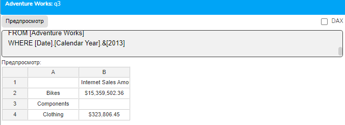
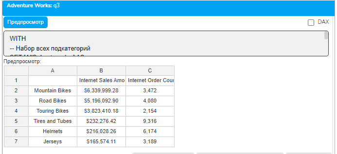
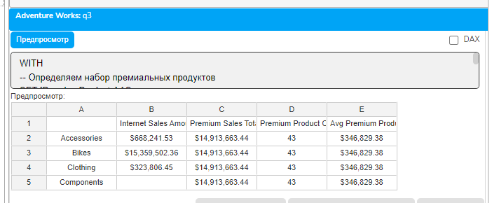
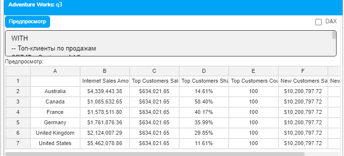
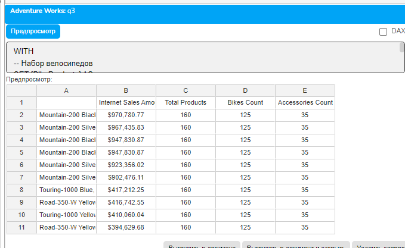
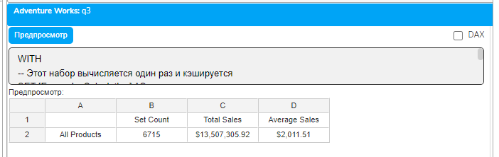

# Урок 4.4: Работа с именованными наборами

Введение: Что такое именованные наборы и зачем они нужны

Представьте, что вы разрабатываете сложный аналитический отчет, где один и тот же набор элементов используется многократно: для фильтрации, сортировки, ранжирования и вычислений. Копировать один и тот же код снова и снова — это путь к ошибкам и сложностям в поддержке. Именованные наборы решают эту проблему элегантно и эффективно.

Именованный набор (Named Set) — это сохраненная коллекция элементов измерения, которой присваивается имя для последующего многократного использования. Это похоже на переменную в программировании, только вместо одного значения мы сохраняем целую коллекцию элементов куба.

Теоретические основы именованных наборов

Синтаксис создания именованных наборов

## В MDX существует два способа создания именованных наборов

Локальные наборы в запросе — существуют только в рамках одного запроса

Глобальные наборы на уровне куба — доступны всем пользователям куба

## Для локальных наборов используется конструкция WITH SET

Delphi

WITH SET ИмяНабора AS выражение_набора

Ключевые преимущества использования именованных наборов

Повторное использование кода: Один раз определив сложный набор, вы можете использовать его многократно в разных частях запроса.

Улучшение производительности: MDX вычисляет именованный набор один раз и кэширует результат. При повторном обращении используется кэшированное значение.

Повышение читаемости: Вместо сложного выражения вы используете понятное имя, что делает код более понятным.

Упрощение поддержки: Изменения логики формирования набора нужно вносить только в одном месте.

Области применения именованных наборов

## Именованные наборы особенно полезны в следующих сценариях

Создание фиксированных списков для анализа (топ-продукты, ключевые клиенты)

Определение групп для сравнительного анализа

Формирование базы для расчетов и агрегаций

Создание динамических наборов на основе критериев

Кэширование результатов сложных операций

Создание и использование простых именованных наборов

Базовый пример именованного набора

## Начнем с простого примера — создадим набор основных категорий продуктов

```mdx
WITH
-- Создаем именованный набор категорий
SET [MainCategories] AS
    {
        [Product].[Category].[Bikes],
        [Product].[Category].[Components],
        [Product].[Category].[Clothing]
    }
SELECT
    [Measures].[Internet Sales Amount] ON COLUMNS,
    [MainCategories] ON ROWS  -- Используем именованный набор
FROM [Adventure Works]
WHERE [Date].[Calendar Year].&[2013]
```



## Разберем этот код детально

WITH SET [MainCategories] AS — объявляем именованный набор с именем MainCategories

Фигурные скобки {} содержат перечисление элементов набора

```mdx
В SELECT мы просто указываем имя набора [MainCategories] вместо повторения всего списка
```

Именованные наборы на основе функций

## Более практичный подход — создание наборов с помощью MDX функций

```mdx
WITH
-- Набор всех подкатегорий
SET [AllSubcategories] AS
    [Product].[Subcategory].[Subcategory].Members
-- Отфильтрованный набор значимых подкатегорий
SET [SignificantSubcategories] AS
    FILTER(
        [AllSubcategories],
        [Measures].[Internet Sales Amount] > 100000
    )
-- Отсортированный набор топ-подкатегорий
SET [TopSubcategories] AS
    TOPCOUNT(
        [SignificantSubcategories],
        10,
        [Measures].[Internet Sales Amount]
    )
SELECT
    {[Measures].[Internet Sales Amount],
     [Measures].[Internet Order Count]} ON COLUMNS,
    [TopSubcategories] ON ROWS
FROM [Adventure Works]
WHERE [Date].[Calendar Year].&[2013]
```



## Обратите внимание на последовательное построение

[AllSubcategories] — базовый набор всех элементов

[SignificantSubcategories] — фильтруем базовый набор

[TopSubcategories] — берем топ-10 из отфильтрованного набора

Именованные наборы в вычислениях

Использование наборов для агрегации

## Именованные наборы удобны для группировки элементов при вычислениях

```mdx
WITH
-- Определяем набор премиальных продуктов
SET [PremiumProducts] AS
    FILTER(
        [Product].[Product].[Product].Members,
        [Measures].[Internet Sales Amount] > 50000
    )
-- Рассчитываем общие продажи премиальных продуктов
MEMBER [Measures].[Premium Sales Total] AS
    SUM(
        [PremiumProducts],  -- Используем именованный набор
        [Measures].[Internet Sales Amount]
    ),
    FORMAT_STRING = "Currency"
-- Количество премиальных продуктов
MEMBER [Measures].[Premium Product Count] AS
    COUNT([PremiumProducts])
-- Средние продажи премиального продукта
MEMBER [Measures].[Avg Premium Product Sales] AS
    IIF(
        [Measures].[Premium Product Count] = 0,
        NULL,
        [Measures].[Premium Sales Total] / [Measures].[Premium Product Count]
    ),
    FORMAT_STRING = "Currency"
SELECT
    {[Measures].[Internet Sales Amount],
     [Measures].[Premium Sales Total],
     [Measures].[Premium Product Count],
     [Measures].[Avg Premium Product Sales]} ON COLUMNS,
    [Product].[Category].[Category].Members ON ROWS
FROM [Adventure Works]
WHERE [Date].[Calendar Year].&[2013]
```



Наборы для сравнительного анализа

## Создадим наборы для анализа разных групп клиентов

```mdx
WITH
-- Топ-клиенты по продажам
SET [TopCustomers] AS
    TOPCOUNT(
        [Customer].[Customer].[Customer].Members,
        100,
        [Measures].[Internet Sales Amount]
    )
-- Новые клиенты (первая покупка в 2013)
SET [NewCustomers] AS
    FILTER(
        [Customer].[Customer].[Customer].Members,
        (
            [Measures].[Internet Sales Amount],
            [Date].[Calendar Year].&[2013]
        ) > 0
        AND
        (
            [Measures].[Internet Sales Amount],
            [Date].[Calendar Year].&[2012]
        ) = 0
    )
-- Расчет метрик для топ-клиентов
MEMBER [Measures].[Top Customers Sales] AS
    SUM([TopCustomers], [Measures].[Internet Sales Amount]),
    FORMAT_STRING = "Currency"
MEMBER [Measures].[Top Customers Count] AS
    COUNT([TopCustomers])
-- Расчет метрик для новых клиентов
MEMBER [Measures].[New Customers Sales] AS
    SUM([NewCustomers], [Measures].[Internet Sales Amount]),
    FORMAT_STRING = "Currency"
MEMBER [Measures].[New Customers Count] AS
    COUNT([NewCustomers])
-- Доля топ-клиентов от общих продаж
MEMBER [Measures].[Top Customers Share] AS
    [Measures].[Top Customers Sales] / [Measures].[Internet Sales Amount],
    FORMAT_STRING = "Percent"
SELECT
    {[Measures].[Internet Sales Amount],
     [Measures].[Top Customers Sales],
     [Measures].[Top Customers Share],
     [Measures].[Top Customers Count],
     [Measures].[New Customers Sales],
     [Measures].[New Customers Count]} ON COLUMNS,
    [Customer].[Country].[Country].Members ON ROWS
FROM [Adventure Works]
WHERE [Date].[Calendar Year].&[2013]
```



Составные и иерархические именованные наборы

Объединение наборов

## Именованные наборы можно комбинировать для создания более сложных структур

```mdx
WITH
-- Набор велосипедов
SET [BikeProducts] AS
    DESCENDANTS(
        [Product].[Product Categories].[Category].[Bikes],
        [Product].[Product Categories].[Product]
    )
-- Набор аксессуаров
SET [AccessoryProducts] AS
    DESCENDANTS(
        [Product].[Product Categories].[Category].[Accessories],
        [Product].[Product Categories].[Product]
    )
-- Объединенный набор велосипедов и аксессуаров
SET [BikesAndAccessories] AS
    [BikeProducts] + [AccessoryProducts]
-- Топ-10 из объединенного набора
SET [Top10Combined] AS
    TOPCOUNT(
        [BikesAndAccessories],
        10,
        [Measures].[Internet Sales Amount]
    )
-- Метрики для анализа
MEMBER [Measures].[Total Products] AS
    COUNT([BikesAndAccessories])
MEMBER [Measures].[Bikes Count] AS
    COUNT([BikeProducts])
MEMBER [Measures].[Accessories Count] AS
    COUNT([AccessoryProducts])
SELECT
    {[Measures].[Internet Sales Amount],
     [Measures].[Total Products],
     [Measures].[Bikes Count],
     [Measures].[Accessories Count]} ON COLUMNS,
    [Top10Combined] ON ROWS
FROM [Adventure Works]
WHERE [Date].[Calendar Year].&[2013]
```



Создание иерархических наборов

## Можно строить наборы, сохраняющие иерархическую структуру

```mdx
WITH
-- Категории с высокими продажами
SET [HighSalesCategories] AS
    FILTER(
        [Product].[Category].Members,
        [Measures].[Internet Sales Amount] > 1000000
    )
-- Топ-5 продуктов для категории Bikes
SET [Top5Bikes] AS
    TOPCOUNT(
        FILTER(
            [Product].[Product].Members,
            ([Product].[Category].[Bikes], [Measures].[Internet Sales Amount]) > 0
        ),
        5,
        [Measures].[Internet Sales Amount]
    )
-- Топ-5 продуктов для категории Components
SET [Top5Components] AS
    TOPCOUNT(
        FILTER(
            [Product].[Product].Members,
            ([Product].[Category].[Components], [Measures].[Internet Sales Amount]) > 0
        ),
        5,
        [Measures].[Internet Sales Amount]
    )
-- Категории + их топ-продукты
SET [CategoryWithProducts] AS
    {[Product].[Category].[Bikes]} + [Top5Bikes] +
    {[Product].[Category].[Components]} + [Top5Components]
-- Ранг для Bikes
MEMBER [Measures].[Bikes Rank] AS
    IIF(
        RANK([Product].[Product].CurrentMember, [Top5Bikes]) > 0,
        RANK([Product].[Product].CurrentMember, [Top5Bikes]),
        NULL
    )
-- Ранг для Components
MEMBER [Measures].[Components Rank] AS
    IIF(
        RANK([Product].[Product].CurrentMember, [Top5Components]) > 0,
        RANK([Product].[Product].CurrentMember, [Top5Components]),
        NULL
    )
-- Универсальный ранг
MEMBER [Measures].[Local Rank] AS
    IIF(
        [Measures].[Bikes Rank] > 0,
        [Measures].[Bikes Rank],
        [Measures].[Components Rank]
    )
SELECT
    {[Measures].[Internet Sales Amount],
     [Measures].[Local Rank]} ON COLUMNS,
    [CategoryWithProducts] ON ROWS
FROM [Adventure Works]
WHERE [Date].[Calendar Year].&[2013]
```

Производительность и оптимизация

Кэширование через именованные наборы

## Одно из главных преимуществ именованных наборов — автоматическое кэширование

```mdx
WITH
-- Этот набор вычисляется один раз и кэшируется
SET [ExpensiveCalculation] AS
    FILTER(
        CROSSJOIN(
            [Product].[Product].[Product].Members,
            [Customer].[Customer].[Customer].Members
        ),
        [Measures].[Internet Sales Amount] > 1000
    )
-- Используем кэшированный набор многократно
MEMBER [Measures].[Set Count] AS
    COUNT([ExpensiveCalculation])
MEMBER [Measures].[Total Sales] AS
    SUM([ExpensiveCalculation], [Measures].[Internet Sales Amount])
MEMBER [Measures].[Average Sales] AS
    AVG([ExpensiveCalculation], [Measures].[Internet Sales Amount])
SELECT
    {[Measures].[Set Count],
     [Measures].[Total Sales],
     [Measures].[Average Sales]} ON COLUMNS,
    {[Product].[Category].[All]} ON ROWS
FROM [Adventure Works]
WHERE [Date].[Calendar Year].&[2013]
```



Правила эффективного использования

Фильтруйте рано: Применяйте фильтры при создании набора, а не после

Избегайте избыточности: Не создавайте наборы для одноразового использования

Используйте иерархию наборов: Стройте сложные наборы на основе простых

Помните о контексте: Именованные наборы статичны и не меняются с контекстом

Практические примеры
Пример 1: ABC-анализ с именованными наборами

```mdx
WITH
-- Сортированный набор всех продуктов
SET [SortedProducts] AS
    ORDER(
        FILTER(
            [Product].[Product].[Product].Members,
            NOT ISEMPTY([Measures].[Internet Sales Amount])
        ),
        [Measures].[Internet Sales Amount],
        DESC
    )
-- Общая сумма продаж
MEMBER [Measures].[Total Sales] AS
    SUM([SortedProducts], [Measures].[Internet Sales Amount])
-- Группа A (80% продаж)
SET [GroupA] AS
    TOPPERCENT(
        [SortedProducts],
        80,
        [Measures].[Internet Sales Amount]
    )
-- Группа B (следующие 15% продаж)
SET [GroupB] AS
    EXCEPT(
        TOPPERCENT(
            [SortedProducts],
            95,
            [Measures].[Internet Sales Amount]
        ),
        [GroupA]
    )
-- Группа C (оставшиеся 5% продаж)
SET [GroupC] AS
    EXCEPT(
        [SortedProducts],
        TOPPERCENT(
            [SortedProducts],
            95,
            [Measures].[Internet Sales Amount]
        )
    )
-- Метрики для каждой группы
MEMBER [Measures].[Group A Count] AS COUNT([GroupA])
MEMBER [Measures].[Group B Count] AS COUNT([GroupB])
MEMBER [Measures].[Group C Count] AS COUNT([GroupC])
MEMBER [Measures].[Group A Sales] AS
    SUM([GroupA], [Measures].[Internet Sales Amount]),
    FORMAT_STRING = "Currency"
MEMBER [Measures].[Group B Sales] AS
    SUM([GroupB], [Measures].[Internet Sales Amount]),
    FORMAT_STRING = "Currency"
MEMBER [Measures].[Group C Sales] AS
    SUM([GroupC], [Measures].[Internet Sales Amount]),
    FORMAT_STRING = "Currency"
-- Определяем к какой группе относится текущий продукт
MEMBER [Measures].[ABC Group] AS
    CASE
        WHEN INTERSECT({[Product].[Product].CurrentMember}, [GroupA]).COUNT > 0 THEN "A"
        WHEN INTERSECT({[Product].[Product].CurrentMember}, [GroupB]).COUNT > 0 THEN "B"
        WHEN INTERSECT({[Product].[Product].CurrentMember}, [GroupC]).COUNT > 0 THEN "C"
        ELSE "N/A"
    END
SELECT
    {[Measures].[Internet Sales Amount],
     [Measures].[ABC Group]} ON COLUMNS,
    HEAD([SortedProducts], 50) ON ROWS
FROM [Adventure Works]
WHERE [Date].[Calendar Year].&[2013]

Пример 2: Сравнительный анализ периодов
WITH
-- Набор успешных продуктов прошлого года
SET [LastYearTopProducts] AS
    TOPCOUNT(
        FILTER(
            [Product].[Product].[Product].Members,
            ([Measures].[Internet Sales Amount], [Date].[Calendar Year].&[2012]) > 0
        ),
        20,
        ([Measures].[Internet Sales Amount], [Date].[Calendar Year].&[2012])
    )
-- Набор успешных продуктов текущего года
SET [CurrentYearTopProducts] AS
    TOPCOUNT(
        FILTER(
            [Product].[Product].[Product].Members,
            ([Measures].[Internet Sales Amount], [Date].[Calendar Year].&[2013]) > 0
        ),
        20,
        ([Measures].[Internet Sales Amount], [Date].[Calendar Year].&[2013])
    )
-- Продукты, которые есть в обоих наборах (стабильные лидеры)
SET [ConsistentLeaders] AS
    INTERSECT([LastYearTopProducts], [CurrentYearTopProducts])
-- Новые лидеры (есть в текущем, но не было в прошлом)
SET [NewLeaders] AS
    EXCEPT([CurrentYearTopProducts], [LastYearTopProducts])
-- Потерянные лидеры (были в прошлом, но нет в текущем)
SET [LostLeaders] AS
    EXCEPT([LastYearTopProducts], [CurrentYearTopProducts])
-- Все уникальные продукты из обоих наборов
SET [AllTopProducts] AS
    UNION([LastYearTopProducts], [CurrentYearTopProducts])
-- Метрики анализа
MEMBER [Measures].[Consistent Count] AS COUNT([ConsistentLeaders])
MEMBER [Measures].[New Leaders Count] AS COUNT([NewLeaders])
MEMBER [Measures].[Lost Leaders Count] AS COUNT([LostLeaders])
MEMBER [Measures].[Product Status] AS
    CASE
        WHEN INTERSECT({[Product].[Product].CurrentMember}, [ConsistentLeaders]).COUNT > 0 THEN "Stable Leader"
        WHEN INTERSECT({[Product].[Product].CurrentMember}, [NewLeaders]).COUNT > 0 THEN "New Leader"
        WHEN INTERSECT({[Product].[Product].CurrentMember}, [LostLeaders]).COUNT > 0 THEN "Lost Leader"
        ELSE "Other"
    END
MEMBER [Measures].[Sales 2012] AS
    ([Measures].[Internet Sales Amount], [Date].[Calendar Year].&[2012]),
    FORMAT_STRING = "Currency"
MEMBER [Measures].[Sales 2013] AS
    ([Measures].[Internet Sales Amount], [Date].[Calendar Year].&[2013]),
    FORMAT_STRING = "Currency"
SELECT
    {[Measures].[Sales 2012],
     [Measures].[Sales 2013],
     [Measures].[Product Status]} ON COLUMNS,
    [AllTopProducts] ON ROWS
FROM [Adventure Works]
```

Типичные ошибки и их решение

Ошибка 1: Попытка изменить именованный набор

```mdx
-- НЕПРАВИЛЬНО: Нельзя переопределить набор
WITH
SET [MySet] AS [Product].[Category].[Bikes]
SET [MySet] AS [Product].[Category].[Clothing]  -- Ошибка!
-- ПРАВИЛЬНО: Используйте разные имена или комбинируйте
WITH
SET [BikeSet] AS {[Product].[Category].[Bikes]}
SET [ClothingSet] AS {[Product].[Category].[Clothing]}
SET [CombinedSet] AS [BikeSet] + [ClothingSet]
```

Ошибка 2: Зависимость от контекста запроса

```mdx
-- ПРОБЛЕМА: Набор не учитывает контекст WHERE
WITH
SET [TopProducts] AS
    TOPCOUNT(
        [Product].[Product].[Product].Members,
        10,
        [Measures].[Internet Sales Amount]  -- Не учитывает фильтр года
    )
-- РЕШЕНИЕ: Явно указывайте контекст в наборе
WITH
SET [TopProducts2013] AS
    TOPCOUNT(
        [Product].[Product].[Product].Members,
        10,
        ([Measures].[Internet Sales Amount], [Date].[Calendar Year].&[2013])
    )
```

Заключение

Именованные наборы — это мощный инструмент MDX, который делает код более читаемым, эффективным и легким в поддержке. Мы изучили:

Синтаксис создания и использования именованных наборов

Применение наборов в вычислениях и агрегациях

Создание составных и иерархических наборов

Оптимизацию производительности через кэширование

Практические паттерны использования в реальных задачах

Именованные наборы особенно ценны при работе со сложными отчетами, где одни и те же группы элементов используются многократно. Они позволяют структурировать логику запроса, делая её более понятной и поддерживаемой.

Домашнее задание

Задание 1: Сегментация клиентов

Создайте систему сегментации клиентов с использованием именованных наборов: VIP (топ-10), Gold (следующие 50), Silver (следующие 100), Bronze (остальные активные).

Задание 2: Анализ продуктового портфеля

Реализуйте анализ с именованными наборами для: растущих продуктов, стабильных продуктов, падающих продуктов на основе сравнения продаж двух периодов.

Задание 3: Комплексная отчетность

Создайте отчет с использованием минимум 5 взаимосвязанных именованных наборов для анализа эффективности регионов.

Контрольные вопросы

В чем основное преимущество использования именованных наборов?

Можно ли использовать один именованный набор при создании другого?

Как именованные наборы влияют на производительность запросов?

Какая разница между локальными и глобальными именованными наборами?

Можно ли изменить именованный набор после его создания?

Как проверить, входит ли элемент в именованный набор?

Какие операции можно выполнять с именованными наборами?
