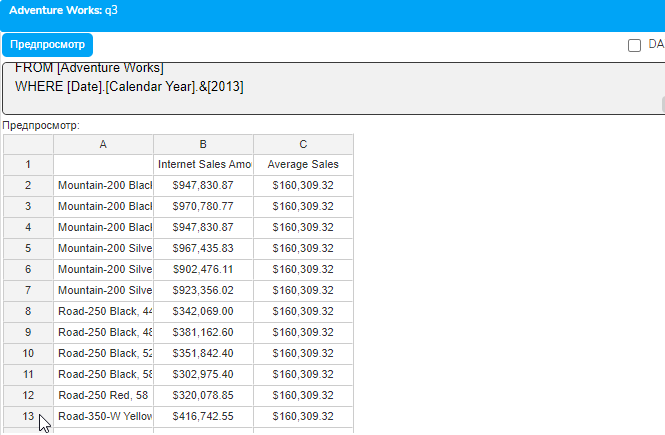
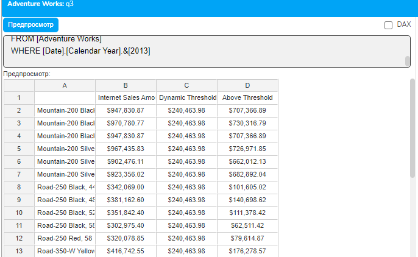
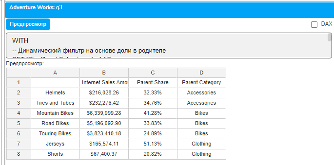
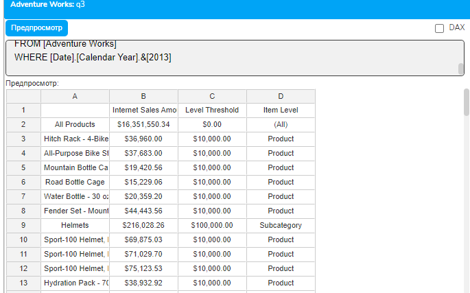
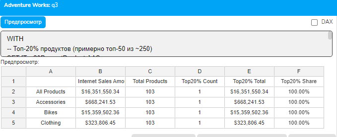
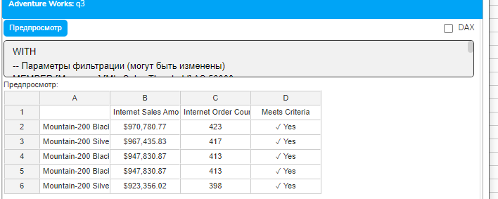
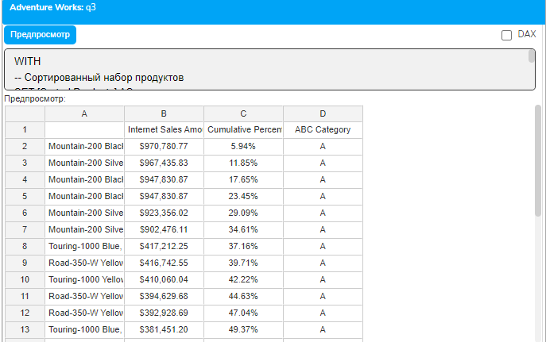
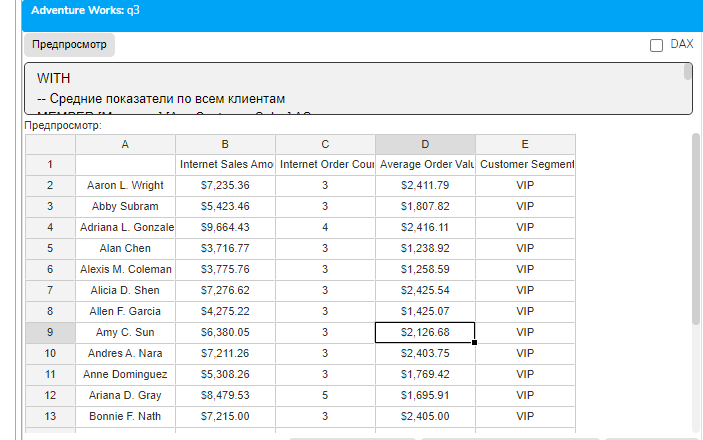

# Урок 4.5: Динамическая фильтрация

Введение: Что такое динамическая фильтрация и зачем она нужна

В предыдущих уроках мы изучили статическую фильтрацию с помощью функции FILTER, где условия фильтрации были жестко заданы в коде. Например, мы отбирали продукты с продажами больше 100000 или топ-10 клиентов. Но что если нужно, чтобы условия фильтрации изменялись в зависимости от контекста запроса, текущего элемента или других данных? Именно для этого существует динамическая фильтрация.

Динамическая фильтрация — это подход, при котором критерии отбора данных не являются фиксированными, а вычисляются во время выполнения запроса на основе контекста, других данных или параметров. Это делает отчеты более гибкими и адаптивными.

Теоретические основы динамической фильтрации

Понятие контекста в MDX

Контекст в MDX — это текущее состояние выполнения запроса в конкретной точке. Контекст включает в себя:

Текущий элемент измерения — при итерации по набору каждый элемент становится текущим

Срез запроса (WHERE) — определяет глобальный контекст для всего запроса

Положение на осях — текущая позиция при формировании результата

Расчетные члены и наборы — дополнительный контекст вычислений

Основные механизмы динамической фильтрации

CurrentMember — ключевая функция для динамической фильтрации. Она возвращает текущий элемент измерения в контексте выполнения. Это позволяет создавать условия, которые зависят от обрабатываемого элемента.

Относительные сравнения — вместо абсолютных значений (например, &gt; 100000) используются относительные критерии (например, больше среднего по категории).

Вычисляемые пороги — пороговые значения не задаются жестко, а вычисляются на основе данных.

Контекстно-зависимые наборы — наборы, которые формируются по-разному в зависимости от контекста.

Преимущества динамической фильтрации

Адаптивность — фильтры автоматически подстраиваются под изменения в данных

Универсальность — один запрос может обслуживать разные сценарии

Масштабируемость — при добавлении новых данных фильтры продолжают работать корректно

Интеллектуальность — возможность создания "умных" отчетов

Динамическая фильтрация на основе среднего значения

Простой пример с динамическим порогом

## Начнем с базового примера — отберем продукты, чьи продажи превышают среднее значение

```mdx
WITH
-- Вычисляем среднее значение продаж по всем продуктам
MEMBER [Measures].[Average Sales] AS
    AVG(
        [Product].[Product].[Product].Members,
        [Measures].[Internet Sales Amount]
    )
-- Создаем динамический фильтр
SET [Above Average Products] AS
    FILTER(
        [Product].[Product].[Product].Members,
        [Measures].[Internet Sales Amount] > [Measures].[Average Sales]
    )
SELECT
    {[Measures].[Internet Sales Amount],
     [Measures].[Average Sales]} ON COLUMNS,
    NON EMPTY [Above Average Products] ON ROWS
FROM [Adventure Works]
WHERE [Date].[Calendar Year].&[2013]
```



## Давайте разберем этот код подробно

[Measures].[Average Sales] — расчетная мера, которая вычисляет среднее значение продаж

Функция AVG() проходит по всем продуктам и вычисляет среднее

В FILTER мы сравниваем продажи каждого продукта со средним значением

Если данные изменятся, среднее пересчитается автоматически

Динамическая фильтрация с множителем

## Усложним пример — отберем продукты, превышающие среднее в 1.5 раза

```mdx
WITH
-- Среднее значение продаж
MEMBER [Measures].[Average Sales] AS
    AVG(
        [Product].[Product].[Product].Members,
        [Measures].[Internet Sales Amount]
    )
-- Динамический порог (150% от среднего)
MEMBER [Measures].[Dynamic Threshold] AS
    [Measures].[Average Sales] * 1.5,
    FORMAT_STRING = "Currency"
-- Фильтруем продукты выше динамического порога
SET [High Performers] AS
    FILTER(
        [Product].[Product].[Product].Members,
        [Measures].[Internet Sales Amount] > [Measures].[Dynamic Threshold]
    )
-- Показываем превышение порога
MEMBER [Measures].[Above Threshold] AS
    [Measures].[Internet Sales Amount] - [Measures].[Dynamic Threshold],
    FORMAT_STRING = "Currency"
SELECT
    {[Measures].[Internet Sales Amount],
     [Measures].[Dynamic Threshold],
     [Measures].[Above Threshold]} ON COLUMNS,
    NON EMPTY [High Performers] ON ROWS
FROM [Adventure Works]
WHERE [Date].[Calendar Year].&[2013]
```



Контекстно-зависимая фильтрация

Фильтрация относительно родительского элемента

## Создадим фильтр, который отбирает подкатегории, составляющие более 20% от своей категории

```mdx
WITH
-- Динамический фильтр на основе доли в родителе
SET [Significant Subcategories] AS
    FILTER(
        [Product].[Product Categories].[Subcategory].Members,
        -- Вычисляем долю подкатегории в её категории
        [Measures].[Internet Sales Amount] /
        (
            [Measures].[Internet Sales Amount],
            [Product].[Product Categories].CurrentMember.Parent
        ) > 0.2
    )
-- Расчетная мера для отображения доли
MEMBER [Measures].[Parent Share] AS
    IIF(
        ([Measures].[Internet Sales Amount],
         [Product].[Product Categories].CurrentMember.Parent) = 0,
        NULL,
        [Measures].[Internet Sales Amount] /
        ([Measures].[Internet Sales Amount],
         [Product].[Product Categories].CurrentMember.Parent)
    ),
    FORMAT_STRING = "Percent"
-- Показываем родительскую категорию
MEMBER [Measures].[Parent Category] AS
    [Product].[Product Categories].CurrentMember.Parent.Name
SELECT
    {[Measures].[Internet Sales Amount],
     [Measures].[Parent Share],
     [Measures].[Parent Category]} ON COLUMNS,
    NON EMPTY [Significant Subcategories] ON ROWS
FROM [Adventure Works]
WHERE [Date].[Calendar Year].&[2013]
```



## Разберем ключевые моменты

CurrentMember.Parent — получаем родительский элемент текущей подкатегории

Деление продаж подкатегории на продажи категории дает долю

Каждая подкатегория сравнивается со своей категорией, а не с общим порогом

Динамическая фильтрация с использованием уровней иерархии

```mdx
WITH
-- Определяем разные пороги для разных уровней
MEMBER [Measures].[Level Threshold] AS
    CASE
        WHEN [Product].[Product Categories].CurrentMember.Level.Name = "Category"
```

        THEN 1000000  -- Порог для категорий

```mdx
        WHEN [Product].[Product Categories].CurrentMember.Level.Name = "Subcategory"
```

        THEN 100000   -- Порог для подкатегорий

```mdx
        WHEN [Product].[Product Categories].CurrentMember.Level.Name = "Product"
```

        THEN 10000    -- Порог для продуктов

        ELSE 0

    END,

```mdx
    FORMAT_STRING = "Currency"
-- Универсальный фильтр для всех уровней
SET [Significant Items] AS
    FILTER(
        [Product].[Product Categories].Members,
        [Measures].[Internet Sales Amount] > [Measures].[Level Threshold]
    )
-- Показываем уровень элемента
MEMBER [Measures].[Item Level] AS
    [Product].[Product Categories].CurrentMember.Level.Name
SELECT
    {[Measures].[Internet Sales Amount],
     [Measures].[Level Threshold],
     [Measures].[Item Level]} ON COLUMNS,
    NON EMPTY [Significant Items] ON ROWS
FROM [Adventure Works]
WHERE [Date].[Calendar Year].&[2013]
```



Динамическая фильтрация с использованием ранжирования

Динамический топ N процентов

## Создадим фильтр, который отбирает топ 20% элементов в каждой группе

```mdx
WITH
-- Топ-20% продуктов (примерно топ-50 из ~250)
SET [Top20PercentProducts] AS
    TOPPERCENT(
        FILTER(
            [Product].[Product].Members,
            [Measures].[Internet Sales Amount] > 0
        ),
        20,
        [Measures].[Internet Sales Amount]
    )
MEMBER [Measures].[Total Products] AS
    COUNT(
        FILTER(
            [Product].[Product].Members,
            [Measures].[Internet Sales Amount] > 0
        )
    )
MEMBER [Measures].[Top20% Count] AS
    COUNT([Top20PercentProducts])
MEMBER [Measures].[Top20% Total] AS
    SUM([Top20PercentProducts], [Measures].[Internet Sales Amount]),
    FORMAT_STRING = "Currency"
MEMBER [Measures].[Top20% Share] AS
    [Measures].[Top20% Total] / [Measures].[Internet Sales Amount],
    FORMAT_STRING = "Percent"
SELECT
    {[Measures].[Internet Sales Amount],
     [Measures].[Total Products],
     [Measures].[Top20% Count],
     [Measures].[Top20% Total],
     [Measures].[Top20% Share]} ON COLUMNS,
    [Product].[Category].Members ON ROWS
FROM [Adventure Works]
WHERE [Date].[Calendar Year].&[2013]
```



Параметризованная динамическая фильтрация

Использование расчетных членов как параметров

```mdx
WITH
-- Параметры фильтрации (могут быть изменены)
MEMBER [Measures].[Min Sales Threshold] AS 50000
MEMBER [Measures].[Min Orders Threshold] AS 10
MEMBER [Measures].[Top N Count] AS 5
-- Комбинированный динамический фильтр
SET [Qualified Products] AS
    FILTER(
        TOPCOUNT(
            [Product].[Product].[Product].Members,
            [Measures].[Top N Count] * 2,  -- Берем больше для последующей фильтрации
            [Measures].[Internet Sales Amount]
        ),
        [Measures].[Internet Sales Amount] > [Measures].[Min Sales Threshold]
        AND
        [Measures].[Internet Order Count] > [Measures].[Min Orders Threshold]
    )
```

-- Финальный набор - топ N из отфильтрованных

```mdx
SET [Final Top Products] AS
    TOPCOUNT(
        [Qualified Products],
        [Measures].[Top N Count],
        [Measures].[Internet Sales Amount]
    )
-- Метка соответствия критериям
MEMBER [Measures].[Meets Criteria] AS
    IIF(
        [Measures].[Internet Sales Amount] > [Measures].[Min Sales Threshold]
        AND [Measures].[Internet Order Count] > [Measures].[Min Orders Threshold],
        "✓ Yes",
        "✗ No"
    )
SELECT
    {[Measures].[Internet Sales Amount],
     [Measures].[Internet Order Count],
     [Measures].[Meets Criteria]} ON COLUMNS,
    NON EMPTY [Final Top Products] ON ROWS
FROM [Adventure Works]
WHERE [Date].[Calendar Year].&[2013]
```



Практические примеры


Пример 1: ABC-анализ с динамическими границами

```mdx
WITH
-- Сортированный набор продуктов
SET [Sorted Products] AS
    ORDER(
        FILTER(
            [Product].[Product].[Product].Members,
            NOT ISEMPTY([Measures].[Internet Sales Amount])
        ),
        [Measures].[Internet Sales Amount],
        DESC
    )
-- Общая сумма продаж
MEMBER [Measures].[Total Sales] AS
    SUM([Sorted Products], [Measures].[Internet Sales Amount])
-- Накопительная сумма для текущего продукта
MEMBER [Measures].[Cumulative Sales] AS
    SUM(
        HEAD(
            [Sorted Products],
            RANK(
                [Product].[Product].CurrentMember,
                [Sorted Products]
            )
        ),
        [Measures].[Internet Sales Amount]
    )
-- Накопительный процент
MEMBER [Measures].[Cumulative Percent] AS
    IIF(
        [Measures].[Total Sales] = 0,
        NULL,
        [Measures].[Cumulative Sales] / [Measures].[Total Sales]
    ),
    FORMAT_STRING = "Percent"
-- Динамическая категория ABC
MEMBER [Measures].[ABC Category] AS
    CASE
        WHEN [Measures].[Cumulative Percent] <= 0.8 THEN "A"
        WHEN [Measures].[Cumulative Percent] <= 0.95 THEN "B"
        ELSE "C"
    END
-- Фильтруем только категорию A
SET [Category A Products] AS
    FILTER(
        [Sorted Products],
        [Measures].[Cumulative Percent] <= 0.8
    )
SELECT
    {[Measures].[Internet Sales Amount],
     [Measures].[Cumulative Percent],
     [Measures].[ABC Category]} ON COLUMNS,
    HEAD([Category A Products], 30) ON ROWS
FROM [Adventure Works]
WHERE [Date].[Calendar Year].&[2013]
```



Пример 2: Динамическая сегментация клиентов

```mdx
WITH
-- Средние показатели по всем клиентам
MEMBER [Measures].[Avg Customer Sales] AS
    AVG(
        [Customer].[Customer].[Customer].Members,
        [Measures].[Internet Sales Amount]
    )
MEMBER [Measures].[Avg Customer Orders] AS
    AVG(
        [Customer].[Customer].[Customer].Members,
        [Measures].[Internet Order Count]
    )
-- Динамическая сегментация клиентов
MEMBER [Measures].[Customer Segment] AS
    CASE
        -- VIP: высокие продажи и много заказов
        WHEN [Measures].[Internet Sales Amount] > [Measures].[Avg Customer Sales] * 3
             AND [Measures].[Internet Order Count] > [Measures].[Avg Customer Orders] * 2
        THEN "VIP"
        -- Лояльные: частые покупки
        WHEN [Measures].[Internet Order Count] > [Measures].[Avg Customer Orders] * 2
        THEN "Loyal"
        -- Высокая ценность: большие чеки
        WHEN [Measures].[Internet Sales Amount] > [Measures].[Avg Customer Sales] * 2
```

        THEN "High Value"

```mdx
        -- Обычные: около среднего
        WHEN [Measures].[Internet Sales Amount] > [Measures].[Avg Customer Sales] * 0.5
        THEN "Regular"
```

        ELSE "Low Activity"

```mdx
    END
-- Фильтруем только VIP клиентов
SET [VIP Customers] AS
    FILTER(
        [Customer].[Customer].[Customer].Members,
        [Measures].[Internet Sales Amount] > [Measures].[Avg Customer Sales] * 3
        AND [Measures].[Internet Order Count] > [Measures].[Avg Customer Orders] * 2
    )
-- Средний чек
MEMBER [Measures].[Average Order Value] AS
    IIF(
        [Measures].[Internet Order Count] = 0,
        NULL,
        [Measures].[Internet Sales Amount] / [Measures].[Internet Order Count]
    ),
    FORMAT_STRING = "Currency"
SELECT
    {[Measures].[Internet Sales Amount],
     [Measures].[Internet Order Count],
     [Measures].[Average Order Value],
     [Measures].[Customer Segment]} ON COLUMNS,
    HEAD([VIP Customers], 20) ON ROWS
FROM [Adventure Works]
WHERE [Date].[Calendar Year].&[2013]
```



Оптимизация динамической фильтрации

Использование именованных наборов для кэширования

При работе с динамическими фильтрами важно оптимизировать производительность:
Оптимизация с использованием STDEV

```mdx
WITH
-- Кэшируем базовый набор один раз
SET [Active Products] AS
    FILTER(
        [Product].[Product].[Product].Members,
        NOT ISEMPTY([Measures].[Internet Sales Amount])
        AND [Measures].[Internet Sales Amount] > 0
    )
-- Вычисляем статистику один раз на кэшированном наборе
MEMBER [Measures].[Products Avg] AS
    AVG([Active Products], [Measures].[Internet Sales Amount])
MEMBER [Measures].[Products StdDev] AS
    STDEV([Active Products], [Measures].[Internet Sales Amount])
-- Используем кэшированные значения для фильтрации
SET [Outlier Products] AS
    FILTER(
        [Active Products],
        NOT ISEMPTY([Measures].[Products StdDev])
        AND ABS([Measures].[Internet Sales Amount] - [Measures].[Products Avg]) >
            ([Measures].[Products StdDev] * 2)
    )
-- Z-score для каждого продукта
MEMBER [Measures].[Z-Score] AS
    IIF(
        [Measures].[Products StdDev] = 0 OR ISEMPTY([Measures].[Products StdDev]),
        NULL,
        ([Measures].[Internet Sales Amount] - [Measures].[Products Avg]) /
        [Measures].[Products StdDev]
    ),
    FORMAT_STRING = "#,##0.00"
SELECT
    {[Measures].[Internet Sales Amount],
     [Measures].[Products Avg],
     [Measures].[Z-Score]} ON COLUMNS,
    [Outlier Products] ON ROWS
FROM [Adventure Works]
WHERE [Date].[Calendar Year].&[2013]
```

Заключение

Динамическая фильтрация — это мощный инструмент MDX, который позволяет создавать адаптивные и интеллектуальные отчеты. Мы изучили:

Основные принципы динамической фильтрации и её преимущества

Фильтрацию на основе вычисляемых порогов — среднее, медиана, процентили

Контекстно-зависимую фильтрацию — использование CurrentMember и иерархий

Параметризованную фильтрацию — создание универсальных запросов

Практические паттерны — ABC-анализ, сегментация, выявление аномалий

Динамическая фильтрация делает отчеты более гибкими и позволяет одному запросу обслуживать множество сценариев использования. Это особенно важно при создании интерактивных дашбордов и аналитических приложений.

Домашнее задание

Базовый уровень: Создайте динамический фильтр, который отбирает продукты с продажами выше медианы.

Средний уровень: Реализуйте динамическую фильтрацию, которая для каждой страны отбирает топ 10% клиентов по продажам.

Продвинутый уровень: Создайте систему динамической фильтрации для выявления сезонных продуктов (продукты, у которых продажи в определенном квартале превышают среднеквартальные продажи более чем в 2 раза).
