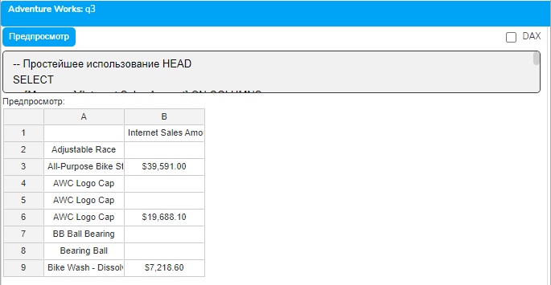
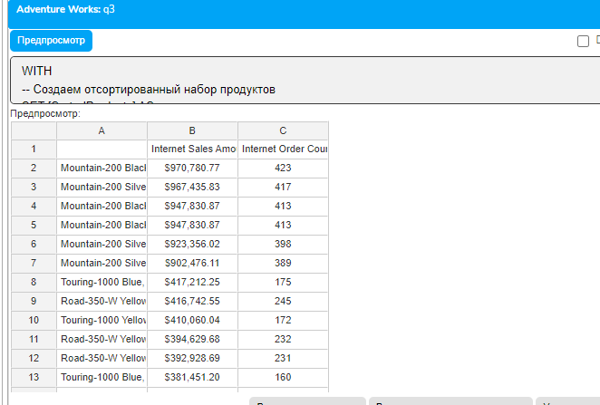
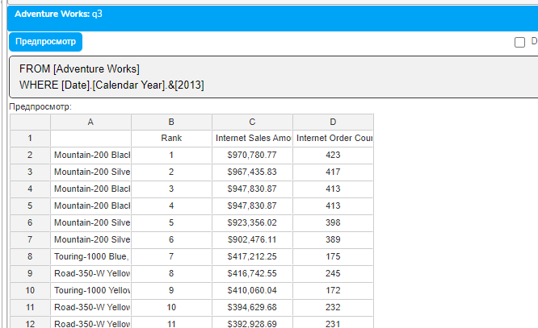
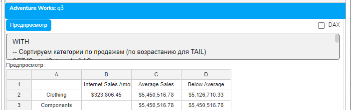
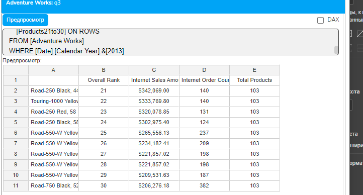
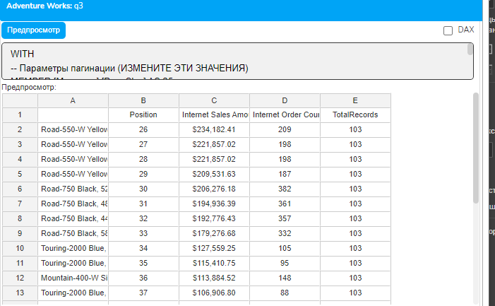
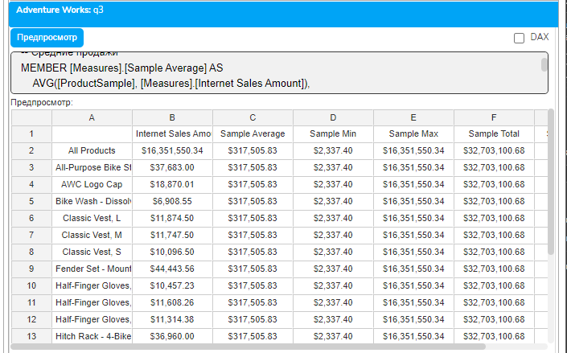
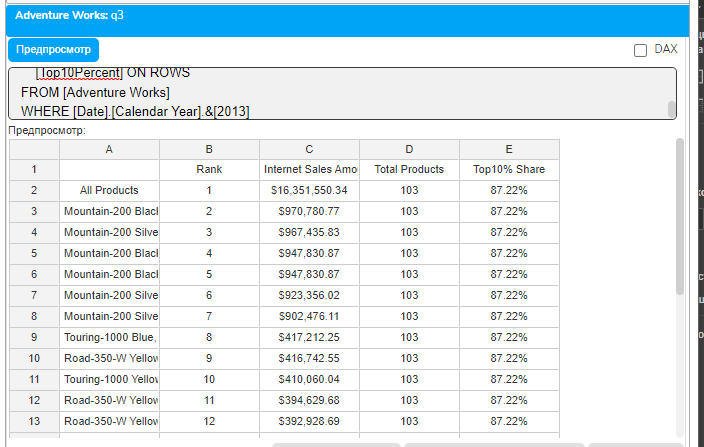
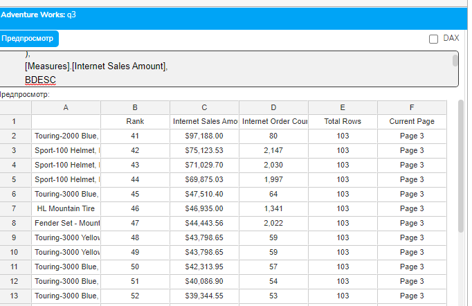

# Урок 4.6: Работа с большими наборами и пагинация

Введение: Проблема больших наборов данных

При работе с OLAP-кубами мы регулярно сталкиваемся с огромными объемами данных. Представьте себе типичную корпоративную систему: измерение клиентов может содержать сотни тысяч записей, измерение продуктов — десятки тысяч товаров, а измерение транзакций — миллионы записей. Попытка загрузить и отобразить все эти данные одновременно создает целый ряд серьезных проблем.

Первая и самая очевидная проблема — это производительность. Когда MDX-запрос возвращает сотни тысяч строк, сервер должен обработать огромный объем данных, выполнить все необходимые вычисления и передать результат клиенту. Это может занимать минуты, а иногда и часы, что совершенно неприемлемо для интерактивной работы.

Вторая проблема — удобство использования. Даже если технически возможно отобразить 100 000 строк в отчете, человек физически не способен эффективно работать с таким объемом информации. Пользователь просто потеряется в бесконечном списке данных и не сможет найти нужную информацию.

Третья проблема — технические ограничения. Многие клиентские приложения, включая Excel и веб-браузеры, имеют жесткие ограничения на количество отображаемых строк. Excel, например, может отобразить максимум 1 048 576 строк, а браузеры могут начать "подвисать" уже при нескольких тысячах элементов DOM.

Четвертая проблема — сетевой трафик. Передача больших объемов данных от сервера к клиенту создает значительную нагрузку на сеть, особенно если пользователи работают удаленно или через медленные каналы связи.

В этом уроке мы детально изучим специальные функции MDX, которые позволяют элегантно решить все эти проблемы путем извлечения только необходимых подмножеств данных.

Теоретические основы работы с подмножествами

Концепция подмножеств в MDX

Подмножество в контексте MDX — это выделенная часть исходного набора элементов. Важно понимать, что подмножество сохраняет все характеристики исходного набора: иерархию, свойства элементов и их взаимосвязи. Единственное отличие — количество элементов.

## MDX предоставляет три основных подхода к извлечению подмножеств

Позиционное извлечение основано на порядковых номерах элементов в наборе. Мы можем взять первые N элементов (функция HEAD), последние N элементов (функция TAIL) или произвольный диапазон от позиции X до позиции Y (функция SUBSET). Этот подход идеально подходит для создания топ-листов, анализа крайних значений и реализации пагинации.

Случайная выборка позволяет получить репрезентативное подмножество для статистического анализа. Функция SAMPLE случайным образом выбирает заданное количество элементов из набора, что особенно полезно при работе с очень большими данными, когда анализ полного набора занимает слишком много времени.

Страничное извлечение (пагинация) — это специальный случай позиционного извлечения, когда большой набор разделяется на страницы фиксированного размера. Пользователь может последовательно просматривать страницы, как в книге, что делает работу с большими данными удобной и эффективной.

Важность порядка элементов

Критически важный момент при работе с подмножествами — это порядок элементов в исходном наборе. Функции HEAD, TAIL и SUBSET работают с позициями элементов, а позиции определяются порядком. Если набор не отсортирован, результаты могут быть непредсказуемыми и бессмысленными.

Рассмотрим простой пример: если мы хотим получить топ-10 продуктов по продажам, недостаточно просто применить HEAD к набору продуктов. Сначала нужно отсортировать продукты по убыванию продаж, и только потом брать первые 10. В противном случае мы получим просто первые 10 продуктов в алфавитном порядке или в порядке их внутренних идентификаторов.

Функция HEAD: Извлечение первых элементов

Детальное изучение синтаксиса HEAD

## Функция HEAD имеет простой, но мощный синтаксис

```mdx
HEAD(Set_Expression, Count)
```

## Где

Set_Expression — любое выражение, возвращающее набор

Count — количество элементов для извлечения

## Давайте начнем с самого базового примера

```mdx
-- Простейшее использование HEAD
SELECT
    [Measures].[Internet Sales Amount] ON COLUMNS,
    HEAD(
        [Product].[Product].[Product].Members,
        10
    ) ON ROWS
FROM [Adventure Works]
```



Этот запрос вернет первые 10 продуктов из измерения Product. Но какие именно это будут продукты? Это зависит от естественного порядка элементов в измерении, который обычно определяется ключами элементов или алфавитным порядком.

HEAD с предварительной сортировкой

## Для получения осмысленных результатов практически всегда нужно сочетать HEAD с ORDER

```mdx
WITH
-- Создаем отсортированный набор продуктов
SET [SortedProducts] AS
    ORDER(
        [Product].[Product].[Product].Members,
        [Measures].[Internet Sales Amount],
```

        DESC  -- Сортировка по убыванию

```mdx
    )
SELECT
    {
        [Measures].[Internet Sales Amount],
        [Measures].[Internet Order Count]
    } ON COLUMNS,
    HEAD([SortedProducts], 20) ON ROWS
FROM [Adventure Works]
WHERE [Date].[Calendar Year].&[2013]
```



Здесь мы сначала создаем именованный набор [SortedProducts], отсортированный по убыванию продаж, затем берем первые 20 элементов. Результат — топ-20 продуктов по продажам за 2013 год.

Оптимизация с NON EMPTY

При работе с большими измерениями многие элементы могут не иметь данных. Важно отфильтровать их перед сортировкой:

```mdx
WITH
-- Сначала определяем множество ВСЕХ продуктов
SET [AllProducts] AS
    [Product].[Product].[Product].Members
-- Затем
-- сортируем это множество по объему продаж
SET [SortedProducts] AS
    ORDER(
        [AllProducts],
        [Measures].[Internet Sales Amount],
        DESC
    )
-- Добавляем ранг
MEMBER [Measures].[Rank] AS
    RANK(
        [Product].[Product].CurrentMember,
        [SortedProducts]
    )
SELECT
    {
        [Measures].[Rank],
        [Measures].[Internet Sales Amount],
        [Measures].[Internet Order Count]
    } ON COLUMNS,
    NON EMPTY
    HEAD([SortedProducts], 15) ON ROWS
FROM [Adventure Works]
WHERE [Date].[Calendar Year].&[2013]
```



]Функция TAIL: Анализ последних элементов

Применение TAIL для анализа худших показателей

Функция TAIL симметрична HEAD, но возвращает последние элементы набора. Это особенно полезно для выявления проблемных областей:

```mdx
WITH
-- Сортируем категории по продажам (по возрастанию для TAIL)
SET [SortedCategories] AS
    ORDER(
        [Product].[Category].[Category].Members,
        [Measures].[Internet Sales Amount],
```

        DESC  -- Сортируем по убыванию

```mdx
    )
-- Берем последние 2 категории (худшие по продажам)
SET [WorstCategories] AS
    TAIL([SortedCategories], 2)
-- Вычисляем среднее по всем категориям
MEMBER [Measures].[Average Sales] AS
    AVG(
        [Product].[Category].[Category].Members,
        [Measures].[Internet Sales Amount]
    ),
    FORMAT_STRING = "Currency"
-- Показываем отставание от среднего
MEMBER [Measures].[Below Average] AS
    [Measures].[Average Sales] - [Measures].[Internet Sales Amount],
    FORMAT_STRING = "Currency"
SELECT
    {
        [Measures].[Internet Sales Amount],
        [Measures].[Average Sales],
        [Measures].[Below Average]
    } ON COLUMNS,
    [WorstCategories] ON ROWS
FROM [Adventure Works]
WHERE [Date].[Calendar Year].&[2013]
```



Комбинирование HEAD и TAIL

## Часто полезно показать одновременно лучшие и худшие элементы

```mdx
WITH
-- Отфильтрованные и отсортированные магазины
SET [SortedStores] AS
    ORDER(
        FILTER(
            [Store].[Store].[Store].Members,
            [Measures].[Store Sales] > 0
        ),
        [Measures].[Store Sales],
        DESC
    )
-- Топ-5 магазинов
SET [Top5Stores] AS
    HEAD([SortedStores], 5)
-- Худшие 5 магазинов
SET [Bottom5Stores] AS
    TAIL([SortedStores], 5)
-- Объединяем оба набора
SET [TopAndBottom] AS
    {[Top5Stores], [Bottom5Stores]}
-- Добавляем индикатор группы
MEMBER [Measures].[Group] AS
    IIF(
        RANK(
            [Store].[Store].CurrentMember,
            [SortedStores]
        ) <= 5,
        "Top 5",
        "Bottom 5"
    )
SELECT
    {
        [Measures].[Group],
        [Measures].[Store Sales],
        [Measures].[Store Cost]
    } ON COLUMNS,
    [TopAndBottom] ON ROWS
FROM [Adventure Works]
```

Функция SUBSET: Гибкое извлечение диапазонов

Понимание параметров SUBSET

## Функция SUBSET предоставляет максимальную гибкость

```mdx
SUBSET(Set_Expression, Start_Position, Count)
```

Важно помнить, что Start_Position начинается с 0, как в большинстве языков программирования:

```mdx
WITH
-- Сортируем все продукты по продажам
SET [AllProducts] AS
    ORDER(
        FILTER(
            [Product].[Product].Members,
            [Measures].[Internet Sales Amount] > 0
        ),
        [Measures].[Internet Sales Amount],
        BDESC
    )
-- Извлекаем продукты с 21 по 30 позицию
SET [Products21to30] AS
    SUBSET([AllProducts], 20, 10)
-- Абсолютный ранг среди всех продуктов
MEMBER [Measures].[Overall Rank] AS
    RANK([Product].[Product].CurrentMember, [AllProducts])
-- Общее количество продуктов
MEMBER [Measures].[Total Products] AS
    COUNT([AllProducts])
SELECT
    {[Measures].[Overall Rank],
     [Measures].[Internet Sales Amount],
     [Measures].[Internet Order Count],
     [Measures].[Total Products]} ON COLUMNS,
    [Products21to30] ON ROWS
FROM [Adventure Works]
WHERE [Date].[Calendar Year].&[2013]
```



Реализация полноценной пагинации

## Пагинация — это ключевое применение SUBSET. Вот комплексный пример

```mdx
WITH
-- Параметры пагинации
MEMBER [Measures].[PageSize] AS 25
MEMBER [Measures].[CurrentPage] AS 2
-- Подготовленные данные
SET [PreparedData] AS
    ORDER(
        FILTER(
            [Product].[Product].Members,
            [Measures].[Internet Sales Amount] > 100
        ),
        [Measures].[Internet Sales Amount],
        BDESC
    )
-- Общее количество
MEMBER [Measures].[TotalRecords] AS
    COUNT([PreparedData])
-- Страница 2 = позиции 26-50 (если PageSize=25)
-- HEAD(50) берёт первые 50, TAIL(25) берёт последние 25 из них
SET [Page2Data] AS
    TAIL(HEAD([PreparedData], 50), 25)
-- Позиция в общем рейтинге
MEMBER [Measures].[Position] AS
    RANK([Product].[Product].CurrentMember, [PreparedData])
SELECT
    {[Measures].[Position],
     [Measures].[Internet Sales Amount],
     [Measures].[Internet Order Count],
     [Measures].[TotalRecords]} ON COLUMNS,
    [Page2Data] ON ROWS
FROM [Adventure Works]
WHERE [Date].[Calendar Year].&[2013]
```



Функция SAMPLE: Статистический анализ через выборку

Базовое использование SAMPLE

## Функция SAMPLE возвращает случайную выборку заданного размера

```mdx
WITH
-- Выборка продуктов
SET [ProductSample] AS
    FILTER(
        [Product].[Product].Members,
        [Measures].[Internet Sales Amount] > 0
    )
-- Средние продажи
MEMBER [Measures].[Sample Average] AS
    AVG([ProductSample], [Measures].[Internet Sales Amount]),
    FORMAT_STRING = "Currency"
-- Минимум
MEMBER [Measures].[Sample Min] AS
    MIN([ProductSample], [Measures].[Internet Sales Amount]),
    FORMAT_STRING = "Currency"
-- Максимум
MEMBER [Measures].[Sample Max] AS
    MAX([ProductSample], [Measures].[Internet Sales Amount]),
    FORMAT_STRING = "Currency"
-- Сумма
MEMBER [Measures].[Sample Total] AS
    SUM([ProductSample], [Measures].[Internet Sales Amount]),
    FORMAT_STRING = "Currency"
-- Количество
MEMBER [Measures].[Sample Count] AS
    COUNT([ProductSample])
SELECT
    {[Measures].[Internet Sales Amount],
     [Measures].[Sample Average],
     [Measures].[Sample Min],
     [Measures].[Sample Max],
     [Measures].[Sample Total],
     [Measures].[Sample Count]} ON COLUMNS,
    HEAD([ProductSample], 20) ON ROWS
FROM [Adventure Works]
WHERE [Date].[Calendar Year].&[2013]
```



Практические сценарии и оптимизация

Сценарий 1: Динамический топ-N отчет

```mdx
WITH
-- Все активные продукты
SET [ActiveProducts] AS
    FILTER(
        [Product].[Product].Members,
        [Measures].[Internet Sales Amount] > 0
    )
-- Сортированные продукты
SET [SortedProducts] AS
    ORDER(
        [ActiveProducts],
        [Measures].[Internet Sales Amount],
        BDESC
    )
-- Общее количество продуктов
MEMBER [Measures].[Total Products] AS
    COUNT([ActiveProducts])
-- Топ-10% (примерно 25 из 250)
SET [Top10Percent] AS
    HEAD([SortedProducts], 25)
-- Общие продажи всех продуктов
MEMBER [Measures].[Total Sales All] AS
    SUM([ActiveProducts], [Measures].[Internet Sales Amount]),
    FORMAT_STRING = "Currency"
-- Продажи топ-10%
MEMBER [Measures].[Top10% Sales] AS
    SUM([Top10Percent], [Measures].[Internet Sales Amount]),
    FORMAT_STRING = "Currency"
-- Доля топ-10% в общих продажах
MEMBER [Measures].[Top10% Share] AS
    IIF(
        [Measures].[Total Sales All] = 0,
        NULL,
        [Measures].[Top10% Sales] / [Measures].[Total Sales All]
    ),
    FORMAT_STRING = "Percent"
-- Ранг продукта
MEMBER [Measures].[Rank] AS
    RANK([Product].[Product].CurrentMember, [SortedProducts])
SELECT
    {[Measures].[Rank],
     [Measures].[Internet Sales Amount],
     [Measures].[Total Products],
     [Measures].[Top10% Share]} ON COLUMNS,
    [Top10Percent] ON ROWS
FROM [Adventure Works]
WHERE [Date].[Calendar Year].&[2013]
```



Сценарий 2: Адаптивная пагинация с навигацией

```mdx
WITH
-- Базовый набор
SET [BaseSet] AS
    ORDER(
        FILTER(
            [Product].[Product].Members,
            [Measures].[Internet Sales Amount] > 1000
        ),
        [Measures].[Internet Sales Amount],
        BDESC
    )
-- СТРАНИЦА 1 (строки 1-20)
SET [Page1] AS HEAD([BaseSet], 20)
-- СТРАНИЦА 2 (строки 21-40)
SET [Page2] AS TAIL(HEAD([BaseSet], 40), 20)
-- СТРАНИЦА 3 (строки 41-60)
SET [Page3] AS TAIL(HEAD([BaseSet], 60), 20)
-- СТРАНИЦА 4 (строки 61-80)
SET [Page4] AS TAIL(HEAD([BaseSet], 80), 20)
-- СТРАНИЦА 5 (строки 81-100)
SET [Page5] AS TAIL(HEAD([BaseSet], 100), 20)
-- Метаданные
MEMBER [Measures].[Total Rows] AS
    COUNT([BaseSet])
MEMBER [Measures].[Current Page] AS
    "Page 3"
MEMBER [Measures].[Rank] AS
    RANK([Product].[Product].CurrentMember, [BaseSet])
SELECT
    {[Measures].[Rank],
     [Measures].[Internet Sales Amount],
     [Measures].[Internet Order Count],
     [Measures].[Total Rows],
     [Measures].[Current Page]} ON COLUMNS,
    [Page3] ON ROWS  -- ИЗМЕНИТЕ: Page1, Page2, Page3, Page4, Page5
FROM [Adventure Works]
WHERE [Date].[Calendar Year].&[2013]
```



Заключение

В этом уроке мы глубоко изучили механизмы работы с большими наборами данных в MDX. Мы рассмотрели четыре ключевые функции: HEAD для извлечения первых элементов, TAIL для получения последних элементов, SUBSET для гибкого извлечения диапазонов и SAMPLE для случайной выборки.

Мы научились правильно комбинировать эти функции с ORDER и FILTER для получения осмысленных результатов, поняли важность предварительной фильтрации с NON EMPTY для оптимизации производительности, и освоили реализацию пагинации для удобной работы с большими данными.

Эти техники абсолютно необходимы при создании производительных аналитических решений. Они позволяют работать с миллионами записей так же эффективно, как с сотнями, обеспечивая быстрый отклик системы и удобство для пользователей.

Домашнее задание

Базовый уровень: Создайте запрос, который показывает топ-15 продуктов по продажам с их рангом и процентом от общих продаж.

Средний уровень: Реализуйте пагинацию для списка магазинов с размером страницы 10 записей, показывая страницу номер 2.

Продвинутый уровень: Создайте запрос со случайной выборкой из 5 продуктов для каждой подкатегории и рассчитайте среднюю цену продажи для каждой выборки.
