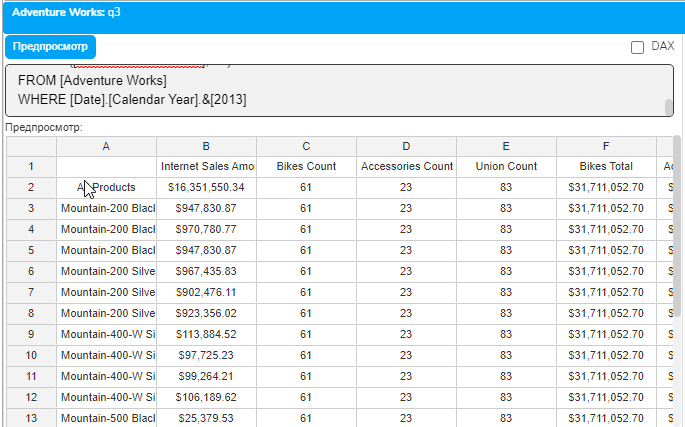
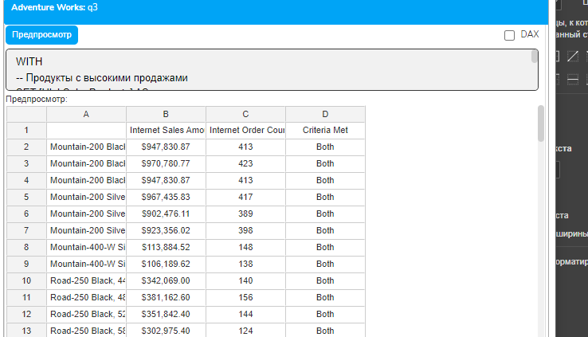
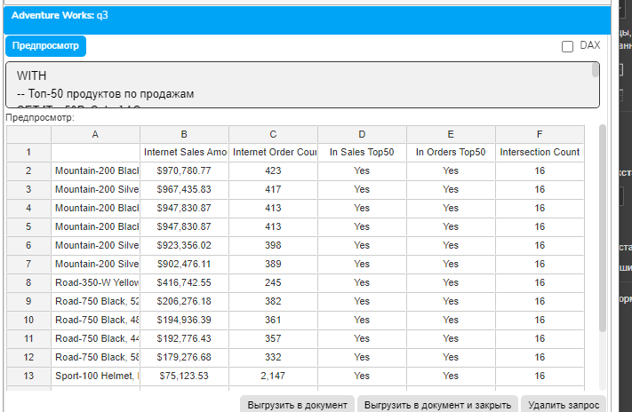
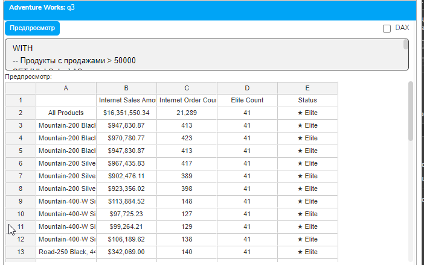
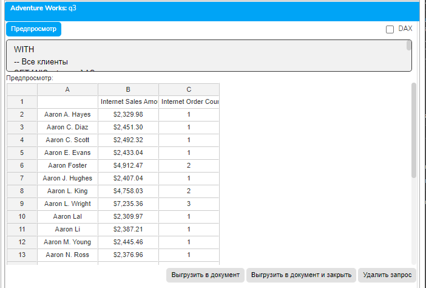
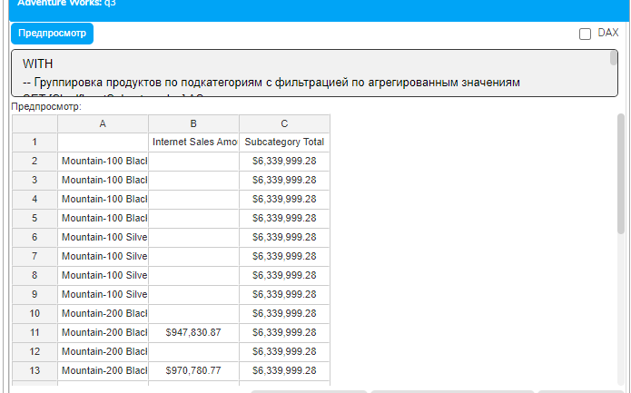
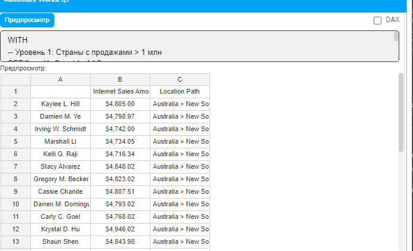
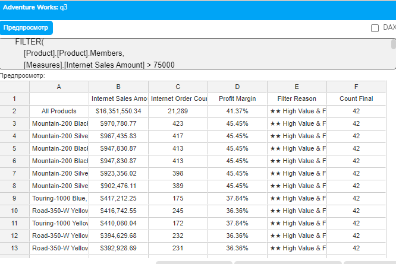
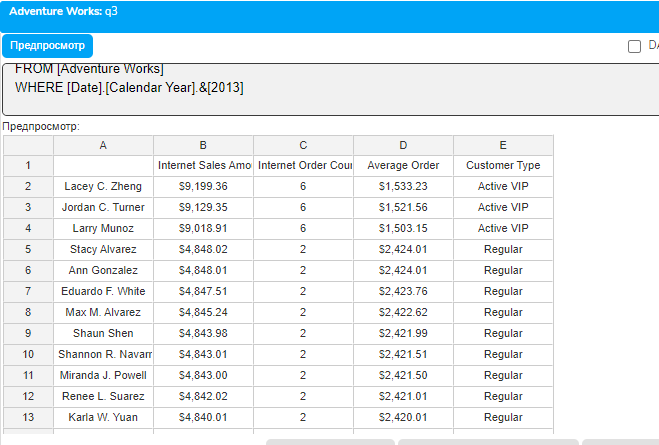

# Урок 4.7: Продвинутые техники фильтрации

Введение: Сложная логика фильтрации в MDX

В предыдущих уроках мы изучили базовую фильтрацию с помощью функции FILTER, динамическую фильтрацию и работу с большими наборами. Теперь пришло время освоить продвинутые техники, которые позволяют создавать сложную логику отбора данных, комбинируя множественные условия и наборы.

В реальных аналитических задачах часто требуется не просто отфильтровать данные по одному условию, а создать сложную логику: исключить определенные элементы, найти пересечение нескольких наборов, объединить результаты разных фильтров или применить фильтрацию после агрегации. Именно эти задачи решают функции, которые мы изучим в этом уроке.

Теоретические основы продвинутой фильтрации

Теория множеств в MDX

MDX работает с наборами (sets), и операции над ними основаны на классической теории множеств. Понимание этих операций критически важно для создания сложных фильтров:

Объединение (Union) — создает набор, содержащий все элементы из двух или более наборов. Дубликаты могут быть удалены или сохранены в зависимости от параметров.

Пересечение (Intersect) — создает набор, содержащий только те элементы, которые присутствуют во всех исходных наборах одновременно.

Разность (Except) — создает набор, содержащий элементы первого набора, которых нет во втором наборе.

Фильтрация после агрегации (Having) — позволяет применять условия к агрегированным включая дубликаты

```mdx
WITH
-- Набор велосипедов
SET [Bikes] AS
    FILTER(
        [Product].[Product].Members,
        ([Product].[Category].[Bikes], [Measures].[Internet Sales Amount]) > 0
    )
-- Набор аксессуаров
SET [Accessories] AS
    FILTER(
        [Product].[Product].Members,
        ([Product].[Category].[Accessories], [Measures].[Internet Sales Amount]) > 0
    )
-- Объединение наборов
SET [BikesAndAccessories] AS
    [Bikes] + [Accessories]
-- Подсчет элементов
MEMBER [Measures].[Bikes Count] AS
    COUNT([Bikes])
MEMBER [Measures].[Accessories Count] AS
    COUNT([Accessories])
MEMBER [Measures].[Union Count] AS
    COUNT([BikesAndAccessories])
-- Общие продажи велосипедов
MEMBER [Measures].[Bikes Total] AS
    SUM([Bikes], [Measures].[Internet Sales Amount]),
    FORMAT_STRING = "Currency"
-- Общие продажи аксессуаров
MEMBER [Measures].[Accessories Total] AS
    SUM([Accessories], [Measures].[Internet Sales Amount]),
    FORMAT_STRING = "Currency"
SELECT
    {[Measures].[Internet Sales Amount],
     [Measures].[Bikes Count],
     [Measures].[Accessories Count],
     [Measures].[Union Count],
     [Measures].[Bikes Total],
     [Measures].[Accessories Total]} ON COLUMNS,
    HEAD([BikesAndAccessories], 20) ON ROWS
FROM [Adventure Works]
WHERE [Date].[Calendar Year].&[2013]
```



Объединение результатов разных фильтров

UNION особенно полезен, когда нужно объединить результаты нескольких разных условий фильтрации:

```mdx
WITH
-- Продукты с высокими продажами
SET [HighSalesProducts] AS
    FILTER(
        [Product].[Product].[Product].Members,
        [Measures].[Internet Sales Amount] > 100000
    )
-- Продукты с большим количеством заказов
SET [PopularProducts] AS
    FILTER(
        [Product].[Product].[Product].Members,
        [Measures].[Internet Order Count] > 50
    )
-- Объединение: продукты, удовлетворяющие хотя бы одному условию
SET [HighSalesOrPopular] AS
    UNION([HighSalesProducts], [PopularProducts])
-- Метка для отслеживания критерия
MEMBER [Measures].[Criteria Met] AS
    CASE
        WHEN [Measures].[Internet Sales Amount] > 100000
             AND [Measures].[Internet Order Count] > 50
        THEN "Both"
        WHEN [Measures].[Internet Sales Amount] > 100000
```

        THEN "High Sales Only"

```mdx
        WHEN [Measures].[Internet Order Count] > 50
```

        THEN "Popular Only"

        ELSE "None"

```mdx
    END
SELECT
    {[Measures].[Internet Sales Amount],
     [Measures].[Internet Order Count],
     [Measures].[Criteria Met]} ON COLUMNS,
    NON EMPTY [HighSalesOrPopular] ON ROWS
FROM [Adventure Works]
WHERE [Date].[Calendar Year].&[2013]
```



Функция INTERSECT: Пересечение наборов

Базовое использование INTERSECT

## Функция INTERSECT возвращает только те элементы, которые присутствуют в обоих наборах

```mdx
WITH
-- Топ-50 продуктов по продажам
SET [Top50BySales] AS
    TOPCOUNT(
        [Product].[Product].[Product].Members,
        50,
        [Measures].[Internet Sales Amount]
    )
-- Топ-50 продуктов по количеству заказов
SET [Top50ByOrders] AS
    TOPCOUNT(
        [Product].[Product].[Product].Members,
        50,
        [Measures].[Internet Order Count]
    )
-- Пересечение: продукты в обоих топ-50
SET [TopInBoth] AS
    INTERSECT([Top50BySales], [Top50ByOrders])
-- Статистика
MEMBER [Measures].[In Sales Top50] AS
    IIF(COUNT(INTERSECT({[Product].[Product].CurrentMember}, [Top50BySales])) > 0, "Yes", "No")
MEMBER [Measures].[In Orders Top50] AS
    IIF(COUNT(INTERSECT({[Product].[Product].CurrentMember}, [Top50ByOrders])) > 0, "Yes", "No")
MEMBER [Measures].[Intersection Count] AS
    COUNT([TopInBoth])
SELECT
    {[Measures].[Internet Sales Amount],
     [Measures].[Internet Order Count],
     [Measures].[In Sales Top50],
     [Measures].[In Orders Top50],
     [Measures].[Intersection Count]} ON COLUMNS,
    [TopInBoth] ON ROWS
FROM [Adventure Works]
WHERE [Date].[Calendar Year].&[2013]
```



Множественное пересечение

## Для пересечения более двух наборов используем вложенные вызовы INTERSECT

```mdx
WITH
-- Продукты с продажами > 50000
SET [HighSales] AS
    FILTER(
        [Product].[Product].Members,
        [Measures].[Internet Sales Amount] > 50000
    )
-- Продукты с количеством заказов > 30
SET [ManyOrders] AS
    FILTER(
        [Product].[Product].Members,
        [Measures].[Internet Order Count] > 30
    )
-- Велосипеды
SET [BikeProducts] AS
    FILTER(
        [Product].[Product].Members,
        ([Product].[Category].[Bikes], [Measures].[Internet Sales Amount]) > 0
    )
-- Пересечение: высокие продажи И много заказов
SET [HighSalesAndOrders] AS
    FILTER(
        [Product].[Product].Members,
        [Measures].[Internet Sales Amount] > 50000 AND
        [Measures].[Internet Order Count] > 30
    )
-- Элитные велосипеды (все 3 условия)
SET [EliteBikes] AS
    FILTER(
        [BikeProducts],
        [Measures].[Internet Sales Amount] > 50000 AND
        [Measures].[Internet Order Count] > 30
    )
MEMBER [Measures].[Elite Count] AS
    COUNT([EliteBikes])
MEMBER [Measures].[Status] AS
    IIF(
        [Measures].[Internet Sales Amount] > 50000 AND [Measures].[Internet Order Count] > 30,
        "★ Elite",
        "Standard"
    )
SELECT
    {[Measures].[Internet Sales Amount],
     [Measures].[Internet Order Count],
     [Measures].[Elite Count],
     [Measures].[Status]} ON COLUMNS,
    [EliteBikes] ON ROWS
FROM [Adventure Works]
WHERE [Date].[Calendar Year].&[2013]
```



Использование EXCEPT для очистки данных

## EXCEPT часто применяется для исключения нежелательных элементов

```mdx
WITH
-- Все клиенты
SET [AllCustomers] AS
    [Customer].[Customer].[Customer].Members
-- Клиенты без покупок в 2013 году
SET [InactiveCustomers] AS
    FILTER(
        [Customer].[Customer].[Customer].Members,
        ([Measures].[Internet Sales Amount], [Date].[Calendar Year].&[2013]) = 0
        OR
        ISEMPTY(([Measures].[Internet Sales Amount], [Date].[Calendar Year].&[2013]))
    )
-- Активные клиенты (исключаем неактивных)
SET [ActiveCustomers] AS
    EXCEPT([AllCustomers], [InactiveCustomers])
-- Дополнительная фильтрация активных клиентов
SET [PremiumActiveCustomers] AS
    FILTER(
        [ActiveCustomers],
        [Measures].[Internet Sales Amount] > 2000
    )
SELECT
    {[Measures].[Internet Sales Amount],
     [Measures].[Internet Order Count]} ON COLUMNS,
    HEAD([PremiumActiveCustomers], 25) ON ROWS
FROM [Adventure Works]
WHERE [Date].[Calendar Year].&[2013]
```



Функция HAVING: Фильтрация после агрегации

Концепция HAVING в MDX

HAVING позволяет фильтровать данные после выполнения агрегации, что критически важно при работе с группированными данными:

```mdx
WITH
-- Группировка продуктов по подкатегориям с фильтрацией по агрегированным значениям
SET [SignificantSubcategories] AS
    FILTER(
        [Product].[Product Categories].[Subcategory].Members,
        SUM(
            DESCENDANTS(
                [Product].[Product Categories].CurrentMember,
                [Product].[Product Categories].[Product]
            ),
            [Measures].[Internet Sales Amount]
        ) > 500000
    )
-- Альтернативный подход с использованием HAVING-подобной логики
SET [ProductsInSignificantSubcategories] AS
    GENERATE(
        [SignificantSubcategories],
        DESCENDANTS(
            [Product].[Product Categories].CurrentMember,
            [Product].[Product Categories].[Product]
        )
    )
-- Сумма по подкатегории
MEMBER [Measures].[Subcategory Total] AS
    SUM(
        DESCENDANTS(
            ANCESTOR(
                [Product].[Product Categories].CurrentMember,
                [Product].[Product Categories].[Subcategory]
            ),
            [Product].[Product Categories].[Product]
        ),
        [Measures].[Internet Sales Amount]
    )
SELECT
    {[Measures].[Internet Sales Amount],
     [Measures].[Subcategory Total]} ON COLUMNS,
    HEAD([ProductsInSignificantSubcategories], 30) ON ROWS
FROM [Adventure Works]
WHERE [Date].[Calendar Year].&[2013]
```



Каскадная фильтрация: Создание зависимых фильтров

Концепция каскадной фильтрации

Каскадная фильтрация — это техника, при которой каждый последующий фильтр применяется к результату предыдущего, создавая цепочку зависимых условий:

```mdx
WITH
-- Уровень 1: Страны с продажами > 1 млн
SET [Level1_Countries] AS
    FILTER(
        [Customer].[Customer Geography].[Country].Members,
        [Measures].[Internet Sales Amount] > 1000000
    )
-- Уровень 2: Штаты в отобранных странах с продажами > 100000
SET [Level2_States] AS
    FILTER(
        GENERATE(
            [Level1_Countries],
            DESCENDANTS(
                [Customer].[Customer Geography].CurrentMember,
                [Customer].[Customer Geography].[State-Province]
            )
        ),
        [Measures].[Internet Sales Amount] > 100000
    )
-- Уровень 3: Города в отобранных штатах с продажами > 50000
SET [Level3_Cities] AS
    FILTER(
        GENERATE(
            [Level2_States],
            DESCENDANTS(
                [Customer].[Customer Geography].CurrentMember,
                [Customer].[Customer Geography].[City]
            )
        ),
        [Measures].[Internet Sales Amount] > 50000
    )
-- Уровень 4: Топ-5 клиентов в каждом отобранном городе
SET [Level4_TopCustomers] AS
    GENERATE(
        [Level3_Cities],
        TOPCOUNT(
            DESCENDANTS(
                [Customer].[Customer Geography].CurrentMember,
                [Customer].[Customer Geography].[Customer]
            ),
            5,
            [Measures].[Internet Sales Amount]
        )
    )
-- Путь в иерархии
MEMBER [Measures].[Location Path] AS
    ANCESTOR(
        [Customer].[Customer Geography].CurrentMember,
        [Customer].[Customer Geography].[Country]
```

    ).Name + " &gt; " +

    ANCESTOR(

```mdx
        [Customer].[Customer Geography].CurrentMember,
        [Customer].[Customer Geography].[State-Province]
```

    ).Name + " &gt; " +

    ANCESTOR(

```mdx
        [Customer].[Customer Geography].CurrentMember,
        [Customer].[Customer Geography].[City]
    ).Name
SELECT
    {[Measures].[Internet Sales Amount],
     [Measures].[Location Path]} ON COLUMNS,
    HEAD([Level4_TopCustomers], 30) ON ROWS
FROM [Adventure Works]
WHERE [Date].[Calendar Year].&[2013]
```



Комбинирование продвинутых техник

Сложная логика с множественными операциями

## Реальные задачи часто требуют комбинирования всех изученных техник

```mdx
WITH
-- Продукты с высокими продажами > 75k
SET [HighValueProducts] AS
    FILTER(
        [Product].[Product].Members,
        [Measures].[Internet Sales Amount] > 75000
    )
-- Продукты с частыми заказами > 40
SET [FrequentProducts] AS
    FILTER(
        [Product].[Product].Members,
        [Measures].[Internet Order Count] > 40
    )
-- Велосипеды с продажами > 50k
SET [HighValueBikes] AS
    FILTER(
        [Product].[Product].Members,
        ([Product].[Category].[Bikes], [Measures].[Internet Sales Amount]) > 0 AND
        [Measures].[Internet Sales Amount] > 50000
    )
-- Маржа
MEMBER [Measures].[Profit Margin] AS
    IIF(
        [Measures].[Internet Sales Amount] = 0,
        NULL,
        ([Measures].[Internet Sales Amount] - [Measures].[Internet Total Product Cost]) /
        [Measures].[Internet Sales Amount]
    ),
    FORMAT_STRING = "Percent"
-- Финальный фильтр: (высокие продажи И частые заказы) ИЛИ (велосипеды > 50k)
-- И маржа >= 20%
SET [FinalFilter] AS
    FILTER(
        [Product].[Product].Members,
        (
            ([Measures].[Internet Sales Amount] > 75000 AND [Measures].[Internet Order Count] > 40) OR
            (([Product].[Category].[Bikes], [Measures].[Internet Sales Amount]) > 0 AND [Measures].[Internet Sales Amount] > 50000)
        ) AND
        [Measures].[Profit Margin] >= 0.2
    )
-- Причина включения
MEMBER [Measures].[Filter Reason] AS
    IIF(
        [Measures].[Internet Sales Amount] > 75000 AND [Measures].[Internet Order Count] > 40,
        "★★ High Value & Frequent",
        IIF(
            ([Product].[Category].[Bikes], [Measures].[Internet Sales Amount]) > 0 AND [Measures].[Internet Sales Amount] > 50000,
            "★ Bike > 50K",
            "Other"
        )
    )
-- Статистика
MEMBER [Measures].[Count High Value] AS
    COUNT([HighValueProducts])
MEMBER [Measures].[Count Frequent] AS
    COUNT([FrequentProducts])
MEMBER [Measures].[Count Bikes] AS
    COUNT([HighValueBikes])
MEMBER [Measures].[Count Final] AS
    COUNT([FinalFilter])
SELECT
    {[Measures].[Internet Sales Amount],
     [Measures].[Internet Order Count],
     [Measures].[Profit Margin],
     [Measures].[Filter Reason],
     [Measures].[Count Final]} ON COLUMNS,
    HEAD(
        ORDER(
            [FinalFilter],
            [Measures].[Internet Sales Amount],
            BDESC
        ),
        25
    ) ON ROWS
FROM [Adventure Works]
WHERE [Date].[Calendar Year].&[2013]
```



Практический пример: Комплексный анализ клиентской базы

```mdx
WITH
-- Этап 1: Базовая сегментация
SET [VIPCustomers] AS
    TOPCOUNT(
        [Customer].[Customer].[Customer].Members,
        100,
        [Measures].[Internet Sales Amount]
    )
SET [RegularCustomers] AS
    FILTER(
        EXCEPT(
            [Customer].[Customer].[Customer].Members,
            [VIPCustomers]
        ),
        [Measures].[Internet Sales Amount] > 500
    )
-- Этап 2: Анализ активности
SET [ActiveVIP] AS
    FILTER(
        [VIPCustomers],
        [Measures].[Internet Order Count] > 5
    )
SET [InactiveVIP] AS
    EXCEPT([VIPCustomers], [ActiveVIP])
-- Этап 3: Объединение для финального анализа
SET [TargetCustomers] AS
    UNION(
        [ActiveVIP],
        TOPCOUNT([RegularCustomers], 50, [Measures].[Internet Sales Amount])
    )
-- Метрики
MEMBER [Measures].[Customer Type] AS
    CASE
        WHEN COUNT(INTERSECT({[Customer].[Customer].CurrentMember}, [ActiveVIP])) > 0
```

        THEN "Active VIP"

```mdx
        WHEN COUNT(INTERSECT({[Customer].[Customer].CurrentMember}, [InactiveVIP])) > 0
```

        THEN "Inactive VIP"

```mdx
        WHEN COUNT(INTERSECT({[Customer].[Customer].CurrentMember}, [RegularCustomers])) > 0
        THEN "Regular"
        ELSE "Other"
    END
MEMBER [Measures].[Average Order] AS
    IIF(
        [Measures].[Internet Order Count] = 0,
        0,
        [Measures].[Internet Sales Amount] / [Measures].[Internet Order Count]
    ),
    FORMAT_STRING = "Currency"
SELECT
    {[Measures].[Internet Sales Amount],
     [Measures].[Internet Order Count],
     [Measures].[Average Order],
     [Measures].[Customer Type]} ON COLUMNS,
    HEAD([TargetCustomers], 30) ON ROWS
FROM [Adventure Works]
WHERE [Date].[Calendar Year].&[2013]
```



Заключение

## В этом уроке мы изучили продвинутые техники фильтрации в MDX

UNION — для объединения наборов и создания OR-логики в фильтрах

INTERSECT — для нахождения общих элементов и создания AND-логики

EXCEPT — для исключения нежелательных элементов

HAVING-подобная логика — для фильтрации после агрегации

Каскадная фильтрация — для создания многоуровневых зависимых фильтров

Эти техники позволяют создавать сложную бизнес-логику отбора данных, комбинируя различные условия и критерии. Понимание и правильное применение этих функций делает MDX мощным инструментом для решения комплексных аналитических задач.

Домашнее задание

Базовый уровень: Создайте запрос, который находит продукты, входящие в топ-20 по продажам ИЛИ в топ-20 по количеству заказов, но исключает продукты категории "Clothing".

Средний уровень: Реализуйте трехуровневую каскадную фильтрацию для анализа продуктов: категория &gt; подкатегория &gt; продукт, где на каждом уровне применяются разные пороговые значения.

Продвинутый уровень: Создайте систему комплексной фильтрации клиентов, которая использует все изученные функции для выявления целевой аудитории для маркетинговой кампании.
