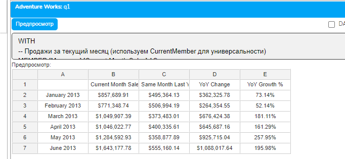
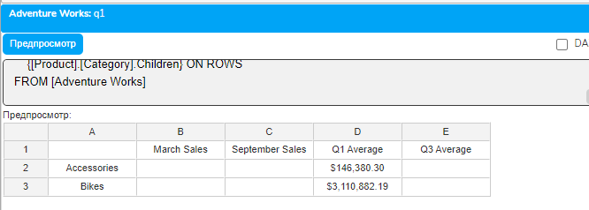
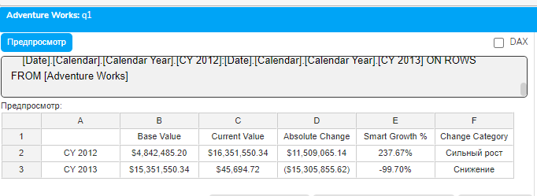

# Урок 5.2: Функции ParallelPeriod и сравнительный анализ

Введение

Сравнительный анализ периодов — это основа управленческой отчетности. Каждый руководитель хочет знать: растет ли бизнес по сравнению с прошлым годом? Как текущий квартал соотносится с аналогичным кварталом прошлого года? Есть ли сезонные паттерны в данных? Эти вопросы требуют сравнения не просто с предыдущим периодом, а с параллельным периодом в другом временном цикле.

В предыдущем уроке мы изучили функцию Lag, которая может сместить нас на 12 месяцев назад. Но что если нужно сравнить квартал с кварталом год назад? Или найти соответствующий день в прошлом месяце? Именно для таких задач MDX предоставляет специализированные функции ParallelPeriod и Cousin, которые понимают структуру временной иерархии и находят соответствующие периоды на разных уровнях. В этом уроке мы детально изучим эти инструменты и научимся создавать профессиональные сравнительные отчеты.

Теоретическая часть

Функция ParallelPeriod: синтаксис и механизм работы

ParallelPeriod — это специализированная функция для нахождения параллельного периода в прошлом или будущем. Её синтаксис:

```mdx
ParallelPeriod([Level_Expression], Index, Member_Expression)
```

## Параметры

Level_Expression (необязательный) — уровень иерархии, на котором происходит сдвиг. Если не указан, используется уровень родителя текущего члена.

Index (необязательный) — количество периодов для сдвига. По умолчанию 1. Положительное число — сдвиг в прошлое, отрицательное — в будущее.

Member_Expression (необязательный) — член, для которого ищется параллельный период. По умолчанию — текущий член контекста.

## Как работает ParallelPeriod

Находит предка указанного члена на заданном уровне

Сдвигается на указанное количество периодов на этом уровне

Спускается вниз к потомку в той же относительной позиции

## Например, для March 2013 с уровнем Year

Поднимается до года CY 2013

Сдвигается на один год назад к CY 2012

Спускается к March 2012 (третий месяц первого квартала)

Сравнение функций временной навигации

Функция

Использование

Преимущества

Недостатки

Lag

[Member].Lag(n) - смещение на n позиций назад

Простота использования; Предсказуемый результат; Работает с любыми упорядоченными иерархиями

Не учитывает структуру иерархии; Требует точного расчета позиций; Может дать неожиданный результат при изменении структуры

ParallelPeriod

ParallelPeriod([Level], n, [Member]) - параллельный период на уровне

Понимает временную структуру; Автоматически находит соответствующий период; Работает с разными уровнями

Только для временных иерархий; Требует правильного указания уровня; Может вернуть NULL для граничных периодов

Cousin

Cousin([Member1], [Member2]) - аналогичная позиция в другой ветви

Универсальность - работает с любыми иерархиями; Гибкость в выборе целевой ветви

Сложнее в понимании; Требует явного указания обоих членов; Не имеет встроенного смещения

Функция Cousin: универсальная навигация

## Cousin — это более общая функция для навигации по параллельным ветвям любой иерархии

```mdx
Cousin(Member_Expression1, Member_Expression2)
```

Важно: Member_Expression2 должен быть предком на том же уровне, что и родитель Member_Expression1.

Функция находит потомка Member_Expression2, который занимает ту же относительную позицию, что и Member_Expression1 относительно своего родителя.

## Правильный пример работы Cousin

```mdx
Cousin([Date].[Calendar].[Month].[March 2013],
       [Date].[Calendar].[Calendar Quarter].[Q3 CY 2013])
```

Здесь March 2013 — третий месяц в Q1 CY 2013, поэтому Cousin вернет September 2013 — третий месяц в Q3 CY 2013.

Типичные сценарии использования

Год к году (Year-over-Year, YoY): Самый распространенный тип анализа. Сравнивает текущий период с аналогичным периодом прошлого года, нивелируя сезонность. Используется для оценки реального роста бизнеса.

Квартал к кварталу прошлого года: Сравнивает квартал не с предыдущим кварталом (QoQ), а с тем же кварталом год назад. Важно для бизнесов с квартальной цикличностью.

Месяц к месяцу прошлого года: Детальное сравнение на месячном уровне. Позволяет выявить аномалии и тренды в конкретных месяцах.

Обработка граничных случаев

Отсутствующие данные: Если параллельного периода не существует (например, данные начинаются с 2012 года, а мы ищем параллельный период для января 2012), функция вернет NULL. Всегда проверяйте на NULL перед вычислениями.

Деление на ноль: При расчете процентного изменения, если базовый период равен нулю, используйте IIF для обработки:

```mdx
IIF([Base Period] = 0 OR ISEMPTY([Base Period]), NULL,
    ([Current] - [Base]) / [Base])
```

Отрицательные базовые значения: Когда базовый период отрицательный, процентное изменение может вводить в заблуждение. Например, изменение с -100 на 100 даст -200%, что контринтуитивно. Рекомендуется использовать абсолютные изменения или специальную логику:

```mdx
IIF([Base] < 0 AND [Current] > 0, "Переход в прибыль",
    IIF([Base] < 0 AND [Current] < 0,
        ([Base] - [Current]) / ABS([Base]),
        ([Current] - [Base]) / ABS([Base])))
```

Частые ошибки и их решения

Ошибка 1: Неправильное форматирование процентов Неправильно: FORMAT_STRING = "#,##0.00%" — умножает на 100 дважды Правильно: FORMAT_STRING = "Percent" — автоматическое форматирование

Ошибка 2: Путаница с направлением сдвига в ParallelPeriod Запомните: положительный Index — это движение в прошлое, отрицательный — в будущее. Это противоположно интуиции!

Ошибка 3: Использование ParallelPeriod без указания уровня Без явного указания уровня функция использует уровень родителя, что может дать неожиданный результат. Всегда указывайте уровень явно для предсказуемости.

Ошибка 4: Неправильное использование Cousin Второй параметр должен быть на уровне родителя первого параметра, а не произвольным членом иерархии.

Особенности работы с фискальными календарями

⚠️ ВАЖНО: Фискальные календари

При работе с фискальными календарями функция ParallelPeriod может давать неожиданные результаты. Фискальный год часто начинается не 1 января, и кварталы могут иметь разное количество недель (4-4-5 или 5-4-4 схемы). В таких случаях:

Всегда тестируйте результаты на граничных периодах

Учитывайте, что параллельный период может иметь разное количество дней

Рассмотрите использование Cousin с явным указанием целевых периодов

Документируйте логику сравнения для пользователей отчетов

Практическая часть

Пример 1: Правильный расчет роста год к году

```mdx
WITH
-- Продажи за текущий месяц (используем CurrentMember для универсальности)
MEMBER [Measures].[Current Month Sales] AS
    [Measures].[Internet Sales Amount],
    FORMAT_STRING = "Currency"
-- Продажи за аналогичный месяц прошлого года
-- Явно указываем уровень Year для предсказуемости
MEMBER [Measures].[Same Month Last Year] AS
    (ParallelPeriod(
        [Date].[Calendar].[Calendar Year],  -- Уровень сдвига
```

        1,                                   -- Один год назад

```mdx
        [Date].[Calendar].CurrentMember),   -- Текущий член
     [Measures].[Internet Sales Amount]),
    FORMAT_STRING = "Currency"
-- Абсолютное изменение
MEMBER [Measures].[YoY Change] AS
    [Measures].[Current Month Sales] - [Measures].[Same Month Last Year],
    FORMAT_STRING = "Currency"
-- Процент роста с правильным форматированием
-- FORMAT_STRING = "Percent" автоматически умножает на 100
MEMBER [Measures].[YoY Growth %] AS
    IIF(
        ISEMPTY([Measures].[Same Month Last Year]) OR
        [Measures].[Same Month Last Year] = 0,
        NULL,
        ([Measures].[YoY Change] / [Measures].[Same Month Last Year])
    ),
    FORMAT_STRING = "Percent"  -- Правильное форматирование процентов
-- Простой способ выбрать месяцы 2013 года
SET [First Half 2013] AS
    [Date].[Calendar].[Month].[January 2013]:
    [Date].[Calendar].[Month].[June 2013]
SELECT
    {[Measures].[Current Month Sales],
     [Measures].[Same Month Last Year],
     [Measures].[YoY Change],
     [Measures].[YoY Growth %]} ON COLUMNS,
    [First Half 2013] ON ROWS
FROM [Adventure Works]
```



Примера 2: Правильное использование Cousin для квартального анализа

```mdx
WITH
-- Q1 2013
SET [Q1 Months] AS
    [Date].[Calendar].[Calendar Year].&[2013].FirstChild.Children
-- Q3 2013
SET [Q3 Months] AS
    [Date].[Calendar].[Calendar Year].&[2013].Children.Item(2).Children
-- Продажи за март (последний месяц Q1)
MEMBER [Measures].[March Sales] AS
    ([Measures].[Internet Sales Amount],
     [Q1 Months].Item(2)),
    FORMAT_STRING = "Currency"
-- Продажи за сентябрь (последний месяц Q3)
MEMBER [Measures].[September Sales] AS
    ([Measures].[Internet Sales Amount],
     [Q3 Months].Item(2)),
    FORMAT_STRING = "Currency"
-- Средние продажи Q1
MEMBER [Measures].[Q1 Average] AS
    AVG([Q1 Months], [Measures].[Internet Sales Amount]),
    FORMAT_STRING = "Currency"
-- Средние продажи Q3
MEMBER [Measures].[Q3 Average] AS
    AVG([Q3 Months], [Measures].[Internet Sales Amount]),
    FORMAT_STRING = "Currency"
SELECT
    {[Measures].[March Sales],
     [Measures].[September Sales],
     [Measures].[Q1 Average],
     [Measures].[Q3 Average]} ON COLUMNS,
    {[Product].[Category].Children} ON ROWS
FROM [Adventure Works]
```



Пример 3: Обработка отрицательных значений и особых случаев

```mdx
WITH
-- Имитация отрицательного базового значения через вычисление
MEMBER [Measures].[Base Value] AS
```

    [Measures].[Internet Sales Amount] - 1000000,  -- Может быть отрицательным

```mdx
    FORMAT_STRING = "Currency"
-- Текущее значение
MEMBER [Measures].[Current Value] AS
    (ParallelPeriod(
        [Date].[Calendar].[Calendar Year],
        -1,  -- Один год ВПЕРЕД
        [Date].[Calendar].CurrentMember),
     [Measures].[Internet Sales Amount]),
    FORMAT_STRING = "Currency"
-- Абсолютное изменение (всегда корректно)
MEMBER [Measures].[Absolute Change] AS
    [Measures].[Current Value] - [Measures].[Base Value],
    FORMAT_STRING = "Currency"
-- Обработка процентного изменения с отрицательной базой
MEMBER [Measures].[Smart Growth %] AS
    CASE
        WHEN ISEMPTY([Measures].[Base Value]) OR
             ISEMPTY([Measures].[Current Value])
            THEN NULL
        WHEN [Measures].[Base Value] = 0
            THEN IIF([Measures].[Current Value] > 0, 1, 0)  -- 100% или 0%
        WHEN [Measures].[Base Value] < 0 AND [Measures].[Current Value] >= 0
            THEN 1  -- Переход из убытка в прибыль = 100% улучшение
        WHEN [Measures].[Base Value] < 0 AND [Measures].[Current Value] < 0
            THEN ([Measures].[Base Value] - [Measures].[Current Value]) /
                 ABS([Measures].[Base Value])  -- Улучшение убытка
        ELSE ([Measures].[Current Value] - [Measures].[Base Value]) /
             [Measures].[Base Value]
    END,
    FORMAT_STRING = "Percent"
-- Категория изменения для отчетности
MEMBER [Measures].[Change Category] AS
    CASE
        WHEN [Measures].[Base Value] < 0 AND [Measures].[Current Value] >= 0
```

            THEN "Выход в прибыль"

```mdx
        WHEN [Measures].[Base Value] >= 0 AND [Measures].[Current Value] < 0
```

            THEN "Уход в убыток"

```mdx
        WHEN [Measures].[Smart Growth %] > 0.2
```

            THEN "Сильный рост"

```mdx
        WHEN [Measures].[Smart Growth %] > 0
```

            THEN "Умеренный рост"

```mdx
        WHEN [Measures].[Smart Growth %] > -0.2
```

            THEN "Стабильно"

        ELSE "Снижение"

```mdx
    END
SELECT
    {[Measures].[Base Value],
     [Measures].[Current Value],
     [Measures].[Absolute Change],
     [Measures].[Smart Growth %],
     [Measures].[Change Category]} ON COLUMNS,
    [Date].[Calendar].[Calendar Year].[CY 2012]:[Date].[Calendar].[Calendar Year].[CY 2013] ON ROWS
FROM [Adventure Works]
```



Заключение

В этом уроке мы освоили мощные инструменты для сравнительного временного анализа. ParallelPeriod — это специализированная функция, которая понимает структуру временной иерархии и находит соответствующие периоды на любом уровне. В отличие от простого Lag, она гарантирует корректное сопоставление периодов независимо от их положения в иерархии. Cousin предоставляет дополнительную гибкость для навигации по параллельным ветвям любых иерархий.

Мы также изучили важные аспекты работы с процентными изменениями, включая правильное форматирование через FORMAT_STRING = "Percent" и обработку особых случаев с отрицательными и нулевыми базовыми значениями. Понимание этих нюансов критически важно для создания надежных аналитических отчетов.

В следующем уроке мы изучим функцию PeriodsToDate, которая позволит создавать накопительные итоги — еще один важнейший элемент временного анализа.
