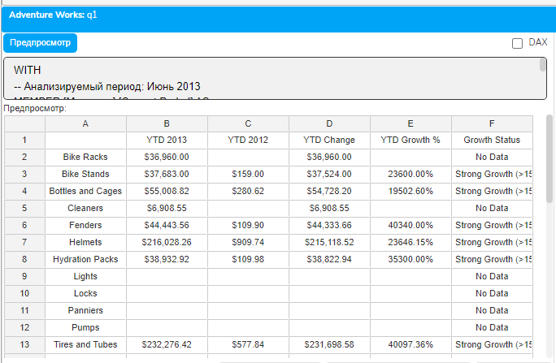
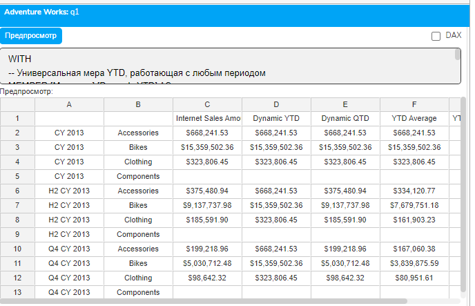
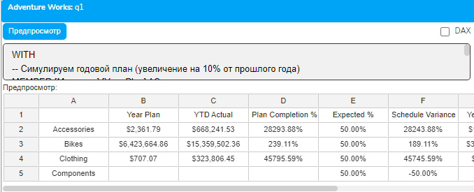

# Урок 5.3: Накопительные итоги и функция PeriodsToDate

Введение

Накопительные итоги — это фундаментальный инструмент управленческой отчетности, без которого невозможно представить современный бизнес-анализ. Каждый день руководители задают вопросы: "Какова выручка с начала года?", "Выполняем ли мы квартальный план продаж?", "Как текущие накопительные показатели соотносятся с прошлогодними?" Эти метрики — YTD (Year-to-Date), QTD (Quarter-to-Date) и MTD (Month-to-Date) — являются ключевыми индикаторами здоровья бизнеса и основой для принятия стратегических решений.

Представьте типичную ситуацию: сейчас июнь, и финансовый директор хочет понять, идет ли компания по плану выполнения годового бюджета. Простого сравнения июня с маем недостаточно — нужно видеть накопленный результат за полгода, сравнить его с половиной годового плана и с аналогичным периодом прошлого года. В Excel такой расчет потребовал бы создания дополнительных столбцов с формулами СУММ, которые нужно было бы постоянно корректировать при изменении периода анализа.

MDX решает эту задачу элегантно с помощью функции PeriodsToDate, которая автоматически определяет начало периода и создает диапазон от него до указанной точки. Это не просто экономия времени — это гарантия корректности расчетов, особенно при работе со сложными календарными структурами, неполными периодами и параллельными сравнениями. В этом уроке мы детально изучим механизм работы PeriodsToDate и научимся создавать профессиональные отчеты с накопительными итогами.

Теоретическая часть

A. Функция PeriodsToDate: синтаксис и механизм работы

Функция PeriodsToDate — это специализированный инструмент MDX для создания накопительных диапазонов. Её полный синтаксис:

```mdx
PeriodsToDate([Level_Expression], [Member_Expression])
```

## Параметры

Level_Expression (необязательный) — уровень иерархии, определяющий границы периода. Если не указан, используется уровень родителя текущего члена.

Member_Expression (необязательный) — конечная точка диапазона. Если не указана, используется текущий член из контекста.

## Механизм работы PeriodsToDate (пошагово)

Определение родителя на указанном уровне: Функция находит предка Member_Expression на уровне Level_Expression

Поиск первого потомка: Определяет первого потомка этого предка на уровне Member_Expression

Создание диапазона: Формирует набор от первого потомка до Member_Expression включительно

## Визуализация работы PeriodsToDate

Inform 7

```mdx
Уровень Year: [CY 2013]
           |
Уровень Quarter: [Q1] -- [Q2] -- [Q3] -- [Q4]
                  |       |
Уровень Month: [Jan][Feb][Mar] [Apr][May][Jun]
                                          ↑
                            Member_Expression (June 2013)
```

                ←------------ Результат -----------→

```mdx
              [Jan][Feb][Mar][Apr][May][Jun]
```

## Отличие от простого диапазона через 

## Диапазон через двоеточие требует явного указания обеих границ

```mdx
[Date].[Calendar].[Calendar Year].&[2013].FirstChild.FirstChild :
[Date].[Calendar].[Calendar Year].&[2013].Children.Item(1).LastChild
```

## PeriodsToDate автоматически находит начальную точку

```mdx
PeriodsToDate(
    [Date].[Calendar].[Calendar Year],
    [Date].[Calendar].[Calendar Year].&[2013].Children.Item(1).LastChild
)
```

B. Стандартные накопительные периоды

YTD (Year-to-Date) — накопительный итог с начала года до указанной даты. Используется для оценки годовой динамики и выполнения годовых планов.

QTD (Quarter-to-Date) — накопительный итог с начала квартала. Критичен для компаний с квартальной отчетностью и квартальными бонусами.

MTD (Month-to-Date) — накопительный итог с начала месяца. Применяется для оперативного мониторинга и ежедневных дашбордов.

WTD (Week-to-Date) — накопительный итог с начала недели. Популярен в ритейле и операционной отчетности.

Создание пользовательских периодов возможно через указание любого уровня иерархии. Например, "Semester-to-Date" для полугодовых итогов.

C. Альтернативные подходы

## MDX предоставляет несколько способов расчета накопительных итогов

Подход

Синтаксис

Преимущества

Недостатки

PeriodsToDate

```mdx
PeriodsToDate([Level], [Member])
```

Универсальность, читаемость

Требует указания уровня

## Диапазон через 

```mdx
[FirstMember]:[LastMember]
```

Полный контроль границ

Нужно знать обе границы

Функция YTD()

```mdx
YTD([Member])
```

Краткость для года

Только для года

Функция QTD()

```mdx
QTD([Member])
```

Краткость для квартала

Только для квартала

Функция MTD()

```mdx
MTD([Member])
```

Краткость для месяца

Только для месяца

## Когда использовать каждый подход

PeriodsToDate — когда нужна гибкость и универсальность

Специализированные функции (YTD, QTD, MTD) — для стандартных отчетов

Диапазоны — когда границы известны заранее или нестандартные

⚠️ Частая ошибка: Путаница между PeriodsToDate и YTD()

## YTD() — это просто сокращение для PeriodsToDate с уровнем Year

```mdx
YTD([Member]) эквивалентно PeriodsToDate([Year Level], [Member])
```

YTD() менее гибкая — работает только с годом

PeriodsToDate позволяет указать любой уровень

D. Производительность и оптимизация

Накопительные итоги могут существенно влиять на производительность, особенно при работе с большими объемами данных.

## Факторы, влияющие на производительность

Размер диапазона (год содержит больше периодов, чем квартал)

Количество измерений в запросе

Сложность вычислений внутри агрегации

Наличие индексов и агрегаций в кубе

💡 Pro Tip: Кэширование накопительных вычислений

## Если накопительные итоги используются в нескольких мерах, создайте именованный набор

```mdx
SET [YTD_Periods] AS PeriodsToDate([Date].[Calendar].[Calendar Year], [Date].[Calendar].CurrentMember)
MEMBER [Measures].[YTD Sales] AS SUM([YTD_Periods], [Measures].[Sales])
MEMBER [Measures].[YTD Profit] AS SUM([YTD_Periods], [Measures].[Profit])
```

Это позволит рассчитать диапазон только один раз.

## Best practices для оптимизации

Используйте агрегации на уровне куба для часто используемых YTD

Ограничивайте диапазон, если полный период не нужен

Применяйте NON EMPTY для исключения пустых периодов

Рассмотрите создание физических YTD мер при ETL

E. Комбинирование с другими временными функциями

## PeriodsToDate отлично сочетается с функциями из предыдущих уроков

## PeriodsToDate + ParallelPeriod

```mdx
-- YTD прошлого года для сравнения
PeriodsToDate(
    [Date].[Calendar].[Calendar Year],
    ParallelPeriod([Date].[Calendar].[Calendar Year], 1, [Current Period])
)
```

## Расчет процента выполнения плана

```mdx
-- YTD факт / Годовой план
[Measures].[YTD Actual] / [Measures].[Year Plan]
```

## Средние накопительные значения

```mdx
-- Среднемесячные продажи YTD
[Measures].[YTD Sales] / COUNT(PeriodsToDate(...))
```

F. Обработка особых случаев

Неполные периоды: Текущий месяц или квартал могут быть неполными. При сравнении с прошлым годом это может привести к некорректным выводам. Решение — использовать ParallelPeriod для получения того же дня в прошлом периоде.

Фискальные календари: Многие компании используют фискальный год, начинающийся не 1 января. PeriodsToDate корректно работает с любой структурой календаря, если она правильно определена в кубе.

NULL значения в диапазоне: Если в диапазоне есть периоды без данных, SUM вернет NULL. Используйте CoalesceEmpty или IIF для замены NULL на 0.

## Граничные случаи

Начало данных: PeriodsToDate может вернуть неполный диапазон

Будущие периоды: Проверяйте на ISEMPTY перед вычислениями

Практическая часть

```mdx
WITH
-- YTD (Year-To-Date) через PeriodsToDate
MEMBER [Measures].[YTD Sales] AS
    SUM(
        PeriodsToDate(
            [Date].[Calendar].[Calendar Year],
            [Date].[Calendar].[Month].[June 2013]
        ),
        [Measures].[Internet Sales Amount]
    ),
    FORMAT_STRING = "Currency"
-- QTD (Quarter-To-Date) через PeriodsToDate
MEMBER [Measures].[QTD Sales] AS
    SUM(
        PeriodsToDate(
            [Date].[Calendar].[Calendar Quarter],
            [Date].[Calendar].[Month].[June 2013]
        ),
        [Measures].[Internet Sales Amount]
    ),
    FORMAT_STRING = "Currency"
-- Альтернативный YTD через явный диапазон (оператор ":")
MEMBER [Measures].[YTD via Range] AS
    SUM(
        [Date].[Calendar].[Month].[January 2013] :
        [Date].[Calendar].[Month].[June 2013],
        [Measures].[Internet Sales Amount]
    ),
    FORMAT_STRING = "Currency"
-- Процент от годового итога
MEMBER [Measures].[% of Year] AS
    IIF(
        ([Date].[Calendar].[Calendar Year].[2013], [Measures].[Internet Sales Amount]) = 0,
        NULL,
        [Measures].[YTD Sales] /
        ([Date].[Calendar].[Calendar Year].[2013], [Measures].[Internet Sales Amount])
    ),
    FORMAT_STRING = "Percent"
-- Текущий месяц (June 2013)
MEMBER [Measures].[Current Month] AS
    ([Measures].[Internet Sales Amount], [Date].[Calendar].[Month].[June 2013]),
    FORMAT_STRING = "Currency"
SELECT
    {[Measures].[Current Month],
     [Measures].[YTD Sales],
     [Measures].[QTD Sales],
     [Measures].[YTD via Range],
     [Measures].[% of Year]} ON COLUMNS,
    [Product].[Category].Members ON ROWS
FROM [Adventure Works]
WHERE [Date].[Calendar].[Month].[June 2013]
```

Пример 2: Сравнение YTD текущего и прошлого года

```mdx
WITH
-- Анализируемый период: Июнь 2013
MEMBER [Measures].[Current Period] AS
    ([Date].[Calendar].[Calendar Year].&[2013].Children.Item(1).LastChild,
     [Measures].[Internet Sales Amount]),
    FORMAT_STRING = "Currency"
-- YTD для июня 2013
MEMBER [Measures].[YTD 2013] AS
    SUM(
        PeriodsToDate(
            [Date].[Calendar].[Calendar Year],
            [Date].[Calendar].[Calendar Year].&[2013].Children.Item(1).LastChild
        ),
        [Measures].[Internet Sales Amount]
    ),
    FORMAT_STRING = "Currency"
-- YTD для июня 2012 (параллельный период)
MEMBER [Measures].[YTD 2012] AS
    SUM(
        PeriodsToDate(
            [Date].[Calendar].[Calendar Year],
            ParallelPeriod(
                [Date].[Calendar].[Calendar Year],
```

                1,  -- Один год назад

```mdx
                [Date].[Calendar].[Calendar Year].&[2013].Children.Item(1).LastChild
            )
        ),
        [Measures].[Internet Sales Amount]
    ),
    FORMAT_STRING = "Currency"
-- Абсолютное изменение YTD
MEMBER [Measures].[YTD Change] AS
    [Measures].[YTD 2013] - [Measures].[YTD 2012],
    FORMAT_STRING = "Currency"
-- Процент роста YTD с обработкой деления на ноль
MEMBER [Measures].[YTD Growth %] AS
    IIF(
        ISEMPTY([Measures].[YTD 2012]) OR [Measures].[YTD 2012] = 0,
        NULL,
        ([Measures].[YTD Change] / [Measures].[YTD 2012])
    ),
    FORMAT_STRING = "Percent"
-- Категория роста для визуализации
MEMBER [Measures].[Growth Status] AS
    CASE
        WHEN ISEMPTY([Measures].[YTD Growth %]) THEN "No Data"
        WHEN [Measures].[YTD Growth %] > 0.15 THEN "Strong Growth (>15%)"
        WHEN [Measures].[YTD Growth %] > 0.05 THEN "Moderate Growth (5-15%)"
        WHEN [Measures].[YTD Growth %] > -0.05 THEN "Stable (-5% to 5%)"
        ELSE "Decline (< -5%)"
    END
SELECT
    {[Measures].[YTD 2013],
     [Measures].[YTD 2012],
     [Measures].[YTD Change],
     [Measures].[YTD Growth %],
     [Measures].[Growth Status]} ON COLUMNS,
    [Product].[Product Categories].[Subcategory].Members ON ROWS
FROM [Adventure Works]
```

Пример 3: Динамические накопительные итоги с CurrentMember



```mdx
WITH
-- Универсальная мера YTD, работающая с любым периодом
MEMBER [Measures].[Dynamic YTD] AS
    IIF(
        [Date].[Calendar].CurrentMember.Level.Ordinal <= 1,  -- Год или выше
        [Measures].[Internet Sales Amount],  -- Возвращаем само значение
        SUM(
            PeriodsToDate(
                [Date].[Calendar].[Calendar Year],
                [Date].[Calendar].CurrentMember
            ),
            [Measures].[Internet Sales Amount]
        )
    ),
    FORMAT_STRING = "Currency"
-- Универсальная мера QTD
MEMBER [Measures].[Dynamic QTD] AS
    IIF(
        [Date].[Calendar].CurrentMember.Level.Ordinal <= 2,  -- Квартал или выше
        [Measures].[Internet Sales Amount],
        SUM(
            PeriodsToDate(
                [Date].[Calendar].[Calendar Quarter],
                [Date].[Calendar].CurrentMember
            ),
            [Measures].[Internet Sales Amount]
        )
    ),
    FORMAT_STRING = "Currency"
-- Среднее значение YTD
MEMBER [Measures].[YTD Average] AS
    IIF(
        [Date].[Calendar].CurrentMember.Level.Ordinal <= 1,
        [Measures].[Internet Sales Amount],
        AVG(
            PeriodsToDate(
                [Date].[Calendar].[Calendar Year],
                [Date].[Calendar].CurrentMember
            ),
            [Measures].[Internet Sales Amount]
        )
    ),
    FORMAT_STRING = "Currency"
-- Количество периодов в YTD
MEMBER [Measures].[YTD Period Count] AS
    COUNT(
        PeriodsToDate(
            [Date].[Calendar].[Calendar Year],
            [Date].[Calendar].CurrentMember
        )
    )
-- Набор различных временных периодов для демонстрации
SET [Time Periods] AS {
    [Date].[Calendar].[Calendar Year].&[2013],  -- Весь год
    [Date].[Calendar].[Calendar Year].&[2013].Children.Item(1),  -- Q2 2013
    [Date].[Calendar].[Calendar Year].&[2013].Children.Item(1).LastChild  -- June 2013
}
SELECT
    {[Measures].[Internet Sales Amount],
     [Measures].[Dynamic YTD],
     [Measures].[Dynamic QTD],
     [Measures].[YTD Average],
     [Measures].[YTD Period Count]} ON COLUMNS,
    [Time Periods] * [Product].[Product Categories].[Category].Members ON ROWS
FROM [Adventure Works]
```



Пример 4: Процент выполнения плана и прогнозирование

```mdx
WITH
-- Симулируем годовой план (увеличение на 10% от прошлого года)
MEMBER [Measures].[Year Plan] AS
    ([Date].[Calendar].[Calendar Year].&[2012], [Measures].[Internet Sales Amount]) * 1.1,
    FORMAT_STRING = "Currency"
-- YTD факт для июня 2013
MEMBER [Measures].[YTD Actual] AS
    SUM(
        PeriodsToDate(
            [Date].[Calendar].[Calendar Year],
            [Date].[Calendar].[Calendar Year].&[2013].Children.Item(1).LastChild  -- June 2013
        ),
        [Measures].[Internet Sales Amount]
    ),
    FORMAT_STRING = "Currency"
-- Процент выполнения годового плана
MEMBER [Measures].[Plan Completion %] AS
    IIF(
        [Measures].[Year Plan] = 0 OR ISEMPTY([Measures].[Year Plan]),
        NULL,
        [Measures].[YTD Actual] / [Measures].[Year Plan]
    ),
    FORMAT_STRING = "Percent"
-- Ожидаемый процент на текущую дату (6 месяцев = 50% года)
MEMBER [Measures].[Expected %] AS
```

    0.5,  -- Июнь = 6/12 = 50%

```mdx
    FORMAT_STRING = "Percent"
-- Отклонение от графика
MEMBER [Measures].[Schedule Variance] AS
    [Measures].[Plan Completion %] - [Measures].[Expected %],
    FORMAT_STRING = "Percent"
-- Экстраполяция на год (если темп сохранится)
MEMBER [Measures].[Year Projection] AS
    IIF(
        [Measures].[Plan Completion %] = 0 OR ISEMPTY([Measures].[Plan Completion %]),
        NULL,
        [Measures].[YTD Actual] / 0.5  -- Делим на долю прошедшего года
    ),
    FORMAT_STRING = "Currency"
-- Прогноз выполнения плана
MEMBER [Measures].[Projected Plan %] AS
    IIF(
        [Measures].[Year Plan] = 0 OR ISEMPTY([Measures].[Year Plan]),
        NULL,
        [Measures].[Year Projection] / [Measures].[Year Plan]
    ),
    FORMAT_STRING = "Percent"
-- Статус выполнения
MEMBER [Measures].[Performance Status] AS
    CASE
        WHEN [Measures].[Schedule Variance] > 0.1 THEN "Ahead of Schedule (>10%)"
        WHEN [Measures].[Schedule Variance] > -0.05 THEN "On Track"
        WHEN [Measures].[Schedule Variance] > -0.15 THEN "Behind Schedule"
        ELSE "Critical Delay (>15%)"
    END
SELECT
    {[Measures].[Year Plan],
     [Measures].[YTD Actual],
     [Measures].[Plan Completion %],
     [Measures].[Expected %],
     [Measures].[Schedule Variance],
     [Measures].[Year Projection],
     [Measures].[Projected Plan %],
     [Measures].[Performance Status]} ON COLUMNS,
    [Product].[Product Categories].[Category].Members ON ROWS
FROM [Adventure Works]
```



Заключение

В этом уроке мы освоили мощный инструментарий для работы с накопительными итогами в MDX. Функция PeriodsToDate автоматизирует создание накопительных диапазонов, избавляя от необходимости вручную определять границы периодов. Мы изучили различные подходы к расчету YTD, QTD и MTD, научились сравнивать накопительные показатели разных лет и создавать динамические меры, адаптирующиеся к контексту запроса.

Накопительные итоги — это не просто технический прием, а критически важный элемент управленческой отчетности. Они позволяют видеть тренды, оценивать выполнение планов и прогнозировать результаты. Правильное использование PeriodsToDate в сочетании с другими временными функциями открывает возможности для создания сложных аналитических дашбордов, которые автоматически адаптируются к изменяющимся временным контекстам.

В следующем уроке мы продолжим изучение временного анализа, сосредоточившись на скользящих средних и функции LastPeriods. Эти инструменты позволят нам сглаживать временные ряды, выявлять долгосрочные тренды и создавать прогнозные модели непосредственно в MDX-запросах.
