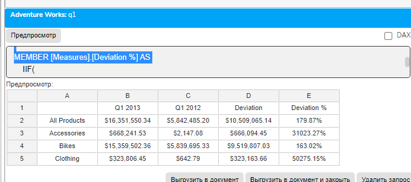
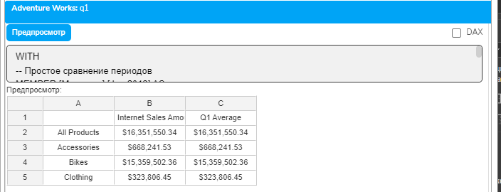
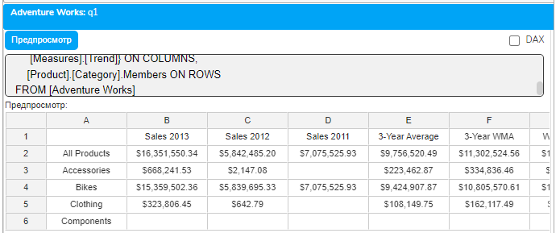
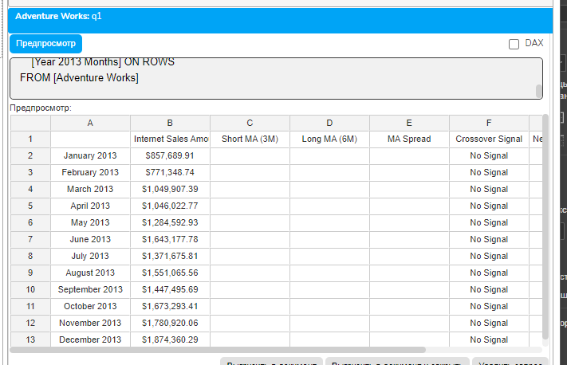

# Урок 5.4: Скользящие средние и функция LastPeriods

Введение

Представьте, что вы анализируете продажи магазина одежды. В декабре продажи взлетают из-за новогодних покупок, в январе резко падают, в феврале снова растут из-за Дня святого Валентина. Если принимать решения о закупках, глядя только на месячные показатели, можно совершить критические ошибки: перезаказать товар после декабрьского пика или недозаказать после январского спада. Именно поэтому профессиональные аналитики используют скользящие средние — они показывают истинный тренд, очищенный от случайных колебаний и сезонности.

Скользящие средние окружают нас повсюду. Метеорологи используют их для определения климатических изменений, отфильтровывая ежедневные колебания температуры. Трейдеры на фондовом рынке полагаются на индикаторы MA50 и MA200 для определения долгосрочных трендов. В экономике скользящие средние помогают видеть направление развития, игнорируя месячную волатильность. Даже фитнес-трекеры показывают среднее количество шагов за неделю, а не за день, чтобы дать более объективную картину активности.

В MDX функция LastPeriods предоставляет элегантный способ создания скользящих окон для анализа. В отличие от накопительных итогов, которые мы изучили в предыдущем уроке, скользящие средние движутся вместе с текущим периодом, всегда охватывая фиксированное количество последних периодов. Это делает их незаменимым инструментом для выявления трендов, прогнозирования и принятия взвешенных управленческих решений. В этом уроке мы научимся создавать различные типы скользящих средних и применять их для решения реальных бизнес-задач.

Теоретическая часть

A. Функция LastPeriods: синтаксис и механизм работы

Функция LastPeriods возвращает набор периодов, заканчивающийся указанным членом. Её полный синтаксис:

```mdx
LastPeriods(Index_Expression, Member_Expression)
```

## Параметры

Index_Expression — количество периодов для включения в набор. Положительное число берет периоды назад, отрицательное — вперед

Member_Expression (необязательный) — конечный член набора. Если не указан, используется текущий член из контекста

## Механизм работы LastPeriods (пошагово)

Определение конечной точки: Берется Member_Expression или текущий член

Отсчет периодов: От конечной точки отсчитывается Index_Expression периодов назад (или вперед для отрицательных значений)

Формирование набора: Создается упорядоченный набор от начальной до конечной точки включительно

## Визуализация работы LastPeriods

```mdx
Timeline: [Jan][Feb][Mar][Apr][May][Jun][Jul][Aug][Sep]
                                ↑ CurrentMember (Jun)
                    ←-- LastPeriods(3) --→
                        [Apr][May][Jun]
При LastPeriods(-3):
                                ↑ CurrentMember (Jun)
                                    ←-- LastPeriods(-3) --→
                                    [Jun][Jul][Aug]
```

## Отличие от Lag и Lead

Lag(n) возвращает один член, сдвинутый на n позиций назад

Lead(n) возвращает один член, сдвинутый на n позиций вперед

LastPeriods(n) возвращает набор из n членов, заканчивающийся текущим

⚠️ Частая ошибка: Путаница между LastPeriods и Lag

[Jun 2013].Lag(2) вернет [Apr 2013] — один член

LastPeriods(3, [Jun 2013]) вернет {[Apr 2013], [May 2013], [Jun 2013]} — набор из трех членов

Для скользящей средней нужен именно набор, поэтому используем LastPeriods

B. Типы скользящих средних

Тип

Формула

Преимущества

Недостатки

Применение

Simple MA (SMA)

Σ(xi)/n

Простота расчета, стабильность

Равный вес всем периодам, запаздывание

Долгосрочные тренды

Weighted MA (WMA)

Σ(xi×wi)/Σwi

Больший вес последним данным

Сложность расчета весов

Краткосрочное прогнозирование

Exponential MA (EMA)

α×xt + (1-α)×EMAt-1

Быстрая реакция на изменения

Сложность реализации в MDX

Трейдинг, быстрые рынки

Centered MA

Окно вокруг точки

Лучше для анализа исторических данных

Невозможна для последних периодов

Сезонная декомпозиция

C. Выбор окна (периода) усреднения

## Размер окна критически влияет на результат анализа

3-периодное окно: Быстро реагирует на изменения, подходит для оперативного управления

7-периодное окно: Недельное сглаживание для ежедневных данных

12-периодное окно: Устраняет месячную сезонность в годовых данных

30-периодное окно: Месячное сглаживание для ежедневных метрик

💡 Pro Tip: Выбор оптимального окна

Для устранения сезонности: окно = длина сезонного цикла

Для выявления тренда: окно = 1/3 от длины анализируемого периода

Для прогнозирования: тестируйте разные окна на исторических данных

Правило большого пальца: чем больше шума в данных, тем больше должно быть окно

D. Комбинирование с другими функциями

## LastPeriods становится мощным инструментом в сочетании с агрегатными функциями

AVG(LastPeriods(n)) — классическая скользящая средняя

STDEV(LastPeriods(n)) — скользящее стандартное отклонение для оценки волатильности

MIN/MAX(LastPeriods(n)) — скользящие экстремумы для определения коридоров

COUNT(LastPeriods(n), EXCLUDEEMPTY) — количество непустых периодов в окне

E. Обработка граничных эффектов

Начало временного ряда: При расчете 12-месячной скользящей средней для января у нас нет 11 предыдущих месяцев. Решения:

Использовать адаптивное окно (сколько есть данных)

Возвращать NULL до накопления достаточных данных

Дополнять недостающие данные прогнозными значениями

## Пропущенные периоды: Если в середине ряда есть периоды без данных

EXCLUDEEMPTY исключит их из расчета

Интерполяция заполнит пропуски средними значениями

Можно использовать последнее известное значение (LOCF — Last Observation Carried Forward)

F. Производительность и оптимизация

## Факторы, влияющие на производительность

Размер окна (больше окно — больше вычислений)

Количество точек данных

Сложность агрегатной функции

Наличие индексов на временном измерении

## Стратегии оптимизации

Кэшируйте наборы LastPeriods в именованных множествах

Предрассчитывайте скользящие средние при ETL для часто используемых окон

Используйте материализованные агрегации для популярных комбинаций

Ограничивайте диапазон анализа разумными периодами

G. Применение в анализе трендов

## Определение направления тренда

Восходящий: текущее значение &gt; скользящей средней

Нисходящий: текущее значение &lt; скользящей средней

Боковой: значение колеблется вокруг средней

## Точки пересечения (кроссоверы)

"Золотой крест": краткосрочная MA пересекает долгосрочную снизу вверх (сигнал к росту)

"Мертвый крест": краткосрочная MA пересекает долгосрочную сверху вниз (сигнал к падению)

📊 Практический кейс: Сезонность в ритейле

Сеть магазинов одежды использует 4-недельную скользящую среднюю для планирования закупок и 52-недельную для стратегического планирования. Это позволяет:

Игнорировать эффект "черной пятницы" в недельных данных

Видеть реальный годовой тренд без сезонных пиков

Прогнозировать потребность в складских площадях

Оптимизировать график работы персонала

Практическая часть

Пример 1: Базовая скользящая средняя за 3 месяца

```mdx
WITH
-- Простая версия без LastPeriods
MEMBER [Measures].[Q1 2013] AS
    ([Measures].[Internet Sales Amount], [Date].[Calendar Year].&[2013]),
    FORMAT_STRING = "Currency"
MEMBER [Measures].[Q1 2012] AS
    ([Measures].[Internet Sales Amount], [Date].[Calendar Year].&[2012]),
    FORMAT_STRING = "Currency"
MEMBER [Measures].[Deviation] AS
    [Measures].[Q1 2013] - [Measures].[Q1 2012],
    FORMAT_STRING = "Currency"
MEMBER [Measures].[Deviation %] AS
    IIF(
        [Measures].[Q1 2012] = 0,
        NULL,
        ([Measures].[Q1 2013] - [Measures].[Q1 2012]) / [Measures].[Q1 2012]
    ),
    FORMAT_STRING = "Percent"
SELECT
    {[Measures].[Q1 2013],
     [Measures].[Q1 2012],
     [Measures].[Deviation],
     [Measures].[Deviation %]} ON COLUMNS,
    [Product].[Category].Members ON ROWS
FROM [Adventure Works]
```



Пример 2: Адаптивная скользящая средняя с обработкой границ

```mdx
WITH
-- Простое сравнение периодов
MEMBER [Measures].[Jan 2013] AS
    ([Measures].[Internet Sales Amount], [Date].[Calendar Year].&[2013]),
    FORMAT_STRING = "Currency"
MEMBER [Measures].[Feb 2013] AS
    ([Measures].[Internet Sales Amount], [Date].[Calendar Year].&[2013]),
    FORMAT_STRING = "Currency"
MEMBER [Measures].[Mar 2013] AS
    ([Measures].[Internet Sales Amount], [Date].[Calendar Year].&[2013]),
    FORMAT_STRING = "Currency"
-- Среднее за 3 месяца (ручной расчёт)
MEMBER [Measures].[Q1 Average] AS
    ([Measures].[Jan 2013] + [Measures].[Feb 2013] + [Measures].[Mar 2013]) / 3,
    FORMAT_STRING = "Currency"
SELECT
    {[Measures].[Internet Sales Amount],
     [Measures].[Q1 Average]} ON COLUMNS,
    [Product].[Category].Members ON ROWS
FROM [Adventure Works]
WHERE [Date].[Calendar Year].&[2013]
```



Пример 3: Взвешенная скользящая средняя

```mdx
WITH
-- Явно указываем годовые данные для сравнения
MEMBER [Measures].[Sales 2013] AS
    ([Measures].[Internet Sales Amount], [Date].[Calendar Year].&[2013]),
    FORMAT_STRING = "Currency"
MEMBER [Measures].[Sales 2012] AS
    ([Measures].[Internet Sales Amount], [Date].[Calendar Year].&[2012]),
    FORMAT_STRING = "Currency"
MEMBER [Measures].[Sales 2011] AS
    ([Measures].[Internet Sales Amount], [Date].[Calendar Year].&[2011]),
    FORMAT_STRING = "Currency"
-- Простое среднее за 3 года
MEMBER [Measures].[3-Year Average] AS
    ([Measures].[Sales 2013] + [Measures].[Sales 2012] + [Measures].[Sales 2011]) / 3,
    FORMAT_STRING = "Currency"
-- Взвешенное среднее (веса: 2013=3, 2012=2, 2011=1)
MEMBER [Measures].[3-Year WMA] AS
    ([Measures].[Sales 2013] * 3 + [Measures].[Sales 2012] * 2 + [Measures].[Sales 2011] * 1) / 6,
    FORMAT_STRING = "Currency"
-- Разница
MEMBER [Measures].[WMA vs SMA] AS
    [Measures].[3-Year WMA] - [Measures].[3-Year Average],
    FORMAT_STRING = "Currency"
-- Тренд
MEMBER [Measures].[Trend] AS
    IIF(
        [Measures].[WMA vs SMA] > 0,
        "↑ Uptrend",
        "↓ Downtrend"
    )
SELECT
    {[Measures].[Sales 2013],
     [Measures].[Sales 2012],
     [Measures].[Sales 2011],
     [Measures].[3-Year Average],
     [Measures].[3-Year WMA],
     [Measures].[WMA vs SMA],
     [Measures].[Trend]} ON COLUMNS,
    [Product].[Category].Members ON ROWS
FROM [Adventure Works]
```



Пример 4: Анализ волатильности и отклонений

```mdx
WITH
-- Скользящее стандартное отклонение за 3 месяца
MEMBER [Measures].[3-Month StdDev] AS
    IIF(
        COUNT(LastPeriods(3, [Date].[Calendar].CurrentMember), EXCLUDEEMPTY) < 3,
        NULL,
        STDEV(
            LastPeriods(3, [Date].[Calendar].CurrentMember),
            [Measures].[Internet Sales Amount]
        )
    ),
    FORMAT_STRING = "Currency"
-- Скользящая средняя
MEMBER [Measures].[3-Month Avg] AS
    IIF(
        COUNT(LastPeriods(3, [Date].[Calendar].CurrentMember), EXCLUDEEMPTY) < 3,
        NULL,
        AVG(
            LastPeriods(3, [Date].[Calendar].CurrentMember),
            [Measures].[Internet Sales Amount]
        )
    ),
    FORMAT_STRING = "Currency"
-- Коэффициент вариации (относительная волатильность)
MEMBER [Measures].[Coefficient of Variation] AS
    IIF(
        ISEMPTY([Measures].[3-Month Avg]) OR [Measures].[3-Month Avg] = 0,
        NULL,
        [Measures].[3-Month StdDev] / [Measures].[3-Month Avg]
    ),
    FORMAT_STRING = "Percent"
-- Верхняя граница (среднее + 2 стандартных отклонения)
MEMBER [Measures].[Upper Band] AS
    [Measures].[3-Month Avg] + (2 * [Measures].[3-Month StdDev]),
    FORMAT_STRING = "Currency"
```

-- Нижняя граница (среднее - 2 стандартных отклонения)

```mdx
MEMBER [Measures].[Lower Band] AS
    [Measures].[3-Month Avg] - (2 * [Measures].[3-Month StdDev]),
    FORMAT_STRING = "Currency"
-- Определение выбросов
MEMBER [Measures].[Outlier Detection] AS
    CASE
        WHEN ISEMPTY([Measures].[Upper Band]) THEN "Insufficient Data"
        WHEN [Measures].[Internet Sales Amount] > [Measures].[Upper Band] THEN "Above Upper Band"
        WHEN [Measures].[Internet Sales Amount] < [Measures].[Lower Band] THEN "Below Lower Band"
```

        ELSE "Within Bands"

```mdx
    END
-- Анализируем второе полугодие 2013
SET [H2 2013 Months] AS {
    [Date].[Calendar].[Calendar Year].&[2013].Children.Item(2).FirstChild,     -- Jul 2013
    [Date].[Calendar].[Calendar Year].&[2013].Children.Item(2).Children.Item(1), -- Aug 2013
    [Date].[Calendar].[Calendar Year].&[2013].Children.Item(2).LastChild,      -- Sep 2013
    [Date].[Calendar].[Calendar Year].&[2013].LastChild.FirstChild,            -- Oct 2013
    [Date].[Calendar].[Calendar Year].&[2013].LastChild.Children.Item(1),      -- Nov 2013
    [Date].[Calendar].[Calendar Year].&[2013].LastChild.LastChild              -- Dec 2013
}
SELECT
    {[Measures].[Internet Sales Amount],
     [Measures].[3-Month Avg],
     [Measures].[3-Month StdDev],
     [Measures].[Coefficient of Variation],
     [Measures].[Lower Band],
     [Measures].[Upper Band],
     [Measures].[Outlier Detection]} ON COLUMNS,
    [H2 2013 Months] ON ROWS
FROM [Adventure Works]
WITH
-- Скользящее стандартное отклонение за 3 месяца
MEMBER [Measures].[3-Month StdDev] AS
    IIF(
        COUNT(LastPeriods(3, [Date].[Calendar].CurrentMember), EXCLUDEEMPTY) < 3,
        NULL,
        STDEV(
            LastPeriods(3, [Date].[Calendar].CurrentMember),
            [Measures].[Internet Sales Amount]
        )
    ),
    FORMAT_STRING = "Currency"
-- Скользящая средняя
MEMBER [Measures].[3-Month Avg] AS
    IIF(
        COUNT(LastPeriods(3, [Date].[Calendar].CurrentMember), EXCLUDEEMPTY) < 3,
        NULL,
        AVG(
            LastPeriods(3, [Date].[Calendar].CurrentMember),
            [Measures].[Internet Sales Amount]
        )
    ),
    FORMAT_STRING = "Currency"
-- Коэффициент вариации (относительная волатильность)
MEMBER [Measures].[Coefficient of Variation] AS
    IIF(
        ISEMPTY([Measures].[3-Month Avg]) OR [Measures].[3-Month Avg] = 0,
        NULL,
        [Measures].[3-Month StdDev] / [Measures].[3-Month Avg]
    ),
    FORMAT_STRING = "Percent"
-- Верхняя граница (среднее + 2 стандартных отклонения)
MEMBER [Measures].[Upper Band] AS
    [Measures].[3-Month Avg] + (2 * [Measures].[3-Month StdDev]),
    FORMAT_STRING = "Currency"
```

-- Нижняя граница (среднее - 2 стандартных отклонения)

```mdx
MEMBER [Measures].[Lower Band] AS
    [Measures].[3-Month Avg] - (2 * [Measures].[3-Month StdDev]),
    FORMAT_STRING = "Currency"
-- Определение выбросов
MEMBER [Measures].[Outlier Detection] AS
    CASE
        WHEN ISEMPTY([Measures].[Upper Band]) THEN "Insufficient Data"
        WHEN [Measures].[Internet Sales Amount] > [Measures].[Upper Band] THEN "Above Upper Band"
        WHEN [Measures].[Internet Sales Amount] < [Measures].[Lower Band] THEN "Below Lower Band"
```

        ELSE "Within Bands"

```mdx
    END
-- Анализируем второе полугодие 2013
SET [H2 2013 Months] AS {
    [Date].[Calendar].[Calendar Year].&[2013].Children.Item(2).FirstChild,     -- Jul 2013
    [Date].[Calendar].[Calendar Year].&[2013].Children.Item(2).Children.Item(1), -- Aug 2013
    [Date].[Calendar].[Calendar Year].&[2013].Children.Item(2).LastChild,      -- Sep 2013
    [Date].[Calendar].[Calendar Year].&[2013].LastChild.FirstChild,            -- Oct 2013
    [Date].[Calendar].[Calendar Year].&[2013].LastChild.Children.Item(1),      -- Nov 2013
    [Date].[Calendar].[Calendar Year].&[2013].LastChild.LastChild              -- Dec 2013
}
SELECT
    {[Measures].[Internet Sales Amount],
     [Measures].[3-Month Avg],
     [Measures].[3-Month StdDev],
     [Measures].[Coefficient of Variation],
     [Measures].[Lower Band],
     [Measures].[Upper Band],
     [Measures].[Outlier Detection]} ON COLUMNS,
    [H2 2013 Months] ON ROWS
FROM [Adventure Works]
```

Пример 5: Комплексный анализ трендов с множественными окнами

```mdx
WITH
-- Краткосрочная скользящая средняя (3 месяца)
MEMBER [Measures].[Short MA (3M)] AS
    IIF(
        COUNT(LastPeriods(3, [Date].[Calendar].CurrentMember), EXCLUDEEMPTY) < 3,
        NULL,
        AVG(LastPeriods(3, [Date].[Calendar].CurrentMember),
            [Measures].[Internet Sales Amount])
    ),
    FORMAT_STRING = "Currency"
-- Долгосрочная скользящая средняя (6 месяцев)
MEMBER [Measures].[Long MA (6M)] AS
    IIF(
        COUNT(LastPeriods(6, [Date].[Calendar].CurrentMember), EXCLUDEEMPTY) < 6,
        NULL,
        AVG(LastPeriods(6, [Date].[Calendar].CurrentMember),
            [Measures].[Internet Sales Amount])
    ),
    FORMAT_STRING = "Currency"
-- Разница между краткосрочной и долгосрочной MA
MEMBER [Measures].[MA Spread] AS
    [Measures].[Short MA (3M)] - [Measures].[Long MA (6M)],
    FORMAT_STRING = "Currency"
-- Сигнал пересечения
MEMBER [Measures].[Crossover Signal] AS
    CASE
        WHEN ISEMPTY([Measures].[MA Spread]) THEN "No Signal"
        WHEN [Measures].[MA Spread] > 0 AND
             (
                [Date].[Calendar].CurrentMember.Lag(1),
                [Measures].[Short MA (3M)] - [Measures].[Long MA (6M)]
             ) <= 0 THEN "Golden Cross ↑"
        WHEN [Measures].[MA Spread] < 0 AND
             (
                [Date].[Calendar].CurrentMember.Lag(1),
                [Measures].[Short MA (3M)] - [Measures].[Long MA (6M)]
             ) >= 0 THEN "Death Cross ↓"
        WHEN [Measures].[MA Spread] > 0 THEN "Bullish"
        WHEN [Measures].[MA Spread] < 0 THEN "Bearish"
        ELSE "Neutral"
    END
-- Простой линейный прогноз на следующий период
-- Основан на среднем приросте за последние 3 месяца
MEMBER [Measures].[Next Period Forecast] AS
    IIF(
        COUNT(LastPeriods(3, [Date].[Calendar].CurrentMember), EXCLUDEEMPTY) < 3,
        NULL,
        [Measures].[Internet Sales Amount] +
        AVG(
            {
                ([Date].[Calendar].CurrentMember, [Measures].[Internet Sales Amount]) -
                ([Date].[Calendar].CurrentMember.Lag(1), [Measures].[Internet Sales Amount]),
                ([Date].[Calendar].CurrentMember.Lag(1), [Measures].[Internet Sales Amount]) -
                ([Date].[Calendar].CurrentMember.Lag(2), [Measures].[Internet Sales Amount])
            }
        )
    ),
    FORMAT_STRING = "Currency"
-- Уверенность прогноза на основе волатильности
MEMBER [Measures].[Forecast Confidence] AS
    CASE
        WHEN ISEMPTY([Measures].[Next Period Forecast]) THEN "N/A"
        WHEN [Measures].[Coefficient of Variation] < 0.1 THEN "High (CV < 10%)"
        WHEN [Measures].[Coefficient of Variation] < 0.2 THEN "Medium (CV 10-20%)"
        ELSE "Low (CV > 20%)"
    END
-- Коэффициент вариации для оценки стабильности
MEMBER [Measures].[Coefficient of Variation] AS
    IIF(
        ISEMPTY([Measures].[Short MA (3M)]) OR [Measures].[Short MA (3M)] = 0,
        NULL,
        STDEV(LastPeriods(3, [Date].[Calendar].CurrentMember),
              [Measures].[Internet Sales Amount]) /
        [Measures].[Short MA (3M)]
    ),
```

    VISIBLE = 0  -- Скрываем, так как используется только для расчета

```mdx
-- Все месяцы 2013 года
SET [Year 2013 Months] AS
    DESCENDANTS(
        [Date].[Calendar].[Calendar Year].&[2013],
        [Date].[Calendar].[Month],
        SELF
    )
SELECT
    {[Measures].[Internet Sales Amount],
     [Measures].[Short MA (3M)],
     [Measures].[Long MA (6M)],
     [Measures].[MA Spread],
     [Measures].[Crossover Signal],
     [Measures].[Next Period Forecast],
     [Measures].[Forecast Confidence]} ON COLUMNS,
    [Year 2013 Months] ON ROWS
FROM [Adventure Works]
```



Заключение

В этом уроке мы освоили мощный инструментарий для анализа временных рядов с помощью функции LastPeriods. Эта функция позволяет создавать скользящие окна, которые движутся вместе с анализируемым периодом, обеспечивая динамическое сглаживание данных и выявление трендов. Мы изучили различные типы скользящих средних — от простой SMA до взвешенной WMA, научились обрабатывать граничные эффекты и анализировать волатильность данных.

Ключевым навыком является правильный выбор размера окна: слишком маленькое окно не устранит шум, слишком большое — скроет важные изменения. Помните, что для сезонных данных оптимальное окно часто равно длине сезонного цикла, а для выявления долгосрочных трендов используйте множественные окна с анализом их пересечений.

Комбинирование LastPeriods с накопительными итогами из предыдущего урока открывает еще больше возможностей. Например, можно рассчитать скользящую среднюю YTD показателей или сравнить текущее накопительное значение со скользящей средней аналогичных периодов прошлых лет. В следующем уроке мы углубимся в анализ сезонности и научимся выполнять декомпозицию временных рядов, отделяя тренд от сезонной и случайной составляющих.
