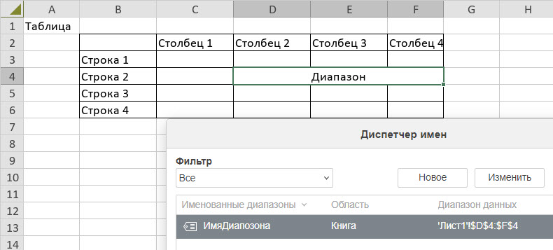
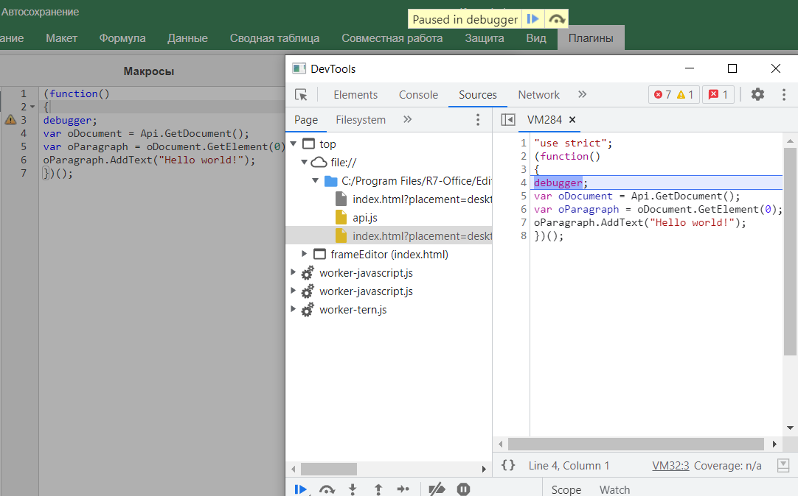
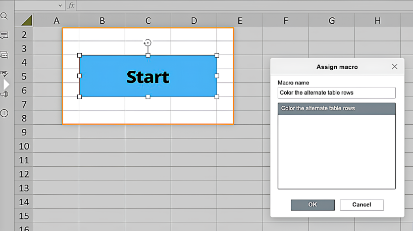

# Создание первого макроса для Р7-Офис


**На занятии вы узнаете:**

Макросы и задачи ими решаемые

Структура таблицы

Примеры простых макросов

Отладка макросов

Подписка на событие

Привязка макроса к объекту

Примеры сложных макросов

Что такое макросы?

**Макросы**  — это набор инструкций или команд, которые выполняются автоматически. Они позволяют автоматизировать рутинные задачи и упростить работу с программами. В контексте редактора макросов в Табличном редакторе Р7-Офис, макросы предоставляют возможность автоматически выполнять повторяющиеся операции, такие как форматирование, вставка текста или изменение структуры документа.  
  
**Макросы** — это так же небольшие скрипты, которые используются для облегчения повседневной работы с различными типами документов. Макросы Р7 используют синтаксис JavaScript и нотацию скриптов API Р7 Document Builder.  
Есть несколько причин, по которым Р7 использует JavaScript для макросов:  
- платформонезависимость,
- простота использования,
- безопасность, поскольку макросы не имеют доступа к системе. Они просто выполняются в том же окне, что и редакторы.

Ознакомление с редактором макросов

**Редактор макросов** предоставляет инструменты для создания, редактирования и запуска макросов. В нем вы можете записывать действия, которые хотите автоматизировать, и сохранять их в виде макросов.  
  
Теперь, когда мы разобрались, что такое макросы, давайте перейдем к их более подробному изучению и созданию собственных макросов!

Задачи, решаемые с помощью макросов

Рассмотрим структуру таблицы и попробуем разобраться, как работать с объектами таблицы через макросы.

**Структура таблицы**

**Таблица в Табличном редакторе Р7-Офис** состоит из следующих элементов:

- **Ячейки:** Основные элементы таблицы, в которых можно размещать текст, числа, формулы и другие данные.
- **Строки и столбцы:** Строки – это горизонтальные ряды ячеек, а столбцы – вертикальные группы ячеек.
- **Заголовки строк и столбцов:** Можно задавать заголовки для строк и столбцов таблицы.
- **Объединение ячеек:** Важный аспект – объединение нескольких ячеек в одну (дипазон) для создания более сложной структуры.

Создание простых макросов

**Теперь, когда вы знаете, как работают макросы**, попробуйте написать свой собственный макрос. У нас есть таблица, и нам нужно раскрасить альтернативные строки таблицы (нечетные будут зелеными, а четные - красными). В таблице 200 строк и столбцы от A до S. Сделать это вручную займет много времени. Поэтому использование макросов будет лучшим решением для этой проблемы.  
**Откройте редакторы Р7** и создайте новую таблицу.  
**Откройте вкладку Плагины** и выберите Макросы.  
- Появится окно макросов.
- Нажмите Новый.
- Вам будет предложен базовый оберточный функционал, в который можно ввести необходимый код:

```
(function() {
    // ... ваш код здесь ...
})();
```

Давайте посмотрим в документации Builder.API, что нам нужно сделать для выполнения нашей задачи.  
Сначала получим текущий рабочий лист **с помощью метода GetActiveSheet:**

```
var oWorksheet = Api.GetActiveSheet();
```

**Затем создадим цикл**, который будет запускаться от первой до последней строки:

```
for (var i = 1; i < 200; i += 2) {
}
```

**Установим две переменные**: одну для нечетных строк, вторую для четных строк:

```
var rowOdd = i, rowEven = i + 1;
```

Раскрасим четные и нечетные строки в соответствующие цвета. Установим желаемые цвета, **используя метод CreateColorFromRGB.**  
**Получим диапазон ячеек** с помощью метода GetRange и зададим цвет для нечетных строк:

```
oWorksheet.GetRange("A" + rowOdd + ":S" + rowOdd).SetFillColor(Api.CreateColorFromRGB(138, 181, 155));
```

То же самое для четных строк, но с другим цветом:

```
oWorksheet.GetRange("A" + rowEven + ":S" + rowEven).SetFillColor(Api.CreateColorFromRGB(216, 227, 220));

```

**Соберем все вместе** с полным кодом скрипта:

Пример 1

**Вставьте код** выше в окно макросов и нажмите Запустить.   
Строки таблицы с 1 по 200 будут раскрашены чередующимися цветами менее чем за секунду.

```
(function() {
    var oWorksheet = Api.GetActiveSheet();
    for (var i = 1; i < 200; i += 2) {
        var rowOdd = i,
            rowEven = i + 1;
        oWorksheet.GetRange("A" + rowOdd + ":S" + rowOdd).SetFillColor(Api.CreateColorFromRGB(138, 181, 155));
        oWorksheet.GetRange("A" + rowEven + ":S" + rowEven).SetFillColor(Api.CreateColorFromRGB(216, 227, 220));
    }
})();
```

**Пример 2**

**Форматирование ячеек**: Применение шрифтов, цветов и других параметров к ячейкам.

```
(function() {
    var oWorksheet = Api.GetActiveSheet();
    for (var i = 1; i < 5; i += 2) {
        var rowOdd = i,
            rowEven = i + 1;
        oWorksheet.GetRange("A" + rowOdd + ":S" + rowOdd).SetFillColor(Api.CreateColorFromRGB(138, 181, 155));
        oWorksheet.GetRange("A" + rowEven + ":S" + rowEven).SetFillColor(Api.CreateColorFromRGB(216, 227, 220));
        oWorksheet.GetRange("A3").SetFontColor(Api.CreateColorFromRGB(0, 255, 0));
    }
})();
```

Отладка макросов в Р7

Для отладки макросов в Р7 выполните следующие шаги:  
  
- **Откройте вкладку** Плагины и нажмите Макросы.
- Используйте команду отладчика **'debugger;'** в своем скрипте:

```
debugger;
var oDocument = Api.GetDocument();
var oParagraph = oDocument.GetElement(0);
oParagraph.AddText("Hello world!");
```


**Обратите внимание**, что команда отладчика будет работать только если инструменты разработчика открыты. В противном случае браузер игнорирует её.  
**Команда debugger** работает как точка останова и приостанавливает выполнение скрипта в точке, где эта команда вставлена.  
  
Если вам нужно вывести **определенные значения** в консоль разработчика браузера, вы можете использовать метод console.log(). Передайте значение, которое вы хотите проверить, или строку сообщения в качестве аргумента этого метода и откройте консоль разработчика, нажав кнопку F12, чтобы увидеть результат:  
  
- console.log(123);

**Подписка на событие**

**Для подписки** на указанное событие и вызова функции обратного вызова при его наступлении используйте метод attachEvent.  
Например, чтобы подписаться на событие при клике на гиперссылку в документе, используйте следующие строки:

```
Api.attachEvent("asc_onHyperlinkClick", function(){
console.log("HYPERLINK!!!");
});
```

Когда вы нажмете **на любую гиперссылку** в документе, будет выполнено событие asc\_onHyperlinkClick, и сообщение "HYPERLINK!!!" появится в консоли.

**Привязка (назначение) макроса к объекту**

**В редакторе электронных таблиц** вы можете назначить макрос графическому объекту:  
Щелкните правой кнопкой мыши по графическому объекту.


Создание сложных макросов

**Изменение содержимого ячеек**: Заполнение ячеек данными, вставка формул и текста.

**Автоматическая настройка** ширины столбцов и высоты строк.

```
(function()
{
    const sheet = Api.GetActiveSheet(); // Получаем активный лист
    sheet.GetRange("A1").SetValue("111");
    sheet.GetRange("B1").SetValue("222222222");
    sheet.GetRange("A1:B1").AutoFit(false,true);//(ширина,высота)
})();
```

**Поиск и восстановление скрытых строк.**

```
(function() {
    const rangeStr = "A2:G10";
    const sheet = Api.GetActiveSheet(); // Получаем активный лист
    const range = sheet.GetRange(rangeStr); //Получаем диапазон
    //Если диапазон приемлемый
    if (range !== undefined && range) {
        //ПОлучаем адрес диапазона в формате R1C1:R2C2 (R-row C-collumn)
        const sAdress = sheet.GetRange(rangeStr).GetAddress(true, true, "xlR1C1", false);

        const diapArr = sAdress.split(":"); //Разбиваем диапазон на начальный и конечный
        if (diapArr.length) {
            let rBegin = findRowNumber(diapArr[0]); //Ищем номер строки через встроенную функцию
            let rEnd = findRowNumber(diapArr[1]);
            //Если диапазоны строк определились верно
            if (rBegin >= 0 && rEnd >= 0) {
                //Проходим по строкам и проверяем на признак скрытости
                for (let i = 1; i <= rEnd - rBegin; i++) {
                    var row = range.GetRows(i);
                    if (row !== undefined && row) {
                        if (row.GetHidden()) //Если строка скрыта, то откроем её
                            row.SetHidden(false);
                    }
                }
            }
        }
    }

})();

//Ищем номер строки в формате R1C1
function findRowNumber(strAdr) {
    let arrAdr = strAdr.split("C"); //Ищем место, где начинается адрес столбца
    if (arrAdr.length) {
        return Number(arrAdr[0].substring(1, arrAdr[0].length));
    }
    return -1;
}
```

Макрос копирования данных между таблицами.

```
//Требуемый диапазон уже должен быть выбран на листе источнике!
function copySelectedDataBetweenTables(nameSheet) {
    const sourceSheet = Api.GetActiveSheet(); // Получаем активный лист с исходными данными
    if(sourceSheet.GetName()!==nameSheet){
        const targetSheet = Api.GetSheet(nameSheet);
        // Выделите нужный диапазон ячеек в исходной таблице
        const sourceRange = sourceSheet.GetSelection(); // 
        // Вставьте данные в целевую таблицу
        if(sourceRange!==undefined&&sourceRange.GetCount()>0){
            let nameRange=sourceRange.GetAddress(true, true, "xlA1", false);
            nameRange=nameRange.replace("$","");
            sourceRange.Copy(targetSheet.GetRange(nameRange));
        }
    }
}
copySelectedDataBetweenTables("Лист2"); // Вызываем функцию и указываем в аргументе имя листа куда мы копируем.
```

На хабре есть статья, [которую можно использвать как доп материал](https://habr.com/ru/articles/863100/)


---




