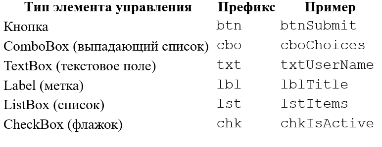

# Руководство по оформлению кода на Р7 JavaScript и VBA


Рекомендации основаны на установившихся стандартах и потребностях проектов. Для VBA MS Excel приведены отличия, связанные с особенностями языка.

Переменные

- **Используйте понятные имена**, которые отражают назначение переменной.
- **Используйте `camelCase`** для имен переменных, где первая буква первого слова в нижнем регистре, а последующие слова начинаются с заглавной буквы.
- **Префиксы типов**, как правило, не используются, но желательно добавлять комментарии для сложных типов данных.
- **Одна переменная за раз**, каждое объявление переменной объявляет только одну переменную: такие объявления как, let a=1,b=2; не используются.

**Примеры на JavaScript:**

```
let isComplete = false;      // Boolean
var index = 0;               // Number
let userName = "John Doe";   // String
let itemsList = [];          // Array
let user = {};               // Object

```

**Примеры на VBA:**

```
Dim isComplete As Boolean
Dim index As Integer
Dim userName As String
Dim myArray() As String

```

# Константы

- **Используйте прописные буквы** для имен констант, разделяя слова символом подчеркивания.
- Константы, как правило, объявляются с помощью `const` в JavaScript или Const в VBA.
- Определяйте константы для значений, которые многократно используются в коде.
- Используйте константы или именованные диапазоны для хранения значений, которые могут измениться. Избегайте жестко заданных значений в коде.

**Примеры на JavaScript:**

```
const MAX_RETRIES = 3;
const DEFAULT_TIMEOUT = 5000;

```

**Примеры на VBA:**

```
Const MAX_RETRIES As Integer = 3
Const DEFAULT_TIMEOUT As Double = 5.5

```

## Функции и подпрограммы (VBA)

- **Используйте `camelCase`** для имен функций для JavaScript и PascalCase для VBA.
- Имя функции должно описывать выполняемое действие или результат, чтобы отразить её назначение или цель.
- Как правило, следует располагать функции под кодом, который их использует.

**Примеры на JavaScript:**

```
function calculateTotalCost() {
    // Логика функции
}

function getUserName() {
    return "John Doe";
}

```

**Примеры на VBA:**

```
Sub CalculateTotalCost()
Function GetEmployeeName()

```

## Параметры (Аргументы)

- **Используйте `camelCase`** для имен параметров, как и для переменных.
- **Рекомендуется добавлять поясняющие комментарии** для типов параметров и их назначения.

**Пример на JavaScript:**

```
function updateRecord(recordId, name) {
    // Логика функции
}

```

**Пример на VBA:**

```
Sub UpdateRecord(ByVal lngRecordID As Long, ByVal strName As String)
```

Глобальные и модульные переменные

- Избегайте глобальных переменных без необходимости
- **При необходимости использования глобальных переменных** рекомендуется использование префикса \_g.
- Для переменных в модулях рекомендуется использование необязательного префикса \_m.
- **Используйте `camelCase**` с соответствующими префиксами.

**Примеры на JavaScript:**

```
let g_appName = "MyApp";  // Глобальная переменная
let m_counter = 0;        // Модульная переменная
```

**Примеры на VBA:**

```
Dim g_strApplicationName As String
Dim m_intCounter As Integer

```

## Элементы управления (DOM) и Элементы управления на формах

- **Используйте трехбуквенные префиксы** для элементов интерфейса (например, `btn`, `txt`, `lbl`) в сочетании с описательными именами для идентификации элементов.

  
**Префиксы элементов управления**


**Примеры на JavaScript:**

```
let btnSubmit = document.getElementById('submit');
let txtUserName = document.getElementById('userName');

```

Переменные для обработки ошибок

- Используйте префикс `err` для переменных, связанных с обработкой ошибок.

**Примеры на JavaScript:**

```
let errMessage = "";
try {
    // Код, который может вызвать ошибку
} catch (error) {
    errMessage = error.message;
}

```

**Примеры на VBA:**

```
Dim errNumber As Long
Dim errMessage As String

```

Перечисления

- Начинайте названия перечислений с префикса `e\_`.
- В именах членов перечислений используйте в `PascalCase`.
- Используйте перечисления для хранения наборов связанных констант.

**Примеры на JavaScript:**

```
const e_Color = {
    Red: "red",
    Green: "green",
    Blue: "blue"
};
```

**Примеры на VBA:**

```
Enum e_Color
    ColorRed
    ColorGreen
    ColorBlue
End Enum
```

## Имена файлов (JavaScript) и модулей (VBA)

- Имена файлов, как и модулей в VBA должны быть описательными и отражать их назначение.
- Используйте `PascalCase` или `kebab-case` для имен файлов и модулей. В именах модулей рекомендуется использование префикса mod (страндартные модули) или cls (классы).

**Примеры на JavaScript:**

```
`Operations.js`
`EmployeeData.js`

```

**Примеры на VBA:**

```
'modFileOperations'
'clsEmployee'

```

Модульность кода

- Стремитесь к разделению код на небольшие блоки и функции, подпрограммы (VBA), выполняющие одну задачу. Это улучшает читаемость и повторное использование.

Комментирование кода

- Добавляйте комментарии для объяснения сложной логики, а также в начале каждого модуля и функции, описывая их назначение.
- Обновляйте комментарии при изменении кода.

**Пример на JavaScript:**

```
/
 * Вычисляет общую стоимость элементов.
 * @param {Array} items - Массив объектов с ценой каждого элемента.
 * @return {Number} - Общая стоимость.
 */
function calculateTotalCost(items) {
    // Логика функции
}

```

**Пример на VBA:**

```
Private Sub Worksheet_BeforeDoubleClick (ByVal Target as Range, Cancel As Boolean)
    'Declare your Variables
        Dim LastRow As Long
    'Find last row
        LastRow = Cells (Rows.Count, 1) .End (xlUp) .Row
End Sub
```

Обработка ошибок

- Используйте конструкции `try-catch` для обработки ошибок в JavaScript
- В VBA используйте операторы On Error для обработки ошибок внутри процедур, чтобы можно было обрабатывать непредвиденные ошибки корректно. Используйте On Error Resume Next только в тех случаях, когда вы ожидаете определенные ошибки, которые не критичны, и всегда сбрасывайте его с помощью On Error GoTo 0 после этого.
- Включайте описательные сообщения об ошибках, чтобы определить, какая часть кода вызвала ошибку, а также релевантные данные для отладки.
- В VBA пошагово выполняйте код с помощью точек останова (F9) и Step Into (F8), чтобы проверять выполнение кода. В JavaScript по-возможности и при необходимости используйте отладку для поиска ошибок.

**Пример на JavaScript:**

```
try {
    // Код, который может вызвать ошибку
} catch (error) {
    console.error("Ошибка:", error.message);
}
```

**Пример на VBA:**

```
On Error GoTo ErrorHandler
' Код, который может вызвать ошибку
Exit Sub

ErrorHandler:
MsgBox "Ошибка " & Err.Number & ": " & Err.Description, vbExclamation, "Ошибка в CalculateTotalCost"
```

Оптимизация циклов

- Сокращайте количество вложенных циклов. Если необходимо, вынесите внутренний цикл в отдельную функцию.
- Используйте `for...of` или `forEach` для итерации по массивам и коллекциям в JavaScript и For Each в VBA. Обычно это быстрее, чем простой цикл.

Проверка и отладка кода

- Регулярно тестируйте код на различные случаи.
- Используйте `console.log` или `console.error` для отладки. в JavaScript и Debug.Print в VBA. Обычно это быстрее, чем простой цикл.
- В VBA Добавляйте Option Explicit в начало каждого модуля, чтобы требовать объявление переменных. Это предотвращает ошибки, вызванные опечатками, и упрощает отладку. Рекомендуется включение Option Explicit в настройках редактора VBA, чтобы он автоматически добавлялся в новые модули.

Управление сессиями и асинхронными вызовами (JavaScript)

- В JavaScript при работе с асинхронными операциями используйте `async/await` и обрабатывайте ошибки с помощью `try-catch`.

## Оператор With (VBA)

- В VBA при работе с объектом используйте блок With...End With, чтобы уменьшить количество обращений к нему. Это улучшает читаемость и снижает вероятность ошибок в повторяющемся коде.

Общие рекомендации по организации кода

- Делайте модули небольшими, каждый модуль должен выполнять одну задачу.
- Убедитесь, что каждый модуль легко читать и поддерживать.
- Документируйте каждый модуль, функцию и процедуру с помощью блока заголовка, который включает автора, дату, описание и версию.
- Рассмотрите возможность добавления информации о версиях для легкого отслеживания изменений, внесенных с течением времени.
- Длинные строки кода сложны для восприятия, лучше разбивать их на порции по 80 или 120 символов (количество символов может быть любым - это предмет договоренности в команде).
- Идентификаторы не должны содержать никаких зарезервированных ключевых слов. Список зарезервированных слов для JavaScript: break, do, instanceof, typeof, case, else, new, var, catch, finally, return, void, continue, for, switch, while, debugged, function, this, with, default, if, throw, delete, in, try, class, enum, extends, super, const, export, import, implements, let, private, public, interface, package, protected, static, yield. Для VBA список в документации по языку.
- В VBA при работе с большими объемами данных или при частых обновлениях рабочего листа временно отключайте настройки, такие как ScreenUpdating, Calculation и EnableEvents. Всегда восстанавливайте эти настройки в их исходное состояние в конце кода или в блоках обработки ошибок.


---


