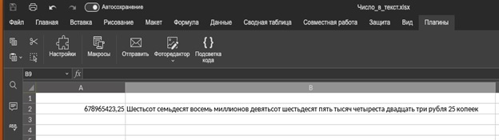
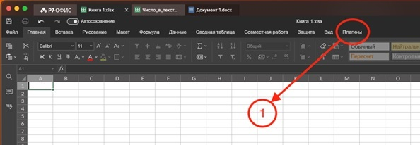
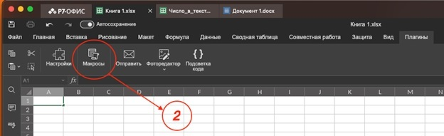
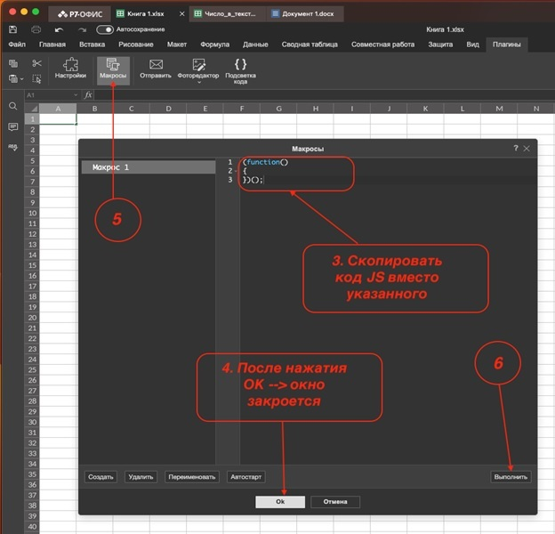

# Пример макроса: Число в текст


Р7-Офис представляет из себя **российскую альтернативу MS Office**. Как и в MS Office, в Р7-Офис имеется возможность создания макросов и плагинов для расширения функциональности редактора. В отличии от MS Office с его языком VBA (Visual Basic Application) программирование макросов и плагинов ведется на языке JavaScript.  
  
**Предлагаем вам** пример решения задачи преобразования чисел, записанных арабскими цифрами, в текстовое представление на русском языке (возможна доработка скрипта для другого языка) с помощью макроса на языке JavaScript для Р7-Офис.  
  
Этот макрос предназначен для обучения, но он может быть полезен и для тех, кто работает с финансовыми и бухгалтерскими документами.

О нашем макросе для Р7-Офис

1.Диапазон чисел, с которыми может работать макрос: от 0 до почти одного миллиарда (999 999 999) с возможностью дальнейшего расширения диапазона. Код охватывает все необходимые случаи и корректно обрабатывает числа, в соответствии с правилам русского языка.


2.Подготовка и вызов макроса не сложен. Для этого необходимо произвести действия:  
  
2.1.Открыть вкладку Р7-Офис Плагины.


2.2.На панели Плагины вызвать Макросы


Запустится окно с макросами.


2.3.Если нашего макроса еще нет, создаем его (Кнопка Создать) или используем уже имеющуюся заготовку, например, Макрос 1. Выбираем его из списка макросов, справа от списка поле редактора с кодом выбранного макроса. В него нам надо вставить наш код, убрав заготовку. Скопируем код нашего макроса из текста ниже в буфер, перейдем в поле редактора макроса (уже очищенное) и вставим код из буфера.  
  
Макрос готов к использованию.   
  
На всякий случай, нажмем кнопку Ok. Окно макроса закроется, сохраним файл, к которому мы только что подключили наш макрос. Нажмем повторно кнопку Макросы в панели Плагины, выберем наш макрос и запустим его, нажав кнопку Выполнить (ниже поля редактора макросов).

**Код макроса на JavaScript для Р7-Офис**

```
const oWorksheet = Api.GetSheet("Лист1"); //Лист1 --> заменить на лист с данными
const data = oWorksheet.GetRange("A2").Value; //A2 --> адрес ячейки с числом
const data_out = oWorksheet.GetRange("B2"); //B2 адрес ячеки для вывода результата

const resultOut = (function numberToText(num) {
  
  // Проверка на допустимый диапазон
  if (Number(num) < 0 || Number(num) >= 1000000000) {
    return "Ошибка: число вне допустимого диапазона (0-999999999,99)";
  }
  
  const units = [
    "",
    "один",
    "два",
    "три",
    "четыре",
    "пять",
    "шесть",
    "семь",
    "восемь",
    "девять",
  ];
  const teens = [
    "десять",
    "одиннадцать",
    "двенадцать",
    "тринадцать",
    "четырнадцать",
    "пятнадцать",
    "шестнадцать",
    "семнадцать",
    "восемнадцать",
    "девятнадцать",
  ];
  const tens = [
    "",
    "",
    "двадцать",
    "тридцать",
    "сорок",
    "пятьдесят",
    "шестьдесят",
    "семьдесят",
    "восемьдесят",
    "девяносто",
  ];
  const hundreds = [
    "",
    "сто",
    "двести",
    "триста",
    "четыреста",
    "пятьсот",
    "шестьсот",
    "семьсот",
    "восемьсот",
    "девятьсот",
  ];
  const thousandUnits = [
    "",
    "одна",
    "две",
    "три",
    "четыре",
    "пять",
    "шесть",
    "семь",
    "восемь",
    "девять",
  ];

  function triadToText(triad, isThousand) {
    let result = "";
    if (triad >= 100) {
      result += hundreds[Math.floor(triad / 100)] + " ";
      triad %= 100;
    }
    if (triad >= 10 && triad < 20) {
      result += teens[triad - 10] + " ";
    } else if (triad >= 20 || triad === 10) {
      result += tens[Math.floor(triad / 10)] + " ";
      triad %= 10;
    }
    if (triad > 0 && triad < 10) {
      result += (isThousand ? thousandUnits[triad] : units[triad]) + " ";
    }
    return result.trim();
  }

  function rubleDeclension(num) {
    const rem100 = num % 100;
    if (rem100 >= 11 && rem100 <= 14) return "рублей";
    switch (num % 10) {
      case 1:
        return "рубль";
      case 2:
      case 3:
      case 4:
        return "рубля";
      default:
        return "рублей";
    }
  }

  function thousandDeclension(num) {
    const rem100 = num % 100;
    if (rem100 >= 11 && rem100 <= 14) return "тысяч";
    switch (num % 10) {
      case 1:
        return "тысяча";
      case 2:
      case 3:
      case 4:
        return "тысячи";
      default:
        return "тысяч";
    }
  }

  function millionDeclension(num) {
    const rem100 = num % 100;
    if (rem100 >= 11 && rem100 <= 14) return "миллионов";
    switch (num % 10) {
      case 1:
        return "миллион";
      case 2:
      case 3:
      case 4:
        return "миллиона";
      default:
        return "миллионов";
    }
  }

  function kopeckDeclension(num) {
    const rem100 = num % 100;
    if (rem100 >= 11 && rem100 <= 14) return "копеек";
    switch (num % 10) {
      case 1:
        return "копейка";
      case 2:
      case 3:
      case 4:
        return "копейки";
      default:
        return "копеек";
    }
  }

  const intPart = Math.floor(num);
  const decPart = Math.round((num - intPart) * 100);
  const intPartStr = intPart.toString();
  let result = "";

  if (intPart === 0) {
    result = "ноль рублей";
  } else {
    const millions = Math.floor(intPart / 1000000);
    const thousands = Math.floor((intPart % 1000000) / 1000);
    const hundreds = intPart % 1000;

    if (millions > 0) {
      result +=
        triadToText(millions, false) + " " + millionDeclension(millions) + " ";
    }
    if (thousands > 0) {
      result +=
        triadToText(thousands, true) +
        " " +
        thousandDeclension(thousands) +
        " ";
    }
    if (hundreds > 0) {
      result += triadToText(hundreds, false) + " ";
    }

    result = result.trim() + " " + rubleDeclension(intPart);
  }

  if (decPart > 0) {
    result += " " + decPart + " " + kopeckDeclension(decPart);
  }
  
  // Преобразование первой буквы в заглавную
  if (result.length > 0) {
    result = result.charAt(0).toUpperCase() + result.slice(1);
  }

  return result.trim();
  
})(data);

data_out.SetValue(resultOut);

```

Инструкция по использованию макроса

Лист, с которым будет работать макрос, указывается непосредственно в самом макросе, как и рабочие ячейки.  
Отредактируйте строки в начале кода макроса, в случае необходимости:

```
const oWorksheet = Api.GetSheet("Лист1"); //Лист1 - Лист с данными
const data = oWorksheet.GetRange("A2").Value; //A2 - Адрес ячейки с числом
const data_out = oWorksheet.GetRange("B2"); //B2 - адрес ячейки для вывода результата
```

Диапазон чисел, с которыми может работать макрос: от 0 до 999 999 999. При выходе числа за границы диапазон, указанного выше, будет выдано соответствующее сообщение об ошибке.

Примечания к коду макроса

В коде макроса сделаны комментарии, позволяющие разобраться с его работой.   
В дополнение к ним добавим:  
В начале макроса определены массивы для единиц, десятков, сотен и т.д. Они содержат текстовые представления разрядов чисел на русском языке.  
  
Функции triadToText, rubleDeclension, thousandDeclension, millionDeclension, kopeckDeclension преобразуют числовые значения в строки и добавляют соответствующее окончание, зависящее от преобразуемого числа. Функция triadToText обрабатывает разряды чисел, а остальные функции обрабатывают падежи для "рубль", "тысяча", "миллион" и "копейка".  
  
Основная функция numberToText разбивает входное число на целую и дробную части, обрабатывает миллионы, тысячи и сотни, добавляет соответствующее слово "рубль" и "копейка" с правильным склонением.

Примеры использования:

Число: 123456789,99  
Вывод результата: Сто двадцать три миллиона четыреста пятьдесят шесть тысяч семьсот восемьдесят девять рублей 99 копеек  
  
Число: 31456,66  
Вывод результата: Тридцать одна тысяча четыреста пятьдесят шесть рублей 66 копеек


---





