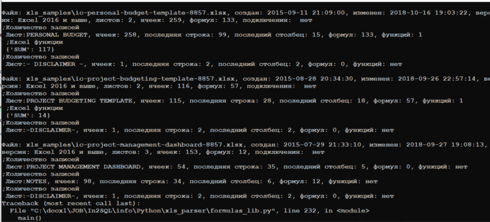

# Справочно: Аудит excel файлов

Программа предназначена для анализа файлов Excel. Она собирает статистику по файлам, включая данные о формулах, листах, ячейках, версиях Excel, внешних подключениях и других характеристиках.  
  
 Программу для windows можно взять с этого [каталога ,](https://disk.yandex.ru/d/JAx490AFSrUTLw) файл formulas\_lib.exe. Так же там находится исходный код программы на языке python.   
  
 Для работы из среды разработки нужно проверить что библиотеки openpyxl, pydantic, и, возможно, formulas установлены. Используйте pip для установки недостающих библиотек:  
**pip install openpyxl pydantic**  
  
Файл со списком функций (Библиотека excel\_functions) должен находиться в той же директории, где и основной файл (formulas\_lib.py)

Скачать программу аудита Excel файлов

| Aудит Excel |
| --- |

**Расшифровка лога для отдельного файла:**  
  
Общая информация по файлу:  
Имя файла  
Дата-время создания  
Дата-время последнего изменения  
Версия Excel, в котором создан или сохранен файл  
Количество листов  
Количество задействованных ячеек  
Количество формул в ячейках  
Подключения, если есть.  
Данные на листах:  
Имя листа  
Количество задействованных ячеек  
Номер последней строки  
Номер последнего столбца  
Количество формул в ячейках  
Количество использованных функций, если есть.   
Список функций.

---

