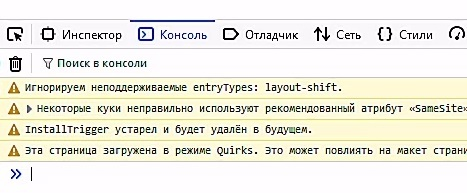
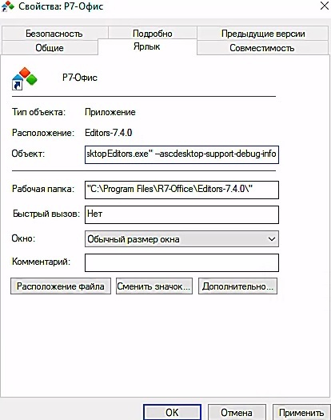
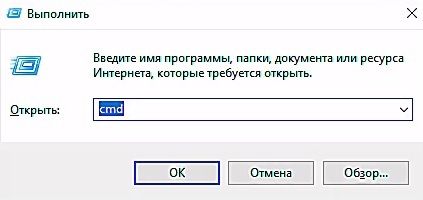
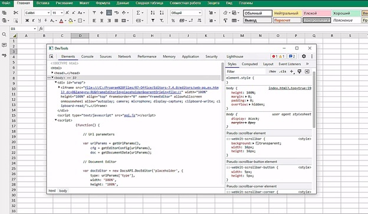
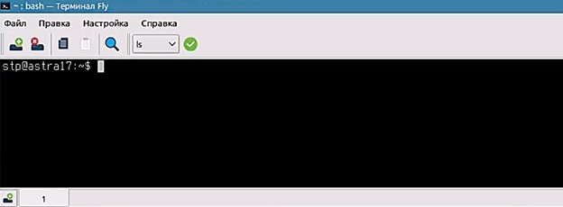

# Занятие 2: Отладка программного кода

**Отладка — это** процесс, который помогает выявить ошибки в программном коде. Выявленные ошибки можно в дальнейшем устранить. Это неотъемлемая часть процесса разработки, и вот несколько причин, почему она важна:

# Зачем нужна отладка программного кода

Обеспечение корректной работы программы : Ошибки в коде могут привести к неправильной работе программы. Отладка позволяет выявить и исправить эти ошибки, чтобы программа функционировала как задумано.

Ошибки могут возникнуть из-за недоразумений, опечаток или неправильной логики. Отладка помогает найти и устранить баги, улучшая качество кода.

Средства отладки , автоматизирующие процесс поиска ошибок, экономят время и ресурсы. Без средств отладки разработчики могут тратить намного больше времени на поиск ошибок.

После выпуска программы средства отладки помогают исправлять ошибки, обнаруженные в процессе эксплуатации. Это важно для поддержки и обновления продукта.

-        **Обеспечение корректной работы программы**: Ошибки в коде могут привести к неправильной работе программы. Отладка позволяет выявить и исправить эти ошибки, чтобы программа функционировала как задумано.
-        **Ошибки** могут возникнуть из-за недоразумений, опечаток или неправильной логики. Отладка помогает найти и устранить баги, улучшая качество кода.
-        **Средства отладки**, автоматизирующие процесс поиска ошибок, экономят время и ресурсы. Без средств отладки разработчики могут тратить намного больше времени на поиск ошибок.
-        **После выпуска** программы средства отладки помогают исправлять ошибки, обнаруженные в процессе эксплуатации. Это важно для поддержки и обновления продукта.

**Средства отладки – это** необходимый инструмент для обеспечения создания и функционирования качественного программного кода.

**Отладка – это**нечто большее, чем просто поиск ошибок. Вот несколько моментов, когда проведение отладки особенно важно:

На этапе разработки : При написании нового кода или внесении изменений в существующий, отладка помогает выявить ошибки до того, как программа попадет к пользователям.

После внесения изменений : Если вы вносите изменения в код, например, добавляете новую функциональность или исправляете баги, обязательно проведите отладку, чтобы убедиться, что все работает корректно.

При обнаружении неожиданного поведения : Если программа ведет себя не так, как вы ожидаете, это может быть признаком ошибки. Отладка поможет выявить причину.

Перед выпуском : Перед выпуском новой версии программы обязательно проведите тщательную отладку. Это поможет избежать неприятных сюрпризов для пользователей.

При регулярном обслуживании : Даже после выпуска программы рекомендуется периодически проводить отладку, чтобы обнаруживать и устранять новые ошибки.

-        **На этапе разработки**: При написании нового кода или внесении изменений в существующий, отладка помогает выявить ошибки до того, как программа попадет к пользователям.
-        **После внесения изменений**: Если вы вносите изменения в код, например, добавляете новую функциональность или исправляете баги, обязательно проведите отладку, чтобы убедиться, что все работает корректно.
-        **При обнаружении неожиданного поведения**: Если программа ведет себя не так, как вы ожидаете, это может быть признаком ошибки. Отладка поможет выявить причину.
-        **Перед выпуском**: Перед выпуском новой версии программы обязательно проведите тщательную отладку. Это поможет избежать неприятных сюрпризов для пользователей.
-        **При регулярном обслуживании**: Даже после выпуска программы рекомендуется периодически проводить отладку, чтобы обнаруживать и устранять новые ошибки.

**Отладка – это** неотъемлемая часть жизненного цикла программного обеспечения.

Давайте рассмотрим, как можно оперативно находить ошибки в коде на языке JavaScript:

Все современные браузеры имеют встроенные инструменты для отладки JavaScript. Включите отладку в вашем браузере, нажав клавишу F12 и выбрав "**Console**" (консоль).


*[Изображение #001: image_009.jpg]*


 `let a = 5; let b = 6; let c = a + b; console.log(c); // Выведет сумму a и b в консоль`

Пример использования console.log() :

```
        let a = 5;
        let b = 6;
        let c = a + b;
        console.log(c); // Выведет сумму a и b в консоль
```

С помощью отладчика вы можете:

Устанавливать точки останова : Это места в коде, где выполнение программы приостанавливается. Вы можете анализировать значения переменных на этом этапе.

Просматривать стек вызовов : Узнайте, какие функции вызываются в данный момент. Это поможет выявить, где возникла ошибка.

Изучать значения переменных : Просматривайте значения переменных во время выполнения программы.

-        **Устанавливать точки останова**: Это места в коде, где выполнение программы приостанавливается. Вы можете анализировать значения переменных на этом этапе.
-        **Просматривать стек вызовов**: Узнайте, какие функции вызываются в данный момент. Это поможет выявить, где возникла ошибка.
-        **Изучать значения переменных**: Просматривайте значения переменных во время выполнения программы.

Запустите программу в режиме пошагового выполнения. Это позволяет вам следить за каждой строкой кода и выявить место, где возникла ошибка.

 `function divide(a, b) { try { let result = a / b; return result; } catch (error) { console.error("Ошибка при делении:", error.message); } } let x = divide(10, 0); // Вызов функции с делением на ноль console.log(x);`

Пример:

```
        function divide(a, b) {
            try {
                let result = a / b;
                return result;
            } catch (error) {
                console.error("Ошибка при делении:", error.message);
            }
        }

        let x = divide(10, 0); // Вызов функции с делением на ноль
        console.log(x);
```

Логирование позволяет отслеживать состояние вашего кода во время выполнения. Вот несколько способов логирования в JavaScript:

 `const myObj = { firstname: "John", lastname: "Doe" }; console.log(myObj); // Выведет объект в консоль`

• console.log(): Этот метод выводит сообщения в консоль браузера.

```
const myObj = { firstname: "John", lastname: "Doe" };
console.log(myObj); // Выведет объект в консоль

```

 `console.info("Информационное сообщение"); console.warn("Предупреждение"); console.error("Ошибка");`

• console.info(), console.warn(), console.error(): Другие методы для вывода информации разного уровня.

```
console.info("Информационное сообщение");
console.warn("Предупреждение");
console.error("Ошибка");

```

 ``

• Брейкпоинты (Breakpoin ts): В инструментах разработчика браузера можно установить точки останова (breakpoints), чтобы приостановить выполнение кода и изучить значения переменных.

```

```

 ``

• debugger . Поскольку работа с документом в Р7 ведётся в рамках защищенного контекста («песочницы» или виртуальной машины javascript), то обычные точки остановки внутри такого рода кода установить проблематично, так как сам контекст создаётся только в момент его вызова, и до того момента точка остановки, которую вы поставить в коде, который должен соответствовать этому контексту, для отладчика будет находится во вне такого контекста! Для решения этой проблемы можно использовать оператор `debugger;`, который добавляется в нужное место кода. Этот оператор заставит отладчик остановить выполнение кода в момент его исполнения в защищенном контексте, что позволит вам изучить данные контекста, как если бы вы использовали обычную точку остановки. После завершения отладки не забудьте удалить или закомментировать этот оператор, чтобы не влиять на работу программы.. Так же следует отметить, что это единственный способ для установки точки остановки при отладке макросов в Р7!

Если вы столкнулись с ошибкой, которую не можете сразу исправить, временно измените код так, чтобы программа продолжала работать. Например:

 `// Проблемный участок кода // const result = problematicFunction(); // console.log(result);`

1. Закомментируйте проблемный участок кода.

```
// Проблемный участок кода
// const result = problematicFunction();
// console.log(result);

```

 `// Временная заглушка для избежания ошибки const result = fallbackValue; console.log(result);`

2. Временно замените его заглушкой.

```
// Временная заглушка для избежания ошибки
const result = fallbackValue;
console.log(result);
```

 `if (errorCondition) { // Временная обработка ошибки console.error('Ошибка: временное решение'); } else { // Нормальное выполнение кода const result = normalFunction(); console.log(result); }`

3. Используйте условные операторы: В зависимости от характера ошибки можно использовать условные операторы для временного изменения логики выполнения кода

```
if (errorCondition) {
    // Временная обработка ошибки
    console.error('Ошибка: временное решение');
} else {
    // Нормальное выполнение кода
    const result = normalFunction();
    console.log(result);
}

```

Эти методы позволяют временно избежать ошибок и продолжить тестирование и отладку программы, не останавливая её работу. После исправления ошибки не забудьте вернуть код в исходное состояние или удалить временные изменения.

Для отладки плагинов нужно запустить приложение Р7-Офис одним из двух способов: через ярлык или через терминал.

1. Вариант 1. Запустить приложение через ярлык:

Щелкните правой кнопкой мыши ярлык приложения на рабочем столе.

Выберите « Свойства» .

Откройте вкладку « Ярлык ».

В поле Target (Объект) после пути к приложению введите пробел, а затем введите флаг --ascdesktop-support-debug-info.

Нажмите кнопку« Применить» .

-        Щелкните правой кнопкой мыши ярлык приложения на рабочем столе.
-        Выберите «**Свойства»**.
-        Откройте вкладку «**Ярлык**».
-        В поле **Target (Объект)** после пути к приложению введите пробел, а затем введите флаг
*--ascdesktop-support-debug-info.*
-        Нажмите кнопку«**Применить»**.


*[Изображение #002: image_010.jpg]*


2. Вариант 2. Запустить приложение через терминал:

Нажмите Win+R.

-        Нажмите Win+R.

В появившемся окне «**Выполнить**» введите *cmd* в поле «**Открыть**»


*[Изображение #003: image_001.jpg]*


Нажмите кнопку ОК . Терминал будет открыт.

В командной строке введите путь к приложению, добавьте пробел и введите флаг: –– ascdesktop-support-debug-info : «%ProgramFiles%\Р7\DesktopEditors\DesktopEditors» ––ascdesktop-support-debug-info

-        Нажмите кнопку **ОК**. Терминал будет открыт.
-        В командной строке введите путь к приложению, добавьте пробел и введите флаг:
––**ascdesktop-support-debug-info : «%ProgramFiles%\Р7\DesktopEditors\DesktopEditors» ––ascdesktop-support-debug-info**

Чтобы начать работу в режиме отладки, щелкните правой кнопкой мыши любое редактируемое поле на верхней панели инструментов (например, список шрифтов) и выберите «Проинспектировать элемент» или щелкните в любом месте документа и нажмите F1.
Вот результат:


*[Изображение #004: image_008.jpg]*


Начиная с версии 7.1, вы можете запускать настольные редакторы Р7 с флагом ––ascdesktop-support-debug-info-keep*.* Он может иметь следующие значения:
Параметры

      Значение;Описание;Использование 1;Запускает приложение;––ascdesktop-support-debug-info-keep=1
0;Останавливает приложение;––ascdesktop-support-debug-info-keep=0
default;Состояние приложения по умолчанию — приложение выключено;––ascdesktop-support-debug-info-keep=default

Для запуска редактора Р7-Офис с этим флагом, используйте те же инструкции, что и для флага **––ascdesktop-support-debug-info.** Отличие состоит в том, что флаг **––ascdesktop-support-debug-info-keep** сохраняет переданное ему значение. Вам не нужно будет указывать его каждый раз при запуске приложения.

Используйте терминал для запуска десктопного редактора Р7 в режиме отладки:


*[Изображение #005: image_003.jpg]*


· Нажмите **CTRL+ALT+T**. Терминал будет открыт.
· В командной строке введите путь к приложению, добавьте пробел и затем введите флаг **––ascdesktop-support-debug-info :**
**«/opt/r7-office/desktopeditors/DesktopEditors» ––ascdesktop-support-debug-info**

Чтобы начать работу в режиме откладки, щелкните правой кнопкой мыши любое редактируемое поле на верхней панели инструментов (например, список шрифтов) и выберите «Проинспектировать элемент» или щелкните в любом месте документа и нажмите F1.


*[Изображение #004: image_008.jpg]*


Аналогично действиям по запуску для ОС Windows.


---


