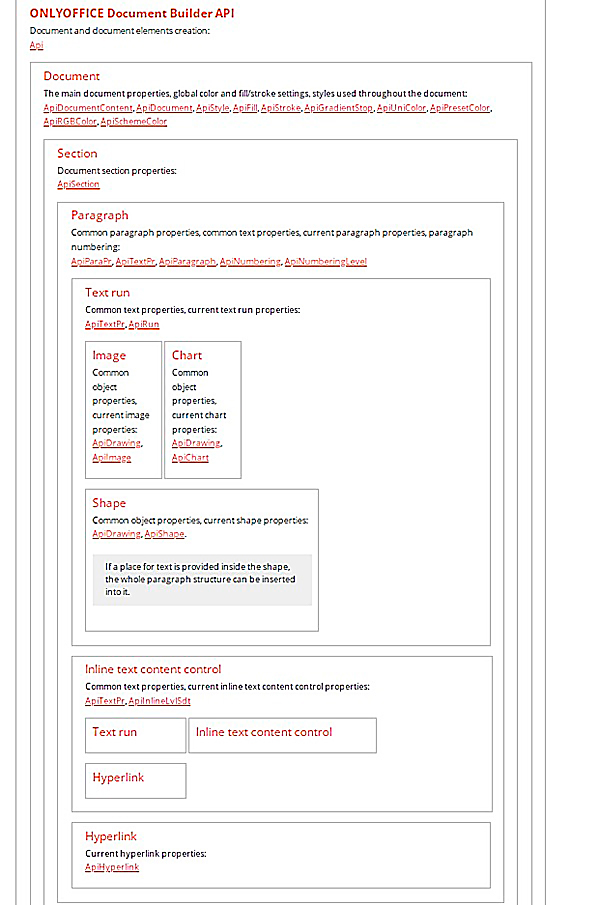
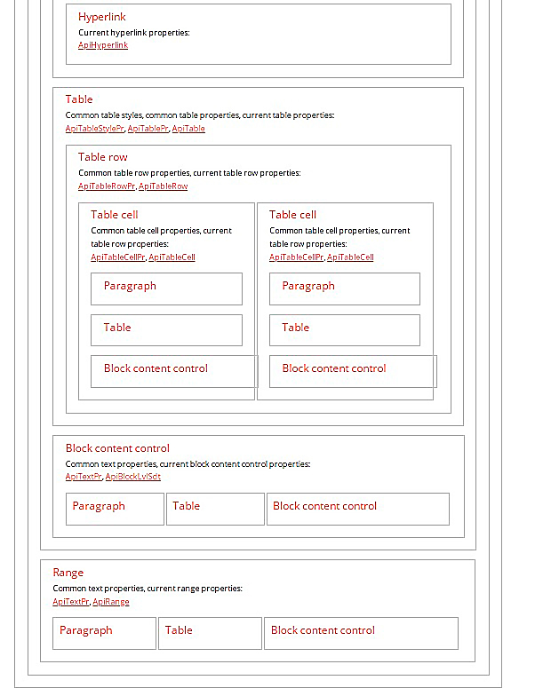
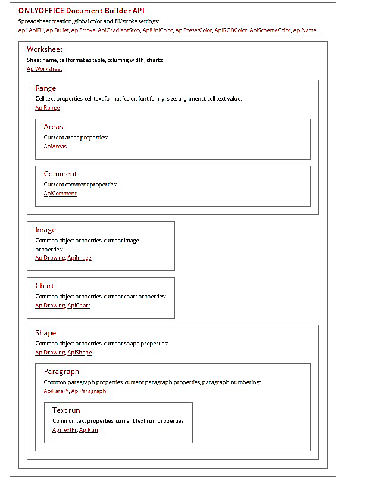
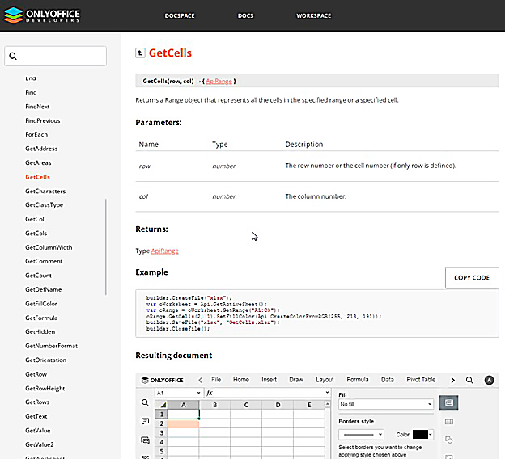
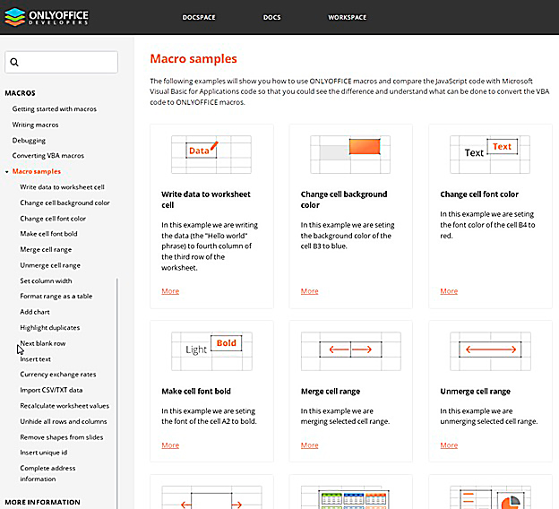

# Занятие 3: Работа с объектной моделью документов Р7

Объектная модель документов в редакторах Р7 во многом старается следовать объектной модели соответствующего типа для MS Office ранних его версий. При этом есть существенные отличия, которые для ряда задач, обычных для MS Office, делают их решение невозможным в Р7. Это прежде всего внешнее управление (автоматизация) через средства ОС Windows (используя технологии ActiveX и COM+). Такое ограничение делает затруднительным интеграцию через API в системы электронного документооборота (СЭД).

Причина этих ограничений заключается в том, что изначально Р7 задумывался как мультиплатформенный офисный пакет. В основе его работы с документами лежит фреймворк Qt, однако редактор представляет собой веб-приложение, функционирующее на базе веб-браузера Chromium. Взаимодействие пользователя — это локальная навигация по панелям статичной страницы, и лишь небольшая часть области самого документа в редакторе через связку WebAsm обрабатывается бинарным ядром. Ограничения, накладываемые на браузеры, работающие с JavaScript, влияют на работу с локальной файловой системой компьютера (или смартфона).

API для работы с документами в Р7 также ограничено по возможностям по сравнению с MS Office. Возможности редактора Р7 в основным соответствуют версии 6.0 MS Office.

Класс App vs. Application: В отличие от MS Office, вершиной API в Р7 является не класс Application (приложение), а класс App. Он вроде бы и должен ему соответствовать, но на деле скорее соответствует классу Document, так как не подразумевает большинство функций управления именно приложением редактора. Однако часть функций схожа и позволяет получить доступ к массиву загруженных документов, управлять записью и чтением документов, их экспортом или импортом и т.п.

Рассмотрим в общем виде модели API документов для текстового и табличного редакторов (примеры и ссылки взяты с сайта опенсорсного решения OnlyOffice).


*[Изображение #001: image_003.jpg]*



*[Изображение #002: image_002.jpg]*


[Api](https://api.onlyoffice.com/docbuilder/textdocumentapi/api)
Document
Основные свойства документа, глобальные настройки цвета и заливки/обводки, стили, используемые во всем документе:
[ApiDocumentContent](https://api.onlyoffice.com/docbuilder/textdocumentapi/apidocumentcontent), [ApiDocument](https://api.onlyoffice.com/docbuilder/textdocumentapi/apidocument), [ApiStyle](https://api.onlyoffice.com/docbuilder/textdocumentapi/apistyle), [ApiFill](https://api.onlyoffice.com/docbuilder/textdocumentapi/apifill), [ApiStroke](https://api.onlyoffice.com/docbuilder/textdocumentapi/apistroke), [ApiGradientStop](https://api.onlyoffice.com/docbuilder/textdocumentapi/apigradientstop), [ApiUniColor](https://api.onlyoffice.com/docbuilder/textdocumentapi/apiunicolor), [ApiPresetColor](https://api.onlyoffice.com/docbuilder/textdocumentapi/apipresetcolor), [ApiRGBColor](https://api.onlyoffice.com/docbuilder/textdocumentapi/apirgbcolor), [ApiSchemeColor](https://api.onlyoffice.com/docbuilder/textdocumentapi/apischemecolor)
Section
Свойства раздела документа:
[ApiSection](https://api.onlyoffice.com/docbuilder/textdocumentapi/apisection)
Paragraph
Общие свойства абзаца, общие свойства текста, свойства текущего абзаца, нумерация абзацев:
[ApiParaPr](https://api.onlyoffice.com/docbuilder/textdocumentapi/apiparapr), [ApiTextPr](https://api.onlyoffice.com/docbuilder/textdocumentapi/apitextpr), [ApiParagraph](https://api.onlyoffice.com/docbuilder/textdocumentapi/apiparagraph), [ApiNumbering](https://api.onlyoffice.com/docbuilder/textdocumentapi/apinumbering), [ApiNumberingLevel](https://api.onlyoffice.com/docbuilder/textdocumentapi/apinumberinglevel)
Text run
Общие свойства текста, текущие свойства прогона текста:
[ApiTextPr](https://api.onlyoffice.com/docbuilder/textdocumentapi/apitextpr), [ApiRun](https://api.onlyoffice.com/docbuilder/textdocumentapi/apirun)
Image
Общие свойства объекта, текущие свойства изображения:
[ApiDrawing](https://api.onlyoffice.com/docbuilder/textdocumentapi/apidrawing), [ApiImage](https://api.onlyoffice.com/docbuilder/textdocumentapi/apiimage)

Chart
Общие свойства объекта, текущие свойства диаграммы:
[ApiDrawing](https://api.onlyoffice.com/docbuilder/textdocumentapi/apidrawing), [ApiChart](https://api.onlyoffice.com/docbuilder/textdocumentapi/apichart)

Shape
Общие свойства объекта, текущие свойства формы:
[ApiDrawing](https://api.onlyoffice.com/docbuilder/textdocumentapi/apidrawing), [ApiShape](https://api.onlyoffice.com/docbuilder/textdocumentapi/apishape).
Если внутри фигуры предусмотрено место для текста, в нее можно вставить всю структуру абзаца.

Inline text content control
Общие свойства текста, текущие свойства элемента управления встроенным текстовым содержимым:
[ApiTextPr](https://api.onlyoffice.com/docbuilder/textdocumentapi/apitextpr), [ApiInlineLvlSdt](https://api.onlyoffice.com/docbuilder/textdocumentapi/apiinlinelvlsdt)
Text run

Hyperlink
Текущие свойства гиперссылки:
[ApiHyperlink](https://api.onlyoffice.com/docbuilder/textdocumentapi/apihyperlink)
Table
Общие стили таблиц, общие свойства таблиц, текущие свойства таблиц:
[ApiTableStylePr](https://api.onlyoffice.com/docbuilder/textdocumentapi/apitablestylepr), [ApiTablePr](https://api.onlyoffice.com/docbuilder/textdocumentapi/apitablepr), [ApiTable](https://api.onlyoffice.com/docbuilder/textdocumentapi/apitable)
Table row
Общие свойства строки таблицы, свойства текущей строки таблицы:
[ApiTableRowPr](https://api.onlyoffice.com/docbuilder/textdocumentapi/apitablerowpr), [ApiTableRow](https://api.onlyoffice.com/docbuilder/textdocumentapi/apitablerow)
Table cell
Общие свойства ячеек таблицы, свойства текущей строки таблицы:
[ApiTableCellPr](https://api.onlyoffice.com/docbuilder/textdocumentapi/apitablecellpr), [ApiTableCell](https://api.onlyoffice.com/docbuilder/textdocumentapi/apitablecell)
Paragraph
Table
Block content control

Table cell
Общие свойства ячеек таблицы, свойства текущей строки таблицы:
[ApiTableCellPr](https://api.onlyoffice.com/docbuilder/textdocumentapi/apitablecellpr), [ApiTableCell](https://api.onlyoffice.com/docbuilder/textdocumentapi/apitablecell)
Paragraph
Table
Block content control
Общие свойства текста, свойства управления содержимым текущего блока:
[ApiTextPr](https://api.onlyoffice.com/docbuilder/textdocumentapi/apitextpr), [ApiBlockLvlSdt](https://api.onlyoffice.com/docbuilder/textdocumentapi/apiblocklvlsdt)
Paragraph

Table

Block content control
Range
Общие свойства текста, свойства текущего диапазона:
[ApiTextPr](https://api.onlyoffice.com/docbuilder/textdocumentapi/apitextpr), [ApiRange](https://api.onlyoffice.com/docbuilder/textdocumentapi/apirange)
Paragraph

Block content control


*[Изображение #003: image_005.jpg]*


Создание таблицы, глобальные настройки цвета и заливки/обводки:
[Api](https://api.onlyoffice.com/docbuilder/spreadsheetapi/api), [ApiFill](https://api.onlyoffice.com/docbuilder/spreadsheetapi/apifill), [ApiBullet](https://api.onlyoffice.com/docbuilder/spreadsheetapi/apibullet), [ApiStroke](https://api.onlyoffice.com/docbuilder/spreadsheetapi/apistroke), [ApiGradientStop](https://api.onlyoffice.com/docbuilder/spreadsheetapi/apigradientstop), [ApiUniColor](https://api.onlyoffice.com/docbuilder/spreadsheetapi/apiunicolor), [ApiPresetColor](https://api.onlyoffice.com/docbuilder/spreadsheetapi/apipresetcolor), [ApiRGBColor](https://api.onlyoffice.com/docbuilder/spreadsheetapi/apirgbcolor), [ApiSchemeColor](https://api.onlyoffice.com/docbuilder/spreadsheetapi/apischemecolor), [ApiName](https://api.onlyoffice.com/docbuilder/spreadsheetapi/apiname)
Worksheet
Имя листа, формат ячейки в виде таблицы, ширина столбца, диаграммы:
[ApiWorksheet](https://api.onlyoffice.com/docbuilder/spreadsheetapi/apiworksheet)
Range
Свойства текста ячейки, формат текста ячейки (цвет, семейство шрифтов, размер, выравнивание), текстовое значение ячейки.:
[ApiRange](https://api.onlyoffice.com/docbuilder/spreadsheetapi/apirange)
Areas
Свойства текущих областей:
[ApiAreas](https://api.onlyoffice.com/docbuilder/spreadsheetapi/apiareas)
Comment
Текущие свойства комментариев:
[ApiComment](https://api.onlyoffice.com/docbuilder/spreadsheetapi/apicomment)
Image
Общие свойства объекта, текущие свойства изображения:
[ApiDrawing](https://api.onlyoffice.com/docbuilder/spreadsheetapi/apidrawing), [ApiImage](https://api.onlyoffice.com/docbuilder/spreadsheetapi/apiimage)

Chart
Общие свойства объекта, текущие свойства диаграммы:
[ApiDrawing](https://api.onlyoffice.com/docbuilder/spreadsheetapi/apidrawing), [ApiChart](https://api.onlyoffice.com/docbuilder/spreadsheetapi/apichart)
Shape
Общие свойства объекта, текущие свойства формы:
[ApiDrawing](https://api.onlyoffice.com/docbuilder/spreadsheetapi/apidrawing), [ApiShape](https://api.onlyoffice.com/docbuilder/spreadsheetapi/apishape).
Paragraph
Общие свойства абзаца, текущие свойства абзаца, нумерация абзацев.:
[ApiParaPr](https://api.onlyoffice.com/docbuilder/spreadsheetapi/apiparapr), [ApiParagraph](https://api.onlyoffice.com/docbuilder/spreadsheetapi/apiparagraph)
Text run
Общие свойства текста, текущие свойства выполнения текста:
[ApiTextPr](https://api.onlyoffice.com/docbuilder/spreadsheetapi/apitextpr), [ApiRun](https://api.onlyoffice.com/docbuilder/spreadsheetapi/apirun)

Данные, приведенные выше, необходимы для понимания структуры и иерархии классов API. Например, если нам требуется создать или изменить что-то на уровне параграфа в текстовом документе, то цепочка доступа может быть такой:

 `// В документе var oDocument = Api.GetDocument(); var oFParagraph = oDocument.GetElement(0); oFParagraph.AddText("First paragraph"); //Аналогично, для ячейки в таблице: var oWorksheet = Api.GetActiveSheet(); var oRange = oWorksheet.GetRange("A1:C3"); var oCell = oRange.GetCells(2, 1); oCell.SetFillColor(Api.CreateColorFromRGB(255, 213, 191));`

```
// В документе

var oDocument = Api.GetDocument();
var oFParagraph = oDocument.GetElement(0);
oFParagraph.AddText("First paragraph");

//Аналогично, для ячейки в таблице:

var oWorksheet = Api.GetActiveSheet();
var oRange = oWorksheet.GetRange("A1:C3");
var oCell = oRange.GetCells(2, 1);
oCell.SetFillColor(Api.CreateColorFromRGB(255, 213, 191));
```

По ссылкам выше вы можете перейти на страницы с описанием самих классов и их методов. В каждом методе обычно приводится пример, который в режиме онлайн тут же исполняется в специальном окне с онлайн-версией редактора OnlyOffice (аналог Р7):


*[Изображение #004: image_001.jpg]*


Для понимания работы АПИ документов рекомендуем ознакомится с [разделом примеров написания макросов](https://api.onlyoffice.com/plugin/macrosamples/). Примеры необходимы, чтобы сформировать общее представление о механизмах работы API.


*[Изображение #005: image_004.jpg]*


Самостоятельное написание макросов является отличным способом понять, как устроен документ и как с ним можно взаимодействовать через API документов.


---


