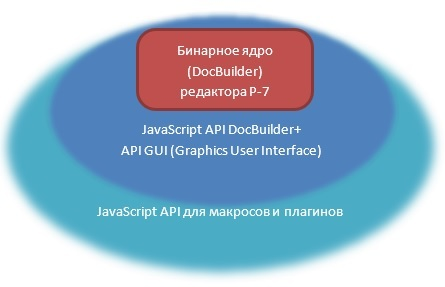
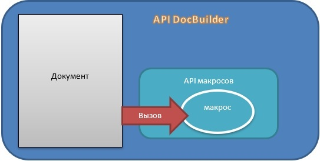
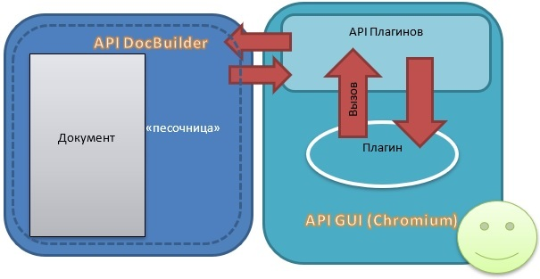

# Занятие 4: Архитектура приложений Р7 и её влияние на разработку

Десктопные редакторы часто организованы по схеме двухуровневой обработки данных. В них есть базовое ядро, отвечающее за взаимодействие между операционной системой и редакторами, а также за внутреннюю реализацию работы приложения с документами. Это ядро часто откомпилировано и может иметь отдельную реализацию в виде приложения, такого как [DocBuilder](https://api.onlyoffice.com/docbuilder/integrationapi/default). DocBuilder может использоваться отдельно для создания документов с помощью специализированных файлов, которые подаются в качестве аргументов командной строки к программе. Эти файлы представляют собой описание действий по созданию и наполнению документов с использованием команд API DocBuilder на языке JavaScript.

Это базовое ядро также используется для работы десктопных приложений. Для построения графического интерфейса пользователя редактора (GUI) используется оболочка на базе браузерного ядра Chromium, которая функционирует как веб-приложение с использованием HTML, CSS и JavaScript. В этой оболочке также реализован проброс API DocBuilder через функции JavaScript.

*[Изображение #001: image_001.jpg]*

Основное отличие между написанием макросов и плагинов заключается в их функциональности и способе взаимодействия с системой. Макросы действительно имеют прямой доступ только к API для работы с содержимым документа. Они представляют собой скрипты, выполняющие определенный набор действий над документом, без возможности взаимодействия с пользователем напрямую, что сводит возможности по взаимодействию с пользователем к нулю.

*[Изображение #002: image_004.jpg]*

**Плагины** представляют собой отдельные потоки интерфейса пользователя в редакторе, которые могут быть встраиваемыми страницами с полным взаимодействием между пользователем и программой. Они могут значительно расширять функциональность редактора, интегрируя новые элементы интерфейса, пользовательские диалоговые окна, инструменты и взаимодействие с внешними сервисами.

**Создание плагинов** является более сложным процессом по сравнению с написанием макросов. Внутреннее содержимое плагинов должно быть разделено на две основные части:

**Графический интерфейс** пользователя (GUI): Это часть плагина, которая взаимодействует с пользователем через элементы интерфейса, такие как кнопки, меню, поля ввода и т. д. GUI позволяет пользователям взаимодействовать с функциональными возможностями плагина.

**Логика работы с документом**: Эта часть плагина отвечает за выполнение операций над документом или интеграцию с внутренними функциями редактора. Она может включать в себя операции чтения, записи, редактирования документа, выполнения алгоритмов и других функций, необходимых для выполнения задач плагина.

В некоторых случаях, особенно для плагинов, которые не требуют визуального интерфейса (например, автоматизация процессов, обработка данных или интеграция с внешними системами), разделение на GUI и логику работы может быть менее очевидным или не требоваться вообще. Такие плагины могут фокусироваться исключительно на выполнении определенных задач с документами или другими аспектами редактора.

**Плагины предоставляют** значительно большие возможности по взаимодействию с пользователем и расширению функциональности редактора, но их разработка требует более глубокого понимания взаимодействия между GUI и логикой работы плагина.

*[Изображение #003: image_003.jpg]*

Поскольку взаимодействие между пользователем и приложением редактора осуществляется через оболочку, основанную на технологиях веб-приложений, а плагины также используют API плагинов и API DocBuilder с помощью языка программирования JavaScript, они ограничены возможностями этого языка. К таковым относятся:

Отсутствие возможности прямой работы с файлами в файловой системе компьютера.

Отсутствие возможности работы с API операционной системы и других прикладных программ.

Совершенно разные по структуре и модели данных макросов на VBA в Microsoft Office и плагинов на javascript в Р7 затрудняют перенос существующих макросов.

Плохая структурируемость исходного кода, обусловленная особенностями javascript, например его однопоточность и плохая реализация асинхронных функций, которые должны происходить либо параллельно, либо строго друг за другом, могут привести к чрезмерному запутыванию исходного кода плагинов.

Плагины работают в отдельном контексте (например, iframe), что затрудняет прямой доступ к элементам графического интерфейса редактора.

Ограниченный и не полный API на JavaScript. Некоторые функции ядра редактора могут быть недоступны через JavaScript API, пока разработчики не добавят соответствующие функции.

Из-за особенности внутренней реализации, все действия с документами могут производиться только через специализированную функцию API плагинов CallCommand (), которая организует «песочницу» (защищенную область кода), в которую можно передавать данные только через специализированный объект Asc.scope object (на самом деле нет, но такой способ не рассматривается в рамках данного курса, а только в расширенном варианте курса). Может оказаться весьма затруднительным и возврат данных из песочницы, так как стандартный метод callback функции иногда срабатывает ошибочно и возвращает данные ассинхронно в другом потоке запросов к песочнице, что приводит к трудно отлавливаемым ошибкам при отладке.

Поскольку плагин представляет собой отдельный iframe (в терминах html), то и любое взаимодействие строится по схеме событий DOM элементов. Поэтому для создания форм плагина, как встраиваемых в редактор, так и в виде отдельных модальных окон, требуются глубокие знания по построению форм на html страницах и организации реакций на события в языке java script.

По схожей схеме событий работает и взаимодействие между плагином и самим редактором. Перечень таких событий сильно ограничен разработчиками, и в частности, практически нет событий о действиях пользователя в документе, оповещающих поток кода плагина, (исключая взаимодействие с контекстным меню редактора, и работой со встроенными в документ пользовательскими контролами форм в текстовом редакторе). Отсутствует возможность простым способом реагировать на изменения, вносимые пользователем в документы в online режиме.

Поскольку сам документ и его внутренние данные размещены непосредственно в бинарном ядре редакторов, а внешний вид документа и данных отрисовывается в определённой области редактора (canvas), то нет никаких способов получить доступ к оперативной информации о данных в той или иной области документа в режиме реального времени, минуя запрос к «песочнице» редактора, что, в свою очередь, должно прервать основной поток плагина, и из-за проблем с асинхронностью обработки данных в песочнице, может привести к аномалиям по работе песочницы, и как следствие - к ошибкам с определением выбранных пользователем данных (может показываться предыдущий выбор пользователя, или его отсутствие), что так же приводит к множеству трудноуловимы ошибок.

Поскольку отладка кода возможна только через инструмент встроенного в редактор DevTools, по сути являющегося javascript дебагером Chromium, то вносить изменения по мере их обнаружения приходится во внешнем редакторе, с последующим перезапуском плагина в ручном режиме, и повторением всех действий, приводившим к ошибке, что весьма затрудняет отладку при мало-мальски сложных по логике и функционалу плагинах.

При работе плагинов с внешними источниками данных, поскольку графическая оболочка редактора является переработанным браузером Chrome, возникают проблемы запросов к таким источникам из-за встроенного в браузеры режима работы CORS (можно почитать о ней например здесь ). Это может сильно затруднить написание плагинов, направленных на работу с внешними серверами, работающими через Web API, так как браузер просто не может без некоторых ухищрений передавать запрос на такие источники.

Затруднено или невозможно использование различных систем автоматизированного тестирования плагинов из-за закрытости среды выполнения плагинов для взаимодействия с внешними источниками.

Список отрицательных моментов из-за использования браузерной оболочки и javascript как основы для написания плагинов можно было бы продолжить.

-        Отсутствие возможности прямой работы с файлами в файловой системе компьютера.
-        Отсутствие возможности работы с API операционной системы и других прикладных программ.
-        Совершенно разные по структуре и модели данных макросов на VBA в Microsoft Office и плагинов на javascript в Р7 затрудняют перенос существующих макросов.
-        Плохая структурируемость исходного кода, обусловленная особенностями javascript, например его однопоточность и плохая реализация асинхронных функций, которые должны происходить либо параллельно, либо строго друг за другом, могут привести к чрезмерному запутыванию исходного кода плагинов.
-        Плагины работают в отдельном контексте (например, iframe), что затрудняет прямой доступ к элементам графического интерфейса редактора.
-        Ограниченный и не полный API на JavaScript. Некоторые функции ядра редактора могут быть недоступны через JavaScript API, пока разработчики не добавят соответствующие функции.
-        Из-за особенности внутренней реализации, все действия с документами могут производиться только через специализированную функцию API плагинов [CallCommand](https://api.onlyoffice.com/plugin/callcommand)(), которая организует «песочницу» (защищенную область кода), в которую можно передавать данные только через специализированный объект [Asc.scope object](https://api.onlyoffice.com/plugin/scope) (на самом деле нет, но такой способ не рассматривается в рамках данного курса, а только в расширенном варианте курса). Может оказаться весьма затруднительным и возврат данных из песочницы, так как стандартный метод callback функции иногда срабатывает ошибочно и возвращает данные ассинхронно в другом потоке запросов к песочнице, что приводит к трудно отлавливаемым ошибкам при отладке.
-        Поскольку плагин представляет собой отдельный iframe (в терминах html), то и любое взаимодействие строится по схеме событий DOM элементов. Поэтому для создания форм плагина, как встраиваемых в редактор, так и в виде отдельных модальных окон, требуются глубокие знания по построению форм на html страницах и организации реакций на события в языке java script.
-        По схожей схеме событий работает и взаимодействие между плагином и самим редактором. Перечень таких событий сильно ограничен разработчиками, и в частности, практически нет событий о действиях пользователя в документе, оповещающих поток кода плагина, (исключая взаимодействие с контекстным меню редактора, и работой со встроенными в документ пользовательскими контролами форм в текстовом редакторе). Отсутствует возможность простым способом реагировать на изменения, вносимые пользователем в документы в online режиме.
-        Поскольку сам документ и его внутренние данные размещены непосредственно в бинарном ядре редакторов, а внешний вид документа и данных отрисовывается в определённой области редактора (canvas), то нет никаких способов получить доступ к оперативной информации о данных в той или иной области документа в режиме реального времени, минуя запрос к «песочнице» редактора, что, в свою очередь, должно прервать основной поток плагина, и из-за проблем с асинхронностью обработки данных в песочнице, может привести к аномалиям по работе песочницы, и как следствие - к ошибкам с определением выбранных пользователем данных (может показываться предыдущий выбор пользователя, или его отсутствие), что так же приводит к множеству трудноуловимы ошибок.
-        Поскольку отладка кода возможна только через инструмент встроенного в редактор DevTools, по сути являющегося javascript дебагером Chromium, то вносить изменения по мере их обнаружения приходится во внешнем редакторе, с последующим перезапуском плагина в ручном режиме, и повторением всех действий, приводившим к ошибке, что весьма затрудняет отладку при мало-мальски сложных по логике и функционалу плагинах.
-        При работе плагинов с внешними источниками данных, поскольку графическая оболочка редактора является переработанным браузером Chrome, возникают проблемы запросов к таким источникам из-за встроенного в браузеры режима работы CORS (можно почитать о ней например [здесь](https://habr.com/ru/companies/macloud/articles/553826/) ). Это может сильно затруднить написание плагинов, направленных на работу с внешними серверами, работающими через Web API, так как браузер просто не может без некоторых ухищрений передавать запрос на такие источники.
-        Затруднено или невозможно использование различных систем автоматизированного тестирования плагинов из-за закрытости среды выполнения плагинов для взаимодействия с внешними источниками.
-        Список отрицательных моментов из-за использования браузерной оболочки и javascript как основы для написания плагинов можно было бы продолжить.

Несмотря на описанные ограничения и сложности, использование JavaScript и схемы DOM в плагинах для десктопных редакторов может иметь свои преимущества:

Использование готовых библиотек и фреймворков: Знакомство с JavaScript и схемой DOM html страниц позволяет использовать множество готовых библиотек и фреймворков, таких как jQuery, React, Angular и другие. Это значительно упрощает создание пользовательского интерфейса плагина и повышает производительность разработки.

Широкий выбор инструментов и ресурсов: JavaScript является одним из самых популярных языков программирования, имеет большое сообщество разработчиков и множество открытых ресурсов. Это обеспечивает доступ к обширному набору инструментов, библиотек и решений для решения различных задач.

Быстрая разработка и прототипирование: Возможность быстро создавать и изменять интерфейс с использованием JavaScript и современных фреймворков позволяет быстрее разрабатывать и прототипировать функционал плагинов.

Расширенные возможности пользовательского интерфейса: Использование JavaScript и современных фреймворков позволяет создавать более сложные и интерактивные пользовательские интерфейсы, что может повысить удобство использования плагинов для конечных пользователей.

-        Использование готовых библиотек и фреймворков: Знакомство с JavaScript и схемой DOM html страниц позволяет использовать множество готовых библиотек и фреймворков, таких как jQuery, React, Angular и другие. Это значительно упрощает создание пользовательского интерфейса плагина и повышает производительность разработки.
-        Широкий выбор инструментов и ресурсов: JavaScript является одним из самых популярных языков программирования, имеет большое сообщество разработчиков и множество открытых ресурсов. Это обеспечивает доступ к обширному набору инструментов, библиотек и решений для решения различных задач.
-        Быстрая разработка и прототипирование: Возможность быстро создавать и изменять интерфейс с использованием JavaScript и современных фреймворков позволяет быстрее разрабатывать и прототипировать функционал плагинов.
-        Расширенные возможности пользовательского интерфейса: Использование JavaScript и современных фреймворков позволяет создавать более сложные и интерактивные пользовательские интерфейсы, что может повысить удобство использования плагинов для конечных пользователей.

Несмотря на технические и организационные вызовы, использование JavaScript для разработки плагинов в десктопных редакторах может принести значительные выгоды благодаря доступу к широкому спектру инструментов и упрощению процесса разработки интерфейса.

---

